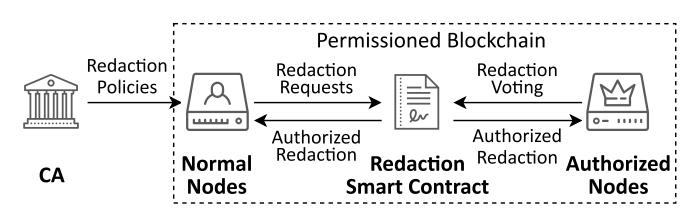
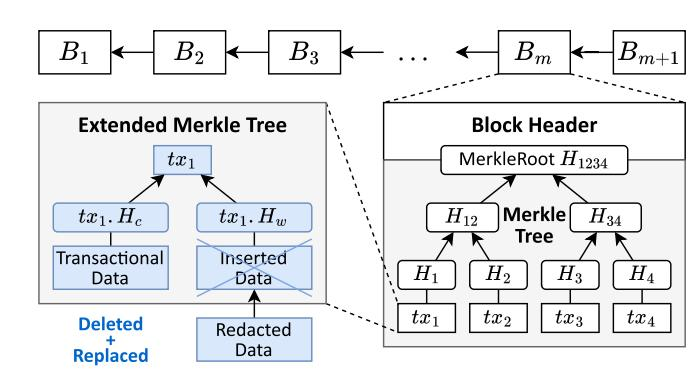
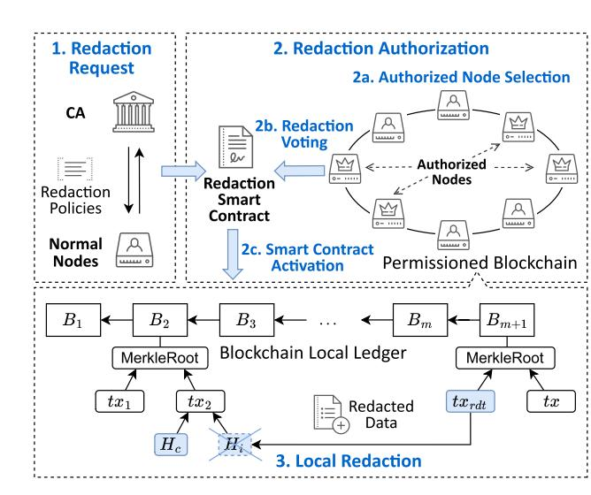
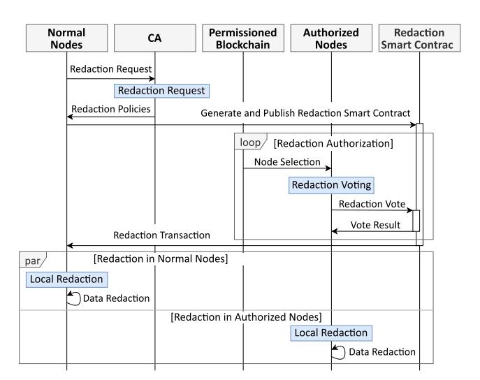
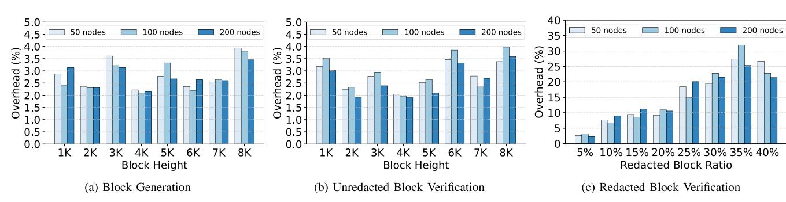
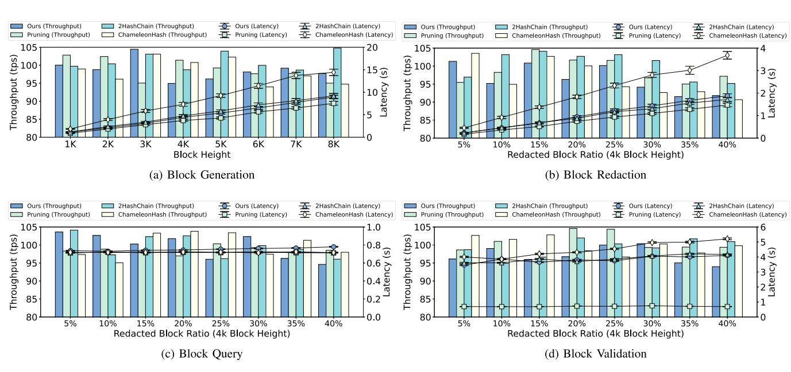
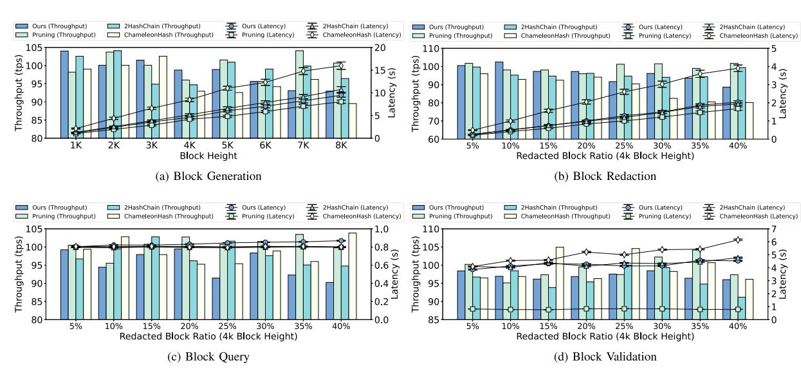
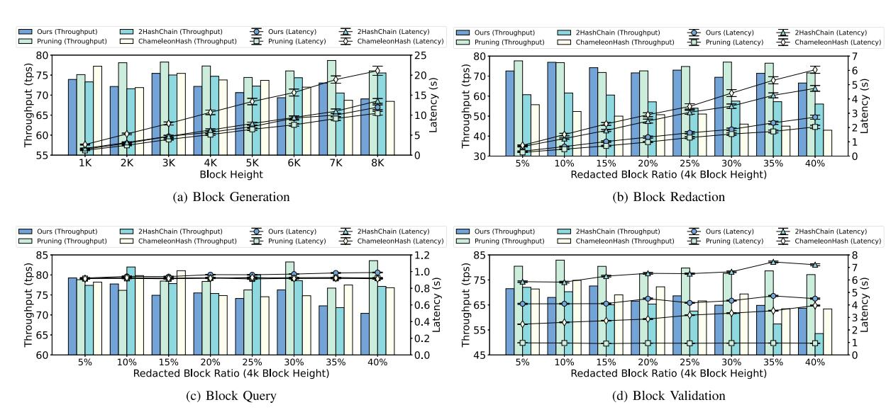

# EMT: Extended Merkle Tree Structure for Inserted Data Redaction in Permissioned Blockchain

Zihan Wu [,](https://orcid.org/0000-0003-2961-4615) Liangmin Wang *[,](https://orcid.org/0000-0003-0048-5979) Member, IEEE*, Xiaoyu Zhang, and Xia Feng *[,](https://orcid.org/0000-0003-3677-6823) Member, IEEE*

*Abstract***—Inserted data redaction is an important and hot security topic for permissioned blockchain. However, existing redactable schemes have two problems: (i)** *Uncaptured Change:* **Transaction-level redaction schemes modify both user-inserted data and system-generated transaction data, making it difficult to capture the changes in system-generated transactions data; (ii)** *Unexpected Spread:* **When the redaction process deletes harmful data, the consensus process may take a long time, resulting in unexpected spread of harmful data. Instead of eliminating the influence of the harmful data, it promotes its spread. To tackle these problems, we propose an Extended Merkle Tree (EMT) structure for inserted data redaction in permissioned blockchain. EMT separates the system-generated transaction data from user-inserted data, ensuring that only the inserted data can be modified during redaction. Furthermore, we design an EMT-based blockchain ledger and develop a smart contract to implement the inserted data redaction. We prove that our redaction scheme preserves the core security features of blockchain and implements redaction operations in Hyperledger Fabric. The experimental results show that our EMT-based blockchain scheme is capable of redacting the harmful inserted data while incurring less than 5% overhead compared to current permissioned blockchains.**

*Index Terms***—Blockchain, blockchain redaction, Merkle tree.**

#### I. INTRODUCTION

**B**LOCKCHAIN immutability ensures that the ledger data cannot be modified. However, malicious users can exploit this feature to insert harmful data [\[1\].](#page-12-0) For instance, the Bitcoin blockchain has been found to store cross-site scripting (XSS) codes and child pornography information [\[2\].](#page-12-0) Meanwhile, legislations for data regulation, such as the General Data Protection Regulation (GDPR) [\[3\],](#page-12-0) require "the right to be forgotten". Under GDPR, users can request data controllers to immediately delete personal data that contains sensitive or private information. Like normal databases, there is an urgent need to make

Received 21May 2024; revised 17March 2025; accepted 25March 2025. Date of publication 28 March 2025; date of current version 27 June 2025. This work was supported in part by the National Natural Science Foundation of China under Grant 62372105, in part by the Leading-edge Technology Program of Jiangsu Natural Science Foundation under Grant BK20202001 and in part by the Science and Technology Achievement Transformation Special Fund Project of Jiangsu Province under Grant SBA2022050016. Recommended for acceptance by Prof. Dr. Geng Sun.*(Corresponding author: Liangmin Wang.)*

Zihan Wu, Liangmin Wang, and Xiaoyu Zhang are with the School of Cyber Science and Engineering, Southeast University, Nanjing 211189, China, and also with the Engineering Research Center of BASAM (blockchain application, supervision and management), Ministry of Education, Nanjing 211189, China (e-mail[: wzh042@seu.edu.cn;](mailto:wzh042@seu.edu.cn) [liangmin@seu.edu.cn;](mailto:liangmin@seu.edu.cn) [dnxy.zhang@seu.edu.cn\)](mailto:dnxy.zhang@seu.edu.cn). Xia Feng is with the School of Cyberspace Security, Hainan University, Hainan 570288, China (e-mail: [xiazio@gmail.com\)](mailto:xiazio@gmail.com).

Digital Object Identifier 10.1109/TNSE.2025.3555979

blockchain redactable to cater for diverse update needs of users and to prevent illegal information spread to the public [\[4\].](#page-12-0)

There has been an increasing number of research devoted to blockchain redaction. Initial blockchain redaction schemes focus on pruning local ledgers, which includes local erasure [\[5\],](#page-12-0) historical data snapshot[\[6\],](#page-12-0) and genesis block reconstruction [\[7\].](#page-12-0) These schemes aim to reduce the storage overhead for full nodes in the blockchain network. Subsequent research focuses on modifying ledger data by utilizing voting-based and chameleonbased redaction, such as double hash chains [\[8\]](#page-12-0) or chameleon hashes [\[9\],](#page-12-0) [\[10\].](#page-12-0)

However, these redaction schemes still encounter two crucial problems: *uncaptured change* and *unexpected spread*. On the one hand, blockchain transactions include system-generated transactional information (e.g., Alice transfers 10 tokens to Bob, referred to as core transaction data) as well as user-inserted transactional information (e.g., "buy a cup of coffee", referred to as inserted data). Blockchain redaction only needs to handle harmful information found in inserted data. It is possible that existing transaction-level redaction schemes may modify core transaction data when redacting inserted data. The modified core transaction data is uncaptured by other users. On the other hand, users must publish their redaction request to the network while waiting for redaction authorization, which is equivalent to spreading the target data. Due to consensus delay, the published redaction request may not be processed immediately. It could lead to the *unexpected spread* of harmful data and amplify its negative impact. As a result, the redaction process would reduce user trust in the blockchain network.

In this paper, to tackle these problems, we design an Extended Merkle Tree (EMT) structure for inserted data redaction in permissioned blockchain. EMT separates the core transaction data and inserted data into independent leaf nodes. As a result, during the data redaction process, the core transaction data is locked to ensure its immutability, while the inserted data can be redacted using predefined redaction policies. Besides, the redacted data could be validated using transactions generated by redaction smart contracts. Specifically, our contributions can be summarized as follows:

- - We propose an Extended Merkle Tree (EMT) structure to solve the *uncaptured change* problem. To the best of our knowledge, this is the first publicly available scheme that utilizes Merkle tree to preserve the immutability of core transaction data. EMT requires validators to construct an

additional layer of Merkle tree, which allows the processing of both core transaction data and inserted data in distinct leaf nodes during redaction.

- - In response to the *unexpected spread* problem, we propose an EMT-based inserted data redaction scheme. Specifically, we design a redaction smart contract that authorizes and publishes redaction data. This smart contract collects votes from the elected authorized nodes and creates new transactions with new redacted data. Our scheme allows nodes to redact data without regenerating the block, thereby enabling instant redaction and reducing the spread of inserted harmful data.
- - We prove that EMT ensures the integrity and consistency of system-generated data and our redaction scheme does not compromise the core security features of blockchain [\[11\].](#page-12-0) We also demonstrate a chaincode implementation of our inserted data redaction scheme in Hyperledger Fabric. Experiments show that the redaction operations add less than 5% overhead to the original permissioned blockchain. Our scheme outperforms existing transaction-level redaction schemes in terms of latency and throughput due to its integrated EMT structure.

#### II. RELATED WORKS

## *A. Pruning-Based Redaction Schemes*

Florian et al. [\[5\]](#page-12-0) proposed ledger pruning for redaction, which allows full nodes to remove harmful data while ensuring pruned transactions remain verifiable and nodes stay synchronized. This method allows subsequent blocks to be validated through the pruned transactions. CoinPrune [\[6\]](#page-12-0) enhanced this by using periodic snapshots to reduce storage overhead and speed up synchronization for new nodes. However, the reliability depends on nodes honestly pruning data. Similarly, Hillmann et al. [\[7\]](#page-12-0) proposed periodic summary blocks for historical data, similar to genesis blocks. This enables extensive pruning while maintaining blockchain integrity and improving scalability without modifying existing blockchain structures. Despite the advantages, pruning-based redactions present challenges. Nodes autonomously decide what data to prune, potentially leading to incomplete ledgers and increasing risks of network centralization and functional constraints.

Beyond traditional pruning, Puddu et al. [12] proposed  $\mu$ chain, where senders encrypt multiple transaction versions with redaction policies. Miners verify redaction requests against policies and use multi-party computation to derive decryption keys for alternative transactions. Moreover, Hyperledger Fabric [13] uses data hiding as pruning alternative in permissioned blockchains. It marks key-value pairs as deleted using “is-Delete”, restricting access but not physically removing data. While pruning-based redaction schemes offer scalability, they come at the cost of decentralization and historical data retention.

## *B. Voting-Based Redaction Schemes*

For voting-based redaction schemes, Deuber et al. [\[8\]](#page-12-0) proposed the first voting-based redactable blockchain protocol for permissioned blockchains. Built on a double hash chain, it uses consensus-based voting for transparent, verifiable, and accountable ledger redactions. Building upon this, Marsalek et al. [\[14\]](#page-12-0) enhanced Deuber's scheme [\[8\]](#page-12-0) by using voting consensus to store redacted blocks on a new blockchain. This newly created blockchain is linked to the original, ensuring both integrity and validity of the updated blockchain.

Several researchers have optimized the voting mechanism for redaction. Reparo et al. [\[15\]](#page-12-0) proposed a public verification layer for permissionless blockchains to "repair" vulnerable smart contracts and harmful data, rather than direct redaction. Consensus voting ensures integrity and validity while preventing doublespending and DDoS attacks. However, voting-based approaches generally require more bandwidth and network resources, and multiple redaction requests can lead to increased consensus delays, limiting scalability.

To address efficiency, Li et al. [\[16\]](#page-12-0) proposed an instantaneous redaction blockchain protocol, which separates voting from the consensus layer to improve voting efficiency and reduce consensus time for redaction requests. Additionally, Dai et al. [\[17\]](#page-12-0) proposed PRBFPT, a framework integrating smart contractbased voting and chameleon hashes for redactable blockchains. PRBFPT enables all nodes to participate in redaction using contract-based locked voting to improve security and fairness. Duan et al. [\[18\]](#page-12-0) proposed Chainknot, featuring mandatory synchronization for accepting redacted content and incentives for reviewing proposals. It uses an autonomous community for evaluating redaction validity, promoting a decentralized yet structured approach. Similarly, Sun et al. [\[19\]](#page-12-0) proposed an evolutionary game-theoretic incentive mechanism for redactable blockchain governance, encouraging community participation in voting.

Beyond permissionless settings, Zhao et al. [\[20\]](#page-12-0) proposed Concordit, a credit-based incentive mechanism for permissioned redactable blockchains. Concordit uses a reward-andpunishment system to incentivize submission, verification, and redaction, encouraging honest participation and mitigating malicious redactions. In addition to these optimizations, Wang et al. [\[21\]](#page-12-0) proposed a redactable blockchain using decentralized trapdoor verifiable delay functions (VDFs). Leveraging VDF properties enhances security and efficiency while reducing reliance on trusted parties and mitigating redaction abuse. Overall, while voting-based redaction mechanisms offer transparency and accountability, they face efficiency and scalability challenges.

## *C. Chameleon-Based Redaction Schemes*

Chameleon-based redaction enables blockchain data modifications while preserving its integrity [\[42\].](#page-13-0) It relies on chameleon hash functions, which are special hash functions that allow the party with the trapdoor key to find collisions that produce the same hash value [\[10\].](#page-12-0) Ateniese et al. [\[9\]](#page-12-0) were the first to incorporate chameleon hashes into permissioned blockchains. Certificate authorities and other trusted third parties manage trapdoor keys to redact blocks while preserving blockchain consistency.

Fig. 1. System model of the proposed scheme.

Derler et al. [\[22\]](#page-12-0) proposed the Policy-based Chameleon Hash (PCH), which allows ledger updates using policy-based trapdoor keys. Building on this, Jia et al. [\[23\]](#page-12-0) proposed Decentralized Chameleon Hash (DCH), requiring multiple node approvals for each redaction and encoding redacted blocks into an RSA accumulator for blockchain consistency verification. Later, Ma et al. [\[24\]](#page-12-0) developed Decentralized Policy-based Chameleon Hash (DPCH), which integrate multi-authority attribute-based encryption to achieve fine-grained access control in decentralized redactions. By granting redaction permissions to multiple entities in the blockchain network, DPCH reduces centralization risks and improves system robustness.

To address accountability, Xu et al. [\[29\]](#page-12-0) proposed Policybased Chameleon Hash with Blackbox Accountability (PCHA). PCHA connects redacted objects to their originators, allowing permissioned blockchain institutions to identify trapdoor key holders involved in redactions. To further enhance redaction efficiency, SeRedact [\[30\]](#page-12-0) presented a verifiable redactable blockchain protocol using a Merkle tree-based mechanism for dynamic redactions, including fast version checks and mandatory redactions. Shen et al. [\[31\]](#page-13-0) later proposed a dual-trapdoor chameleon hash for full editability of ledger objects while ensuring efficient and key-exposure-resistant ledger redaction.

Researchers also explored advanced chameleon hash designs for cross-chain and fine-grained redactions. Hu et al. [\[35\]](#page-13-0) presented IvyRedaction for cross-chain redaction, ensuring atomic, consistent, and accountable modifications across multiple blockchains. This solution uses a decentralized intermediary to manage a global cross-chain revision state and enforce rollback rules. Similarly, Huang et al. [\[36\]](#page-13-0) proposed a multigranularity redaction scheme for Monero, which integrates the RingCT protocol with security techniques to enhance user identity traceability and enable redactions at various levels.

Beyond these, researchers improve redaction security and efficiency through innovative cryptography. Li et al. [\[37\]](#page-13-0) proposed a lattice-based tagged chameleon hash (tCH), achieving postquantum security. Duan et al. [\[38\]](#page-13-0) proposed T-times Chameleon Hash (t-CH) and t-Chameleon Signature (t-CS), where exceeding redaction limits exposes the trapdoor key. Meanwhile, Zhao et al. [\[39\]](#page-13-0) developed Tiger Tally, a redactable blockchain for IoT data, integrating targeted policy-based chameleon hash (TPBCh) with tokenized redaction permissions for predefined scopes and abuse prevention.

In addition, Wu et al. [\[25\]](#page-12-0) proposed a verifiable distributed chameleon hash-based redactable consortium blockchain. This design distributes trapdoor key shares among nodes, requiring a threshold for redactions and enabling honest nodes to verify collision shares, enhancing security. Huang et al. [\[26\]](#page-12-0) further presented a dynamic, decentralized chameleon hashbased redactable blockchain (DRBC) leveraging identity-based chameleon hash (IDCH) and verifiable transactions (VT) for secure and dynamic redactions, allowing flexible network participation.

Recently, studies have transitioned chameleon hashes to permissionless blockchains. Li et al.[\[40\]](#page-13-0) developed Non-interactive Chameleon Hash (NITCH) for permissionless blockchains, enhancing scalability, consistency, and accountability. NITCH dynamically assigns trapdoor keys, which allows participants to independently calculate shares for generating hash collisions for redaction. Similarly, Zhang et al. [\[27\]](#page-12-0) proposed Dynamic and Decentralized Attribute-based Chameleon Hash (DACH), which addresses centralized permissions and security limitations to enhance flexibility in permissionless environments.

To improve security and verification, Tian et al. [\[32\]](#page-13-0) proposed Verifiable Redactable Blockchain (VRBC). VRBC proposed the Blockchain Authentication Tree (BAT), which enables lightweight nodes to efficiently query and verify chain data and validate ledger integrity before synchronization. Li et al. [\[33\]](#page-13-0) proposed a practical and secure policy-based chameleon hash scheme, which enhances both security and usability with robust policy enforcement. Zhang et al. [\[28\]](#page-12-0) proposed a dynamic trust-based redactable blockchain supporting updates and traceability by dynamically evaluating user trust levels to prevent malicious modifications. Li et al. [\[34\]](#page-13-0) explored message control mechanisms for blockchain rewriting, using chameleon hashes for controlled modifications and integrity. Additionally, Zhang et al. [\[41\]](#page-13-0) proposed NANO for readability and editability governance in blockchain databases. NANO uses Newton interpolation-based secret sharing to manage key distribution, enabling fine-grained access control and policy privacy in permissioned blockchains.

Overall, chameleon-based redaction schemes face challenges with trapdoor key management and redaction authorization. Furthermore, the redaction process may result in the incorrect modification of core transaction data, which could lead to security risks. For instance, the leakage of trapdoor keys could potentially be exploited to abuse the redaction privilege. We provide a detailed comparison of all the above schemes in Table [I.](#page-3-0)

## III. OVERVIEW

In this section, we present an overview of our EMT-based inserted data redaction scheme, including the system model, threat model and design goals. The notations used in this paper are listed in Table [II.](#page-3-0)

## *A. System Model*

The system model, as shown in Fig. 1, consists of four parties: certificate authority (CA), normal nodes, authorized nodes, and redaction smart contracts. Normal nodes retrieve the redaction policies from the CA and generate redaction smart contracts waiting for authorized voting. Then, authorized nodes send votes to redaction smart contracts. Finally, redaction smart contracts

TABLE I COMPARISON OF BLOCKCHAIN REDACTION SCHEMES

| Schemes        | Technology     | Accountability | Consistency | Authorization      | Efficiency     | Data Protection |
|----------------|----------------|----------------|-------------|--------------------|----------------|-----------------|
| [5]-[7]        | Pruning        | Limited        | No          | N/A                | High           | No              |
| [12], [13]     | Pruning        | Limited        | No          | CA                 | Medium to High | No              |
| [8], [14]-[21] | Voting         | Yes            | Yes         | All Miners         | Low            | No              |
| [9], [22]      | Chameleon Hash | No             | No          | CA                 | Medium         | No              |
| [23]-[28]      | Chameleon Hash | Limited        | Limited     | Authorized Parties | Low to Medium  | No              |
| [29]-[34]      | Chameleon Hash | Yes            | Yes         | Authorized Parties | Low to Medium  | Limited         |
| [35]-[41]      | Chameleon Hash | Yes            | Yes         | Authorized Parties | Medium to High | Limited         |
| Ours           | Pruning+Voting | Yes            | Yes         | Authorized Parties | High           | Yes             |

TABLE II NOTATIONS

| Notation      | Description                                        |
|---------------|----------------------------------------------------|
| $B_i$         | The i-th block in the blockchain.                  |
| $H(\cdot)$    | The hash function.                                 |
| $\mathcal{C}$ | The blockchain ledger.                             |
| $tx_i$        | The i-th transaction.                              |
| $H_c$         | Hash value of the core transaction data.           |
| $d_c$         | Core transaction data.                             |
| $H_w$         | Hash value of the inserted data.                   |
| $d_w$         | Inserted data (e.g., transaction remarks).         |
| $req$         | Redaction request.                                 |
| $tx_{id}$     | Unique identifier of the transaction.              |
| $d_{new}$     | The new data content submitted for redaction.      |
| $P_c$         | Redaction policy of the blockchain $\mathcal{C}$ . |
| $con_k$       | The k-th redaction smart contract.                 |
| $N_{auth}$    | The set of authorized nodes.                       |
| $tx_{rdt}$    | The redaction transaction.                         |
| $\Sigma$      | Aggregate signatures of the authorized nodes.      |

generate redaction transactions in response to the approved redaction, which initiate local redaction in blockchain nodes.

- - *Certificate Authority:* CA is a trusted third party that generates system parameters and redaction policies to assist normal nodes in creating redaction requests. Once completed, CA would not participate in the subsequent redaction process in the permissioned blockchain.
- - *Normal Nodes:* Normal nodes are semi-trust blockchain users that can generates redaction request through redaction smart contracts.
- - *Authorized Nodes:* Authorized nodes are selected from the normal nodes in the permissioned blockchain. They interact with redaction smart contracts to vote for the authorized redaction requests.
- - *Redaction Smart Contracts:* Redaction smart contract is an entity generated by normal nodes with redaction requests. It would generate the necessary redaction transactions to initiate local redaction.

## *B. Threat Model*

In our permissioned blockchain setting, we consider probabilistic polynomial-time (PPT) adversaries  $\mathcal{A}$  that may attempt to initiate unauthorized redaction requests or manipulate redaction transactions. Adversaries  $\mathcal{A}$  can be either normal nodes that submit illegal redaction requests or authorized nodes that exploit their voting privileges for personal benefits. We assume

that the end-to-end communication channels are secure and that adversaries  $\mathcal{A}$  cannot break standard cryptographic primitives.

A key component is the CA, which generates system parameters and defines redaction policies that manage the redaction process. Importantly, the role of CA is limited to this initial setup. Once configured, the CA does not participate in subsequent redaction operations, such as voting or transaction execution. Therefore, even if the CA were compromised, the blockchain system would continue to operate normally. Existing redaction policies would remain in effect, which allows authorized nodes to process redaction requests. While future policy updates might be affected, the core blockchain functionality and previously executed transactions would remain secure. This minimizes the potential impact of any compromise at this level, which mitigates the risk of a single-point failure.

# *C. Design Goals*

The proposed EMT-based data redaction scheme aims to address the critical challenges of secure and efficient redaction in permissioned blockchains. The key design goals of our proposed scheme are as follows:

- - *Integrity and Immutability of Core Transaction Data:* The proposed scheme ensures that core transaction data remains immutable while allowing for the redaction of inserted data. It maintains the integrity of critical transaction details and prevents unauthorized modifications to essential blockchain records.
- - *Instant Inserted Data Redaction with Minimal Overhead:* The proposed scheme enables instant redaction of inserted data through the EMT structure. The redaction process does not require block regeneration to update redacted data, which minimizes delays and improving blockchain redaction performance.
- - *Controlled and Authorized Redaction:* Redaction operations must be authorized through a smart contract-based voting mechanism. It ensures that only designated authorized nodes can approve and execute redactions, which prevent unauthorized redaction attempts.
- - *Scalability and Flexibility:* The proposed scheme supports efficient validation and redaction as the blockchain grows. It ensures that the redaction process remains feasible without compromising blockchain performance.

# IV. EMT: THE EXTENDED MERKLE TREE STRUCTURE

In this section, we demonstrate the proposed Extended Merkle Tree (EMT) structure. Existing blockchain redaction schemes usually employ a Merkle tree (also known as a hash tree) to ensure data integrity and consistency. However, this approach lacks flexibility and efficiency in terms of verifying redacted transactions. EMT enhances the ability to manage and redact the inserted data while preserving the fundamental features of a Merkle tree.

# *A. Blockchain Basics*

In this paper, we propose an EMT structure based on Deuber's paper [8], which describes and defines blocks and transactions in blockchain. The blockchain ledger comprises multiple blocks linked in a chain, with each block  $B_i$  consisting of a block header  $B.head$  and block body  $B.body$ . The  $B.head$  is a tuple:

| $B.head = \langle s, s', mRoot, ctr, x \rangle$ | (1) |
|-------------------------------------------------|-----|
|-------------------------------------------------|-----|

where,  $s$  and  $s'$  represent the hash of the current block and the hash of the previous block respectively. *mRoot* represents the root of the Merkle tree in the block, *ctr* stores the verification information generated by the consensus block (for example, in the Bitcoin network, *ctr* represents the random number *nonce* calculated by the miner in the PoW process).  $x$  denotes information related to the generation of  $B_i$ , including block version, block height, and timestamp.

According to the above definition, a valid  $B_i$  satisfies the following conditions:

| $(H(ctr, G(s', mRoot, x)) = s) \wedge ctr = 1$ | (2) |
|------------------------------------------------|-----|
|------------------------------------------------|-----|

where  $H$  and  $G$  are hash functions. Based on this, the blockchain within the ledger is represented as:

$$\mathcal{C} = B_1 \parallel B_2 \parallel \cdots \parallel B_n \quad (3)$$

Additionally, let  $\text{head}(\mathcal{C})$  and  $\text{len}(\mathcal{C})$  denote the current block header and the length of the blockchain respectively.  $\text{height}(B_i)$  denotes the height of block  $B_i$ . To describe a segment of the chain in blockchain data redaction, we utilize  $^q \mathcal{C}$  and  $\mathcal{C}^{[q}$  to represent blocks before and after height  $q$ , respectively, where  $^q \mathcal{C} \prec \mathcal{C}$  implies that  $^q \mathcal{C}$  and  $\mathcal{C}$  share the same prefix.

Different from *B.head*, *B.body* contains the packaged transactions. The packaged transactions form a Merkle tree. As a type of binary tree, the Merkle tree is widely adopted in blockchain systems, usually for verifying the integrity of ledger data (such as the Simple Payment Verification, SPV, in Bitcoin). Through the Merkle tree, nodes in the blockchain can quickly detect inconsistencies in transactions within a block and verify whether a transaction has been tampered with, even without knowing all the ledger data. Typically, a Merkle tree in a block can be described as  $MT(\langle tx_1, \dots, tx_m \rangle)$ , where each leaf node represents the hash of a transaction packaged in a block  $H(tx_1)$ , and each branch node is the hash value of two child nodes. Given a leaf node and the path from the leaf node to the root, nodes in the blockchain can quickly determine whether the hash value  $H(tx_m)$  of a given transaction  $tx_m$  is a leaf node of the Merkle tree.

Fig. 2. The Merkle tree design in the EMT Structure.

# *B. The EMT Design*

As shown in Fig. 2, the EMT proposed in this paper expands the traditional Merkle tree with two independent branches: the core transaction data branch and the inserted data branch. The core transaction data branch is responsible for storing key information of the transaction, such as the addresses of the sender and receiver, and transaction amount. The integrity and consistency of the above data are crucial for the security of the blockchain system. Correspondingly, the inserted data branch is used to store inserted information, such as transaction remarks or postscripts, which may require redaction after the transaction is completed. The stored information does not affect the functionality of the transaction.

The generation of EMT is executed by validators or miners in the network, with the aim of ensuring data integrity and consistency of each transaction. EMT can be described as:

| $EMT \left( \langle tx_1.H_c, tx_1.H_w, \dots, tx_m.H_c, tx_m.H_w \rangle \right).$ | (4) |
|-------------------------------------------------------------------------------------|-----|
|-------------------------------------------------------------------------------------|-----|

For each transaction  $tx$ , validators first calculate the hash value  $H_c$  of its core transaction data  $d_c$  and the hash value  $H_w$  of the inserted data  $d_w$ . Subsequently, they combine  $H_c$  and  $H_w$  to form the transaction's hash value  $H_{tx} = H(H_c \parallel H_w)$ , where  $\parallel$  represents concatenation.

In the proposed EMT, transaction verification targets two types of transactions: redacted transactions and unredacted transactions.

- For unredacted transactions, both the core transaction data and inserted data remain unchanged, so the verification process follows the original process: if  $tx$  is a redacted transaction, its core transaction data hash value is  $H_c$ , and the inserted data hash value is  $H_w$ ; validators calculate the total hash value of  $tx$ ,  $H_{tx} = H(H_c \parallel H_w)$ , and if  $tx$  is unredacted,  $H_{tx}$  should match the hash value recorded in  $B_i$ , passing the transaction verification.
- | For redacted transactions, only the inserted data is modified, while the core transaction data remains unchanged. The verification process is as follows: if <i>tal</i> ' is a redacted transaction, its core transaction data hash value <i>H</i> c remains the same, but the inserted data hash value <i>H</i> w represents the new hash value after redacting; validators first confirm that the core transaction data is unchanged, ensuring that <i>H</i> c matches the hash value recorded in the |
  |------------------------------------------------------------------------------------------------------------------------------------------------------------------------------------------------------------------------------------------------------------------------------------------------------------------------------------------------------------------------------------------------------------------------------------------------------------------------------------------------------------------------------------------|
  |------------------------------------------------------------------------------------------------------------------------------------------------------------------------------------------------------------------------------------------------------------------------------------------------------------------------------------------------------------------------------------------------------------------------------------------------------------------------------------------------------------------------------------------|

## **Algorithm 1:** EMT Verification Algorithm.

**Input:** Transaction  $tx$ ; Block  $B_i$ .

**Output:** Verification result: True or False.

- $H_c$  ← Hash of core transaction data of *tx*.
   $H_w$  ← Hash of inserted data of *tx*.
   $H_{tx} \leftarrow H(H_c \| H_w) \triangleright$  Calculate the hash of *tx*.
   $H_{B,tx} \leftarrow$  Corresponding hash value in  $B$  for *tx*.
  **if** *tx* is unredacted **then if**  $H_{tx} = H_{B,tx}$  **then return** True  $\triangleright$  The transaction is valid.
  **else return** False  $\triangleright$  The transaction is invalid.
  **end if else**  $\triangleright$  For redacted transactions.
   $H'_w \leftarrow$  New hash of redacted inserted data of *tx*.
   $H_{tx'} \leftarrow H(H_c \| H'_w) \triangleright$  Calculate the new hash of
- | 1:  | $H_{tx'} \leftarrow H(H_c \  H'_w) \triangleright$ Calculate the new hash of $tz$ . |
  |-----|-------------------------------------------------------------------------------------|
  |     | if Redaction Verification for $H_{tx'}$ is valid <b>then</b>                        |
  | 1:2 | return True $\triangleright$ The redacted transaction is valid.                     |
  | 1:3 | else                                                                                |
  | 1:4 | return False $\triangleright$ The redacted transaction is invalid.                  |
  | 1:5 | end if                                                                              |
  | 1:6 | end if                                                                              |

block; then, they calculate the new total hash value  $H_{t,x'} = H(H_c \parallel H_w)$ ; finally, they verify  $H_{t,x'}$ . Since the inserted data is redactable,  $H_{t,x'}$  may differ from the original hash value, thus it must meet the specific redaction policies or have corresponding authorization proof.

The detailed process is outlined in Algorithm 1. In the proposed scheme, a new transaction containing verification information is employed to provide redaction information for branch verification after local redaction. The detailed process of redaction policies and authorized voting design is discussed in Section V.

#### V. THE PROPOSED INSERTED DATA REDACTION SCHEME

In this section, we demonstrate the inserted data redaction scheme based on the EMT structure. The scheme allows for instant redaction of inserted data in the blockchain ledger, while preserving the integrity and consistency of blockchain.

#### *A. Main Phases*

As shown in Fig. 3, the inserted data redaction process mainly consists of three phases.

*1) Phase 1 (Redaction Request):* A normal node submits a redaction request to the CA of the permissioned chain, including detailed information about the data to be redacted and the reasons for redaction. CA verifies the identity of the normal node. Upon successful verification, CA generates a signed message containing the redaction policy of the current blockchain network and returns it to the normal node. The normal node then creates a redaction smart contract based on the signed message and publishes the contract to the network.

Fig. 3. Main phases in the inserted data redaction process.

*2) Phase 2 (Redaction Authorization):* The authorized nodes in the permissioned blockchain conduct a consensus voting on this redaction, which includes the following steps:

- - *2a. Authorized Node Selection:* Blockchain validators review the submitted redaction smart contract, confirming its legitimacy and compliance with redaction policies. Qualified smart contracts trigger the selection of authorized nodes based on redaction policies, resulting in the formation of a committee to vote on the redactions.
- - *2b. Redaction Voting:* Authorized nodes vote on the redaction smart contract, determining its validity based on contract information and redaction policies. The smart contract assesses the voting results within a set time window to determine if the submitted redaction request has received sufficient consent from the authorized nodes.
- - *2c. Smart Contract Activation:* If the redaction votes of the authorized nodes pass, the redaction smart contract initiates a redaction transaction that includes the redacted data, the related transaction identifier, and the smart contract's address.

*3) Phase 3 (Local Redaction):* Nodes perform local redaction operations when synchronizing new blocks; if the new block contains a redaction transaction, they remove the inserted data in the specified transaction, replacing the data content with the new redaction transaction id, pointing to the redacted content.

## *B. Redaction Algorithms and Smart Contract Design*

In this section, we provide a detailed explanation to the redaction algorithms and smart contract design implemented in the proposed scheme. The sequence diagram of the redaction process is shown in Fig. [4,](#page-6-0) and the redaction algorithms and contract designs are as follows:

1) *Redaction Request Algorithm*: As shown in Algorithm 2, the redaction request algorithm is used for the CA to receive and process redaction requests. Specifically, node  $n_i$  submits a redaction request  $req = \{tx_{id}, d_{new}, r_{just}\}$  to the CA, where

Fig. 4. The sequence diagram of the inserted data redaction process.

 $tx_{id}$  represents the unique identifier of the redacted transaction,  $d_{new}$  is the new data content submitted by  $n_i$ , and  $r_{just}$  is the reason for the redaction request. Subsequently, upon receiving the request, the CA performs  $V(n_i, \mathcal{C})$  to verify whether the node  $n_i$  is legitimate in the permissioned blockchain  $\mathcal{C}$ , ensuring the validity of the request.

After identity verification, the CA returns the redaction policy of the current network, which can be described as:

$$P_C = \{tx_{id} \in T_{rdbl}, n_i \models A_r\}. \quad (5)$$

The redaction policy is divided into two parts:  $T_{rdbl}$  and  $A_r$ , in which  $T_{rdbl}$  represents the transactions that can be redacted, described as:

$$T_{rdbl} = T_{all} \setminus (T_{gen} \cup T_{rdt} \cup T_{con}). \quad (6)$$

Here,  $T_{all}$  represents the set of all transactions on the permissioned blockchain,  $T_{gen}$  denotes the set of transactions in the genesis block,  $T_{rdt}$  represents the set of transactions with modified content after redaction, and  $T_{con}$  is the set of transactions containing the redaction smart contract;  $A_r$  represents the authorized node selection strategy in the permissioned blockchain  $\mathcal{C}$ , which is based on the strategy designed by Derler et al. [13]. Specifically, the nodes in the network are typically divided into three categories: the set of transaction senders  $S$ , the set of transaction receivers  $R$ , and the validators  $V$  in the network. These nodes can be represented as a set of attributes  $\{S, R, V\}$ , and the redaction contract can select authorized nodes based on the attributes of the strategy returned by the CA. For example, a transaction initiator with the attribute set  $\{V\}$  can be selected as an authorized node to participate in the redaction voting process related to the strategy  $\{S \vee V\}$ , but cannot participate in the redaction voting process related to the strategy  $\{S \wedge V\}$ . Typically, the redaction strategy is set to  $\{S \vee R \vee V\}$ , indicating that only nodes related to the transaction and validators in the network can become authorized nodes for the related transaction.

# **Algorithm 2:** Redaction Request Algorithm.

**Input:** Redaction request reg =  $\{tx_{id}, d_{new}, r_{just}\}$  from  $n_i$ 

**Output:** Redaction smart contract  $con_j$ 

| 1:  | $V(n_i, \mathcal{C}) \leftarrow$ Verify if $n_i$ is a valid node in $\mathcal{C}$     |
|-----|---------------------------------------------------------------------------------------|
| 2:  | $\text{if } V(n_i, \mathcal{C})$ <b>then</b>                                          |
| 3:  | $P_{\mathcal{C}} \leftarrow \{tx_{id} \in T_{rdbl}, n_i \models A_r\}$                |
| 4:  | $T_{rdbl} \leftarrow T_{all} \setminus (T_{gen} \cup T_{rdt} \cup T_{con})$           |
| 5:  | $msg \leftarrow \{P_{\mathcal{C}}, \sigma\} \triangleright$ CA returns signed message |
| 6:  | $con_j \leftarrow$ Generate contract based on $msg$                                   |
| 7:  | Deploy $con_j$ to blockchain network                                                  |
| 8:  | <b>else</b>                                                                           |
| 9:  | Reject $req$                                                                          |
| 10: | <b>end if</b>                                                                         |

# **Algorithm 3:** Redaction Smart Contract Functions.

- | 1  | <b>Function: init</b> (Smart contract instance <i>conn</i> )                                                               |
  |----|---------------------------------------------------------------------------------------------------------------------------------------|
  | 2  | <i>Nall</i> ← RequestNodes()     ▷ Request all nodes                                                                       |
  | 3  | <i>Nauth</i> ← <i>RSSHA256</i> (addr( <i>conk</i> ), <i>Nall</i> , <i>Ar</i> ) |
  | 4  | Store <i>Nauth</i> in <i>conk</i>                                                                               |
  | 5  | <b>return</b> Authorized nodes <i>Nauth</i> stored in <i>conk</i>                                               |
  | 6  |                                                                                                                                       |
  | 7  | <b>Function: query</b> (Smart contract instance <i>conk</i> )                                                              |
  | 8  | Generate { <i>req</i> , σ} ▷ Redaction voting preparation                                                                             |
  | 9  | <b>return</b> Redaction Information { <i>req</i> , σ}                                                                                 |
  | 10 |                                                                                                                                       |
  | 11 | <b>Function: vote</b> (Node <i>\hat{n}</i> , contract <i>conk</i> , time window                                            |
- | t)  |                                                                              |
  |-----|------------------------------------------------------------------------------|
  | 1:2 | Initialize count of <i>yes</i> votes <i>yesVotes</i> = 0                     |
  | 1:3 | <b>while</b> time window <i>t</i> not elapsed <b>do</b>                      |
  | 1:4 | Receive vote { <i>vote</i> , $\xi_j$ } from $\hat{n}_j$                      |
  | 1:5 | Verify signature $\xi_j$ of $\hat{n}_j$                                      |
  | 1:6 | <b>if</b> signature is valid and <i>vote</i> = <i>yes</i> <b>then</b>        |
  | 1:7 | Increment <i>yesVotes</i>                                                    |
  | 1:8 | <b>end if</b>                                                                |
  | 1:9 | <b>end while</b>                                                             |
  | 2:0 | <i>Threshold</i> ← Predefined redaction threshold                            |
  | 2:1 | <b>if</b> <i>yesVotes</i> ≥ <i>Threshold</i> <b>then</b>                     |
  | 2:2 | Generate $\Sigma = \{\xi_1, \xi_2, \dots, \xi_j\}$                           |
  | 2:3 | Broadcast <i>txrdt</i> = { <i>req</i> , $\Sigma$ } to the network |
  | 2:4 | <b>else</b>                                                                  |
  | 2:5 | Reject redaction transaction                                                 |
  | 2:6 | <b>end if</b>                                                                |
  | 2:7 | <b>return</b> Broadcast decision based on voting result                      |

Based on the generated redaction policy, the CA returns a signed message  $msg = \{P_C, \sigma\}$ , where  $\sigma$  represents the redaction policy. After receiving the signed message  $msg$ , node  $n_i$  generates a transaction request to deploy the redaction smart contract  $con_k$ , which is deployed to the network after verification by validators in the permissioned blockchain.

2) *Redaction Smart Contract*: As shown in Algorithm 3, the redaction smart contract is responsible for implementing and managing the redaction process. Once the redaction smart contract  $con_k$  is verified and deployed into  $\mathcal{C}$ ,  $n_i$  calls the

## **Algorithm 4:** Redaction Voting Algorithm.

**Input:** Authorized node  $\hat{n}_j$ , Contract  $con_k$ , Redaction information  $\{req, \sigma\}$ 

## Output: Vote submission to the contract

| 1:  | Verify the validity of $\{req, \sigma\}$ against $P_C$ from CA |
|-----|----------------------------------------------------------------|
| 2:  | Extract $tx_{id}, d_{new}, r_{just}$ from $req$                |
| 3:  | <b>if</b> $tx_{rdt}$ is valid <b>then</b>                      |
| 4:  | Determine vote decision based on $r_{just}$                    |
| 5:  | Generate vote result $\{yes/no\}$                              |
| 6:  | Generate Schnorr signature $\{\epsilon_j\}$                    |
| 7:  | Submit vote $\{yes/no, \epsilon_j\}$ to $con_k$                |
| 8:  | <b>else</b>                                                    |
| 9:  | Reject $tx_{rdt}$                                              |
| 10: | <b>end if</b>                                                  |

initialization function `init()` to select the authorized node committee. During initialization, *conk* first requests a list of all nodes *Nall* in the current network from the CA. Then *conk* selects the authorized node committee *Nauth* based on the strategy *Ar*, ensuring that only nodes with specific attribute sets can participate in the redaction voting process. The process can be described as:

$$RS_{\text{SHA}256}(addr(con_k), N_{all}, A_r) \rightarrow N_{auth}. \quad (7)$$

Here,  $RS_{\text{SHA}256}$  is a function that selects authorized nodes based on a hash value generated by SHA-256, and  $addr(con_k)$  is the address of the current redaction smart contract  $con_k$ . After the selection of  $N_{auth}$ , the public keys  $pk_j$  of the authorized nodes  $\hat{n}_j \in N_{auth}$  are stored in the contract  $con_k$ .

Once  $N_{auth}$  is determined, authorized nodes can access the redaction request information  $\{req, \sigma\}$  by calling the query() function in  $con_k$ . After the redaction voting starts,  $con_k$  waits for the voting results from the authorized node  $\hat{n}_j$  within a certain time window  $t$ .  $\hat{n}_j$  uploads their voting result  $\{yes/no, \xi_j\}$  by calling the vote() function in  $con_k$ , where  $\xi_j$  is the signature of the authorized node  $\hat{n}_j$ . If the voting results meet the predetermined requirements within the specified time, the redaction consensus has been reached.

At this point,  $con_k$  generates a redaction transaction  $tx_{rdt} = \{req, \Sigma\}$ , which includes the redaction request of the normal node  $req$  and the aggregate signatures of the authorized nodes  $\Sigma = \{\xi_1, \xi_2, \dots, \xi_j\}$ . The redaction transaction is a special type of transaction used to trigger local redaction in nodes within the network with the redaction-related information. It ensures the clarity of the redacted data and the legitimacy of the transaction. Subsequently, the redaction transaction  $tx_{rdt}$  is broadcast to the entire network.

3) *Redaction Voting Algorithm*: As shown in Algorithm 4 the redaction voting algorithm enables authorized nodes to vote on the redaction transaction  $tx_{rdt}$  in the redaction smart contract  $con_k$ . After obtaining the relevant information of the redaction request, each authorized node  $\hat{n}j \in Nauth$  obtains the redaction policy  $P_{\mathcal{C}}$  from the CA to verify the validity of  $tx_{rdt}$ . Once validated,  $\hat{n}j$  generates a redaction decision based on the reason for the redaction request  $r_{jjust}$  and produces the corresponding

## **Algorithm 5:** Local Redaction Algorithm.

**Input:** Node  $n_j$ , Blockchain  $\mathcal{C}$ , Contract  $con_k$ , Redaction transaction  $tx_{rdt}$ 

**Output:** Updated local ledger at node  $n_j$ 

| 1:  | Sync the latest block head( $\mathcal{C}$ )                            |
|-----|------------------------------------------------------------------------|
| 2:  | <b>if</b> $tx_{rdt} \in$ head( $\mathcal{C}$ ) <b>then</b>             |
| 3:  | Extract $tx_{id}$ , $d_{new}$ , $\Sigma$ from $tx_{rdt}$               |
| 4:  | Verify the legality and correctness of $tx_{rdt}$ against $\Sigma$     |
| 5:  | Confirm that $tx_{rdt}$ has consensus from authorized nodes in $con_k$ |
| 6:  | <b>if</b> $tx_{rdt}$ is valid <b>then</b>                              |
| 7:  | Locate the block $B_m$ in $\mathcal{C}$ with $tx_{id}$                 |
| 8:  | Find the transaction $tx_n$ in $B_m$                                   |
| 9:  | Replace $tx_n.d_w$ with reference to $tx_{rdt}$                        |
| 10: | Update local ledger with redacted $tx_n$                               |
| 11: | <b>end if</b>                                                          |
| 12: | <b>end if</b>                                                          |

voting result according to their approval or disapproval decision. Using the Schnorr signature [23],  $\hat{n}_j$  signs their decision to generate  $\xi_j$ . Subsequently,  $\hat{n}_j$  calls  $con_k.vote()$  to submit both the voting result and signature  $yes/no$ ,  $\xi_j$  to the smart contract.

4) *Local Redaction Algorithm*: As shown in Algorithm 5, after the redaction smart contract  $con_k$  reaches the voting threshold, the local redaction algorithm is responsible for executing local ledger redaction operations on the nodes within the network. When node  $n_j$  synchronizes with the latest block head( $\mathcal{C}$ ) in the network, if it contains the redaction transaction  $tx_{rdt}$  broadcast by  $con_k$ , it verifies the legality and correctness of  $tx_{rdt}$  through the aggregate signature  $\Sigma$ .  $con_k$  confirms that  $tx_{rdt}$  has obtained the voting consensus of authorized nodes. After confirming the validity of  $tx_{rdt}$ ,  $n_j$  extracts the redaction request  $req$  from  $tx_{rdt}$ , including the identifier of the data to be redacted  $tx_{id}$  and the new data  $d_{new}$ . Based on the redaction content in  $tx_{rdt}$ ,  $n_j$  first searches the  $\text{len}(\mathcal{C})$  blocks  $^{\text{len}(\mathcal{C})}\mathcal{C}$  in the current local ledger to locate the transaction  $tx_n$  in a block  $B_i$  pointed by  $tx_{id}$ . Then,  $n_j$  deletes the written data  $tx_n.d_w$  in  $tx_n$  and replaces it with a corresponding  $tx_{rdt}$ , thereby updating the local ledger. Both authorized and regular nodes are required to perform this local redaction operation.

For new nodes joining the network, since the redaction operation records the redaction transaction  $tx_{rdt}$  into the redaction smart contract, if the synchronized local ledger does not execute the local redaction in time, the new node can correctly generate the latest local ledger through the verification local ledger verification. In this way, the local redaction algorithm ensures that each node can correctly and effectively update its local ledger according to the voting results in the smart contract, thereby maintaining the integrity and consistency of the entire network.

# *C. Consistency on the Redacted Ledger*

In the proposed scheme, we use the pruning technology to delete target data from the local ledger. Since each node prunes the ledger locally, inconsistencies across blockchain nodes are inevitable. Unlike Chainknot [18], which provides a method for

forced synchronization of redactable blockchain, our solution offers a more flexible approach. Each node can recover to the latest version based on records stored in the ledger without requiring centralized enforcement.

For instance, when two authorized nodes submit redaction requests for overlapping data segments, the system resolves potential conflicts through a structured sequence of operations. Each request triggers a separate instance of the redaction smart contract, which operates independently. Due to the inherent sequential processing of blockchain, these requests are executed in a deterministic order. Each redaction smart contract processes an independent voting process by authorized nodes as shown in Algorithm 3. If conflicting redactions arise, the voting mechanism determines which request is approved based on predefined policies and consensus rules. Once a redaction request is authorized, the corresponding transaction is recorded on the blockchain, as shown in Algorithm 2. Nodes then synchronize with the updated blocks and apply redactions locally in the specified order. If a later redaction transaction targets the same data segment as an earlier one, it overwrites the previous redaction to ensure consistency across all nodes. In future research, we will focus on the issue of consistency verification when there are conflicts in overlapping redactions.

Similarly, when multiple redaction requests target unrelated parts of the blockchain, the system processes them efficiently. Since these redactions do not interfere with one another, independent smart contracts can execute in parallel. Each contract processes a separate voting process without dependencies on other redactions, which maintains system throughput. Once approved, each redaction request generates a distinct transaction. Even if multiple transactions are created concurrently, they are incorporated into the blockchain according to standard block creation procedures. Nodes apply redactions in the recorded order. It ensures consistency while maintaining high efficiency in handling concurrent requests.

## VI. SECURITY ANALYSIS

## *A. The Integrity and Consistency of Core Transaction Data*

The immutability of data within a permissioned blockchain is a key characteristic that ensures its security. It is particularly vital for core transaction data, such as transaction amounts, and the addresses of senders and receivers. In this subsection, we demonstrate that, despite permitting redactions to inserted data, these redactions do not compromise the integrity and consistency of the core transaction data.

**Theorem 1** (*Unredacted Core Transaction Data*): In Algorithm 5, redacting the inserted data  $d_w$  does not alter the core transaction data  $d_c$ .

*Proof:* In our proposed scheme for permissioned blockchains, each transaction  $tx$  includes immutable core transaction data  $d_c$  (like transaction amount, sender and receiver addresses) and redactable inserted data  $d_w$  (e.g., transaction comments). Validators use the cryptographic hash function  $H$  to maintain data integrity in transactions during block construction. The hash  $H(tx)$  is derived from both  $H(d_c)$  and  $H(d_w)$ . Due to the one-wayness, collision resistance

and input sensitivity of the hash function, any alteration in  $d$  is significantly changes  $H(tx)$ . Redacting  $d_w$  locally only affects  $d_w$ , not  $d_c$ . Even though  $H(tx)$  changes after  $d_w$  is modified, EMT ensures that any change in  $H(d_w)$ , even after a redaction transaction  $tx_{rdt}$ , does not affect the integrity of  $d_c$ . A change in  $H(d_c)$  would result in failed transaction verification. Hence, we conclude that the core transaction data  $d_c$  remains unredacted after any redaction operation on  $d_w$ .  $\square$ 

## *B. The Legitimacy of Inserted Data Redaction*

In permissioned blockchains, verifying the legitimacy of data redaction is crucial for system security. The security of the proposed blockchain system depends on the robustness of digital signatures. In this subsection, we demonstrate that the redaction operations in our proposed blockchain are legitimate and cannot be executed by unauthorized entities. Our scheme employs the Schnorr signature for voting in the redaction voting phase. The Schnorr signature scheme  $\Gamma = (Gen, Sign, Verify)$  is known to be existential unforgeable under chosen plaintext attacks (EUF-CMA). Here,  $Gen$  creates a key pair,  $Sign$  generates a signature  $\xi$  for message  $m$  using the private key  $sk$ , and  $Verify$  checks the match of message  $m$  and signature  $\xi$  with the public key  $pk$ . It is assumed that no PPT (probabilistic polynomial-time) adversary  $\mathcal{A}$  can forge a valid signature under a chosen plaintext attack with non-negligible probability.

**Theorem 2** (*Authorized 1.nserted Data Redaction*): If the Schnorr signature used by authorized node  $\hat{n}_j$  in voting is EUF-CMA secure, then in Algorithm 4, no PPT adversary  $\mathcal{A}$  can generate and execute the redaction transaction  $tx_{rdt}$  without authorized voting, with non-negligible probability.

*Proof:* A proof by contradiction is described as follows. we assume that PPT adversary  $\mathcal{A}$  can generate and execute unauthorized redaction transactions, breaching Schnorr's EUF-CMA security. This contradicts Schnorr's definition. Specifically, if  $\mathcal{A}$  could create a valid  $tx_{rdt}$  without authorized node consent and broadcast it, this implies forging or mimicking an authorized node's signature to make  $tx_{rdt}$  appear approved by most authorized nodes. But, Schnorr's EUF-CMA security implies  $\mathcal{A}$  cannot forge a valid signature within polynomial time. Hence,  $\mathcal{A}$ 's  $tx_{rdt}$  would fail the signature check in the permissioned blockchain, i.e.,  $\text{Verify}(pk, tx_{rdt}, \xi) = 0$ . It contradicts the assumption of  $\mathcal{A}$  successfully generating and executing  $tx_{rdt}$ , rendering the assumption invalid. Therefore, under the EUF-CMA security of Schnorr signatures, no PPT adversary can generate and execute a redaction transaction without authorized voting.  $\square$ 

## *C. Blockchain Core Security Features*

Studies in paper [8], [43] state that for security, a redactable blockchain II must satisfy three core blockchain security features: Chain Growth, Chain Quality, and Redactable Common Prefix. In this subsection, we evaluate if the blockchain II' in our inserted data redaction scheme maintains these features, thus ensuring its security.

**Theorem 3 (Chain Growth):** Suppose two honest parties in the network store blockchains  $\mathcal{C}_1$  and  $\mathcal{C}_2$  in time slots  $s_{l_1}$  and

 $sl_2$ , with  $sl_2$  being  $s$  slots ahead of  $sl_1$ , if  $\Pi'$  maintains the Chain Growth property, then for  $s \in \mathbb{N}$  and  $0 < \tau < 1$ , it satisfies:

$$\text{len}(\mathcal{C}_1) - \text{len}(\mathcal{C}_2) \geq \tau \cdot s \quad (8)$$

where  $\tau$  is the chain growth rate coefficient.

*Proof:* Our proposed scheme redacts only transaction data and does not remove blocks from the chain, thus not reducing the chain length. Therefore, redaction operations do not change the chain length, and  $\text{II}'$  upholds Chain Growth.  $\square$ 

**Theorem 4 (Chain Quality):** Assume a honest party in the blockchain stores a chain  $\mathcal{C}$  of length  $l$ , where  $l \in \mathbb{N}$ , if  $\Pi'$  upholds Chain Quality, the proportion of erroneous blocks by malicious nodes in  $\mathcal{C}$  will not exceed  $\mu$ , where  $0 < \mu \leq 1$  is the chain quality coefficient.

*Proof:* In our scheme, all redactions require authorized node voting and adhere to strict redaction policies. Malicious nodes may locally redact blocks, but the transaction  $tx_{rdt}$  ensures that each redaction is recorded on the chain. Even if new nodes synchronize to a ledger with erroneous blocks, they can correct these by verifying  $tx_{rdt}$ . Thus, if  $\Pi$  meets the  $(\mu, l)$  Chain Quality property,  $\Pi'$  does as well.  $\square$ 

**Theorem 5 (Redactable Common Prefix):** Suppose two honest parties store blockchains  $C_1$  and  $C_2$  in time slots  $sl_1 \leq sl_2$ , if  $\Pi'$  upholds the Redactable Common Prefix characteristic, then  $C_1 \prec^{\theta_1} C_2$ , with  $\text{len}(C_1) \leq \theta \leq \text{len}(C_2)$ , where  $\theta \in \mathbb{N}$  is the redactable common prefix coefficient.

*Proof:* Each redaction in  $\Pi'$  requires authorized nodes voting and local node verification. Without new redaction transactions  $tx_{rdt}$  between  $sl_1$  and  $sl_2$ , any transaction  $tx_i \in B_j \in \mathcal{C}_1$  passes verification in Algorithm 1, ensuring  $tx_i \in B_j \in \mathcal{C}_1^{\theta l} \mathcal{C}_2$ . With new redaction  $tx_{rdt}$ , transactions involving  $tx_{rdt}$  could be validated according to Algorithm 1 as  $tx_i' \in B_j \in \mathcal{C}_1^{\theta l} \mathcal{C}_2$ . Therefore, if I satisfies the Redactable Common Prefix, so does  $\Pi'$ . □

#### VII. PERFORMANCE EVALUATION

In this section, we implemented our proposed EMT-based inserted data redaction scheme on a simulation platform and conducted a series of experiments with existing blockchain redaction schemes. The results show that while maintaining security as described in Section VI, our scheme presents robust performance.

## *A. Experiment Settings*

Our experiments are based on Hyperledger Fabric [13] (hereafter referred to as Fabric). In this environment, leveraging the built-in consensus mechanism of Fabric, we achieved blockchain transaction creation, transfer, and data inserting operations. We utilized the modular design of Fabric chaincode functions to construct a complete UTXO blockchain protocol. Additionally, Fabric supports the customization of transaction data structures. We first defined a standard UTXO transaction structure and extended it to implement EMT-based inserted data redaction operations. All experiments were conducted on the Proxmox virtual environment running Ubuntu 24.04 LTS, equipped with a 2.0 GHz AMD EPYC 7713 CPU, 32 cores, and 64 GB of memory.

For our Fabric simulation environment, we conducted experiments under three different network configurations: 10 organizations with 10 peer nodes each, 5 organizations with 10 peer nodes each, and 20 organizations with 10 peer nodes each. These configurations resulted in a total of 100, 50, and 200 nodes, respectively. All these networks use the inherent Raft consensus of Fabric for transaction endorsement. For performance evaluation, we employed Hyperledger Caliper, an open-source testing tool, to gather experimental data. We set up 10 Caliper workloads, randomly sending transaction requests at 100 transactions per second (tps) to invoke functions in the chaincode. In the comparative scheme section, we constructed a standard UTXO blockchain that does not contain redaction operations as a baseline. We also implemented existing blockchain redaction schemes for comparison. These include the local pruning scheme [5], the double hash chain data redaction scheme [8], and the chameleon hash-based data redaction scheme [9], referred to hereafter as Pruning, 2HashChain, and ChameleonHash, respectively.

#### *B. Result Analysis*

The result analysis in this section is divided into two major parts to compare the proposed scheme with others. The first part involves a comparison with the traditional UTXO scheme, and the second part is a comparison with existing blockchain redaction schemes.

1) *Compared With UTXO-Based Scheme:* This subsection aims to compare the performance of our scheme with that of the traditional UTXO scheme. Across all experimental scenarios in Fig. 5, we observed that the additional overhead caused by our scheme remained stable and did not increase with the number of nodes. The experiment includes block generation, unredacted block verification and redacted block verification based on our scheme and the traditional UTXO scheme. We will dive into the specific results for each of these scenarios.

**Block Generation:** In this part, we generated 1,000 to 8,000 blocks. We assessed the additional computational overhead induced in our scheme in the blockchain generation phase by comparing network latency and transaction throughput. As shown in Fig. 5(a), even with the increasing scale of blockchain, the additional computational overhead incurred by the EMT did not significantly increase. This is because the EMT only requires two additional hash operations in contrast to existing operations during its construction.

*Unredacted Block Verification:* Next, we compared the efficiency of verifying generated blocks without redacting operations between the two schemes. In this process, our scheme needs to recalculate the core data's hash values and insert data into the EMT. As Fig. 5(b) shows, the results indicate that our scheme, when performing blockchain verification, requires more computational overhead compared to the non-redactable UTXO blockchain. However, this verification process does not increase linearly with block height, indicating good scalability of our scheme.

*Redacted Block Verification:* Finally, assuming a blockchain height of 4,000, we analyzed the impact on verification time when the proportion of redacted blocks in the network increased

Fig. 5. Performance Overhead of Block Operations Compared to UTXO-based Scheme.

Fig. 6. Block Operation Performance with 50 Nodes (5 organizations with 10 peer nodes each): Throughput and Latency Comparison.

from 5% to 40%. In this scenario, the traditional UTXO scheme ignores the verification of redacted blocks, while our approach verifies redacted blocks by retrieving newly generated redaction transactions. As Fig. 5(c) demonstrates, although the additional retrieval and verification steps cause extra computational overhead, this overhead increases linearly with the proportion of redacted blocks and does not exhibit exponential growth. It indicates that our scheme maintains high efficiency under block redaction operations.

*2) Compared With Existing Redaction Schemes:* In the comparison with existing blockchain schemes, we evaluate and demonstrate the performance of our proposed schemes compared to existing schemes (local pruning scheme Pruning [\[5\],](#page-12-0) double hash chain scheme 2HashChain [\[8\],](#page-12-0) chameleon hashbased scheme ChameleonHash [\[9\]\)](#page-12-0). The experiments include the following four parts:

*Block Generation:* Figs. 6(a), [7\(a\)](#page-11-0) and [8\(a\)](#page-11-0) compare the performance of different schemes in generating blocks of varying heights. The latency and throughput comparisons indicate that blockchains with redaction abilities need additional operations during block generation. Specifically, our proposed scheme requires the construction of an EMT during block generation, the 2HashChain scheme maintains two hash chains, and the ChameleonHash scheme implements chameleon hash construction, which has the most significant impact on performance among all the schemes. Nevertheless, as shown in the throughput evaluation, these operations have a minimal impact on the overall transaction processing capacity, which indicates that the system throughput remains stable even with new structures and operations. Moreover, as the number of nodes increases, the block generation performance is less affected.

*Block Redaction:* Figs. 6(b), [7\(b\)](#page-11-0) and [8\(b\)](#page-11-0) compare the performance of different schemes when the proportion of redacted blocks is at varying proportions. In this part, the focus is on assessing the performance of the redaction operation itself. Due to limitations of the experimental platform, the consensus mechanism for redaction operations was not included. The results show that as the proportion of redacted blocks increases, blockchains with redaction functions must perform additional operations to modify specified data. The Pruning scheme achieves redaction

Fig. 7. Block Operation Performance with 100 Nodes (10 organizations with 10 peer nodes each): Throughput and Latency Comparison.

Fig. 8. Block Operation Performance with 200 Nodes (20 organizations with 10 peer nodes each): Throughput and Latency Comparison.

through local pruning operations, which avoids the need for on-chain operations. The 2HashChain scheme only requires updating one hash chain after modification, thus limiting the number of needed on-chain operations. In contrast, our scheme and the ChameleonHash scheme both require generating new transaction for redaction or computing hash collisions during redaction, resulting in higher latency. As shown in Fig. 8(b), due to the complexity of on-chain operations, the transaction processing throughput of our scheme and the Chameleon-Hash scheme are significantly impacted. However, it should be noted that in application scenarios, a dynamic blockchain network could further influence redaction performance. Furthermore, because our scheme uses pruning-based redaction, it achieves better latency and throughput as the number of nodes increases.

*Block Query:* Figs. [6\(c\),](#page-10-0) 7(c) and 8(c) compare the performance when querying blocks at varying proportions. From the latency comparison, it is observed that other schemes generally maintain a high query efficiency when redacted data is inserted into the original transactions. Since our scheme updates the redacted data into new transactions, there may be a decline in query efficiency. Correspondingly, as shown in throughput comparison, the performance of transaction processing throughput also confirms this. However, it is important to note that in blockchain systems, full nodes often perform ledger query operations locally. Therefore, the reduction in query performance in our scheme does not directly affect the efficiency of block generation in the network. Like block generation, the performance of block query is almost unaffected as the number of nodes increases.

*Block Verification:* Figs. [6\(d\),](#page-10-0) [7\(d\)](#page-11-0) and [8\(d\)](#page-11-0) compare the performance of verifying blocks under different proportions of redacted blocks. Unlike the query process, verification involves checking the integrity and validity of transactions. In this scenario, the Pruning scheme represents only the query operation and serves as a control group for the verification process of redaction schemes. According to the results in the latency comparison, our scheme and the 2HashChain scheme are similar in performance, both involving the recalculation and verification of transaction hash values. In contrast, the ChameleonHash scheme involves a more complex process when verifying chameleon hashes, which results in higher latency. Correspondingly, the throughput results show how these complex on-chain operations lead to a reduction in the transaction throughput in the network, with the ChameleonHash scheme being the most significantly affected. As the number of nodes increases, our scheme, which locates both the redacted transaction and its new content, achieve better performance compared to the 2HashChain scheme in Fig. [8\(d\).](#page-11-0)

## VIII. CONCLUSION

In this paper, we focus on two distinct problems in existing blockchain redaction schemes: the *uncaptured change* and the *unexpected spread* of harmful data. To address these problems, we propose an EMT-based inserted data redaction scheme. Specifically, EMT separates core transaction data from inserted data, enabling nodes to precisely redact inserted data in local ledgers. It effectively resolves the issue of *uncaptured change*. Additionally, regarding the *unexpected spread* of harmful data, we designed a redaction scheme that allows authorized nodes to vote on redaction requests, thus reducing the network overhead associated with full network consensus. Redacted data is then immediately published via new transactions, which facilitates instant redaction without the need to recreate transactions and blocks. Security analysis proves that our scheme preserves the security features of the permissioned blockchain. Experimental results show that our redaction schemes offer efficient redaction performance with acceptable overhead compared to immutable blockchains.

#### REFERENCES

[1] R. Matzutt et al., "A quantitative analysis of the impact of arbitrary blockchain content on bitcoin," in *Proc. Int. Conf. Financial Cryptogr. Data Secur.*, 2018, pp. 420–438. [2] R. Matzutt, M. Henze, J. H. Ziegeldorf, J. Hiller, and K. Wehrle, "Thwarting unwanted blockchain content insertion," in*Proc. IEEE Int. Conf. Cloud Eng.*, 2018, pp. 364–370. [3] G. Tziakouris, "Cryptocurrencies—a forensic challenge or opportunity for law enforcement? An interpol perspective," *IEEE Secur. Privacy*, vol. 16, no. 4, pp. 92–94, Jul./Aug. 2018. [4] T. Ye, M. Luo, Y. Yang, K.-K. R. Choo, and D. He, "A survey on redactable blockchain: Challenges and opportunities," *IEEE Trans. Netw. Sci. Eng.*, vol. 10, no. 3, pp. 1669–1683, May/Jun. 2023. [5] M. Florian, S. Henningsen, S. Beaucamp, and B. Scheuermann, "Erasing data from blockchain nodes," in *Proc. IEEE Eur. Symp. Secur. Privacy Workshops*, 2019, pp. 367–376. [6] R. Matzutt, B. Kalde, J. Pennekamp, A. Drichel, M. Henze, and K. Wehrle, "Coinprune: Shrinking bitcoin's blockchain retrospectively," *IEEE Trans. Netw. Serv. Manage.*, vol. 18, no. 3, pp. 3064–3078, Sep. 2021.

[7] P. Hillmann, M. Knüpfer, E. Heiland, and A. Karcher, "Selective deletion in a blockchain," in *Proc. IEEE Int. Conf. Distrib. Comput. Syst.*, 2020, pp. 1249–1256. [8] D. Deuber, B. Magri, and S. A. K. Thyagarajan, "Redactable blockchain in the permissionless setting," in *Proc. IEEE Symp. Secur. Privacy*, 2019, pp. 124–138. [9] G. Ateniese, B. Magri, D. Venturi, and E. Andrade, "Redactable blockchain– or– rewriting history in bitcoin and friends," in *Proc. IEEE Eur. Symp. Secur. Privacy*, 2017, pp. 111–126. [10] D. Derler, K. Samelin, and D. Slamanig, "Bringing order to chaos: The case of collision-resistant chameleon-hashes," *J. Cryptol.*, vol. 37, no. 3, 2024, Art. no. 29. [11] J. Garay, A. Kiayias, and N. Leonardos, "The bitcoin backbone protocol: Analysis and applications," in *Proc. Annu. Int. Conf. Theory Appl. Cryptographic Techn.*, 2015, pp. 281–310. [12] I. Puddu, A. Dmitrienko, and S. Capkun, "muchain: How to forget without hard forks," Cryptology ePrint Archive, Paper 2017/106, 2017. [Online]. Available:<https://eprint.iacr.org/2017/106> [13] E. Androulaki et al., "Hyperledger fabric: A distributed operating system for permissioned blockchains," in *Proc. Eur. Conf. Comput. Syst.*, 2018, pp. 1–15. [14] A. Marsalek and T. Zefferer, "A correctable public blockchain," in *Proc. 18th IEEE Int. Conf. Trust, Secur. Privacy Comput. Commun./13th IEEE Int. Conf. Big Data Sci. Eng. (TrustCom/BigDataSE)*, 2019 , pp. 554–561. [15] S. A. K. Thyagarajan, A. Bhat, B. Magri, D. Tschudi, and A. Kate, "Reparo: Publicly verifiable layer to repair blockchains," in *Proc. Int. Conf. Financial Cryptogr. Data Secur.*, 2021, pp. 37–56. [16] X. Li, J. Xu, L. Yin, Y. Lu, Q. Tang, and Z. Zhang, "Escaping from consensus: Instantly redactable blockchain protocols in permissionless setting," *IEEE Trans. Dependable Secure Comput.*, vol. 20, no. 5, pp. 3699–3715, Sep./Oct. 2023. [17] W. Dai et al., "PRBFPT: A practical redactable blockchain framework with a public trapdoor," *IEEE Trans. Inf. Forensics Secur.*, vol. 19, pp. 2425–2437, 2024. [18] J. Duan, L. Gu,W.Wang, and L.Wang, "Chainknot: Redactable blockchain protocol with forced synchronization," *IEEE Trans. Netw. Sci. Eng.*, vol. 11, no. 3, pp. 3091–3104, May/Jun. 2024. [19] J. Sun, R. Zhao, H. Yin, and W. Cai, "Incentive mechanism for redactable blockchain governance: An evolutionary game approach," *IEEE Trans. Comput. Social Syst.*, vol. 11, no. 5, pp. 6953–6965, Oct. 2024. [20] L. Zhao et al., "Concordit: A credit-based incentive mechanism for permissioned redactable blockchain," *Comput. Netw.*, vol. 255, 2024, Art. no. 110848. [21] W.Wang, L.Wang, J. Duan, X. Tong, and H. Peng, "Redactable blockchain based on decentralized trapdoor verifiable delay functions," *IEEE Trans. Inf. Forensics Secur.*, vol. 19, pp. 7492–7507, 2024. [22] D. Derler, K. Samelin, D. Slamanig, and C. Striecks, "Fine-grained and controlled rewriting in blockchains: Chameleon-hashing gone attributebased," in *Proc. Annu. Netw. Distrib. Syst. Secur. Symp.*, 2019, pp. 1–15. [23] M. Jia et al., "Redactable blockchain from decentralized chameleon hash functions," *IEEE Trans. Inf. Forensics Secur.*, vol. 17, pp. 2771–2783, 2022. [24] J. Ma, S. Xu, J. Ning, X. Huang, and R. H. Deng, "Redactable blockchain in decentralized setting," *IEEE Trans. Inf. Forensics Secur.*, vol. 17, pp. 1227–1242, 2022. [25] X. Wu, X. Du, Q. Yang, N. Wang, and W. Wang, "Redactable consortium blockchain based on verifiable distributed chameleon hash functions," *J. Parallel Distrib. Comput.*, vol. 183, 2024, Art. no. 104777. [26] X. Huang, Y. Wang, Y. Ding, Q. Wu, C. Yang, and H. Liang, "Dynamically redactable blockchain based on decentralized chameleon hash," *Digit. Commun. Netw.*, 2024, doi: [10.1016/j.dcan.2024.10.013.](https://dx.doi.org/10.1016/j.dcan.2024.10.013) [27] D. Zhang, J. Le, X. Lei, T. Xiang, and X. Liao, "Secure redactable blockchain with dynamic support," *IEEE Trans. Dependable Secure Comput.*, vol. 21, no. 2, pp. 717–731, Mar./Apr. 2024. [28] Y. Zhang, Z. Ma, S. Luo, and P. Duan, "Dynamic trust-based redactable blockchain supporting update and traceability," *IEEE Trans. Inf. Forensics Secur.*, vol. 19, pp. 821–834, 2024. [29] S. Xu, X. Huang, J. Yuan, Y. Li, and R. H. Deng, "Accountable and finegrained controllable rewriting in blockchains," *IEEE Trans. Inf. Forensics Secur.*, vol. 18, pp. 101–116, 2023. [30] Z. Xu, X. Luo, K. Xue, D. Wei, and R. Li, "SEREDACT: Secure and efficient redactable blockchain with verifiable modification," in *Proc. 43rd Int. Conf. Distrib. Comput. Syst.*, 2023, pp. 818–828.

[31] J. Shen, X. Chen, Z. Liu, and W. Susilo, "Verifiable and redactable blockchains with fully editing operations," *IEEE Trans. Inf. Forensics Secur.*, vol. 18, pp. 3787–3802, 2023. [32] G. Tian, J. Wei, M. Kutylowski, W. Susilo, X. Huang, and X. Chen, "VRBC: A verifiable redactable blockchain with efficient query and integrity auditing," *IEEE Trans. Comput.*, vol. 72, no. 7, pp. 1928–1942, Jul. 2023. [33] N. Li, Y. Li,M.Manulis, Y. Tian, and G. Yang, "Practical and secure policybased chameleon hash for redactable blockchains," *Comput. J.*, vol. 67, no. 11, pp. 3128–3139, 2024. [34] Y. Li, B. Sengupta, Y. Tian, J. Yuan, and T. H. Yuen, "Message control for blockchain rewriting," *IEEE Trans. Dependable Secure Comput.*, early access, Mar., 04, 2024, doi: [10.1109/TDSC.2024.3372631.](https://dx.doi.org/10.1109/TDSC.2024.3372631) [35] S. Hu, M. Li, J. Weng, J.-N. Liu, J. Weng, and Z. Li, "IvyRedaction: Enabling atomic, consistent and accountable cross-chain rewriting," *IEEE Trans. Dependable Secure Comput.*, vol. 21, no. 4, pp. 3883–3900, Jul./Aug. 2024. [36] K. Huang, Y. Mu, F. Rezaeibagha, X. Zhang, X. Li, and S. Cao, "Monero with multi-grained redaction," *IEEE Trans. Dependable Secure Comput.*, vol. 21, no. 1, pp. 241–253, Jan./Feb. 2024. [37] Y. Li and S. Liu, "Tagged chameleon hash from lattices and application to redactable blockchain," in *Proc. 27th IACR Int. Conf. Pract. Theory Public-Key Cryptography*, 2024, pp. 288–320. [38] J. Duan, W. Wang, L. Wang, and L. Gu, "Controlled redactable blockchain based on t-times chameleon hash and signature," *IEEE Trans. Inf. Forensics Secur.*, vol. 19, pp. 7560–7572, 2024. [39] L. Zhao, D. Guo, L. Luo, J. Xie, Y. Shen, and B. Ren, "Tiger tally: A secure IoT data management approach based on redactable blockchain," *Comput. Netw.*, vol. 248, 2024, Art. no. 110500. [40] J. Li, H. Ma, J. Wang, Z. Song, W. Xu, and R. Zhang, "Wolverine: A scalable and transaction-consistent redactable permissionless blockchain," *IEEE Trans. Inf. Forensics Secur.*, vol. 18, pp. 1653–1666, 2023. [41] C. Zhang, M. Zhao, J. Liang, Q. Fan, L. Zhu, and S. Guo, "NANO: Cryptographic enforcement of readability and editability governance in blockchain databases," *IEEE Trans. Dependable Secure Comput.*, vol. 21, no. 4, pp. 3439–3452, Jul./Aug. 2024. [42] G. Ateniese and B. De Medeiros, "On the key exposure problem in chameleon hashes," in *Security in Communication Networks*. Berlin, Germany: Springer, 2005, pp. 165–179. [43] C.-P. Schnorr, "Efficient identification and signatures for smart cards," in *Proc. Annu. Int. Cryptol. Conf.*, 1989, pp. 239–252.

**Zihan Wu** received the B.S. degree from the School of Science, Hohai University, Nanjing, China, in 2017, and the M.S. degree in computer science from the School of Computer Science and Communication Engineering, Jiangsu University, Zhenjiang, China, in 2021. He is currently working toward the Ph.D. degree with the School of Cyber Science and Engineering, Southeast University, Nanjing, China. His research interests include blockchain redaction and interoperation.

**Liangmin Wang** (Member, IEEE) received the B.S. degree in computational mathematics from Jilin University, Changchun, China, in 1999, and the Ph.D. degree in cryptology from Xidian University, Xi'an, China, in 2007. He is currently a Full Professor with the School of Cyber Science and Engineering, Southeast University, Nanjing, China. He has authored or coauthored more than 70 technical papers at premium international journals and conferences, IEEE INFOCOM, IEEE TRANSACTIONS ON DEPENDABLE AND SECURE COMPUTING, IEEE TRANSACTIONS ON INFORMATION FORENSICS AND SECURITY, IEEE/ACM TRANSACTIONS ON NET-WORKING, and *ACM Computing Surveys*. His research interests include data security and privacy. He was a TPC member of many IEEE conferences, such as IEEE ICC, IEEE HPCC, IEEE TrustCOM. He has been honored as a "Wan-Jiang Scholar" of Anhui Province since 2013.

**Xiaoyu Zhang** was born in Anhui Province, China, in 1995. She received the MA. Eng. degree and the Ph.D. degree in computer science from Anhui University, Hefei, China, in 2023. She is currently a Postdoctoral Researcher of the School of Cyber Science and Engineering with Southeast University, Nanjing, China. She has authored or coauthored relevant papers in reputable journals, IEEE TRANSAC-TIONS ON INFORMATION FORENSICS AND SECURITY, IEEE TRANSACTIONS ON MOBILE COMPUTING, IEEE TRANSACTIONS ON VEHICULAR TECHNOLOGY, IEEE INTERNET OF THINGS JOURNAL. Her research interests include vehicular ad hoc network, IoT security, and applied cryptography.

**Xia Feng** (Member, IEEE) received the B.S. degree in computer science and technology from Jiangsu University, Zhenjiang, China, in 2008, and the Ph.D. degree from the Department of Computer Science and Technology, Anhui University, Hefei, China, in 2017. She is currently with the School of Cyberspace Security, Hainan University, Haikou, China. Her research interests include authentication protocols in privacy computing, blockchain, and applied cryptography.