# VRBC: A Verifiable Redactable Blockchain With Efficient Query and Integrity Auditing

Guohua Tian , Jianghong Wei , Miros»aw Kuty»owsk[i](https://orcid.org/0000-0003-3192-2430) , Willy Susil[o](https://orcid.org/0000-0002-1562-5105) [,](https://orcid.org/0000-0002-1562-5105) Fellow, IEEE, Xinyi Huang, and Xiaofeng Che[n](https://orcid.org/0000-0001-5858-5070) [,](https://orcid.org/0000-0001-5858-5070) Senior Member, IEEE

Abstract—Driven by various legal obligations and service requirements, the redactable blockchain was introduced to balance the modifiability and immutability of blockchain technology. However, such a blockchain inevitably generates one or even more acceptable versions for the same block data, enabling malicious full nodes to deceive light/new nodes with old data and even disrupt the consistency of the blockchain ledger. In this paper, we introduce the concept of verifiable redactable blockchain (VRBC) to provide efficient validity verification for on-chain data. To this end, we design a novel authentication data structure, called blockchain authentication tree (BAT), which utilizes a chameleon hash function and aggregatable vector commitment to bind continuouslyappended blocks. Based on this, we propose an efficient VRBC scheme supporting integrity auditing, which not only allows light nodes to query and validate on-chain data, but also enables new nodes to check the integrity of the blockchain ledger before synchronizing it, effectively avoiding resource waste and security risks caused by invalid queries and ledger synchronization. Furthermore, we introduce some optimized strategies to improve the performance of the proposed scheme and extend it to transaction-level and permissionless VRBC, respectively. Finally, we demonstrate the practicability of the proposed scheme through detailed security analysis and visual performance evaluation.

Index Terms—Blockchain authentication tree, Chameleon hash function, Integrity auditing, Verifiable redactable blockchain

Ç

# 1INTRODUCTION

AS a breakthrough computing paradigm, the blockchain technology [\[1\]](#page-12-0), [\[2\]](#page-12-1), [\[3\]](#page-13-0) has attracted a lot of attention in various fields, such as insurance [\[4\]](#page-13-1), supply chain [\[5\],](#page-13-2) [\[6\],](#page-13-3) and data outsourcing [\[7\]](#page-13-4), [\[8\],](#page-13-5) [\[9\].](#page-13-6) Benefiting from P2P network and consensus mechanisms, blockchain exhibits some compelling properties, especially decentralization and immutability, substantially improving the ledger's security.

It turns out that immutability is a double-edged sword that creates limitations for the development of blockchain. Malicious users may contaminate the blockchain by posting some illegal/improper information (e.g., violent crimes [\[10\],](#page-13-7) [\[11\]\)](#page-13-8), or launch attacks using potential vulnerabilities (e.g., DAO [\[12\]\)](#page-13-9). Moreover, the continuous shift towards privacy protection (e.g., GDPR [\[13\]\)](#page-13-10) has intensified the conflict between the "right to be forgotten" [\[14\]](#page-13-11) and blockchain immutability. As a result, future blockchain technologies will need to trade off between modifiability and immutability.

To this end, Ateniese et al. [\[15\]](#page-13-12) proposed the concept of redactable blockchain to achieve controlled redaction on the blockchain. By adopting a chameleon hash (CH) function [\[16\],](#page-13-13) the redactor can use trapdoor key to generate a collision for the target block, and elegantly redact it without breaking the hash link between adjacent blocks. Based on this, several schemes have been proposed to achieve fine-grained privilege distribution [\[17\],](#page-13-14) [\[18\],](#page-13-15) [\[19\]](#page-13-16), [\[20\]](#page-13-17), [\[21\],](#page-13-18) accountability [\[18\],](#page-13-15) [\[19\],](#page-13-16) [\[22\],](#page-13-19) and supervised self-management [\[23\].](#page-13-20)

Once the blockchain becomes redactable, there may be multiple acceptable versions of the same block/transaction. While full nodes (FNs) can verify and update each redacted data promptly, light nodes (LNs) that only maintain block headers cannot effectively validate the block data obtained from FNs. That is, malicious FNs can deceive LNs, especially new nodes that want to synchronize his ledger. In this case, if and only if all redaction records have been recorded on the blockchain, light/new nodes can backtrack to the genesis block to verify the correctness and validity of blockchain ledger. Distinctly, this is infeasible for resource-constrained LNs. Taking into account the necessity of efficient data query and auditing, existing primitives, such as Provable Data Possession (PDP) [\[24\],](#page-13-21) Proof of Retrieval (POR)

 Guohua Tian is with the State Key Laboratory of Integrated Service Networks (ISN), Xidian University, Xi'an, Shaanxi 710071, China. Email: [gh\\_tian0621@163.com.](mailto:gh_tian0621@163.com) Jianghong Wei is with the State Key Laboratory of Mathematical Engineering and Advanced Computing, Zhengzhou, Henan 450002, China. E-mail: [jianghong.wei.xxgc@gmail.com](mailto:jianghong.wei.xxgc@gmail.com). Miros»aw Kuty»owski is with the Wroc»aw University of Science and Technology, 50-370 Wroc»aw, Poland. E-mail: [miroslaw.kutylowski@pwr.edu.](mailto:miroslaw.kutylowski@pwr.edu.pl) [pl](mailto:miroslaw.kutylowski@pwr.edu.pl). Willy Susilo is with the Institute of Cybersecurity and Cryptology, University of Wollongong, Wollongong, NSW 2522, Australia. E-mail: [wsusilo@uow.edu.au.](mailto:wsusilo@uow.edu.au) Xinyi Huang is with the Artificial Intelligence Thrust, Information Hub, Hong Kong University of Science and Technology (Guangzhou), Guangzhou, Guangdong Province 511455, China. E-mail: [xinyi@ust.hk](mailto:xinyi@ust.hk). Xiaofeng Chen is with the State Key Laboratory of Integrated Service Networks (ISN), Xidian University, Xi'an, Shaanxi 710071, China, and also with the College of Computer and Cyber Security, Fujian Normal University, Fuzhou, Fujian 350117, China. E-mail: [xfchen@xidian.edu.cn](mailto:xfchen@xidian.edu.cn).

Manuscript received 17 August 2022; revised 17 October 2022; accepted 27 November 2022. Date of publication 20 December 2022; date of current version 9 June 2023.

This work was supported in part by the National Nature Science Foundation of China under Grants 61960206014, 62032012, 62121001, and 62172434, in part by the Key Research and Development Program of Shaanxi under Grant 2020ZDLGY08-03.

(Corresponding author: Xiaofeng Chen.)

Recommended for acceptance by D. He.

Digital Object Identifier no. 10.1109/TC.2022.3230900

[\[25\],](#page-13-22) [\[26\]](#page-13-23), and Verifiable Data Streaming (VDS) [\[27\],](#page-13-24) [\[28\],](#page-13-25) [\[29\],](#page-13-26) [\[30\]](#page-13-27), cannot be applied into redactable blockchains since the blockchain ledger is generated by all miners rather than a single user. Therefore, none of the existing redactable blockchains can solve this problem, which raises a significant question :

Can we design a verifiable redactable blockchain with efficient query and integrity auditing?

## 1.1 Our Contributions

Aiming at the above problems, we propose a verifiable redactable blockchain (VRBC) with efficient query and integrity auditing, mainly involving three contributions:

 Blockchain authentication tree (BAT). We design a novel authentication data structure BAT, customized for redactable blockchain, which binds the continuously-appended blocks to provide elegant redaction and efficient validity verification for on-chain data. Efficient VRBC. Based on BAT, we propose an efficient VRBC scheme supporting integrity auditing. It enables light/new nodes to query and validate the on-chain data or check the integrity of the blockchain ledger before synchronizing it. Notably, our auditing protocol can act as a subroutine of consensus mechanism to prevent malicious miners from appending new blocks to the blockchain. Optimized and extended VRBCs. Taking advantage of the structural characteristics of BAT, we propose optimized auditing and delayed redaction strategy to improve the performance of the proposed VRBC scheme. Also, we extend it to a transaction-level VRBC and a permissionless VRBC, respectively.

#### 1.2 Related Work

As shown in Table [1,](#page-1-0) the current mainstream redactable blockchains are built upon various CHs or their variants. Inspired by the work of Ateniese et al. [\[15\]](#page-13-12), Derler et al. [\[17\]](#page-13-14) formalized the concept of Policy-based CH (PCH) and presented a fine-grained redactable blockchain. By using the chameleon hash with ephemeral trapdoor (CHET) [\[33\]](#page-13-28) to compute the hash value for each transaction, they achieve transaction-level redaction on the blockchain. Meanwhile, the ephemeral trapdoor will be distributed through ciphertext-policy attribute-based encryption (CP-ABE) [\[34\],](#page-13-29) enabling users whose attributes issued by the central authority (CA) satisfy the corresponding access policy to redact target transactions. Furthermore, Xu et al. [\[20\]](#page-13-17) proposed a revocable PCH (RPCH). It realizes more flexible privilege management in a redactable blockchain by replacing the PCH's standard CP-ABE with a revocable one. After that, Ma et al. [\[21\]](#page-13-18) proposed a novel decentralized PCH (DPCH) that enables a reliable redactable blockchain by introducing multiple authorities to issue redaction privileges. Furthermore, Puddu et al. [\[31\]](#page-13-30) proposed a novel redactable blockchain, named mchain. Unlike CH-based solutions, a mchain stores multiple versions of encrypted transactions and employs CA to control the access view of miners by releasing the decryption keys of the currently active transactions. Although mchain is an effective solution for patching smart contracts (e.g., DAO), it has to store all redundant transactions permanently, and cannot realize adaptive redaction due to the limited number of the pre-set options.

To prevent redactors from abusing redaction privilege, Tian et al. [\[18\]](#page-13-15) proposed a new PCH that supports blackbox accountability (PCHBA). Namely, it enables CA to link malicious redactions to its redactor and allows any user to identify them by interacting with the black-box device. Similarly, Panwar et al. [\[19\]](#page-13-16) presented a revocable and traceable redactable blockchain, in which a revocable CHET (RCHET) integrated with the group signature is utilized to trace malicious redactors. Moreover, Jia et al. [\[23\]](#page-13-20) presented a novel variant of CH, named stateful chameleon hash with revocable subkey (sCHRS). It allows users to redact the private data of their transactions with their sCHRS subkey. For supervising malicious redactions, a semi-trusted CA is employed to revoke malicious users once they redact the data beyond their privileges. Besides, Xu et al. [\[22\]](#page-13-19) presented an epoch-based K-time redactable blockchain, in which each redactor needs to pay a time-locked deposit to obtain K-time redaction privileges from CA. Once a redactor implements a malicious redaction on the blockchain during the current epoch, his deposit will be forfeited.

Considering the redactable blockchain in a permissionless setting, Ateniese et al. [\[15\]](#page-13-12) introduced a decentralized architecture for CH-based redactable blockchains, which shares a trapdoor key among some fixed users who possess a lot of system resources (e.g., the top 7 mining pools), and allows them to redact blocks via a secure multi-party computation (MPC) protocol. Similarly, Derler et al. [\[17\]](#page-13-14) extended their Authorized licensed use limited to: Thammasat University. Downloaded on September 04,2026 at 07:59:01 UTC from IEEE Xplore. Restrictions apply.

TABLE 1 Comparisons of Redactable Blockchain

| Schemes    |      | Main idea     | Setting           | Authorization | Redactor     |           | Efficient query Auditing |
|------------|------|---------------|-------------------|---------------|--------------|-----------|--------------------------|
| AMVA17     | [15] | CH            | Permissioned/less | CA/Committee  | CA/Committee |           |                        |
| PDS17      | [31] | Multi-version | Permissioned      | CA            |              | CA        |                        |
| DSSS19     | [17] | PCH           | Permissioned/less | CA/Users      | Authorized   | users     |                        |
| DMT19      | [32] | Voting        | Permissionless    | N/A           | All          | miners    |                        |
| TLL+20     | [18] | PCHBA         | Permissioned      | CA            | Authorized   | users     |                        |
| PVN21      | [19] | RCHET         | Permissioned      | CA            | Authorized   | users     |                        |
| XNMX+21    | [20] | RPCH          | Permissioned      | CA            | Authorized   | users     |                        |
| XNMH+21    | [22] | CH+Signature  | Permissioned      | CA            | Authorized   | users     |                        |
| JSZ+21     | [23] | sCHRS         | Permissioned      | CA            | CA +         | All users |                        |
| MXNH+22    | [21] | DPCH          | Permissioned      | Multi-CA      | Authorized   | users     |                        |
| Our scheme |      | BAT           | Permissioned/less | CA/Committee  | CA/Committee |           | ✓ ✓                      |

\*Efficient query: LN can query on-chain data and validate its correctness and validity without traversing the entire blockchain.

scheme to a permissionless setting, where each user acts as its own attribute authority and issues redaction privilege to others. Furthermore, Deuber et al. [\[32\]](#page-13-31) proposed a redactable blockchain based on a voting mechanism [\[35\]](#page-13-32), in which every two adjacent blocks are linked with two hash chains and the target block will be replaced with a new one that has obtained enough votes from the following blocks. In this way, redactions only change a particular hash chain of blocks, while the other one never changes.

## 2PROBLEM FORMULATION

In this section, we introduce the system model, definitions, and threat model of the proposed scheme.

#### 2.1 System Model

As shown in Fig. [1,](#page-2-0) the underlying architecture of the proposed scheme involves the following four types of entities.

 System manager (SM) is a fully trusted initiator, such as a CA or committee, responsible for initializing the VRBC system. Besides, SM pre-generates the commitment for each block, which enables blockchain nodes to build a BAT based on the redactable blockchain. Also, SM can redact on-chain data according to legal obligations or user requests. Blockchain miner (BM) is a full node (FN) holding the entire blockchain ledger, and responsible for appending new blocks to the blockchain. In addition, BM can monitor malicious on-chain data and issue redact

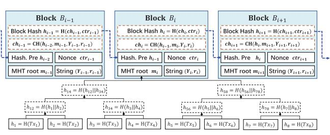

requests on the blockchain, or check the correctness of

audit proofs published on the blockchain.

 Verifier/Auditor (VA) is a light/new node (LN), such as a resource-constrained user that can query and validate the on-chain data, or a new user that can check the integrity of the blockchain ledger held by

FNs before synchronizing it.

 Prover/Auditee (PA) is a full node holding the entire blockchain ledger, and responsible for providing verifiable data query or ledger synchronization services.

## 2.2 Definitions

Inspired by [\[15\],](#page-13-12) we give the definition of VRBC based on the chameleon hash CH ¼ fSetup; KeyGen; CH; Col; Verifyg in [\[36\]](#page-13-33) and the aggregatable vector commitment AVC ¼ fSetup; Commit; Update; Open; Aggreagte; Verifyg in [\[37\]](#page-13-34).

 Redactable blockchain: The VRBC blockchain, as shown in Fig. [2](#page-2-1), consists of a sequence of redactable blocks Bi ¼ðhi1; chi;mi;Yi;ri; ctriÞ, in which hi1;ri 2 Z p; chi;Yi 2 G;mi 2f0; 1g-, and ctri 2 N. Take appending block Bi as an example, BM uses the root value mi of the Merkle hash tree (MHT) built upon transactions fTx1; :::; Tx8g to generate chameleon hash value for the new block Bi:

| $ch_i = \text{CH}(h_{i-1}, m_i, Y_i, r_i)$ | (1) |
|--------------------------------------------|-----|
|--------------------------------------------|-----|

where hi1 is the hash value of the previous block, and ðYi;riÞ is the verification string of ðmi; chiÞ in CH function [\[36\].](#page-13-33) Then, the block hash hi is generated through a standard hash function Hðchi; ctriÞ, where ctri is the Nonce value of the block Bi. Verifiable BAT: VRBC adopts vector commitment to bind the above blockchain as a q-ary spanning-tree BAT. As depicted in Fig. [3](#page-3-0)[1](#page-2-2) , take appending block B4 to a binary BAT as an example, the commitment value of node n4 is generated in advance when its

Fig. 1. The system model and workflow of the proposed VRBC scheme.

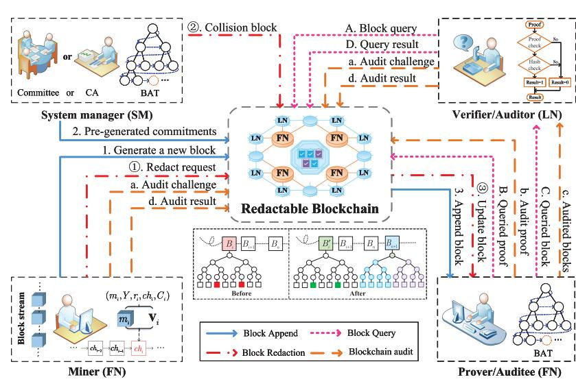

1. Generating a BAT mainly involves metadata in each block header, for brevity, we omit all block bodies (transactions) in this figure.

parent node B1 is appended to BAT. Now, SM pregenerates the commitments of B4's child nodes and calculates a verification value g4, such that:

| $\mathcal{C}_4 = \text{Commit}(m_4, C_9, C_{10}; \gamma_4)$ | (2) |
|-------------------------------------------------------------|-----|
|-------------------------------------------------------------|-----|

where Commit is an improved algorithm of Point-Proofs scheme [\[37\]](#page-13-34) obtained by introducing a verification value, which enables SM to append a new block into BAT without updating the entire BAT.

For better readability, we define some auxiliary functions for q-ary BAT: On input node index i and parameter q,

 Levelði; qÞ¼blog qððq 1Þði þ 1Þþ 1Þ 1c: it outputs the level l of the i-th node ni Parentði; qÞ¼bi1 q c: it outputs the index of parent node of the node ni; #Childði; qÞ ¼ ðði 1Þ mod qÞþ 2: it outputs the position of node ni in its parent node commitment; Pathði; qÞ¼ Pi: it outputs the index set of path nodes from ni to the root node: Pi ¼ðp0; :::; plÞ, where p0 ¼ 0;pl ¼ i and pj1 ¼ Parentðpj;qÞ, for j 2½1;l; Famði; qÞ¼ Ai: it outputs Ai ¼ða1;a2; :::; aqþ1Þ, the index vector of the node ni and its children in the tree, called later a family index vector. Namely, a1 ¼ i, and aj ¼ q i þ j 1, for 1 <j q þ 1.

Essentially, VRBC is an auditable VDS protocol customized for redactable blockchain, involving four algorithms (Setup, KeyGen, Bind, Redact) and two protocols (Query, Audit).

- 1) Setupð1-; 1N Þ! pp : On input security parameters ð1-; 1N Þ, this algorithm outputs public parameters pp.
- 2) KeyGenð1-; 1N Þ!ðTK; HKÞ: On input ð1-; 1N Þ, the key generation algorithm outputs a secret trapdoor key TK and public hash key HK.
- 3) Bindðhi1;mi; HK; TKÞ!ðchi;ri; fCjgj2Ai ; giÞ: On input mi, hi1, TK and HK, the bind algorithm outputs a CH value chi and child node commitments fCjgj2Ai : CHðmi;hi1; HKÞ!ðchi;riÞ: it returns a hash value chi and verification string ðY; riÞ. Commitðmi; TKÞ ! ðfCjgj2Ai ; giÞ: it returns commitments fCjgj2Ai and verification value gi.

- 4) Redactðm0 s;ms; HK; TKÞ!ðY 0 s ;r0 s; fC0 igi2Ps Þ: On input a new data m0 s and old data ms, the redaction algorithm outputs the updated verification string ðY 0 s ;r0 sÞ and the related path node commitments fC0 igi2Ps : ColðTK; HK; m0 s;hs1Þ!ðY 0 s ;r0 sÞ: it returns a collision ðm0 s;Y 0 s ;r0 sÞ for ðms;Ys;rsÞ. Updateðms;m0 s; fCigi2Ps Þ!fC0 igi2Ps : it returns the updated commitments fC0 igi2Ps .
- 5) Query: This interactive protocol can query and verify the correctness and validity of on-chain data, as follows: ChalðppÞ! s: takes pp as input, this algorithm outputs the index s of the queried block. Proveðs; BATÞ! ps: based on s, this procedure uses BAT to run Open and Aggregate algorithms, and returns the proof ps for the queried block ms. Verifyðms; psÞ! 0=1: based on the proof ps and the queried block ms, this procedure outputs 1 if the proof ps is valid. Otherwise, it outputs 0.
- 6) Audit: This interactive protocol can check the integrity of the blockchain ledger, as follows: ChalðppÞ! Chal : takes pp as input, this algorithm outputs a challenge Chal. ProveðChal; BATÞ! p^ : based on Chal, this procedure uses BAT to run Open andAggregate algorithms, and returns an integrity proof p^. Verifyðp^; fmigi2ChalÞ! 0=1 : based on the proof p^ and the challenged data fmig, this procedure outputs 1 if p^ is valid. Otherwise, it outputs 0.

## 2.3 Threat Model

For better understanding, we specify a threat model for the proposed VRBC scheme, involving three security goals of correctness, soundness, and controlled redaction.

 Correctness: In the block query or blockchain auditing phase, the Verify procedure outputs 1 for a given query/audit challenge Chal, if the system parameters have been generated by Setup, the data structure has been generated by KeyGen, Bind and Redact, and the proof has been generated by Prove. Soundness: If a prover can convince a verifier that the challenged block data is intact and valid through

Fig. 3. The process of appending a new block B4 to node n4 and redacting block B3 with B0 3 in binary BAT (i.e., ðq ¼ 2Þ).

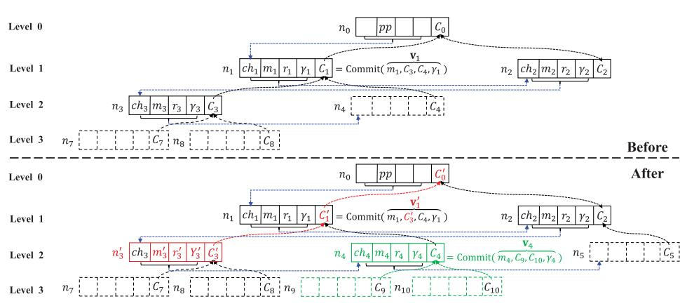

completing a query or audit challenge, it actually stores those data. Specifically, the soundness experiment between a challenger C and a PPT adversary A involves the following phases:

 Initialization: The challenger C first runs Setup and KeyGen to generate public parameter pp. Then, he samples a set of data fmigi2N and runs Commit to generates its commitment C. Finally, C sends ðpp; C; NÞ to the adversary A; Query: A picks a random index j 2½N and asks C to return the corresponding data mj 2fmig and its proof pj until the number of queries reaches upper bound qH <N; Challenge: C checks A with a challenge Chal consisting of some data that have not been queried, A returns the corresponding proof p; Verify: C outputs 1 if p is an accepting proof to ðChal; fCgÞ. Otherwise, outputs 0. Controlled redaction: Given a collision ðm0 s;Y 0 s ;r0 sÞ for ðms;Ys;rsÞ, no adversary can extract the corresponding trapdoor key. Besides, except for the redactors who hold the trapdoor key, no user can generate a new collision ðm00 s ;Y 00 s ;r00 s Þ for ðms;Ys;rsÞ.

## 3VERIFIABLE REDACTABLE BLOCKCHAIN

In this section, we describe the concrete construction of the proposed VRBC scheme.

## 3.1 Overview

Inspired by [\[15\],](#page-13-12) [\[28\],](#page-13-25) we design a novel blockchain authentication tree (BAT) that enables LNs to query or audit the redactable blockchain ledger held by FNs. Specifically, BMs adopts a chameleon hash function CH [\[36\]](#page-13-33) to generate a new block. If BM wins the current consensus process, his new block will be appended to the blockchain. Then, SM uses an aggregatable vector commitment to bind the new block into the q-ary BAT. Later, SM will follow redaction requests to generate and publish the corresponding collision block and updated BAT root commitment on the blockchain. On this basis, VA will be able to query the on-chain block from PAs and verify its correctness and validity. In addition, the new node will be able to check the integrity of the blockchain ledger before synchronizing it. Notably, all audit results will be published on the blockchain and shared among all nodes, which avoids the resource waste incurred by repeated auditing within the same period, enabling all nodes to supervise and exclude malicious PAs.

#### 3.2 The Concrete Construction

#### 3.2.1 System Setup

Given two security parameters ð1-; 1N Þ, SM runs Setup algorithm to initialize a VRBC system. First, SM generates three bilinear groups ðG1; G2; GT Þ of prime order p to build a bilinear pairing e : G1 G2 ! GT , the generators of those groups are g1;g2 and gT ¼ eðg1;g2Þ, respectively. Then, he defines two pseudo-random functions f1 : f1; 2; :::; ng Z p !f1; 2; :::; ng and f2 : f1; 2; :::; ng Z p ! Z p, along with two collision-resistant hash functions H1 : Z p G ! Z p and H2 : f0; 1g ! Z p. After that, he runs KeyGen algorithm to generate trapdoor keys x; y; a Z p, hash key HK ¼ðX; Y Þ¼ðgx 1 ;gy 1Þ and parameter (column) vectors:

$$\begin{aligned} g_1^{\mathbf{a}} &= (g_1^{\alpha}, \dots, g_1^{\alpha^N}) \\ g_1^{\alpha^N \mathbf{a}[-1]} &= (g_1^{\alpha^{N+1}}, \dots, g_1^{\alpha^{2N}}) \\ g_2^{\mathbf{a}} &= (g_2^{\alpha}, \dots, g_2^{\alpha^N}) \end{aligned} \quad (3)$$

where (column) vector a :¼ða; a2; :::; aN Þ. Furthermore, SM packages the public parameter set pp ¼ðe; p; g1;g2;gT ; G1; G2; GT ; H1; H2; f1; f2; HK; ga 1;gaN a½1 1 ;ga 2Þ and generates the genesis block B0, as follows.

$$\begin{cases} h_0 = H_2(pp||ctr_0) \\ C_0 = g_1^{\mathbf{v}_0^\top \mathbf{a}} = g_1^{\sum_{i=1}^N v_{0,i} a^i} \end{cases} \quad (4)$$

where v0 ¼ðh0;C1; :::; CqÞ and Cj ¼ g kj 1 ; kj ¼ H2ðxjjjÞ. Finally, SM broadcasts B0 ¼ðh0; ctr0; pp; fCjgj2A0 Þ and root node commitment C0 on the blockchain network.

#### 3.2.2 Block Append

To append a block to the blockchain, BM packages some transactions and calculates their MHT root mi. Then, he runs Bind algorithm to generate a new block Bi.

 Hash binding: BM picks at random an element ri Z p and computes the chameleon hash value of Bi:

$$\begin{aligned} ch_i &= (X \cdot Y)^{H_1(h_{i-1}\|m_i, Y)} \cdot g_1^{r_i} \\ &= g_1^{H_1(h_{i-1}\|m_i, Y)(x+y)+r_i} \end{aligned} \quad (5)$$

where hi1 ¼ H2ðchi1; ctri1Þ. Then, BM appends block Bi ¼ðhi1; chi;mi; Y; riÞ to the blockchain when he wins the current consensus process.

 Commitment binding: Upon receiving Bi, SM executes the procedure Commit to bind Bi to q-ary BAT (q ¼ N 1). As the instance shown in Fig. [3,](#page-3-0) SM runs Famði; qÞ function to derive the family index vector Ai ¼ða1;a2; :::; aqþ1Þ. For each j 2½2;q þ 1, SM computes the trapdoor kaj ¼ H2ðxjjajÞ and its commitment Caj ¼ g kaj 1 for the future j-th child node of node ni. Then, SM obtains a family commitment vector vi ¼ðmi;Ca2 ; :::; Caqþ1 Þ and calculates a verification value gi ¼ ki v&gt; i a, such that:

$$\begin{aligned} C_i = g_1^{\epsilon_i} &= g_1^{\gamma_i + \sum_{j=1}^N v_{i,j} a^j} \\ &= g_1^{\gamma_i + m_i \alpha + C_{a_2} \alpha^2 + \dots + C_{a_N} \alpha^N} \end{aligned} \quad (6)$$

Finally, SM publishes the family commitment vector vi and commitment verification value gi of the new block Bi on the blockchain.

 Upon receiving a new block Bi along with ðvi; giÞ, all LNs check its correctness, as follows:

$$\begin{cases} C_i \stackrel{?}{=} g_1^{v_i + \sum_{j=1}^N v_{i,j}\alpha^j} \\ ch_i \stackrel{?}{=} (X \cdot Y)^{H_1(h_{i-1}||m_i, Y)} \cdot g_1^{r_i} \end{cases} \quad (7)$$

If equation [\(7\)](#page-4-0) holds, they append Bi to their local blockchain ledger. That is, they insert the new node ni ¼ðchi;mi;ri; gi;CiÞ to their local copy of BAT.

# Algorithm 1. Commitment Update

Input: ðs; ms;m0 s; fCigi2Ps Þ

Output: ðfc0 igi2Ps Þ

1 Compute l Levelðs; qÞ and b Parentðs; qÞ

2 Set i s

3 for (h ¼ l; h 0; h ) do

4 if h ¼¼ l then

5 C0 s ¼ Cs g ðm0 smsÞags 1 , gs 0

6 else

7 c #Childði; qÞ ðC0 CiÞacgb

8 C0 b ¼ Cb g 1 , gb 0 9 i b, b Parentðb; qÞ

10 end 11 end

# Algorithm 2. Query Proof Generation

Input: ðs; BATÞ

Output: ðps;ms;hs1; chs;ms;Ys;rs; fCigi2Ps Þ

1 Set l Levelðs; qÞ

2 Compute Ps ¼ Pathðs; qÞ¼ðp1;p2; :::; plÞ

3 Compute ts ¼ H2ðc; Cs; vs½cÞ where c ¼ 1

4 Compute ps ðCs=gmsa 1 Þ aNþ1cts

5 for (i 2 Ps ^ i 6¼ 0) do

6 b Parentði; qÞ

7 c #Childði; qÞ

8 Run Famðb; qÞ to generate Ab ¼ða1; :::; aqþ1Þ

9 Get vb ¼ðmb;Ca2 ; :::; Caqþ1 Þ

10 Compute tb ¼ H2ðc; Cb; vb½cÞ

11 Generate pb ¼ðCb=gvb;cac aNþ1ctb

1 Þ 12 end

13 Compute ps Q i2Ps pi, ms P i2Ps vi;cti

14 Get Bs ¼ðhs1; chs;ms;Ys;rsÞ, fCigi2Ps from BAT.

## 3.2.3 Block Redaction

When the s-th block needs to be redacted (for example, we have to replace ms by m0 s, similar to the redaction instance shown in Fig. [3\)](#page-3-0), SM executes the following procedures:

 Update.Col: SM computes the long-term trapdoor ks of the block chameleon hash chs:

$$k_s = \mathbf{H}_1(h_{s-1}||m_s, Y_s) \cdot (x + y_s) + r_s \bmod p \quad (8)$$

Then, SM generates a new ephemeral trapdoor key y0 s ¼ H2ðx; m0 sÞ and its hash key Y 0 s ¼ g y0 s 1 . After that, SM calculates the new verification value r0 s:

| $s'_s = k_s - \mathbf{H}_1(h_{s-1}  m'_s, Y'_s) \cdot (x + y'_s) \bmod p$ | (9) |
|---------------------------------------------------------------------------|-----|
|                                                                           |     |

In this way, SM generates a collision block B0 s ¼ ðchs;m0 s;Y 0 s ;r0 sÞ for Bs ¼ðchs;ms;Ys;rsÞ.

 Update.Com: To revoke the invalid block data ms , SM updates the commitments fCigi2Ps of the path

nodes from the redacted block m0 s to the root node in Authorized licensed use limited to: Thammasat University. Downloaded on September 04,2026 at 07:59:01 UTC from IEEE Xplore. Restrictions apply.

sequence, as shown in Algorithm [1](#page-5-0). Finally, SM publishes the new block ðs; m0 s;Y 0 s ;r0 sÞ and the updated root commitment C0 0 on the blockchain.

 Update.block: After obtaining ðs; m0 s;Y 0 s ;r0 s;C0 0Þ, all FNs run Algorithm [1](#page-5-0) to generate the new root commitment C00 0 . If C00 0 ¼ C0 0, they further check that:

$$ch_s \stackrel{?}{=} (X \cdot Y'_s)^{H_1(h_{s-1}||m'_s, Y'_s)} \cdot g_1^{r'_s} \quad (10)$$

If equation [\(10\)](#page-5-1) does not hold, then FNs aborts this procedure. Otherwise, they replace the block ðchs;ms;rs; gs;CsÞ and the commitments fCigi2Ps with ðchs;m0 s;r0 s;Y 0 s ;C0 sÞ and fC0 igi2Ps , respectively.

# Algorithm 3. Audit Proof Generation

Input: ðChal; BATÞ

Output: ðp^;m^; fhs1; chs;ms;Ys;rs; fCigi2Psgs2BÞ

1 Set p^ 1

2 Parse Chal as z; f1 and f2

3 for (i ¼ 1;i z; i þþ) do

4 Compute index: bi ¼ f1ði; f1Þ

5 Compute coefficient: ti ¼ f2ði; f2Þ

6 Compute ti;c ¼ H2ðc; Cbi ; vbi ½cÞ where c ¼ 1 a 1 Þ aNþ1cti;cti

7 Compute pbi ¼ðCbi=gmbi

8 Get p^ p^ pbi

9 end

10 Set B fbigi2½z

11 while B 6¼f0g do

12 s maxðBÞ, b Parentðs; qÞ

13 Run Famðb; qÞ to generate Ab ¼ða1; :::; aqþ1Þ

14 Get vb ¼ðmb;Ca2 ; :::; Caqþ1 Þ

15 Db Ab½1\ B

16 Sb f#Childðd; qÞg where d 2 Db

17 tb ¼ H2ðCbÞ

18 for c 2 Sb do

19 pb 1

20 tb;c ¼ H2ðc; Cb; vb½SbÞ

21 pb pb ðCb=gvb;cac 1 Þ aNþ1ctb;ctb

22 end

23 B ðB=DbÞ[fbg

24 end

25 Get p^ p^ Q i2Ps;s2B pi, m^ P i2Ps;s2B P c2Si vi;cti;cti 26 Get fhs1; chs;ms;Ys;rs; fCigi2Psgs2B from BAT.

#### 3.2.4 Block Query

To query the s-th block data ms, VA can perform an interactive protocol Query with a full node PA, as follows[2](#page-5-2) :

 Chal: VA sends a request to PA and asks for the s-the block data along with its validity proof. Proof: PA runs Algorithm [2](#page-5-3) to generate the query proof ðps;msÞ, which will be published on the blockchain. Meanwhile, PA sends the verification metadata ðhs1; chs;ms;Ys;rs; fCigi2Ps Þ of the queried block to VA via a secure off-chain channel. Verify: After getting the queried block Bs ¼ ðhs1; chs;ms;Ys;rs; fCigi2Ps Þ and proof ðps;msÞ, if

C0 0 ¼ C0, VA checks the validity of queried block:

$$\prod_{i \in \mathbb{P}_s} e(C_i, g_2^{\alpha^{N+1-c_i t_i}}) \stackrel{?}{=} e(\pi_s, g_2) \cdot g_T^{\alpha^{N+1} \mu_s} \quad (11)$$

where c ¼ #Childðj; qÞ and i ¼ Parentðj; qÞ;ði; j 2 PsÞ. If equation [\(11\)](#page-6-0) does not hold, which means that the block data ms is invalid, VA discards it. Otherwise, he further checks the correctness of the queried block via validating its chameleon hash value:

$$ch_s \stackrel{?}{=} (X \cdot Y_s)^{H_1(h_{s-1}||m_s, Y_s)} \cdot g_1^{r_s} \quad (12)$$

If both equations [\(11\)](#page-6-0) and [\(12\)](#page-6-1) are valid, VA remains Bs locally. Otherwise, he discards it.

## 3.2.5 Blockchain Auditing

To check the integrity of the blockchain ledger held by PA, the auditor VA can execute an Audit protocol, as follows.

- Chal: VA picks three random elements z 2½n and f1;f2 2 Z
- p. Then, he issues the audit challenge Chal ¼ðz; f1;f2Þ on the blockchain. Proof: According to the challenge Chal, PA runs the Algorithm [3](#page-5-4) to generate an integrity proof ðp^;m^Þ, which will be issued on the blockchain. After that, he returns the challenged blocks ðfhs1; chs;ms;Ys;rs; fCigi2Ps gs2BÞ to VA through a secure off-chain channel. Verify: Upon getting ðp^;m^Þ, if C0 0 ¼ C0, he checks the integrity of the blockchain ledger, as follows.

$$\prod_{\substack{i \in \mathbf{P}_s \\ s \in B}} e(C_i, g_2^{\sum_{c \in S_i} \alpha^{N+1-c} t_{i,c}})^{t_i} \stackrel{?}{=} e(\hat{\pi}, g_2) \cdot g_T^{\alpha^{N+1} \mu}$$

If the above equation does not hold, VA aborts this process. Otherwise, by equation [\(12\)](#page-6-1), he checks the correctness of the challenged blocks. If all challenged blocks are correct, VA outputs audit result Result ¼ 1 to indicate that the blockchain ledger held by PA is intact and valid. Otherwise, outputs Result ¼ 0. Finally, VA issues the audit result on the blockchain.

# 4OPTIMIZED AND EXTENDED VRBCS

Benefits from the scalability of the underlying primitives, the proposed VRBC can also be optimized/extended to meet various service requirement.

## 4.1 VRBC With Optimized Auditing and Redaction

By observing BAT-based proof generation and redaction, we introduce two optimized strategies to improve the performance of blockchain auditing and redaction, respectively.

 Optimized auditing: Due to the structural characteristics of BAT, the costs (i.e., computation and communication) of blockchain auditing are determined by the node number of path union from challenged nodes to the root node. That is, the audit cost is minimized when all challenged blocks are on the same path or belong to the minimum path union. To this

end, we define a new PRF f 1 : f1; :::; ql g Z p ! Authorized licensed use limited to: Thammasat University. Downloaded on September 04,2026 at 07:59:01 UTC from IEEE Xplore. Restrictions apply.

ð qð1ql1Þ 1q ; qð1ql Þ 1q where l ¼ levelðn; qÞ, which enables VA to randomly pick z 2½ql leaf nodes and challenge all path nodes from them to the root node. Besides, the coefficients of the challenged nodes are still calculated by bi ¼ f2ði; f2Þ. According to the audit challenge Chal ¼ðz;f1;f2Þ with f 1 and f2, PA generates an integrity proof by running Algorithm [3](#page-5-4).

 Delayed redaction: Similarly, blockchain redaction requires updating the commitment of all path nodes from the redacted block to the root node, which means that redaction costs are also minimized when all redacted blocks are on the same path or adjacent paths. To this end, SM can adopt a delayed redaction strategy to achieve an efficient batch redaction. Specifically, he first divides BAT into a series of subregions based on leaf nodes. Then, he delays trivial redaction requests belonging to the same sub-region until an important request arises (e.g., a redaction request subject to law), and then redacts all the delayed blocks at once.

## 4.2 Transaction-Level VRBC

For achieving fine-grained redactions, we can extend the proposed scheme to a transaction-level version, as follows.

 Chameleon hash: To achieve transaction-level redaction, BM runs CH function to generate the chameleon hash value for each transaction Txi in Bs: he picks a random ri 2 Z p and computes:

$$ch_i = g_1^{\mathbf{H}_1(Tx_i, Y) \cdot (x+y) + r_i} \quad (13)$$

Then, he uses all chameleon hash values fchig to generate a MHT, whose root value ms will be used to generate the block hash hs ¼ H2ðhs1;ms; ctrsÞ.

 Node commitment: For verifiable redaction, one feasible solution is that SM adopts Pointproofs [\[37\]](#page-13-34) to generate the transaction commitment TCs for each block Bs. Further, he runs our commitment algorithm to calculate node commitment Cs with ðTCs;Ca2 ; :::; Caqþ1 Þ, instead of ðms;Ca2 ; :::; Caqþ1 Þ. Proof generation/verification: The proof generation and verification of transaction-level redaction are similar to our basic scheme, except for the additional proof generation and verification of transaction commitment. Due to space limitations, we omit it here. Transaction-level redaction: Based on the above modifications, SM is able to calculate a collision ðTx0 i;Y 0 s ;r0 sÞ for the target transaction ðTxi;Ys;rsÞ. Then, he updates the transaction commitment of the redacted block and the path node commitments from the redacted node to the root node.

#### 4.3 VRBC for Permissionless Setting

Similar to the scheme of Ateniese et al. [\[15\],](#page-13-12) VRBC can also be implemented in a permissionless setting.

 Chameleon hash: By introducing a committee consisting of some important miners (e.g., the top 7 mining pools), VRBC allows them to execute a MPC protocol to generate the hash key of the chameleon hash function, or redact on-chain data. For example, each party Pi 2fPgi2½1;n picks a random element xi;yi Z p. After that, they generate a uniform hash key pair ðX; Y Þ via a MPC protocol.

| $X = \prod_{i=1}^n g_1^{x_i}, \quad Y = \prod_{i=1}^n g_1^{y_i} \quad (14)$ |
|-----------------------------------------------------------------------------|
|-----------------------------------------------------------------------------|

Then, BM generate a new block Bi ¼ðchi;mi;riÞ with ðX; Y Þ. To redact ms with m0 s, each Pi generates a new ephemeral trapdoor piece y0 i;s ¼ H2ðxi;m0 sÞ and executes the MPC protocol to generate a new hash key Y 0 s ¼ Qn i¼1 g y0 i;s 1 . Thereafter, Pi computes the trapdoor piece ki;s and the randomness r0 i;s:

$$\begin{cases} k_{i,s} = \mathbf{H}_1(m_s, Y_s) \cdot (x_i + y_i) + \frac{r_s}{n} \bmod p \\ r'_{i,s} = k_{i,s} - \mathbf{H}_1(h_{s-1} || m'_s, Y'_s) \cdot (x_i + y'_{i,s}) \bmod p \end{cases}$$

Finally, they obtain the collision ðchs;m0 s;Y 0 s ;r0 sÞ of block ðchs;ms;Ys;rsÞ, where r0 i¼1 r0 i;s.

s ¼ Pn Vector commitment: Due to the same main idea, our vector commitment algorithm can also be implemented in a decentralized committee according to Pointproofs [\[37\]](#page-13-34). Here, we omit the specific process.

# 5SECURITY ANALYSIS

Theorem 1. (Correctness): The proposed scheme can achieve a correct verification in the block query and auditing phases.

Proof. Due to the similar idea, the correctness of blockchain auditing can be deduced from the block query. Therefore, we will prove their correctness in the following two steps.

Step 1: we prove the correctness of block query process:

$$\begin{aligned} & \prod_{i \in \mathbf{P}_s} e(C_i, g_2^{\alpha^{N+1-c_{t_i}}}) \\ &= \prod_{i \in \mathbf{P}_s} e(g_1^{\mathbf{v}_i^\top \mathbf{a} + \gamma_i}, g_2^{\alpha^{N+1-c_{t_i}}}) \\ &= \prod_{i \in \mathbf{P}_s} e(g_1^{\mathbf{v}_i[-c]^\top \mathbf{a}[-c] + \gamma_i}, g_2^{\alpha^{N+1-c_{t_i}}}) \cdot e(g_1^{\mathbf{v}_i, c\alpha^c}, g_2^{\alpha^{N+1-c_{t_i}}}) \\ &= e\left(\prod_{i \in \mathbf{P}_s} (C_i/g_1^{\mathbf{v}_i, c\alpha^c})^{\alpha^{N+1-c_{t_i}}}, g_2\right) \cdot e(g_1^{\alpha^{N+1}} \sum \mathbf{v}_i, c^{t_i}, g_2) \\ &= e\left(\prod_{i \in \mathbf{P}_s} \pi_i, g_2\right) \cdot g_T^{\alpha^{N+1} \cdot \sum \mathbf{v}_i, c^{t_i}} \end{aligned}$$

Distinctly, iff ps ¼ Q i2Ps pi and ms ¼ Pvi;cti, we get that

$$\prod_{i \in P_s} e(C_i, g_2^{\alpha^{N+1-c}t_i}) = e(\pi_s, g_2) \cdot g_T^{\alpha^{N+1}\mu_s} \quad (15)$$

Step 2: Then we analyze the correctness of the blockchain auditing. Let ti;c be the coefficient of the c -th element of the vector vi. From equation [\(15\),](#page-7-0) we can get that:

$$\begin{aligned} & \prod_{\substack{i \in \mathbf{P}_s \\ s \in B}} e(C_i, g_2^{\sum_{c \in S_i} \alpha^{N+1-c} t_{i,c}})^{t_i} \\ &= \prod_{i \in \mathbf{P}_s} \prod_{c \in S_i} e(C_i, g_2^{\alpha^{N+1-c} t_{i,c} t_i}) \tag{16} \\ &= e\left(\prod_{i \in \mathbf{P}_s} \pi_i, g_2\right) \cdot g_T^{\alpha^{N+1}} \sum_{v_{i,c} t_{i,c} t_i} \end{aligned}$$

Distinctly, iff p^ ¼ Q pi and m^ ¼ Pvi;cti;cti, we capture that:

$$\prod_{i \in \mathbf{P}_s} e(C_i, g_2^{\sum_{c \in S_i} \alpha^{N+1-c} t_{i,c}})^{t_i} = e(\hat{\pi}, g_2) \cdot g_T^{\alpha^{N+1} \hat{\mu}} \quad (17)$$

In summary, the proposed scheme can guarantee the correctness of block query and blockchain auditing. tu

Theorem 2. (Soundness): As long as the '-wBDHE problem is hard in bilinear group, in the algebraic group model, no PPT adversary can pass the block query and blockchain auditing protocol of the proposed scheme with a non-negligible probability.

Proof. Essentially, block query is a special case of blockchain auditing, so we only discuss the soundness of the latter. For clarity, we set a series of soundness games, as follows.

Game 0. The initial game Game 0 is an interactive soundness game, as defined in Section [2.3](#page-3-1).

Game 1. This game is essentially identical to Game 0, except that the challenger C maintains a list of all issued commitments. Once the adversary A queries a commitment Ci that is not part of the list, C aborts it and declares failure.

Game 2. This game is essentially identical to Game 1, except that C maintains a list of its responses to the Open query made by A. For a challenge Chal, if A can win this game by returning two different proofs ðp^; p^0 Þ with a nonnegligible probability , C aborts it and declares failure.

To analyze the difference in success probability between Game 1 and Game 2, we assume that the challenged BAT consists of n blocks, where each block Bi contains data mi along with the commitment Ci issued by Commit. Furthermore, let Chal ¼ fði; biÞg be the challenge that causes the failure. Then, we suppose that the expected response generated by an honest prover is Q p^ ¼ pi and m^ ¼ Pvi;c;ti;c;ti, where c 2 Si;i 2 Ps;s 2 B 2 Chal, while the response generated by A are p^0 and m^0 Based on the correctness demonstrated in Theorem [1](#page-7-1), the expected response will satisfy the following verification equation:

.

$$\prod_{\substack{i \in \mathbf{P}_s, \\ s \in B}} e(C_i, g_2^{\sum_{c \in S_i} a^{N+1-c} t_{i,c}})^{t_i} = e(\hat{\pi}, g_2) \cdot g_T^{a^{N+1} \hat{\mu}} \quad (18)$$

Likewise, the response p^0 ð6¼ p^Þ that causes the failure also satisfies the verification equation, i.e., that

$$\prod_{\substack{i \in \mathbf{P}_s \\ s \in \mathcal{B}}} e(C_i, \sum_{c \in S_i} \alpha^{N+1-c} t_{i,c}) t_i = e(\hat{\pi}', g_2) \cdot g_T^{N+1} \hat{\mu}' \quad (19)$$

Distinctly, m^0 6¼ m^, otherwise it means that p^0 ¼ p^, which contradicts our assumption above. Further, we prove that we can build a simulator S to solve the '-wBDHE problem: S behaves like C in Game 1, except for giving black-box access to A. From equation [\(18\)](#page-7-2) and [\(19\)](#page-7-3), S can get that:

$$\begin{aligned} e(\hat{\pi}/\hat{\pi}', g_2) &= g_T^{\alpha^{N+1}(\hat{\mu}' - \hat{\mu})} \\ &= e(g_1^{\alpha^{N+1}(\hat{\mu}' - \hat{\mu})}, g_2) \end{aligned} \quad (20)$$

Now, S get that ðp^=p^0 Þ ðm^0 m^Þ 1 ¼ gaNþ1 1 . Thus, if there is a non-negligible difference between the success probability of A in Game 1 and Game 2, we can build a simulator S to utilize A to solve '-wBDHE problem.

Game 3. This game is essentially identical to Game 2, except that C can track Open queries and interactive instances. In this case, if there are some responses m^ that can pass the verification, but at least one of the aggregated proofs m^0 is not equal to the expected proof m^ ¼ vi;c;ti;c;ti, C aborts it and declares failure.

P Based on the same assumption as Game 2, we can also build a simulator S to solve the '-wBDHE problem. In fact, A can win Game 3 in one of the following three cases:

 Case 1:"H-lucky" queries: For any queries ð; C; S; v½SÞ launched by the algebraic A [\[38\]](#page-13-35), who must output b 2 ZN p and d 2 ZN1 p , such that

$$C = g_1^{\mathbf{b}^\top \mathbf{a} + \alpha^N \mathbf{d}^\top \mathbf{a}[-1]} \\ = g_1^{\sum_{i \in [N]} b_i \alpha^i + \sum_{j \in [N-1]} d_j \alpha^{N+1+j}} \quad (21)$$

On this basis, a query is "H-lucky" if and only if:

| $ \mathbf{v}[S] \not\equiv_p \mathbf{b}[S] $ | and | $(\mathbf{v}[S] - \mathbf{b}[S])^T \mathbf{t} \equiv_p 0$ | (22) |
|----------------------------------------------|-----|-----------------------------------------------------------|------|
|                                              |     |                                                           |      |

where t ¼ðH2ði; C; v½iÞÞi2S. Notably, a query is "H-lucky" with a negligible probability, at most 1=p.

 Case 2:"H0 -lucky" challenge: For any challenges ð; fCi;Si; vi½Sigi2Ps;s2BÞ launched by A, it must output some fbi; digi2Ps;s2B, such that.

$$C_i = g_1^{\mathbf{b}_i^\top \mathbf{a} + \alpha^N \mathbf{d}_i^\top \mathbf{a}[-1]} \quad (23)$$

Similarly, a challenge is "H0 -lucky" if 9i,

$$(\mathbf{v}_i[S_i] - \mathbf{b}_i[S_i])^\top \mathbf{t}_i[S_i] \neq p \quad (24)$$

$$\sum_{i \in \Gamma_s, s \in B} (\mathbf{v}_i[S_i] - \mathbf{b}_i[S_i])^\top \mathbf{t}_i[S_i] t_i \equiv_p 0$$

where ti½Si¼ðti;cÞc2Si ¼ðH2ðc; Ci; vi½SiÞÞc2Si . Obviously, the challenge is "H0 -lucky" with probability at most 1=p, which is negligible.

 Case 3: "Solving '-wBDHE problem": Consider the output ðp^; fCi; fSz i ; vz i ½Sz i gz¼0;1gi2Ps Þ of a winning adversary A, who must output bi; di, such that:

$$C_i = g_1^{\mathbf{b}_i^\top \mathbf{a} + \alpha^N \mathbf{d}_i^\top \mathbf{a}[-1]} \quad (25)$$

Since v0 i ½S0 i \ S1 i 6¼ v1 i ½S0 i \ S1 i ,it must be the case that either v0 i ½S0 i 6¼ bi½S0 i or v1 i ½S1 i 6¼ bi½S1 i . Therefore, let ðS i ; v i ; p^Þ be an accepting instance, where is equal to 0 or 1, and v i ½S i 6¼ bi½S i , we have:

$$\prod_{\substack{i \in \mathbf{P}_s \\ s \in B}} e(C_i, g_2 \sum_{c \in S_i} a^{N+1-c} t_{i,c})^{t_i} = e(\hat{\pi}^*, g_2) \cdot g_T^{a^{N+1} \hat{\mu}^*} \quad (26)$$

where m^ ¼ v i ½S i &gt;ti½S i ti. This implies that

$$\begin{aligned} & \sum_{i \in \mathbf{P}_s} s \in S_i \sum_{c \in S_i} \alpha^{N+1-c} \mathbf{b}_i^* [-c]^\top \mathbf{a} [-c]^\top \mathbf{t}_i, \mathbf{t}_{i,c} \\ & \left( \sum_{i \in \mathbf{P}_s} s \in S_i \alpha^N \mathbf{d}_i^\top \mathbf{a} [-1] \sum_{c \in S_i} \alpha^{N+1-c} \mathbf{t}_i, \mathbf{t}_{i,c} \right) \cdot (\hat{\pi}^*)^{-1} \\ & = g_1 \alpha^{N+1} \sum_{i \in \mathbf{P}_s} (\mathbf{v}_i^* [S_i^*] - \mathbf{b}_i^* [S_i^*])^\top \mathbf{t}_i [S_i^*] \mathbf{t}_i \end{aligned} \quad (27)$$

Since there are no "H-lucky" queries, we have:

$$(\mathbf{v}_i^*[S_i^*] - \mathbf{b}_i^*[S_i^*])^\top \mathbf{t}_i[S_i^*] \not\equiv_p 0 \quad (28)$$

Also, there are no "H0 -lucky" challenges, we have

$$\Delta = \sum_{i \in \mathbf{P}_s, s \in B} (\mathbf{v}_i^*[S_i^*] - \mathbf{b}_i^*[S_i^*])^\top \mathbf{t}_i[S_i^*] t_i \neq 0 \quad (29)$$

Meanwhile, the LHS of Equation [\(27\)](#page-8-0) can be calculated with ðga 1;gaN a½1 1 ;ga2N a 1 Þ. Therefore, S can calculate c 6 p D1 and raise both sides of Equation [\(27\)](#page-8-0) to the power c to compute gaNþ1 1 .

Therefore, if there is a non-negligible difference between the success of A in Game 2 and Game 3, we can build a simulator S to employ A to solve '-wBDHE problem. tu

Theorem 3. (Controlled redaction): The proposed scheme only allows the redactor holding a trapdoor key to redact the blockchain and prevents adversaries from exploiting collisions to extract the trapdoor key or forge a new collision.

Proof. By adopting Chen et al.'s [\[36\]](#page-13-33) double-trapdoor chameleon hash family, the proposed scheme enables the redactor to achieve a controlled redaction on the blockchain. That is, the proposed scheme inherits the security of [\[36\],](#page-13-33) involving collision resistance, trapdoor collisions, and key-exposure freeness. The former two ensure that only the redactor can compute a collision to redact blockchain. In addition, the last one prevents adversaries from extracting the trapdoor key with collisions. Due to space constraints, the specific proof is omitted here. tu

## 6PERFORMANCE EVALUATION

In this section, we evaluate the performance of the proposed scheme from both theoretical analysis and implementation.

For better performance evaluation, we select Ethereum [\[2\]](#page-12-1) and AMVA17 [\[15\]](#page-13-12) as compared schemes. Meanwhile, we define some notations in Table [2](#page-9-0), which will be used to evaluate the computation, communication, and storage costs of compared schemes in Tables [3](#page-9-1) and [4,](#page-10-0) respectively.

During the system setup phase, all compared schemes require 1M to generate a standard genesis block. In addition, AMVA17 consumes 1H þ 3Exp to generate the parameters of the chameleon hash function, while our scheme requires additional cost 2qH þ 3NExp to generate the parameters of chameleon hash and vector commitment. Correspondingly, AMVA17 and our scheme require extra 2ðjZpjþjGjÞ and 4ðN þ 1ÞjGj bandwidth to publish public parameters on the blockchain, respectively. Although the additional computation and communication costs of our scheme are higher than that of AMVA17, it is negligible relative to the cost of generating a standard block, which is necessary and acceptable for our scheme to achieve efficient validation.

In the block append phase, except for generating a standard block with 1M, the block proposer BM in AMVA17 consumes extra 1H þ 2Exp to calculate the chameleon hash value for each block. Compared to AMVA17, our scheme requires extra qð2H þ ExpÞ to bind a new block to the q-ary BAT, which enables other BMs to check the correctness and validity of on-chain block data. Accordingly, our scheme requires additional computation costs ðq 1ÞH þ 1Hþ ðN 1ÞExp to verify the correctness and validity of the new block, as well as additional bandwidth qjGj to publish its family node commitments on the blockchain.

Concerning block redaction, only AMVA17 and our scheme allow the redactor to redact on-chain data. The redaction cost of the former is 1H þ 1Exp, while that of the latter is 2Hþð' þ 1ÞðH þ ExpÞ, in which 'ðH þ ExpÞ is used to update the node commitment from the redacted block to the root node in BAT. Correspondingly, other BMs in our scheme also require 'ðH þ ExpÞ to update the related commitments and calculate the updated root node commitment to check the validity of the redacted block. Let us note that the communication cost of our scheme is almost equal to AMVA17 since our scheme allows BMs to update the redacted block and BAT by themselves.

Regarding block query, any continuously-online LN can easily verify the validity of the queried block with 2lþ1H in Ethereum, ð2lþ1 þ 1ÞH þ 2Exp in AMVA17, and 2lþ1H þ 1H in our scheme, respectively. Without loss of generality, Tables [3](#page-9-1) and [4](#page-10-0) summarize the query costs of rejoined LN (like a new node). Specifically, Ethereum (AMVA17) requires VA to download all blocks from the queried block to the genesis block (the entire blockchain ledger), and verify them to capture the correctness and validity of the queried block. Unlike them, our scheme binds the blockchain as a q-ary BAT, which enables PA to generate a validity proof for the queried block, and VAs only need to download and validate the queried block along with its proof. Notably, similar to the proof generation in PointProofs[\[37\],](#page-13-34) the PA in our scheme can first calculate the sum of coefficients of each parameter and then perform exponential operations, which makes the cost of proof generation at most q'H þð2N 1ÞExp. Therefore, both the computation and communication costs of our scheme are much lower than those of Ethereum and AMVA17.

Taking into account the auditing of the blockchain, similar to the block query, VA in Ethereum and AMVA17 needs to download and verify the entire blockchain ledger held by PA. Nevertheless, our scheme adopts an optimized auditing strategy, which enables VA to check the integrity of the blockchain only by verifying the blocks of path union determined by the audit challenge. Moreover, both the FNs and the LNs of our scheme require only an additional jZpjþ 3jGj to store metadata for each block, which is much less than the size of a standard block.

In practice, block query and blockchain auditing are very frequent, which means that the additional costs of our scheme at each phase are negligible and acceptable relative to the benefits obtained by achieving efficient verification.

## 6.2 Implementation

To obtain a visual performance evaluation, we set up a series of experiments to estimate the on-chain and off-chain costs of compared schemes at different phases.

TABLE 2 Notations

| Notation |        | Description |         |              |                  |            |                      |
|----------|--------|-------------|---------|--------------|------------------|------------|----------------------|
| n        | Number | of          | blocks  | in           | the              | blockchain |                      |
| nq       | Number | of          | blocks  | before       | the              | queried    | block                |
| m        | Number | of          |         | transactions | in a             | standard   | block                |
| q        | Number | of          | forks   | in the       | q -ary           | BAT        |                      |
| N        | Number | of          |         | dimensions   | of               | the family | vector               |
| r        | Number | of          | nodes   | in the       |                  | audited    | path union           |
| l        | Height | of          | the     | MHT in       | the              | block,     | i.e., level ð m; 2 Þ |
| ‘        | Height | of          | the     |              | redacted/queried |            | node in BAT.         |
| H        | Cost   | of          | running | a hash       | function         | H          | 1                    |
| H        | Cost   | of          | running | a            | standard         | hash       | function H 2         |
| M        | Cost   | of          | mining  | a standard   |                  | block      |                      |
| Exp      | Cost   | of          | running | a            | exponentiation   |            | operation            |
| Pair     | Cost   | of          | running | a bilinear   |                  | pairing    | operation            |
| j G j    | Size   | of the      | element | in           | G                |            |                      |
| j Z p j  | Size   | of the      | element | in           | Z p              |            |                      |
| j Tx j   | Size   | of the      |         | transaction  | in a             | standard   | block                |
| j BH j   | Size   | of the      | block   | header       | in a             | standard   | block                |

TABLE 3 Comparisons of Computation Costs

| Schemes      | System           | Block append        |                                          | Block redaction |                                       | Block query      |                                                | Blockchain auditing |                                                              |
|--------------|------------------|---------------------|------------------------------------------|-----------------|---------------------------------------|------------------|------------------------------------------------|---------------------|--------------------------------------------------------------|
|              |                  | setup               | Bind                                     | verify          | Redact                                | verify           | Prove                                          | Verify              | Prove                                                        |
| Ethereum [2] | 1M               | 1M                  | 2 (1+1) H                     | –               | –                                     | –                | $n_q(2^{(1+1)}H)$                              | –                   | $n(2^{(1+1)}H)$                                              |
| AMVA17 +3exp | 1M+1H            | 1M+1H+2Exp          | 2 (1+1) H+1)H+2Exp            | 1M+1Exp         | 2 (1+1) H+1)H+2Exp         | –                | $n(2^{(1+1)}H)+2Exp$                           | –                   | $n(2^{(1+1)}H)+2Exp$                                         |
| Our scheme   | 1M+2qH +3NExp | 1M+1H+2q(H +Exp) | 2 (1+1) H+q)H+1H +(N+1)Exp | (H+Exp)         | 2 (1+1) H+1)H +(Exp)Exp | qH+(2N- 1)Exp | 2 (1+1) H+1H+(Exp+2)H (Exp+Pair) | qpH+(2N- 1)Exp   | $\rho(\mathcal{H} + 2^{(1+1)}H)$ ( $\rho + 1$ )(Exp+Pair) |

We adopt Python to implement the above compared schemes by calling the GNU Multiple Precision Arithmetic (GMP) Library[3](#page-10-1) , Pairing Based Cryptography (PBC) Library[4](#page-10-2) and Fast Elliptic Curve Cryptography (fastecdsa 2.2.3) Library[5](#page-10-3) . For each scheme, we test the on-chain costs (i.e., gas consumption[6](#page-10-4) ) of various operations on the official public test-net Ropsten[7](#page-10-5) of Ethereum. Meanwhile, we also test the off-chain computation costs of all compared schemes on CentOS 8.3.2011 with two 2.20GHz Intel Xeon Silver 4210 CPU and 128GB memory. Specifically, we adopt SHA-256 as the standard hash function to generate block/ transaction hash value. Besides, each test block instance contains 170 transactions of size 660 Bytes[8](#page-10-6) and all experiments will be repeated 30 times to obtain average results.

## 6.2.1 On-Chain Costs

As shown in Fig. [4](#page-10-7), we test the additional on-chain costs (i.e., gas costs) of compared schemes incurred by blockchain redaction and efficient verification.

During the system setup phase, additional gas will be used to issue some necessary parameters. Specifically, the extra gas cost of AMVA17 is constant 0:203 106 Gwei, while the extra gas cost of our scheme increases linearly with vector dimension: 0:798 106 Gwei, 1:343 106 Gwei, and 2:273 106 Gwei for N ¼ 3; 6; 11, respectively. Similarly, in the block append phase, AMVA17 consumes a constant 0:158 106 Gwei gas to publish some metadata for correctness verification. Meanwhile, our scheme consumes linearly increasing gas costs to publish necessary metadata for correctness and validity verification: 0:231 106 Gwei, 0:367 106 Gwei, and 0:594 106 Gwei for q ¼ 2; 5; 10, respectively. To achieve elegant redaction, AMVA17 consumes only 0:050 106 Gwei to issue an updated (collision) block, while our scheme requires 0:186 106 Gwei, most of which is used to publish the latest vector commitments of the redacted block and the BAT root node (i.e., C0 s and C0 0).

Considering efficient validation in redactable blockchain, only our scheme can achieve efficient block query and blockchain auditing. As shown in Fig. [4c,](#page-10-7) each block query process in our scheme requires a constant gas 0:218 106 Gwei, of which 46:3% gas is borne by VA for publishing the query request and verification result. For each blockchain audit process, our scheme consumes additional gas 0:331 106 Gwei, where 64:4% gas is borne by VA for issuing the audit challenge and the result on the blockchain.

Although our scheme requires more extra gas than AMVA17 at all phases, it is necessary to provide efficient validity verification in block query and blockchain auditing scenarios. Moreover, our query and auditing protocol share all "challenge-response" instances on the blockchain, which avoids the on/off-chain resource waste caused by repeated audit requests within the same period.

In the system setup phase, the time cost is used to generate the parameters pp and the genesis block. From Fig. [5a,](#page-11-0)

TABLE 4 Comparisons of Communication and Storage Costs

| Schemes      | Setup                         | Communication Costs                       |                               |                                           | Storage costs                           |                                |                                           |
|--------------|-------------------------------|-------------------------------------------|-------------------------------|-------------------------------------------|-----------------------------------------|--------------------------------|-------------------------------------------|
|              |                               | Append                                    | Redaction                     | Query                                     | Auditing                                | FN                             | LN                                        |
| Ethereum [2] | $1 \text{BH} +m \text{Tx} $   | $1 \text{BH} +m \text{Tx} $               | –                             | $n_q( \text{BH} +m \text{Tx} )$           | $n( \text{BH} +m \text{Tx} )$           | $n( \text{BH} +m \text{Tx} )$  | $n \text{BH} $                            |
| AMVA17       | $1 \text{BH} +m \text{Tx} +2$ | $1 \text{BH} +m \text{Tx} +2 \text{Z}_p $ | $1 \text{BH} +m \text{Tx} $   | $n( \text{BH} +m \text{Tx} )$             | $n( \text{BH} +m \text{Tx} )$           | $n( \text{BH} +m \text{Tx} )$  | $n( \text{BH} )$                          |
| [2]          | $(2 \text{Z}_p + \text{G} )$  | $+1 \text{G} $                            | $+3 \text{Z}_p $              | $+n(2 \text{Z}_p + \text{G} )$            | $+n(2 \text{Z}_p + \text{G} )$          | $+n(2 \text{Z}_p + \text{G} )$ |                                           |
| Our scheme   | $1 \text{BH} +m \text{Tx} +4$ | $1 \text{BH} +m \text{Tx} +2 \text{Z}_p $ | $1 \text{BH} +m \text{Tx} +2$ | $1 \text{BH} +m \text{Tx} +4 \text{Z}_p $ | $n( \text{BH} +m \text{Tx} )+(3\rho+1)$ | $n( \text{BH} +m \text{Tx} )$  | $n \text{BH} +n( \text{Z}_p + \text{G} )$ |
|              | $(N+1) \text{G} $             | $+(q+1) \text{G} $                        | $( \text{Z}_p + \text{G} )$   | $+(\ell+4) \text{G} $                     | $( \text{Z}_p + \text{G} )$             | $+n( \text{Z}_p +3 \text{G} )$ | $+3 \text{G} $                            |

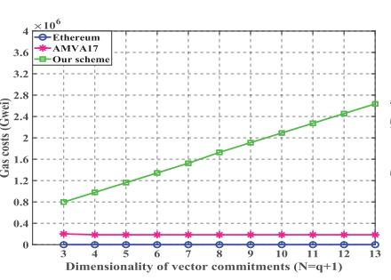

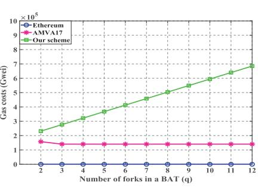

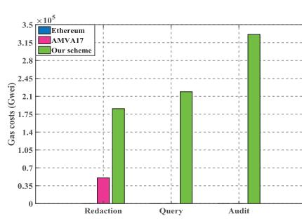

Fig. 4. Comparisons of on-chain costs.

3. https://gmplib.org/.

4. https://crypto.stanford.edu/pbc/download.html.

5. https://pypi.org/project/fastecdsa/

6. Gas is the basic unit used to pay for various computation operations when conducting transactions or executing smart contracts in the Ethereum ecosystem, (1 109Gwei ¼ 1Ether ¼ \$2992, April 22, 2022).

7. https://ropsten.etherscan.io/ 8. This is the average of the parameters for the latest 10,000 blocks in

Ethereum as of April 22, 2022.

Ethereum requires 0.0003s, 0.001s and 0.0016s to package 100, 300 and 500 transactions, respectively. The corresponding costs of AMVA17 are 0.0008s, 0.0015s and 0.0022s, of which the extra time 0.0005s is used to generate the parameters of the chameleon hash function. Similarly, our scheme separately requires extra time 0.0405s, 0.0613s, and 0.0996s during q ¼ 2; 5; 10 to initialize the chameleon hash function and vector commitment algorithm. Distinctly, the system setup cost of all compared schemes mainly depends on the number of parameters rather than transactions.

During the block append phase, the time costs consist of block generation and verification. In Fig. [5b,](#page-11-0) Ethereum requires 0.0003s, 0.001s, and 0.0017s to package 100, 300 and 500 transactions into a new block, respectively. On this basis, AMVA17 requires additional 0.0017 seconds to generate the chameleon hash value, while our scheme requires extra 0.006s, 0.011s, and 0.019s during q ¼ 2; 5; 10 to generate the chameleon hash value and commitments. From Fig. [5c,](#page-11-0) Ethereum consumes 0.0004s, 0.001s and 0.0017s to verify blocks containing 100, 300 and 500 transactions, respectively. On this basis, AMVA17 requires extra 0.001s to verify the correctness of the new block, while our scheme requires extra 0.008s, 0.017s, and 0.031s during q ¼ 2; 5; 10 to check the correctness and validity of the new block.

Regarding block redaction, in Fig. [6,](#page-11-1) AMVA17 requires a constant time 0.008s to redact the target block via generating a collision block. Correspondingly, the verification cost is also 0.008s. However, both the redaction and verification costs of our scheme show a stair-like growth trend as the block index increases (i.e., efficient redaction and verification with sublinear cost), which is determined by the number of BAT forks and the index of the redacted block. As regards redaction costs, our scheme redacts the 500th block with 0.015s, 0.008s and 0.006s during q ¼ 2; 5; 10, respectively. Besides, the redaction costs of the 2000th block are 0.019s, 0.010s, and 0.008s. With regard to verification costs, our scheme separately requires 0.029s 0.015s and 0.012s to check the 500th block during q ¼ 2; 5; 10, and the corresponding verification cost of the 2000th block are 0.036s, 0.019s and 0.016s. Notably, both the redaction and verification costs of our scheme decrease as q increases, which is opposite to the cost trend shown in Fig. [5](#page-11-0). Meanwhile, as q increases, the cost of our scheme approaches AMVA17, which means that our scheme can achieve additional efficient verification with the same costs as AMVA17.

Taking into account the block query costs shown in Fig. [7](#page-12-2), both Ethereum and AMVA17 only need to directly return the relevant blockchain data, so their proof generation cost shown in Fig. [7a](#page-12-2) is 0s. Unlike them, our scheme requires PA to generate a proof whose time costs depend only on the parameter q : 0.008s, 0.017s and 0.032s during q ¼ 2; 5; 10. Recalling Table [4,](#page-10-0) both the communication costs of Ethereum and AMVA17 are much higher than our scheme, so the additional cost of proof generation in our scheme is negligible and acceptable. Furthermore, Fig. [7b](#page-12-2) shows that the verification costs of all compared schemes increase linearly with the index of the queried block. Specifically, AMVA17 separately requires 0.427s and 1.704s to check the validity of blocks 500 and 2000, which are much higher than that of Ethereum and our scheme. Furthermore, to check the 500-th block, Ethereum requires 0.005s, our scheme needs 0.011, 0.008s and 0.006s during q ¼ 2; 5; 10, respectively. In contrast, the verification costs for the 2000th block in Ethereum is 0.017s, which is higher than our scheme (0.014s, 0.008s, 0.007s for q ¼ 2; 5; 10). As a result,

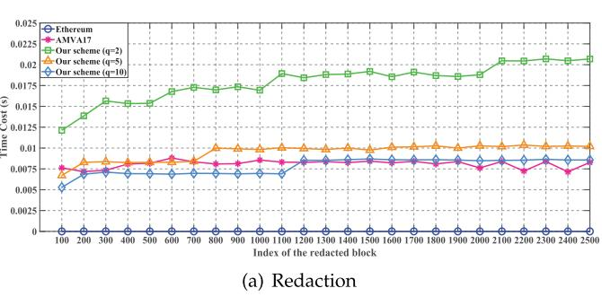

Fig. 5. Comparisons of off-chain computation costs in the system setup and block append phases.

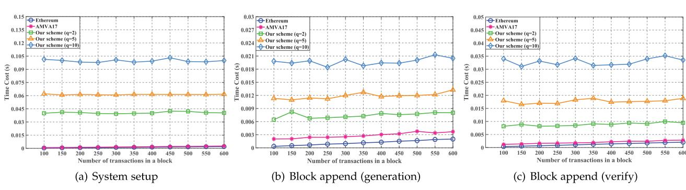

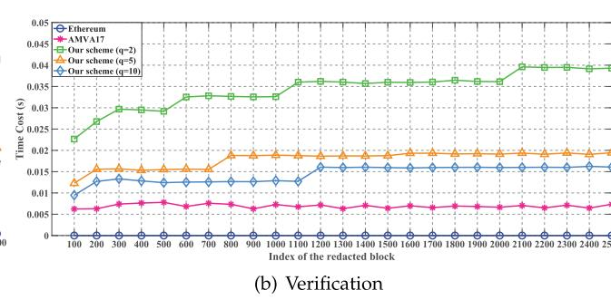

our scheme achieves efficient block query with sublinear costs in the redactable blockchain.

Regarding blockchain auditing, recalling Table [1,](#page-1-0) only our scheme can achieve integrity auditing for the blockchain ledger, while Ethereum and AMVA17 have to download and verify the entire ledger to capture its integrity. Thus, we first test the time costs of proof generation and verification in our scheme. Based on Ateniese et al.'s work [\[24\],](#page-13-21) if the corrupted block rate of the checked file is 1%, the precision rate of integrity auditing is 95% during challenging 300 blocks and 99% during challenging 460 blocks. As depicted in Fig. [8a](#page-12-3), the proof generation costs of challenging 300 blocks in our scheme are 0.286s, 0.310s and 0.309s during q ¼ 2; 5; 10, while the corresponding costs of challenging 460 blocks are 0.375s, 0.438s, and 0.457s, respectively. In addition, for q ¼ 2; 5; 10, the verification costs of our scheme are 1.227s, 0.831s, and 0.825s during challenging 300 blocks, as well as 1.551s, 1.192s, and 1.298s during challenging 460 blocks.

Furthermore, we set the number of challenged blocks at 460 in our scheme and further evaluate its performance by comparing it with other schemes. As shown in Fig. [8b](#page-12-3), PA in Ethereum and AMVA17 only returns the entire ledger directly (i.e., the proof generation cost is 0s). To achieve efficient integrity auditing, our scheme consumes 0.339s, 0.365s, and 0.418s to generate integrity proof during q ¼ 2; 5; 10, respectively. Correspondingly, the verification costs of our scheme are 1.549s, 1.239s, and 1.178s. Nevertheless, the verification costs for Ethereum and AMVA17 increase linearly with the ledger scale of the blockchain. Specifically, to check a blockchain ledger containing 5000 blocks, Ethereum and AMVA17 require 8.596s and 9.090s, respectively. When the audited ledger consists of 10000 blocks, Ethereum and AMVA17 require 17.070s and 17.981s, respectively. Distinctly, the auditing costs of Ethereum and AMVA17 are much higher than our scheme, which means that the method of obtaining blockchain integrity by verifying all blocks of the ledger is unfeasible, especially for the resource-constrained VA in some frequent audit scenarios.

# 7CONCLUSION

Focusing on the security issues of redactable blockchains, we design a novel authentication data structure BAT to provide efficient validity verification for redactable blockchains. On this basis, we propose an efficient block query protocol, in which resource-constrained LNs can query and validate the blockchain data held by FNs at an acceptable cost. Furthermore, the first auditing protocol for redactable blockchain is designed to verify the integrity of the blockchain ledger held by FNs. Let us note that our auditing protocol can also be used as a subroutine of the consensus mechanism to prevent malicious miners from appending blocks to the blockchain. Furthermore, we design some optimized strategies to reduce the computation costs of auditing and redaction of the proposed VRBC scheme, and extend it to the transaction level and permissionless versions. In conclusion, the proposed scheme is the first verifiable redactable blockchain supporting efficient data query and auditing, which is significant for improving the security and practicability of redactable blockchains.

## REFERENCES

[1] S. Nakamoto, "Bitcoin: A peer-to-peer electronic cash system," 2008. [Online]. Available:<http://bitcoin.org/bitcoin.pdf> [2] G. Wood et al., "Ethereum: A secure decentralised generalised transaction ledger," Ethereum Project Yellow Paper, vol. 151, no. 2014, pp. 1–32, 2014.

Fig. 8. Comparisons of off-chain computation costs in the blockchain auditing phase.

Fig. 7. Comparisons of off-chain computation costs in the block query phase.

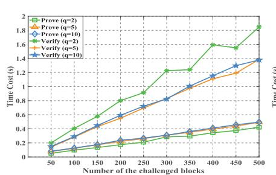

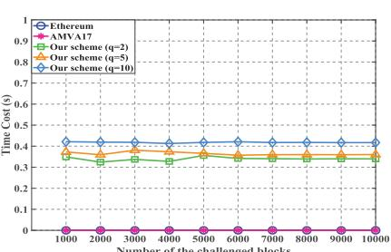

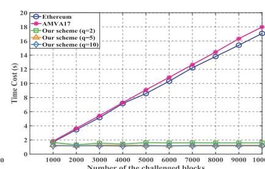

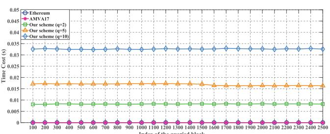

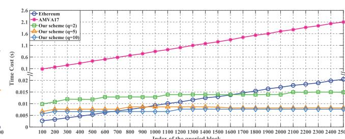

[3] M. Moser et al., "An empirical analysis of traceability in the mon- € ero blockchain," 2017, arXiv:1704.04299. [4] M. Raikwar, S. Mazumdar, S. Ruj, S. S. Gupta, A. Chattopadhyay, and K.-Y. Lam, "A blockchain framework for insurance processes," in Proc. 9th IFIP Int. Conf. New Technol., Mobility Secur., 2018, pp. 1–4. [5] K. Korpela, J. Hallikas, and T. Dahlberg, "Digital supply chain transformation toward blockchain integration," in Proc. 50th Hawaii Int. Conf. Syst. Sci., 2017, pp. 4182–4191. [6] S. Krenn, H. C. Pohls, K. Samelin, and D. Slamanig, "Chameleon- € hashes with dual long-term trapdoors and their applications," in Proc. Int. Conf. Cryptol. Afr., 2018, pp. 11–32. [7] H. Yuan, X. Chen, J. Wang, J. Yuan, H. Yan, and W. Susilo, "Blockchain-based public auditing and secure deduplication with fair arbitration," Inf. Sci., vol. 541, pp. 409–425, 2020. [8] G. Tian et al., "Blockchain-based secure deduplication and shared auditing in decentralized storage," IEEE Trans. Dependable Secure Comput., vol. 19, no. 6, pp. 3941–3954, Nov./Dec. 2021. [9] X. Ma, C. Wang, and X. Chen, "Trusted data sharing with flexible access control based on blockchain," Comput. Standards Interfaces, vol. 78, 2021, Art. no. 103543. [10] C. Hopkins, "If you own bitcoin, you also own links to child porn," 2015. [Online]. Available: [https://www.dailydot.com/](https://www.dailydot.com/business/bitcoin-child-porn-transaction-code/) [business/bitcoin-child-porn-transaction-code/](https://www.dailydot.com/business/bitcoin-child-porn-transaction-code/) [11] R. Matzutt et al., "A quantitative analysis of the impact of arbitrary blockchain content on bitcoin," in Proc. Int. Conf. Financial Cryptography Data Secur., 2018, pp. 420–438. [12] M. I. Mehar et al., "Understanding a revolutionary and flawed grand experiment in blockchain: The dao attack," J. Cases Inf. Technol., vol. 21, no. 1, pp. 19–32, 2019. [13] P. Voigt and A. Von dem Bussche, "The eu general data protection regulation (GDPR)," A Practical Guide, 1st Ed., Berlin, Germany: Springer, vol. 10, no. 3152676, pp. 10–5555, 2017. [14] J. M. L. Alfonsın, "Argentina: The right to be forgotten," in The Right To Be Forgotten. Berlin, Germany: Springer, 2020, pp. 239–248. [15] G. Ateniese, B. Magri, D. Venturi, and E. Andrade, "Redactable blockchain– or– rewriting history in bitcoin and friends," in Proc. IEEE Eur. Symp. Secur. Privacy, 2017, pp. 111–126. [16] G. Ateniese and B. D. Medeiros, "On the key exposure problem in chameleon hashes," in Proc. Int. Conf. Secur. Commun. Netw., 2004, pp. 165–179. [17] D. Derler, K. Samelin, D. Slamanig, and C. Striecks, "Fine-grained and controlled rewriting in blockchains: Chameleon-hashing gone attribute-based," in Proc. 26th Annu. Netw. Distrib. Syst. Secur. Symp., 2019, pp. 1–15. [18] Y. Tian, N. Li, Y. Li, P. Szalachowski, and J. Zhou, "Policy-based chameleon hash for blockchain rewriting with black-box accountability," in Proc. Annu. Comput. Secur. Appl. Conf., 2020, pp. 813–828. [19] G. Panwar, R. Vishwanathan, and S. Misra, "Retrace: Revocable and traceable blockchain rewrites using attribute-based cryptosystems," in Proc. 26th ACM Symp. Access Control Models Technol., 2021, pp. 103–114. [20] S. Xu, J. Ning, J. Ma, G. Xu, J. Yuan, and R. H. Deng, "Revocable policy-based chameleon hash," in Proc. Eur. Symp. Res. Comput. Secur., 2021, pp. 327–347. [21] J. Ma, S. Xu, J. Ning, X. Huang, and R. H. Deng, "Redactable blockchain in decentralized setting," IEEE Trans. Inf. Forensics Secur., vol. 17, pp. 1227–1242, 2022. [22] S. Xu, J. Ning, J. Ma, X. Huang, and R. H. Deng, "K-time modifiable and epoch-based redactable blockchain," IEEE Trans. Inf. Forensics Secur., vol. 16, pp. 4507–4520, 2021. [23] Y. Jia, S.-F. Sun, Y. Zhang, Z. Liu, and D. Gu, "Redactable blockchain supporting supervision and self-management," in Proc. ACM Asia Conf. Comput. Commun. Secur., 2021, pp. 844–858. [24] G. Ateniese et al., "Provable data possession at untrusted stores," in Proc. 14th ACM Conf. Comput. Commun. Secur., 2007, pp. 598–609. [25] A. Juels and B. S. Kaliski Jr, "PORs: Proofs of retrievability for large files," in Proc. 14th ACM Conf. Comput. Commun. Secur., 2007, pp. 584–597. [26] H. Shacham and B. Waters, "Compact proofs of retrievability," in Proc. Int. Conf. Theory Appl. Cryptol. Inf. Secur., 2008, pp. 90–107. [27] D. Schroder and H. Schr € oder, "Verifiable data streaming," in € Proc. ACM Conf. Comput. Commun. Secur., 2012, pp. 953–964.

- [28] J. Krupp, D. Schroder, M. Simkin, D. Fiore, G. Ateniese, and €
- S. Nurnberger, "Nearly optimal verifiable data streaming," in € Public-Key Cryptography–PKC 2016. Berlin, Germany: Springer, 2016, pp. 417–445. [29] J. Wei, G. Tian, J. Shen, X. Chen, and W. Susilo, "Optimal verifiable data streaming protocol with data auditing," in Proc. Eur. Symp. Res. Comput. Secur., 2021, pp. 296–312. [30] M. Miao, J. Wei, J. Wu, K.-C. Li, and W. Susilo, "Verifiable data streaming with efficient update for intelligent automation systems," Int. J. Intell. Syst., vol. 37, no. 2, pp. 1322–1338, 2022. [31] I. Puddu, A. Dmitrienko, and S. Capkun, "mchain: How to forget without hard forks," IACR Cryptol. ePrint Arch. 2017/106, vol. 2017, 2017, Art. no. 106. [32] D. Deuber, B. Magri, and S. A. K. Thyagarajan, "Redactable blockchain in the permissionless setting," in Proc. IEEE Symp. Secur. Privacy, 2019, pp. 124–138. [33] J. Camenisch, D. Derler, S. Krenn, H. C. Pohls, K. Samelin, and €
- D. Slamanig, "Chameleon-hashes with ephemeral trapdoors," in Proc. IACR Int. Workshop Public Key Cryptography, 2017, pp. 152–182. [34] V. Goyal, O. Pandey, A. Sahai, and B. Waters, "Attribute-based encryption for fine-grained access control of encrypted data," in Proc. 13th ACM Conf. Comput. Commun. Secur., 2006, pp. 89–98. [35] T. Kohno, A. Stubblefield, A. D. Rubin, and D. S. Wallach, "Analysis of an electronic voting system," in Proc. IEEE Symp. Secur. Privacy, 2004, pp. 27–40. [36] X. Chen et al., "Efficient generic on-line/off-line (threshold) signatures without key exposure," Inf. Sci., vol. 178, no. 21, pp. 4192– 4203, 2008. [37] S. Gorbunov, L. Reyzin, H. Wee, and Z. Zhang, "Pointproofs: Aggregating proofs for multiple vector commitments," in Proc. ACM SIGSAC Conf. Comput. Commun. Secur., 2020, pp. 2007–2023. [38] G. Fuchsbauer, E. Kiltz, and J. Loss, "The algebraic group model and its applications," in Proc. Annu. Int. Cryptol. Conf., 2018, pp. 33–62.

Guohua Tian received the BS degree from the School of Mathematics and Information Science, Shaanxi Normal University, in 2016, and the MS degree from School of Mathematics and Statistics, Xidian University, in 2019. Currently, he is working toward the PhD degree majoring in cyberspace security with the School of Cyber Engineering, Xidian University. His research interests include network and information security, cloud computing, data deduplication and blockchain.

Jianghong Wei received the PhD degree in Information Security from Zhengzhou Information Science and Technology Institute, Zhengzhou, China, in 2016. He is currently a lecturer with the State Key Laboratory of Mathematical Engineering and Advanced Computing, Zhengzhou, China. His research interests include applied cryptography and network security.

Miros»aw Kuty»owski received the PhD degree from the University of Wroclaw, in 1986. He is a full professor of computer science with the Wroclaw University of Technology. His research interests include algorithms for distributed and ad hoc systems, privacy protection, security and pragmatic cryptography. he is particularly involved in research on malicious cryptography and the problems that arise due to interplay of modern IT technology and law. He has been an expert in many e-government initiatives serving public institutions and business organizations.

Willy Susilo (Fellow, IEEE) received the PhD degree in computer science from the University of Wollongong, Australia. He is a distinguished professor and head of School of Computing and Information Technology and the director of Institute of Cyber security and Cryptology (iC2) at the University of Wollongong. He was awarded the prestigious Australian Research Council (ARC) Future Fellow. His main research interests include cryptography and in-formation security. His main contribution is in the area of digital signature schemes.

He has served as a program committee member in dozens of international conferences. He has published numerous publications in the area of digital signature schemes and encryption schemes.

Xinyi Huang received the PhD degree from the School of Computer Science and Software Engineering, University of Wollongong, Australia. He is currently a professor with the Artificial Intelligence Thrust, Information Hub, Hong Kong University of Science and Technology (Guangzhou), China. His research interests include applied cryptography and network security. He has authored more than 150 research papers in refereed international conferences and journals.

Xiaofeng Chen (Senior Member, IEEE) received the BS and MS degrees in mathematics from Northwest University, China, in 1998 and 2000, respectively, and the PhD degree in cryptography from Xidian University in 2003. Currently, he works with Xidian University as a professor. His research interests include applied cryptography and cloud computing security. He has published more than 200 research papers in referred international conferences and journals. His work has been cited more than 14000 times at Google Scholar. He is a member of the Editorial Board for IEEE Transactions on Dependable and Secure Computing, IEEE Transactions on Knowledge and Data Engineering, International Journal of Foundations of Computer Science, etc. He has served as the program/general chair or program committee member in more than 30 international conferences.

" For more information on this or any other computing topic, please visit our Digital Library at www.computer.org/csdl.

