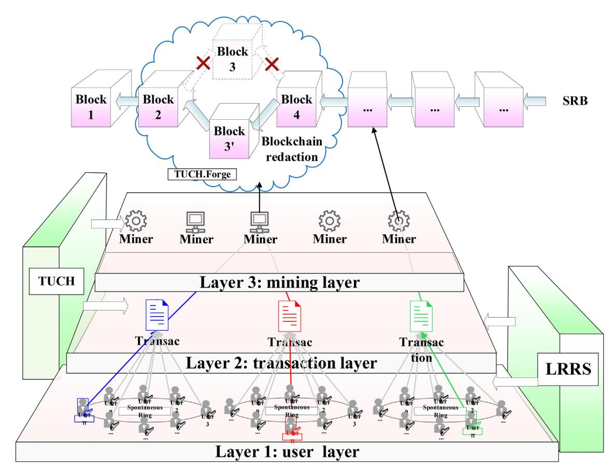
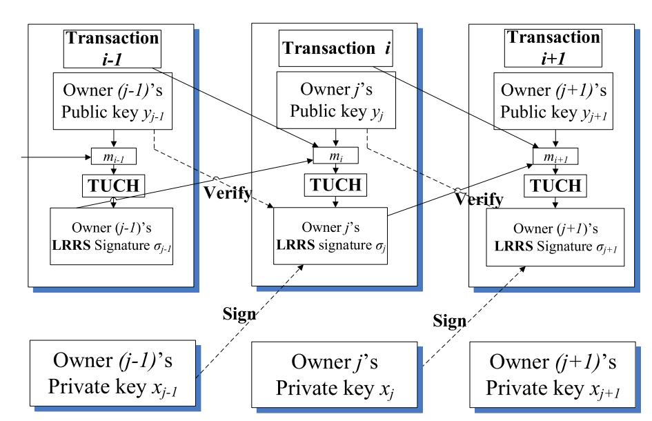
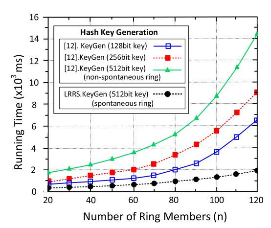
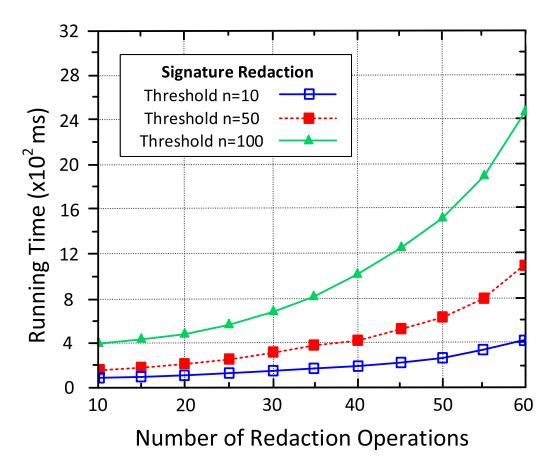
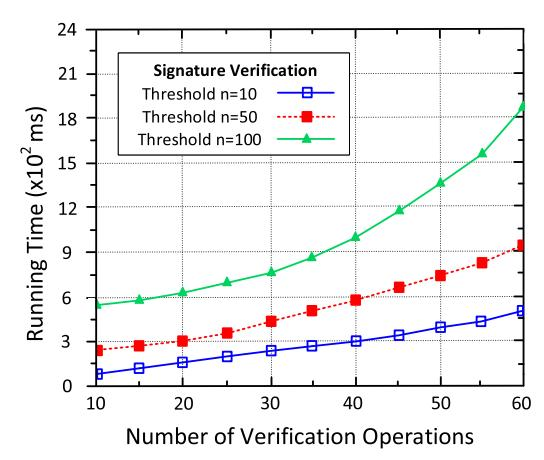
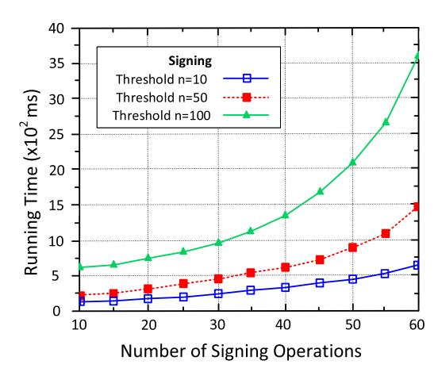
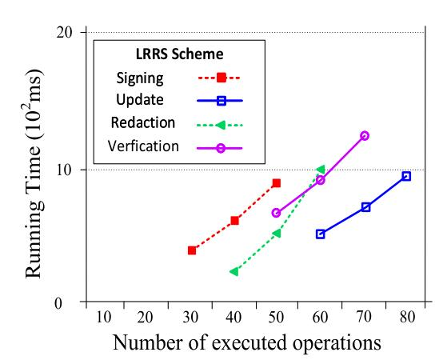
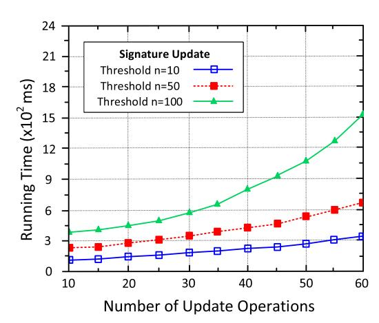

# Scalable and redactable blockchain with update and anonymity

Ke Huang a,⇑ , Xiaosong Zhang a,b , Yi Mu c , Fatemeh Rezaeibagha d , Xiaojiang Du e

#### article info

#### Article history:

Received 25 September 2019

Received in revised form 6 July 2020

Accepted 8 July 2020

Available online 9 August 2020

#### Keywords:

Blockchain

Internet-of-Things

Redaction

Spontaneous Ring

#### abstract

Internet-of-Things (IoT) envisions communications between heterogeneous devices and utilization of the associated data for smart decision making. Blockchain bridges the gap between widely-distributed IoT devices and the need for a universal trust-layer. When applying blockchain for IoT, some concerns can arise. Among them, scalability is a crucial factor because it decides whether blockchain can keep empowering IoT in the long term. According to a recent survey by Ali et al., some newly launched blockchains are suffering from powerful attacks (e.g. 51% attack) when the computing pool is small, and the number of participated nodes is inadequate (USENIX 2016). To ensure the scalability of initiallydeployed blockchains, a proper countermeasure is important to be devised. Ateniese et al. proposed the notion of the redactable blockchain (EuroS&P 2017) which allows block history to be rewritten by using chameleon hash. However, the distribution and management of trapdoor key is crucial for the scalability of chameleon hash as well as redactable blockchain. To deal with the above problems, we propose two cryptographic schemes as the new theoretic tools for blockchain redaction: time updatable chameleon hash (TUCH) and linkable-and-redactable ring signature (LRRS). The use of TUCH and LRRS schemes enables redaction to take place scalably and anonymously where the spontaneous ring is generated for redaction, which costs little expenditures to rewrite a block content. Specifically, the redaction will be processed without assigning and splitting trapdoor key among multiple users in a complex way, and achieve transaction anonymity for users. What is more, we briefly instantiate how to build a redactable blockchain with update and anonymity (SRB) with our proposed TUCH and LRRS. While security analysis confirms that our proposals are theoretically secure, the experimental results show that our proposals are efficient for implementation purposes.

2020 Elsevier Inc. All rights reserved.

## 1. Introduction

The advancements of societies are driven by intelligent utilization and management of data generated by heterogeneous devices, such as sensor-enabled types of machineries [\[24\].](#page-15-0) How to accommodate, analyze and benefit from massive heterogeneous data is the most crucial factor for realizing the Internet-of-Things (IoT) [\[4\].](#page-15-0) The rise of blockchain [\[36\]](#page-16-0) offers an ideal

a Research College for Cyber Security, University of Electronic Science and Technology of China (UESTC), Chengdu 611731, China

b Cyberspace Security Research Center, Peng Cheng Laboratory, Shenzhen 518055, China

c Key Laboratory of Network Security and Cryptology, College of Mathematics and Informatics, Fujian Normal University, Fuzhou 350007, China

d Information Technology, Mathematics and Statistics Discipline, Murdoch University, Perth 6150, Australia

eDepartment of Computer and Information Sciences, Temple University, Philadelphia, PA 19122, USA

⇑ Corresponding author. E-mail addresses: [huangke@uestc.edu.cn](mailto:huangke@uestc.edu.cn) (K. Huang), [johnsonzxs@uestc.edu.cn](mailto:johnsonzxs@uestc.edu.cn) (X. Zhang), [ymu.ieee@gmail.com](mailto:ymu.ieee@gmail.com) (Y. Mu), [fatemeh.rezaeibagha@](mailto:fatemeh.rezaeibagha@murdoch.edu.au) [murdoch.edu.au](mailto:fatemeh.rezaeibagha@murdoch.edu.au) (F. Rezaeibagha), [dxj@ieee.org](mailto:dxj@ieee.org) (X. Du).

solution to this problem by establishing a trust-free public layer among IoT devices without a central party. To implement scalable and secure blockchain systems for industrial activities, relevant issues have been extensively discussed [\[32\].](#page-16-0) Among them, scalability is a vital subject to study as it is necessary for the adoption of blockchain in the foreseeable future. Scalability usually implies scalable consensus mechanism [\[43\]](#page-16-0) and basic primitives (such as: hash function and digital signature) used to power blockchain [\[21\]](#page-15-0). In this work, we focus on the scalable and secure hashing and signing schemes for blockchain.

The increasingly powerful attacks against the blockchain are pushing it to the age of transformation. According to a recent report by Ali et al. [\[8\],](#page-15-0) some newly launched blockchains are vulnerable to powerful attacks (such as 51% attack [\[36\]](#page-16-0)) due to inadequate participated nodes and small computing pool. The evidence showed that some chains are manipulated by a large pool which controls over 60% of the network power. Consequently, some illegal contents [\[7\]](#page-15-0) and unwanted information [\[35\]](#page-16-0) were forced to be recorded on blockchain, and they are hard to remove or reverse due to immutable feature of blockchain. A straightforward resolution has been proposed by Ateniese et al. [\[7\]](#page-15-0) to re-write block history back to a normal state once the chain is compromised. Their core principle is to replace the hash used in blockchain with a chameleon hash function [\[28\]](#page-16-0) which creates a backdoor to the hash block. Simply, it allows to find a different nonce or random number for a given block without changing its hash value. Therefore, block contents can be written without causing inconsistency to block hash.

Basically, studies of redactable blockchain (or mutable blockchain [\[20\]\)](#page-15-0) seek to break or bypass blockchain's immutability to compensate for fatal errors found in distributed ledger. Another strong motivation is erasing individual privacy or unwanted information from blockchain to fulfil ''the right to be forgotten" demanded by GDPR's regulation [\[40\].](#page-16-0) In this work, we put aside the regulation issues (top-level design and legal concerns) and mainly focus on the technical design and implementation of the core cryptographic protocols for redaction. As we later survey in Section [2.3](#page-3-0), some current works (e.g., [\[9\]](#page-15-0)) based on chameleon hash result in evident costs to distribute trapdoor key among multiple nominated parties for collaboration. Meanwhile, as we revealed in our previous work [\[26\]](#page-16-0), the cost of forming a non-spontaneous ring for each member who holds a piece of a trapdoor key is evidently high and becomes even higher with the number of nodes. Meanwhile, it also causes misuses of redaction power. Suppose anyone who derives hash collision elsewhere by either brutal-force computing or eavesdropping others, he can redact the chain whenever he is willing to. The above drawbacks indicate the scalability problem of redactable blockchain. If we do not solve it, redactable blockchain can not be considered as an ideal trustlayer for IoT network or any other platforms in the long run.

In this paper, we propose a time updatable chameleon hash (TUCH) and linkable-and-redactable ring signature (LRRS) as theoretical building blocks to construct a redactable blockchain with update and anonymity (SRB). The improvements to our previous work [\[26\]](#page-16-0) is that the hashing scheme TUCH we proposed is based on a spontaneous ring which is scalable and efficient to deploy and use. Meanwhile, a linkable and redactable ring signature is devised to capture the anonymity and doublespending issues of blockchain. Above proposals help build a scalable and redactable blockchain (SRB). Our contributions can be summarized as the following:

- 1) We propose the first time updatable chameleon hash (TUCH), which allows for spontaneous ring formation and does not rely on the interactive participation of any other entities for the key generation. The chameleon randomness for holding a hash collision is under periodic expiration, it can pass verification only within a fixed time window (i.e., an hour or a day, represented by Dt).
- 2) We propose the first linkable-and-redactable ring signature (LRRS), which allows a signer to sign a message anonymously without relying on any trusted entities. A ring of users is formed spontaneously where the members are unaware that their public keys are selected for creating the signature. Meanwhile, the LRRS signature can be redacted to commit to another message by the designated holder of the trapdoor key. Also, LRRS offers linkability, which links two anonymous signatures generated by the same signer; this is useful to detect double-spending in crypto-currencies.
- 3) We instantiate how to apply our proposed TUCH and LRRS in public blockchain for redaction. We also give security analysis based on pre-defined security models to achieve security requirements. The analysis shows that our proposals are secure against defined adversarial models. We also perform experiments to evaluate the performance of our proposed schemes. Simulation results show that our proposed TUCH is scalable and efficient in practice. Meanwhile, LRRS is less efficient than peer works but at an acceptable level. It traded efficiency for anonymity, and this deficiency is factored by the size of the selected ring.

The remainder of this paper is organized as follows. In Section 2, we present the background for this work; In Section [3,](#page-3-0) we provide system model and definitions; In Section [4](#page-7-0), we present constructions and security analysis of our proposed TUCH and LRRS schemes; In Section [5](#page-10-0), we show instantiation of applying TUCH and LRRS to build SRB; In Section [6](#page-12-0), we provide performance evaluations; Section [7](#page-14-0) concludes the paper.

## 2. Related work

In this section, we review some related works of chameleon hash, ring signature and redactable blockchain as follows.

# 2.1. Chameleon hash

Chameleon hash is a trapdoor one-way hash function where finding a chameleon hash is hard without the trapdoor key. The first idea was proposed by Krawczyk et al. [\[28\]](#page-16-0) where the notion of chameleon signature (CS) was also revealed. CS is a simpler and non-interactive version of undeniable signatures [\[19\].](#page-15-0) In an undeniable signature, one has to interact with the signer to verify the validity of a signature (via a deniable protocol). Later on, the key-exposure problem is identified by Ateniese et al. [\[2\],](#page-15-0) which captures the leakage of trapdoor key in any given hash collisions. Since then, several schemes with keyexposure freeness were proposed, such as [\[18,13,27\]](#page-15-0).

Camenisch et al. [\[13\]](#page-15-0) proposed an ephemeral chameleon hash which prevents forging a collision without the ephemeral trapdoor. They formalized definitions and security for chameleon hash function in [\[13\]](#page-15-0). To clarify, we review some related works in Table 1. As it is shown in Table 1, chameleon hash schemes are compared by involvements of ID-based infrastructure, pairing computations, collision-resistance and intractability assumptions. As it is shown in Table 1, the majority of the listed schemes do not rely on ID-based infrastructure and pairing computation.

## 2.2. Ring signature

Ring signature was originated from group signature [\[16\].](#page-15-0) In group signature, to generate a signature, a group of users are summoned by a group manager to form the group. Any user in this group can sign on behalf of the whole group. As a result, anonymous authentication is achieved. Unlike the group signature, the formation of the ring signature is spontaneous where the ring members are unaware of the fact that they joined the ring. There are different types of ring signatures including threshold version [\[12\],](#page-15-0) revocable version [\[5\]](#page-15-0) and linkable version [\[42\].](#page-16-0) Due to development of crypto-currencies, linkable ring signature is gaining massive attention, as it preserves user's identity, meanwhile detecting any doubly used cryptocurrencies [\[29\].](#page-16-0) However, despite the explored security and efficiency features to enhance linkable ring signature, a redactable version of any group or ring-based signatures are yet to study. We review some relevant works in Table 2. As it is shown in Table 2, most ring signature schemes are based on public-key infrastructure, and are linkable. In addition, few works achieved the design of constant signature size (i.e., jrj¼ Oð1Þ).

Table 1 Overview of chameleon hash works.

| Scheme |      | Identity-based | Pairing-based | Collision-resistance | Assumptions |
|--------|------|----------------|---------------|----------------------|-------------|
| ICH    | [2]  | Yes            | No            | Yes                  | q-SDHP      |
| KEF    | [18] | No             | No            | Yes                  | CDHP        |
| CHE    | [13] | No             | No            | Yes                  | RSA and DLP |
| CHD    | [27] | No             | No            | Yes                  | RSA         |
| ACH    | [31] | No             | Yes           | Yes                  | CDHP        |
| CHW    | [17] | No             | No            | Yes                  | CDHP        |
| CIK    | [15] | No             | No            | Yes                  | Factoring   |
| ACC    | [11] | No             | No            | Yes                  | Factoring   |

Each work is named after the abbreviation of article title.

Table 2 Overview of ring signature works.

| Scheme |      | Crypto-system | Pairing-based | Signature |   |   | size      | Linkability | Assumptions |       |
|--------|------|---------------|---------------|-----------|---|---|-----------|-------------|-------------|-------|
| SLT    | [42] | PKI           | No            | O         | ð | n | Þ         | Yes         | DDHP,       | S-RSA |
| SLRSE  | [41] | PKI           | No            | O         | ð | 1 | Þ         | Yes         | S-RSA       |       |
| SLRSR  | [1]  | PKI           | No            | O         | ð | n | Þ         | Yes         | DDHP,       | S-RSA |
| LRSS   | [33] | PKI           | No            | O         | ð | n | Þ         | Yes         | DDHP        |       |
| RCT2.0 | [39] | PKI           | Yes           | O         | ð | 1 | Þ         | Yes         | DDH,        | k-SDH |
| LRSU   | [30] | PKI           | No            | O         | ð | n | Þ         | Yes         | DLP         |       |
| ELT    | [45] | PKI           | Yes           | O         | ð |   | ffiffiffi |             |             |       |
|        |      |               |               |           |   | p | n Þ       | Yes         | SDH,        | DDHI  |
| SIB    | [6]  | IDB           | Yes           | O         | ð | 1 | Þ         | Yes         | DLP,        | DDHP  |
| ESL    | [23] | PKI           | Yes           | O         | ð |   | ffiffiffi |             |             |       |
|        |      |               |               |           |   | p | n Þ       | Yes         | SDA,        | q-SDH |
| TRS    | [22] | PKI           | No            | O         | ð | n | Þ         | No          | DDHP        |       |

Denote k-SDH as k-Strong Diffie-Hellman Assumption [\[39\]](#page-16-0); q-SDH as q-Strong Diffie-Hellman Assumption; DDHI as q-Decisional Diffie-Hellman Inversion Assumption; SDA as Subgroup Decision Assumption; S-RSA as Strong RSA Assumption; PKI as Public-Key based Infrastructure; IDB as Identity-based Infrastructure. Each work is named after the abbreviation of the article title.

## 2.3. Redactable blockchain

Redactable blockchain refers to a blockchain with editable (redactable) block or revocable transaction. The fundamental motivation of this primitive is to recover distributed ledger from fatal error without causing hash inconsistency or any hard forks. As shown in Table 3, various schemes were proposed to achieve this goal.

Reversecoin is the first crypto-currency to support transaction revocation. It allows the user to reverse a transaction in a configurable timeout by applying off-line keys. Although this project does not succeed, it provides valuable insight in designing redactable blockchain.

Ateniese et al. [\[7\]](#page-15-0) proposed the notion of redactable blockchain in EuroS&P 2017. They introduced chameleon hash as the core element to achieve redactable blockchain so that block contents could be re-written efficiently. However, there are still some problems left to be answered for. For example, how to reach an agreement on redaction or how chameleon hash is programmed to achieve redaction. Then, Matzutt et al. [\[35\]](#page-16-0) proposed a content detector with minimum fees to reject malicious contents insertion on chain, but no security analysis is provided to validate their proposal. In addition, Puddu et al. [\[37\]](#page-16-0) proposed lchain to alter transaction state in an effort to change blockchain records. Although no cryptographic solution is involved, their proposal induced high computing costs. Deuber et al. [\[20\]](#page-15-0) proposed a consensus-based voting and policy to dictate redaction. Only a tiny overhead is yielded in their proposal in comparison with other works. Recently, Ashritha et al. [\[9\]](#page-15-0) proposed to split trapdoor key (private key) among multiple validators and reconstruct it via multi-party computation for secure redaction. However, their solution relies on interactive protocol and is constrained by the number of participants.

Politou et al. [\[20\]](#page-15-0) proposed a review article to list all notable challenges and developments in redactable blockchain. As discussed in their work, solutions for redactable blockchain were not limited by cryptographic methods. Possible solutions extended to consensus protocol, malware detection, adjustment of transaction fees, etc. The philosophy of the above solutions is to lead majority of nodes forget about the problematic block history and switch to the ''right" chain. In a recent work, Xu et al. [\[44\]](#page-16-0) proposed a blockchain-based identity management and authentication scheme. They adopted chameleon hash in order to delete illegal users' information without causing hash inconsistency.

## 3. System model and definitions

In this section, we first give preliminaries used in this work. Then, we show the system model for our scalable and redactable blockchain with update and anonymity (SRB). After that, we give definitions for our TUCH and LRRS schemes. They both serve as core elements to achieve SRB.

## 3.1. Preliminaries

Let G be a cyclic multiplicative group of prime order q and generator g. We have the following complexity assumptions in G:

- -Discrete Logarithm Problem (DLP): Given ga 2 G where a2RZq, computing a is hard.
- -Computational Diffie-Hellman Problem (CDHP): Given g; ga; gb 2 G where a; b2RZq, computing gab is hard.
- -Decisional Diffie-Hellman Problem (DDHP): Given g; ga; gb; gc 2 G where a; b; c2RZq, deciding c ¼ ab is hard.
- - A Gap Diffie-Hellman (GDH) group is the group where CDHP is hard and DDHP is easy. < g; ga; gb; gc > is a Diffie-Hellman tuple if and only if c ¼ abmodq.

Table 3 Overview of redactable blockchain works.

| Scheme                             | Technique & Principle                                                                                   | Pros & Cons                                                                                   |
|------------------------------------|---------------------------------------------------------------------------------------------------------|-----------------------------------------------------------------------------------------------|
| Reversecoin [38]                   | uses offline key to reverse transaction by a configurable timeout period                                | the first revocable coin, but does not succeed                                                |
| Redactable Blockchain [7]          | proposes the notion of redactable blockchain formally with chameleon hash                               | allows to rewrite block history, but many issues are not discussed                            |
| Thwarting Insertion [35]           | proposes a content detector with minimum fees to reject malicious contents on chain                     | gives conceptual suggestions, but does not provide formal analysis                            |
| $\mu$ chain [37]                   | proposes $\mu$ chain to enable changes of transaction state to erase relevant blockchain records        | does not rely on complex cryptographic schemes, but introduces high computing costs           |
| Permissionless [20]                | proposes voting-based consensus protocol to achieve redactable blockchain                               | relies on complex cryptographic protocol, but it is fairly efficient to run                   |
| Enhanced Redactable Blockchain [9] | uses multi-party computation to reconstruct the trapdoor for secure redaction among multiple validators | enhances redaction security at the expense of introducing complex interactions and computings |

Other related works are [\[26,25\],](#page-16-0) each scheme is designed for specific application scenario.

#### 3.2. System model of SRB

The framework of our scalable and redactable blockchain with update and anonymity (SRB) is shown in Fig. 1. As coincided with public blockchain (i.e. bitcoin [\[36\]](#page-16-0)), our SRB includes two main parties defined as below.

Miner (or trapdoor holder): Entities which pack signed transactions from users and record them in blockchain based on the proof-of-work consensus [\[36\].](#page-16-0) Miner runs TUCH:KeyGen to generate trapdoor key tk and hash key hk. Hash key hk is a public key used to generate a chameleon hash h. Trapdoor key tk is a private key kept by the miner secretly, it is used to produce a hash collision for chameleon hash h to which corresponding hash key hk is committed.

User: Entities sign and publish transaction in order to record it on the chain. For a user i, he runs LRRS:UKeyGen to generate signing key ski and verification key pki. He keeps ski privately and runs LRRS:Sign to produce a LRRS signature for a transaction.

As it is shown in Fig. 1, our SRB is designed to be scalable and decentralized that no central authority is established. The workflow of the blockchain insertion is similar to bitcoin [\[36\]](#page-16-0) where the user publishes signed transactions, and miners verify and record them in blockchain. By replacing ordinary hash function (e.g. SHA-256) and elliptic curve digital signing algorithm (ECDSA) used in standard blockchain with our TUCH and LRRS, we can transform ordinary chain to a redactable chain. An instantiation is given in Section [5.](#page-10-0)

### 3.3. Definitions of TUCH

Definition 1. Our Time Updatable Chameleon Hash (TUCH) consists of the following six algorithms:

- -TUCH.SetupðkÞ!ðparamTUCHÞ: On input a security parameters k, output system parameters paramTUCH.
- -TUCH.KeyGenðparamTUCHÞ!ðtk; hkÞ: On input system parameters paramTUCH, output trapdoor key and hash key ðtk; hkÞ.

Fig. 1. The framework of scalable and redactable blockchain.

- - TUCH.Hashðhk; CID; m;t; aÞ!ðh;rÞ: On input a hash key hk, a customized identity CID, a message m, a current time t and a randomness a, output chameleon hash and chameleon randomness ðh;rÞ.
- - TUCH.Verifyðhk; CID;ðm; h;rÞ;tÞ ! ð?; 0 or 1Þ: On input a hash key hk, a customized identity CID, a tuple ðm; h;rÞ which consists of message m, chameleon hash h and chameleon randomness r, and a current time t, output ?; 0 or 1.
- - TUCH.Forgeðtk; CID; m0 ;ðm; h;rÞ;tÞ!ðr0 or ?Þ: On input a trapdoor key tk, a customized identity CID, a new message m0 ,a tuple ðm; h;rÞ and a current time t, output a new chameleon randomness r0 or ?.
- - TUCH.Updateðtk; CID;ðm; h;r;tÞ;DtÞ!ðr00 or ?Þ: On input a trapdoor key tk, a customized identity CID, a tuple ðm; h;r;tÞ, and a time interval Dt, output an updated chameleon randomness r00 or ?.

## 3.4. Definitions of LRRS

Definition 2. Our Linkable-and-Redactable Ring Signature (LRRS) consists of the following nine algorithms:

- -LRRS.SetupðkÞ!ðparamLRRSÞ: On input a security parameter k, output system parameters paramLRRS.
- - LRRS.UKeyGenðparamLRRSÞ!ðski; pkiÞ: On input system parameters paramLRRS, output user's private and public key pair (ski; pki).
- -LRRS.HKeyGenðparamLRRSÞ!ðhk;tkÞ: On input system parameters paramLRRS, output trapdoor key tk and hash key hk.
- - LRRS.Signðhk; L; m; xp;tÞ!ðrt LðmÞÞ: On input a hash key hk, a list of n public keys L, a message m to be signed, signer's private key xp where p 2½1; jLj is confidential and hidden, and a current time t, output a LRRS signature at time t as rt LðmÞ.
- - LRRS.VerifyðL; m;rt LðmÞ;tÞ!ð0 or 1Þ: On input a list of n public keys L, a message m,a LRRS signature at time t as rt LðmÞ and a current time t, output 0 or 1.
- - LRRS.Redactðtk; L; m0 ;rt LðmÞ;tÞ ! ð? or rt Lðm0 ÞÞ: On input a trapdoor key tk, a list of n public keys L, a new message m0 ,a LRRS signature at time t as rt LðmÞ and a time point t, output ? or a redacted LRRS signature rt Lðm0 Þ at time point t.
- - LRRS.Updateðtk; L; m;rt LðmÞ;t;DtÞ ! ð? or rtþDt L ðmÞÞ: On input a trapdoor key tk, a list of n public keys L, a message m,a LRRS signature rt LðmÞ at time t, a time point t and a global time interval Dt, output ? or an updated LRRS signature rtþDt L ðmÞ at time point t þ Dt.
- - LRRS.LinkðL;ðpkd0 ; md0 ;rt Lðmd0 ÞÞ;ðpkd1 ; md1 ;rt Lðmd1 ÞÞ;tÞ ! ð?; 0 or 1Þ: On input a list of n public keys L ¼fy1; ; yng, two tuples ðpkdi ; mdi ;rt Lðmdi ÞÞ where di 2 L and i ¼ð0; 1Þ, and a current time t, output ?; 0 or 1.
- - LRRS.DenyðL; m;rL tðmÞ; m;rL tðmÞ;tÞ ! ð?; 0or1Þ: On input a list of n public keys L ¼fy1; ; yng, dispute message m and signature rL tðmÞ, original message m and signature rL tðmÞ, a current time t, output ?; 0 or 1.

#### 3.5. Security requirements

In this part, we give security requirements for our TUCH and LRRS schemes.

## 3.5.1. Security Requirements of TUCH

Definition 3. A secure time updatable chameleon hash should satisfy the following properties [\[18\]](#page-15-0).

Correctness: Our proposed TUCH should satisfy correctness defined as below. It describes that any correctly computed, redacted or updated chameleon hashes should pass verification successfully.

$$\forall \lambda, \forall \text{param}_{\text{TUCH}} \leftarrow \text{TUCH.Setup}(\lambda), (tk, hk) \leftarrow \text{TUCH.KeyGen}(\text{param}_{\text{TUCH}}),$$

$$\forall (h, r) \leftarrow \text{TUCH.Hash}(hk, \text{CID}, m, t, \alpha), r' \leftarrow \text{TUCH.Forge}(tk, \text{CID}, m', (m, h, r), t),$$

$$\forall (r'') \leftarrow \text{TUCH.Update}(tk, \text{CID}, (m, \hbar, r, t), \Delta t)$$

TUCH.Verify(
$$tk$$
, CID,  $(m, h, r), t$ ) = TUCH.Verify( $tk$ , CID,  $(m', h, r'), t$ ) =,

TUCH.Verify(
$$tk$$
, CID,  $(m, \hbar, r''), t + \Delta t$ ) = 1

**Indistinguishability:** Indistinguishability asks that no adversary can efficiently distinguish between the chameleon randomness generated from TUCH.Hash and TUCH.Forge. Our proposed TUCH is indistinguishable if for any efficient adversary  $\mathcal{A}$  against our TUCH, we have probability  $|\Pr[\text{Ind}_{\mathcal{A}}^{\lambda} = 1] - \frac{1}{2}| \leq v(\lambda)$  in the experiment  $\text{Ind}_{\mathcal{A}}^{\lambda}$  defined as below where  $v$  is a negligible function.

Experiment: Indk

A paramch TUCH TUCH:SetupðkÞ

ðhkch;tkchÞ TUCH:KeyGenðparamch TUCHÞ

a R f0; 1g where R indicates random selection

b R AHash&Forgeðtkch;;aÞ;Forgeðtkch;ÞðhkchÞ

Here, oracle Hash&Forge on input

(tkch; m; m0 ; CID;t; a) where t is the current time

Set ðh;rÞ TUCH:Hashðhkch; CID; m;t; aÞ

Set ðh0 ;r0 Þ TUCH:Hashðhkch; CID; m0 ;t; a0

Þ Set ðr00Þ TUCH:Forgeðtkch; CID; m;ðm0 ; h;r0 Þ;tÞ

If TUCH:Verifyðhkch; CID; m0 ; h0 ;r0 ;tÞ ¼? \_ r00 ¼?

return ?

If a ¼ 0:

return (h;r)

If a ¼ 1:

return (h0 ;r00)

Return 1, if b ¼ a;

else, return 0

**Collision-resistance:** Collision-resistance asks that even granted with access to a forging oracle Forge', no adversary can generate a fresh collision (never has been queried before) at the current time  $t$  while passing verification. Our proposed TUCH is collision resistant if for any efficient adversary  $\mathcal{A}$  against our TUCH, we have the probability  $\Pr[\text{CollRes}_{\mathcal{A}}^t = 1] \leq v(\lambda)$  in the experiment CollRes $\mathcal{A}$  defined below where  $v$  is a negligible function.

Experiment: CollResk A.

paramch TUCH TUCH:SetupðkÞ

ðhkch;tkchÞ TUCH:KeyGenðparamch TUCHÞ

ðCID ; m;r; m;r; h ;t Þ AForge0 ðtkch;Þ;Updateðtkch;Þ

ðhkchÞ

Here, oracle Forge0 on input (tkch; m; m0 ; CID;t):

Return ? if TUCH:Verifyðhkch; CID; m; h;r;tÞ

– 1

r0 TUCH:Forgeðtkch; CID; m0 ;ðm; h;rÞ;tÞ

If r0 ¼?, return ?; otherwise, return r0

Oracle Update on input (tkch; CID;ðm; h;rÞ;tÞ;Dt):

Return ? if TUCH.Verify ðhkch; CID; m; h;r;tÞ

– 1

r00 TUCH:Updateðtkch; CID;ðm; h;rÞ;DtÞ

Return 1 if TUCH:Verifyðhkch; CID ; m; h ;r;tÞ=

TUCH:Verifyðhkch; CID ; m; h ;r;tÞ¼ 1 K m – m

else, return 0.

## 3.5.2. Security requirements of LRRS

Definition 4. A secure linkable-and-redactable ring signature should satisfy the following properties.

Correctness: Our proposed LRRS should satisfy correctness. It describes that any correctly generated, redacted or updated signatures should pass verification successfully.

$$\forall \lambda, \forall \text{param}_{\text{LRRS}} \leftarrow \text{LRRS.Setup}(\lambda),$$

$$\forall n, L = \{pk_1, \dots, pk_n\}$$
 where  $pk_i \leftarrow \text{LRRS.UKeyGen}(\text{param}_{\text{LRRS}})$  for  $(1 \leq i \leq n)$ .

$$\forall (tk, hk) \leftarrow \text{LRRS.HKeyGen}(\text{param}_{\text{LRRS}}), (\sigma_t^f(m)) \leftarrow \text{LRRS.Sign}(hk, L, m, x_t, t),$$

ðrt Lðm0 ÞÞ LRRS:Redactðtk; L; m0 ; rt LðmÞ;tÞ;

rtþDt L ðmÞ LRRS:Updateðtk; L; m;rt LðmÞ;t; DtÞ;

LRRS:VerifyðL; m;rt LðmÞ;tÞ¼ LRRS:VerifyðL; m0 ;rt Lðm0 ÞÞ;tÞ¼

LRRS:VerifyðL; m;rtþDt L ðmÞÞ;t þ DtÞ¼ 1

**Unforgeability:** Unforgeability asks that no adversary can forge a signature to pass verification without the corresponding private key. Our proposed LRRS is unforgeable against chosen-message attack (UF-CMA) if for any efficient adversary  $\mathcal{A}$ , the probability in the following UF-CMA $\hat{\lambda}$  experiment is negligible  $\Pr[\text{UF-CMA}^{\hat{\lambda}} = 1] \leq v(\lambda)$  where  $v$  is a negligible function.

Experiment: UF-CMAk A.

paramch LRRS LRRS:SetupðkÞ

For  $L, n$  and  $t$ , where  $\forall 1 \leq i \leq n$ ,  $(sk_i, pk_i) \leftarrow$ 

LRRS:UKeyGen (paramch LRRS)

ðtkch; hkchÞ LRRS:UKeyGenðparamch LRRSÞ

ðm;rt LðmÞÞ ASignðÞ;RedactðÞ;UpdateðÞðL;tÞ

where Sign; Redact and Update are signing, redacting and update oracles which will return ? if queried on invalid inputs and response for at most qs distinct queries in total

Return 1 if LRRS:VerifyðL ; m;rt L ðmÞ;tÞ¼ 1KðL # LÞ

Krt L ðmÞ – rt Lðmi Þ where i 2½1; qs

and t is the current time

else, return 0.

Signer-Ambiguity: Signer-Ambiguity asks that no adversary can link a signature to the identity of signer with nonnegligible advantage. Our proposed LRRS is signer-ambiguous if the probability of adversary A in winning the following experiment is exactly 1 jLj , i.e. PrjSAk Aj¼ 1 jLj .

Experiment: SAk A.

8paramLRRS LRRS:SetupðkÞ

8ðtk; hkÞ LRRS:HKeyGenðparamLRRSÞ

Given (L ; n;rt LðmÞ) where L ¼fpk1; ; pk ng

and  $\forall 1 \leq i \leq n^*$ ,  $(sk_i, pk_i) \leftarrow \text{LRRS.UKeyGen}(\text{param}_{\text{LRRS}})$ 

j R f1; ng

j ASignðÞ;RedactðÞ;UpdateðÞ Þ where oracles

1 ðL Sign; Redact and Update are as previously defined

Return 1 if ðj ¼ j ÞKð8i; j 2½1; n; LRRS:LinkðÞ ¼ 0)

K ðpk j is not on the query list of oracles Sign; Redact or Update)).

else, return 0

Linkability: To prevent double-spending in blockchain, it is needed to detect signatures generated by the same signer even if the user's identity is hidden [\[5\].](#page-15-0) For two given LRRS signatures in the same ring under the same set of public keys L, anyone can run LRRS:Link to detect linkability.

Deniability: For any forged LRRS signature, the original signer can deny it by revealing the originally signed signature by running LRRS:Deny.

Signer-accountability: Signer-accountability asks that no malicious signer can forge a signature on a previously signed one at some time without trapdoor key, and successfully pass the LRRS:Deny.

## 4. The proposed TUCH and LRRS

In this section, we show the construction of TUCH in the GDH group and construction of LRRS. We also give security analysis by following previously defined models.

# 4.1. Construction of TUCH

TUCH.SetupðkÞ!ðparamTUCHÞ: On input a security parameter k, select a GDH group G generated by g with order q. Set H1 : f0; 1g ! G and H2 : f0; 1g ! Zq. Define Dt 2 G as a global time interval for updating chameleon randomness. Output system parameter paramTUCH ¼fG; q; g; H1; H2;Dtg.

TUCH.KeyGenðparamTUCHÞ!ðtk; hkÞ: On input system parameters paramTUCH, randomly select an integer x R Z q as trapdoor key and set hk ¼ y ¼ gx as hash key. Output trapdoor key and hash key ðtk; hkÞ.

TUCH.Hashðhk; CID; m;t; aÞ!ðh;rÞ: On input a hash key hk ¼ y, a customized identity CID 2f0; 1g , a message m 2f0; 1g , a current time t 2 Zq, and a random number a R Z q, compute h ¼ H1ðCIDÞ. It then sets chameleon randomness r ¼ðgat ; yat Þ, and computes chameleon hash as h ¼ gat hH2ðmÞt . Output ðh;rÞ.

TUCH.Verifyðhk; CID;ðm; h;rÞ;tÞ ! ð?; 0 or 1Þ: On input a hash key hk ¼ x, a customized identity CID, a current time t 2 Zq, and a tuple ðm; h;rÞ which consists of a message m, a chameleon hash h and a chameleon randomness r. First, check whether < g; gat ; y; yat > is a valid Diffie-Hellman tuple (i.e. in the form of < g; gat ; gx; gxat >). If not, output ?. Otherwise, compute h ¼ H1ðCIDÞ. If h ¼ gat hH2ðmÞt holds, output 1; otherwise, output 0.

TUCH.Forgeðtk; CID; m0 ;ðm; h;rÞ;tÞ!ðr0 or ?Þ: On input a trapdoor key tk ¼ x, a customized identity CID, a new message m0 , a tuple ðm; h;rÞ which includes message m, chameleon hash h and chameleon randomness r, first run TUCH.Verify (hk; CID;ðm; h;rÞ;t) to check the validity. If the output is 1, returns ? and terminates; otherwise, compute h ¼ H1ðCIDÞ and new chameleon randomness as r0 ¼ðga0 t ; ya0 t Þ¼ðgat hððH2ðmÞH2ðm0 ÞÞt ,

yat hxððH2ðmÞH2ðm0 ÞÞt Þ. Then, check whether < g; ga0 t ; y; ya0 t > is a valid Diffie-Hellman tuple (i.e. in the form of < g; ga0 t ; gx; gxa0 t >). If invalid, output ?; otherwise, check whether (1) holds

| $g^{xt}h^{H_2(m)t} \stackrel{?}{=} g^{xt}h^{H_2(m')t}$ | (1) |
|--------------------------------------------------------|-----|
|--------------------------------------------------------|-----|

If holds it, output r0 ; otherwise, output ?.

TUCH.Updateðtk; CID;ðm; h;r;tÞ; DtÞ!ðr00 or ?Þ: On input a trapdoor key tk ¼ x, a customized identity CID, a tuple ðm; h;r;tÞ, and a time interval Dt, first run TUCH:Verify(hk; CID;ðm; h;rÞ;t) to check the validity. If the output is 1, return ? and terminate; otherwise, compute h ¼ H1ðCIDÞ and update chameleon randomness as r00 ¼ðga00ðtþDtÞ ; ya00ðtþDtÞ Þ¼ðgat hH2ðmÞðDtÞ ; yat hxH2ðmÞðDtÞ Þ. Then, check whether < g; ga00ðtþDtÞ ; y, ya00ðtþDtÞ > is a valid Diffie-Hellman tuple (i.e. in the form of < g; ga00ðtþDtÞ ; gx, gxa00ðtþDtÞ >). If it does not hold, output ?; otherwise, check whether (2) holds

| $g^{2t} h^{H_2(m)t} \stackrel{?}{=} g^{2''(t+\Delta t)} h^{H_2(m)(t+\Delta t)}$ | (2) |
|---------------------------------------------------------------------------------|-----|
|---------------------------------------------------------------------------------|-----|

If it holds, output r00; otherwise, output ?.

# 4.2. Security Analysis of TUCH

Correctness: We show correctness of our TUCH based on 1 and 2 as follows.

$$g^{x't} h^{H_2(m')t} = g^{xt} h^{(H_2(m)-H_2(m'))t} h^{H_2(m')t} = g^{xt} h^{H_2(m)t} h^{[H_2(m')-H_2(m')]t} = g^{xt} h^{H_2(m)t}. \quad (1)$$

| $g^{x''}(t+\Delta t) h^{H_2}(t)(t+\Delta t) = g^{xt} h^{H_2}(t)(-\Delta t) h^{H_2}(t)(t+\Delta t) = g^{xt} h^{H_2}(t) h^{H_2}(t)(\Delta t-\Delta t) = g^{xt} h^{H_2}(t) t$ | (2) |
|----------------------------------------------------------------------------------------------------------------------------------------------------------------------------|-----|
|----------------------------------------------------------------------------------------------------------------------------------------------------------------------------|-----|

Indistinguishability: For sufficiently large security parameter k, any paramTUCH TUCH:Setup;ðtk; hkÞ TUCH:KeyGenðparamTUCHÞ, all customized identities CID 2f0; 1g and all m; m0 2f0; 1g, denote DTUCH:Forge and DTUCH:Hash as distribution domains for tuple ðh;rÞ where h and r are generated by TUCH:Hash and TUCH:Forge, respectively. Denote t as the current time and R as the output domains of chameleon randomness r ¼ðga; yaÞ, we compare the probability distributions of DTUCH:Hash and DTUCH:Forge as follows:

DTUCH:Hash ¼ fðr; hÞjr 2 R; m 2f0; 1g; h TUCH:HashðparamTUCH; CID; m;t; aÞg DTUCH:Forge ¼ fðr0 ; hÞjr0 2 R; m; m0 2f0; 1g; h TUCH:HashðparamTUCH; CID; m;t; aÞ; r0 TUCH:Forgeðtk; CID; m0 ;ðm; h;tÞ;tÞg

For each chameleon hash h, a customized identity CID and message m, there is always one-to-one correspondence r ¼ðh hH2ðmÞ ; h hH2ðmÞx Þ where h ¼ H1ðCIDÞ and h ¼ gat hðH2ðmÞÞt . The same goes with ðh;r0 Þ. Therefore, the probability distributions of DTUCH:Hash and DTUCH:Forge are indistinguishable.

Collision-resistance: Suppose A is a PPT adversary against the collision-resistance of our TUCH scheme. We briefly show how to construct an algorithm B that uses A to solve CDHP with non-negligible probability.

On given a CDHP instance ðg; ga; gbÞ; B interacts with A to output gab as follows: At setup stage, B randomly chooses x 2 Z q as trapdoor key and computes hk ¼ y ¼ gx as hash key. Set h ¼ gb for an unknown b Zp. B runs TUCH:Setup to generate paramTUCH. B sends paramTUCH and hk to A, and controls random oracles OH1 ;OH2 , Forge, and Update queries.

During query stage, for each distinct query, B responds differently and records query histories in a list. Thus, for identical query, B always return the same answer. During output stage, for an output which satisfies a collision ðCID ; m;r;ðm0 ;r0 ÞÞ where r ¼ðga; yaÞ and r ¼ðga0 ; ya0 Þ; B computes ðya0 =yaÞ ½H2ðmÞH2ðm0 Þ1 as a solution to the CDHP instance. Since, ðya0 =yaÞ ½H2ðmÞH1ðm0 Þ1 ¼ hx satisfies CDHP instance (g; ga; h; hx ), we can reduce the collision-resistance of our TUCH to the CDHP.

#### 4.3. Construction of LRRS scheme

LRRS.SetupðkÞ!ðparamTUCHÞ: On input a security parameter k, select a group G generated by g with order q. Set H1 : f0; 1g ! G and H2 : f0; 1g ! Zq. Set Dt 2 Zq as a global time interval for update. Note that Dt > 0. Output system parameter paramLRRS ¼fG; q; g; H1; H2;Dtg.

LRRS.UKeyGenðparamLRRSÞ!ðski; pkiÞ: On input system parameters paramLRRS, first select a random number xi R Zq as the user's private key and generate yi ¼ gxi as his public key. Output user's private and public key pair (ski; pki).

LRRS.HKeyGenðparamLRRSÞ!ðhk;tkÞ: On input system parameters paramLRRS, choose a random integer tk ¼ x R Z q as trapdoor key and compute hk ¼ y ¼ gx as hash key. Output trapdoor key and hash key (tk; hk).

**LRRS.Sign**( $hk, L, m, x_n, t$ )  $\rightarrow (\sigma_t(m))$ : On input a hash key  $hk = y = g^x$  where  $x$  is denoted as trapdoor key, a list of  $n$  public keys  $L = \{y_1, \dots, y_n\}$ , signer's private key  $x_n$  where  $1 \leq n \leq n$  and a current time  $t \in Z_q$ , compute a LRRS signature at time  $t$  as follows:

- 1. Set CID ¼ L as a customized identity. Compute h ¼ H1ðCIDÞ and y~ ¼ hxp .
- 2. Pick two random numbers u; v R Zq and compute cpþ1 ¼ H1ðL; y~; gut; hv Þ.
- 3. For each i ¼ p þ 1; ; n; 1; ; p 1, pick two random numbers ai; bi R Z q, and run TUCH:Hash(hk; CID; m;t; ai) to output chameleon hash hi and chameleon randomness ri ¼ðgat ; yat Þ. Then, compute

$$c_{i+1} = H_2(L, \tilde{y}, \hbar_i \cdot y_i^{c_i}, h^{\beta_i} \cdot \tilde{y}^{c_i}).$$

- 4. Then, compute ap ¼ u xpcpt 1 mod q; bp ¼ v xpcp mod q.

Output rt LðmÞ¼ðc1;r1; ;rn; b1; ; bn; y~Þ.

LRRS.VerifyðL; m;rt LðmÞ;tÞ!ð0 or 1Þ: On input a list of n public keys L ¼fy1; ; yng, a message m 2f0; 1g ; LRRS signature at time t as rt LðmÞ¼ðc1;r1; ;rn; b1; ; bn; y~Þ and a current time t, verify as follows:

- 1. Set CID ¼ L. For i ¼ 1; ; n, compute hi ¼ gat hH2ðmÞt where ri ¼ðgat ; yat Þ and t is unknown to verifier. Compute z0 i ¼ hi yci i , z00 i ¼ hbi y~ci . Then, compute ciþ1 ¼ H2ðL; y~; z0 i ; z00 i Þ for i – n.
- 2. Check whether c1 ¼ ? H2ðL; y~; z0 n; z00 nÞ. If it holds, output 1; otherwise, output 0 which signifies the signature is either invalid or out of date (i.e. t – t).

**LRRS.Redact**( $tk, L, m', \sigma_t^i(m), t) \rightarrow (\perp$  or  $\sigma_L(m'))$ : On input a trapdoor key  $tk = x$ , a list of  $n$  public keys  $L = \{y_1, \dots, y_n\}$ , a new message  $m' \in \{0, 1\}^*$ , LRRS signature at time  $t$  as  $\sigma_t^i(m) = (c_1, r_1, \dots, r_n, \beta_1, \dots, \beta_n, \tilde{y})$  and a time point  $t$ , first run LRRS.Verify( $L, m, \sigma_t^i(m), t$ ) to check the validity. If the output is 0, return  $\perp$  and terminate; otherwise, proceed as follows. Set CID =  $L$ . For  $1 \leq i \leq n$ , compute each new randomness  $r_i^t = (g^{x_t^i}, y^{x_t^i}) = (g^{x_t^i h^{[H_2(m)-H_2(m')]t}}, y^{x_t^i h^{x_t^i (H_2(m)-H_2(m'))t}})$ . Output a redacted LRRS signature  $\sigma_t^i(m') = (c_1, r_1^t, \dots, r_n^t, \beta_1, \dots, \beta_n, \tilde{y})$  at time point  $t$ .

**LRRS.Update**( $tk, L, m, \sigma_L^t(m), t, \Delta t) \rightarrow (\perp \text{ or } \sigma_L^{t+\Delta t}(m))$ : On input a trapdoor key  $tk = x$ , a list of  $n$  public keys  $L = \{y_1, \dots, y_n\}$ , a message  $m \in \{0, 1\}^*$ , LRRS signature  $\sigma_L^t(m) = (c_1, r_1, \dots, r_n, \beta_1, \dots, \beta_n, \tilde{y})$  at time  $t$ , a time point  $t$  and a global time interval  $\Delta t > 0$ , first run LRRS.Verify( $L, m, \sigma_L(m), t$ ) to check the validity. If the output is either  $\perp$  or 0, return  $\perp$  and terminate; otherwise, proceed the following update: Set CID =  $L$ . For  $1 \leq i \leq n$ , compute  $r_i^t = (g_i^{xt^{(t+\Delta t)}}, y^{xt^{(t+\Delta t)}}) = (g_i^{xt} h^{H_2(m)(-\Delta t)}, y_i^{xt} h^{xH_2(m)(-\Delta t)})$  to derive each updated randomness  $r_i^t$ . Output an updated LRRS signature  $\sigma_L^{t+\Delta t}(m) = (c_1, r_1^t, \dots, r_n^t, \beta_1, \dots, \beta_n, \tilde{y})$  at time point  $t + \Delta t$ .

LRRS.LinkðL;ðpkd0 ; md0 ;rt Lðmd0 ÞÞ;ðpkd1 ; md1 ;rt Lðmd1 ÞÞ;tÞ ! ð?; 0 or 1Þ: On input a list of n public keys L ¼fy1; ; yng,a tuple ðpkdi ; mdi ;rt Lðmdi ÞÞ where di 2 L and t ¼ð0; 1Þ, and a current time t, check:

- 1. Run LRRS:Verify(L; mdi ; rt Lðmdi Þ) for i ¼ð0; 1Þ, if the output is 1, go to next step; otherwise, return ?,
- 2. Check whether y~d0 ¼ y~d1 , if it holds, output 1; otherwise, output 0.

LRRS.DenyðL; m;rL tðmÞ; m;rL tðmÞ;tÞ ! ð?; 0 or 1Þ: On input a list of n public keys L ¼fy1; ; yng, dispute message m and signature rL tðmÞ, original message m and signature rL tðmÞ, a current time t, first run LRRS:Verify on rL tðmÞ and rL tðmÞ to check the validity. If it fails, output ? and terminate; otherwise, check whether if any collisions exist: TUCH:HashðCID; m;r i Þ¼ TUCH:HashðCID; m;riÞ for any i 2½1; n where CID ¼ L is denoted as a customized identity. If not hold, output 0; otherwise, output 1.

#### 4.4. Security analysis of LRRS

Correctness: The correctness of our LRRS is clear from inspection.

Unforgeability: Our proposed LRRS is unforgeable against chosen-message attack if the DLP is hard in the random oracle. Briefly, suppose a probabilistic polynomial time (PPT) adversary A against the unforgeability of our LRRS makes at most qs queries to Sign; Redact and Update oracles to forge a valid LRRS signature with non-negligible probability. Then, we can construct a simulator M which uses A to solve DLP with one of public keys in L. Denote the successful forgery generated by A as below:

$$\sigma^* = (c_1^*, r_1^*, \dots, r_n^*, \beta_1^*, \beta_n^*, \tilde{y}^*)$$

where the output signature r of A against our unforgeability experiment satisfies following equations:

$$c_{i+1}^* = H_2(L, \tilde{y}, \hbar \cdot y_i^* \cdot c_i^*, h^{\beta_i} \cdot \tilde{y}^{c_i}),$$

$$c_1^* = H_2(L, \tilde{y}, \hbar \cdot y_n^{*c_n^*}, h^{\beta_n^*} \cdot \tilde{y}^{*c_n^*}).$$

On input of the DLP instance (g; gx), M sets yxp ¼ gx where xp 2 L, it aims to output x. M simulates inputs for A and processes outputs from A. It records the queries history of A in a list and returns identity response upon receiving the same query. Some outputs of A are valid forgeries of LRRS and are used to solve DLP with non-negligible probability (Refer to [\[34\]](#page-16-0) for details).

**Signer-Ambiguity:** Our proposed LRRS is Signer-Ambiguous if the DDHP is hard in the random oracle. Briefly, suppose  $\mathcal{A}$  is a PPT adversary against the signer-ambiguity of our LRRS, then we can construct a PPT simulator  $\mathcal{A}$  to solve DDHP by using  $\mathcal{A}$ . Concretely, on given a message  $m$ , a list of  $n$  public keys  $L$ , a set of private keys  $SKT = \{sk_1, \dots, sk_t\}$  where  $0 \leq t \leq n-1$ , a signature  $\sigma_t^L$  signed with private key  $sk_t$  at current time  $t$  on message  $m$ ,  $\mathcal{A}$  can be constructed to solve DDHP for some polynomial  $Q(k)$  with probability:

$$\Pr[\mathcal{A}(m, L, SKT, \sigma)] > \frac{1}{n-t} + \frac{1}{Q(k)}.$$

Refer to [\[34\]](#page-16-0) for details.

Linkability: The linkability of our LRRS can be reduced to CDHP. For a fixed L, the same signer with private key xp will always produce same y~ ¼ H1ðLÞ xp . Following this, any user can run LRRS:Link to detect linkability generated from same signer. The reduction is easy from inspection. Refer to [\[34\]](#page-16-0) for details.

Deniability: When disputing a forged LRRS signature, algorithm.

LRRS:Deny allows the original signer to deny the disputed signature by revealing the original signature. Concretely, suppose the dispute message and signature pair are: (m;rL tðmÞ) where the signature is forged by the holder of trapdoor key tk (i.e., miner), the original signer can deny it by revealing (m;rL tðmÞ). Since collisions are found between dispute pair (m;rL tðmÞ) and original pair (m;rL tðmÞ), and only the trapdoor key tk holder can forge it by running TUCH:Forge. This suggests that he must have made this forgery during a past time. Therefore, we can reduce our deniability to the collisionresistance of our TUCH as proved in Section [4.2.](#page-8-0)

Signer-accountability: Conversely, we suppose a malicious signer who can forge a previously signed signature and pass the LRRS:Deny without trapdoor key tk. Therefore, he can find the collisions to redact the signed signature in a past time, this breaks the collision-resistance of TUCH. Therefore, we can reduce our signer-accountability to the collision-resistance of our TUCH as proved in Section [4.2.](#page-8-0)

## 5. Instantiation

## 5.1. Basic idea

Based on the idea introduced by Ateniese et al. [\[7\]](#page-15-0), redactable blockchain is powered by replacing the system hash function (i.e. SHA-256) and digital signature scheme (i.e. ECDSA) with chameleon hash and malleable signature [\[14\].](#page-15-0) In this work, our proposed TUCH and LRRS serve as hash function and signing scheme, respectively. For clarity, we adapt basic bitcoin transaction slightly for redaction [\[36\]](#page-16-0) and show an example in Fig. 2.

#### 5.2. Key generation

To initiate our SRB, key generation is required. Instead of generating and distributing trapdoor keys among several validators [\[9\]](#page-15-0), we allow the corresponding miner to dictate block redaction with his own trapdoor key tk. Simply, we run TUCH:KeyGen for assigning tk and hk to the miner. Then, the redaction power of a specific block is controlled by the miner who appended the block to a chain. The implementation is easy: the miner will additionally record his hash key hk on the block (as shown in Fig. 2) so that he can later redact it when summoned. How to reach an agreement on the redacted block is another challenging issue, which we will investigate it in the future.

## Algorithm 1. Block Redaction based on TUCH and LRRS

## Input:

An original block B ¼ ððL; hprev ;r; mÞ;tranÞ, a new transaction set tran0 , a trapdoor key tk and a current time t.

Here, denote  $\text{tran} = \{m_i, \sigma_i^L(m_i)\}_{1 \leq i \leq n}$  as a set of transactions,  $L$  as a list of  $n$  public keys,  $h_{\text{prev}}$  as hash of previous block which satisfies  $h = \text{TUCH.Hash}(\text{hk}, \text{CID}, m, t, r)$  block,  $m$  as a nonce [7] and  $\{\sigma_i^L(m)\}_i$  as a LRRS signature.

Output: The redacted block B0 ¼ ððCID; hprev ;r0 ; m0 Þ;tran0 Þ

1: set CID ¼ L

2: run r0 TUCH:Forgeðtk; CID; m0 ; hprev ;r; m;tÞ;

3: for each i 2½1; n

4: run tran0 LRRS:Redactðtk; L;tran0 i ; frt LðmÞi g;tÞ;

5: end for

return B0

## 5.3. Instantiating block redaction

We instantiate a block redaction by the pseudocode in Algorithm 1. As instantiated, miner runs TUCH:Forge and LRRS:Redact to redact committed hash and signature while keeping block hash consistency. After that, major nodes can keep

mining on the redacted chain. Additionally, the miner needs to update redacted chain (by running TUCH:Update and LRRS:Update periodically); otherwise, other miners will stop following the redacted results after Dt time (Dt is a configurable timeout) and switch to the original chain instead. Therefore, redaction is enabled while preventing abuse of the redaction power. Since the update process is similar to the redaction procedure, details are omitted here.

# 6. Performance evaluation

In this section, we give both complexity and experimental analysis on our proposed TUCH and LRRS schemes. To test algebraic and cryptographic algorithms, we implement PBC library for simulations. Our experimental platform is a laptop equipped with Intel i5-3210 M CPU and dual-core processors of 2.3 GHz with 4 GB RAM. The operating system is Windows 7 SP1. We use OpenSSL as a means of communication.

# 6.1. Complexity analysis

We compare the complexity of our proposed TUCH and LRRS with similar schemes in Tables 4 and 5. As it is shown in Table 4, our TUCH is as efficient as other works in major operations, including hashing, verification and forging. As it is

Table 4 Complexity of hashing schemes.

| Work      |                                |                            |                           |               |
|-----------|--------------------------------|----------------------------|---------------------------|---------------|
|           |                                |                            | Algorithms                |               |
|           |                                |                            | Forge                     | Update        |
|           | Hash                           | Verification               |                           |               |
| TUCH      | $3T_e + 3T_m$                  | $3T_e + 3T_m$              | $2T_e + 4T_m$             | $2T_e + 4T_m$ |
| ACH [31]  |                                | $1T_e + 2$ $T_m + 1T_p$ |                           | $n/a$         |
| CHKE [2]  | $2T_m + 1T_p$ $4T_e + 2T_m$ | $4T_e + 2T_m$              | $2T_e +$ $2T_e + 1T_i$ | $n/a$         |
| IDCH [18] | $3T_e + 1T_m$                  | $3T_e + 1T_m$              | $2T_e + 2T_m$             | $n/a$         |

Denote Tm as group multiplication; Te as group exponentiation; Ti as group inversion; Tp as bilinear pairing operation; n=a as not applicable.

Table 5 Complexity of signature schemes.

| Schemes  |                             | Algorithms                  |                             |                 |
|----------|-----------------------------|-----------------------------|-----------------------------|-----------------|
|          | Sign                        | Verify                      | Redact                      | Update          |
| Our LRRS | $(5n - 1)T_e + (4n - 1)T_m$ | $(2n + 2)T_e + (3n + 1)T_m$ | $(4n + 2)T_e + (7n + 1)T_m$ | $2nT_e + 4nT_m$ |
|          | $3T_e + 17m + 17s$          | $2T_e + 17m + 17v$          | $2T_e + 17m + 17i$          | n/a             |
| [3]      | $4T_e + 2T_m + 17s$         | $2T_e + 17m + 17v$          | $2T_e + 3T_m + 17i$         | n/a             |
| [17]     | $3T_e + 27m + 17s$          | $2T_e + 27m + 17v$          | $2T_e + 3T_m + 17i$         | n/a             |

Denote n as number of ring members; Tm as group multiplication; Te as group exponentiation; Ti as group inversion; Tp as bilinear pairing operation; n=a as not applicable; Ts as signing operation of BLS signature [\[10\]](#page-15-0) signature; Ts as verification operation of BLS signature [\[10\].](#page-15-0)

Fig. 4. Signing cost.

Fig. 5. Redaction cost.

Fig. 6. Verification cost.

shown in [Table 5,](#page-12-0) our LRRS is dominated by the size of the ring, which is chosen for signing. Although our LRRS requires linear costs (with n) in generating and processing signature, these operations yield anonymity, scalability and security features. Meanwhile, if n is not large, associated cryptographic costs are still acceptably low.

## 6.2. Experimental analysis

To test our LRRS's performance in key generation, we compare it with our previous work [\[26\]](#page-16-0) in [Fig. 3.](#page-12-0) We apply different key sizes (128, 256, 512 bits) to our previous work, and apply 512 bit key length to our LRRS to test key generation performance. As it is depicted in [Fig. 3](#page-12-0), our previous work [\[26\]](#page-16-0) which is based on spontaneous ring formation yields an obvious linear cost in key generation as it requires the participation of each ring member. Differently, our LRRS yields a much stable cost in key generation. We also list the costs of different dominant operations in LRRS in [Figs. 4–7.](#page-13-0) The results show that each function of our LRRS is dominated by the factor of threshold n (i.e., the number of nodes in the spontaneous ring). For a quantitative view, we give an overview in Fig. 8. As it is shown in Fig. 8, within an approximately 100 ms computing time where we fix threshold n by 50 (i.e., a ring of 50 members), it yields 50 times of signing operations, 60 times of redaction and verification operations, 80 times of an update. Clearly, signing is the most time-consuming operation while the update is the least one in our LRRS, and therefore when n is not surprisingly large, our LRRS is acceptably efficient.

# 7. Conclusion

In this paper, we propose a scalable and redactable blockchain with our new theoretical tools. Specifically, we propose a time updatable chameleon hash (TUCH) and a linkable-and-redactable ring signature (LRRS) as theoretical building blocks. We instantiate how to build a redactable blockchain with update and anonymity features where the user's privacy is pre-

Fig. 7. Update cost.

Fig. 8. Overview of cost.

served, and the misuses of redaction are avoided. Our security analysis shows our scheme satisfies security requirements. Experimental results show that our proposals are valid and efficient to be implemented. Meanwhile, it also illustrates that the cost of redaction is factored by the size of the ring selected by the signer. In the future, we will investigate how to boost efficiency for the redaction of blockchain and crypto-currencies. This helps us build both reliable and efficient trust layer for IoT devices.

# CRediT authorship contribution statement

Ke Huang: Conceptualization, Methodology, Software, Writing - original draft, Visualization. Xiaosong Zhang: Validation, Formal analysis, Resources, Data curation, Supervision, Project administration, Funding acquisition. Yi Mu: Supervision, Writing - review & editing. Fatemeh Rezaeibagha: Writing - review & editing. Xiaojiang Du: Funding acquisition.

# Declaration of Competing Interest

The authors declare that they have no known competing financial interests or personal relationships that could have appeared to influence the work reported in this paper.

## Acknowledgment

This work was supported in part by the National Key R&D Program of China under Grant No. 2017YFB0802300 and Grant No. 2018YFB08040505; National Natural Science Foundation of China under Grants 61872087, 61602092 and U19A2066; Research Initiation Fund (Central Universities) under Grant No. Y030202059018061 and Y030202059018060.

# References

[1] [Au. Man Ho, Sherman S.M. Chow, Willy Susilo, Patrick P. Tsang, Short linkable ring signatures revisited, in: European Public Key Infrastructure](http://refhub.elsevier.com/S0020-0255(20)30676-9/h0005) [Workshop, Springer, 2006, pp. 101–115.](http://refhub.elsevier.com/S0020-0255(20)30676-9/h0005) [2] [Giuseppe Ateniese, Breno de Medeiros, Identity-based chameleon hash and applications, in: International Conference on Financial Cryptography,](http://refhub.elsevier.com/S0020-0255(20)30676-9/h0010) [Springer, 2004, pp. 164–180](http://refhub.elsevier.com/S0020-0255(20)30676-9/h0010). [3] [Giuseppe Ateniese, Breno de Medeiros, On the key exposure problem in chameleon hashes, in: International Conference on Security in Communication](http://refhub.elsevier.com/S0020-0255(20)30676-9/h0015) [Networks, Springer, 2004, pp. 165–179](http://refhub.elsevier.com/S0020-0255(20)30676-9/h0015). [4] [Luigi Atzori, Antonio Iera, Giacomo Morabito, The internet of things: a survey, Computer Networks 54 \(15\) \(2010\) 2787–2805.](http://refhub.elsevier.com/S0020-0255(20)30676-9/h0020) [5] [Au. Man Ho, Joseph K Liu, Willy Susilo, Tsz Hon Yuen, Constant-size id-based linkable and revocable-iff-linked ring signature, in: International](http://refhub.elsevier.com/S0020-0255(20)30676-9/h0025) [Conference on Cryptology in India, Springer, 2006, pp. 364–378.](http://refhub.elsevier.com/S0020-0255(20)30676-9/h0025) [6] [Man Ho Au, Joseph K. Liu, Willy Susilo, Tsz Hon Yuen, Secure id-based linkable and revocable-iff-linked ring signature with constant-size construction,](http://refhub.elsevier.com/S0020-0255(20)30676-9/h0030) [Theoretical Computer Science 469 \(2013\) 1–14.](http://refhub.elsevier.com/S0020-0255(20)30676-9/h0030) [7] [Giuseppe Ateniese, Bernardo Magri, Daniele Venturi, Ewerton Andrade, Redactable blockchain–or–rewriting history in bitcoin and friends, in: 2017](http://refhub.elsevier.com/S0020-0255(20)30676-9/h0035) [IEEE European Symposium on Security and Privacy \(EuroS&P\), IEEE, 2017, pp. 111–126.](http://refhub.elsevier.com/S0020-0255(20)30676-9/h0035) [8] Muneeb Ali, Jude Nelson, Ryan Shea, Michael J. Freedman, Blockstack: A global naming and storage system secured by blockchains, in: 2016 fUSENIXg Annual Technical Conference (fUSENIXgfATCg16Þ, 2016, pp. 181–194. [9] Kondapally Ashritha, M. Sindhu, K.V. Lakshmy, Redactable blockchain using enhanced chameleon hash function, in: 2019 5th International Conference on Advanced Computing & Communication Systems (ICACCS), IEEE, 2019, pp. 323–328. [10] [Dan Boneh, Ben Lynn, Hovav Shacham, Short signatures from the weil pairing, in: International Conference on the Theory and Application of](http://refhub.elsevier.com/S0020-0255(20)30676-9/h0050) [Cryptology and Information Security, Springer, 2001, pp. 514–532.](http://refhub.elsevier.com/S0020-0255(20)30676-9/h0050) [11] [Mihir Bellare, Todor Ristov, A characterization of chameleon hash functions and new, efficient designs, Journal of Cryptology 27 \(4\) \(2014\) 799–823.](http://refhub.elsevier.com/S0020-0255(20)30676-9/h0055) [12] [Emmanuel Bresson, Jacques Stern, Michael Szydlo, Threshold ring signatures and applications to ad-hoc groups, in: Annual International Cryptology](http://refhub.elsevier.com/S0020-0255(20)30676-9/h0060) [Conference, Springer, 2002, pp. 465–480](http://refhub.elsevier.com/S0020-0255(20)30676-9/h0060). [13] [Jan Camenisch, David Derler, Stephan Krenn, Henrich C. Pöhls, Kai Samelin, Daniel Slamanig, Chameleon-hashes with ephemeral trapdoors, in: IACR](http://refhub.elsevier.com/S0020-0255(20)30676-9/h0065) [International Workshop on Public Key Cryptography, Springer, 2017, pp. 152–182](http://refhub.elsevier.com/S0020-0255(20)30676-9/h0065). [14] [Melissa Chase, Markulf Kohlweiss, Anna Lysyanskaya, Sarah Meiklejohn, Malleable signatures: new definitions and delegatable anonymous](http://refhub.elsevier.com/S0020-0255(20)30676-9/h0070) [credentials, in: 2014 IEEE 27th Computer Security Foundations Symposium, IEEE, 2014, pp. 199–213.](http://refhub.elsevier.com/S0020-0255(20)30676-9/h0070) [15] [Xiaofeng Chen, Haibo Tian, Fangguo Zhang, Yong Ding, Comments and improvements on key-exposure free chameleon hashing based on factoring, in:](http://refhub.elsevier.com/S0020-0255(20)30676-9/h0075) [International Conference on Information Security and Cryptology, Springer, 2010, pp. 415–426.](http://refhub.elsevier.com/S0020-0255(20)30676-9/h0075) [16] David Chaum, Eugène Van Heyst, Group signatures, in: Workshop on the Theory and Application of of Cryptographic Techniques, Springer, 1991, pp. 257–265. [17] [Xiaofeng Chen, Fangguo Zhang, Kwangjo Kim, Chameleon hashing without key exposure, in: International Conference on Information Security,](http://refhub.elsevier.com/S0020-0255(20)30676-9/h0085) [Springer, 2004, pp. 87–98](http://refhub.elsevier.com/S0020-0255(20)30676-9/h0085). [18] [Xiaofeng Chen, Fangguo Zhang, Haibo Tian, Baodian Wei, Kwangjo Kim, Key-exposure free chameleon hashing and signatures based on discrete](http://refhub.elsevier.com/S0020-0255(20)30676-9/h0090) [logarithm systems, IACR Cryptology ePrint Archive 2009 \(2009\) 35.](http://refhub.elsevier.com/S0020-0255(20)30676-9/h0090) [19] [X. Deng, C.H. Lee, H. Zhu, Deniable authentication protocols, IEE Proceedings-Computers and Digital Techniques 148 \(2\) \(2001\) 101–104.](http://refhub.elsevier.com/S0020-0255(20)30676-9/h0095) [20] Dominic Deuber, Bernardo Magri, Sri Aravinda Krishnan Thyagarajan. Redactable blockchain in the permissionless setting, arXiv preprint arXiv:1901.03206, 2019. [21] Ittay Eyal, Adem Efe Gencer, Emin Gün Sirer, Robbert Van Renesse, Bitcoin-ng: A scalable blockchain protocol, in: 13th {USENIX}) Symposium on Networked Systems Design and Implementation (NSDI) 16), 2016, pp. 45–59. [22] [Eiichiro Fujisaki, Koutarou Suzuki, Traceable ring signature, in: International Workshop on Public Key Cryptography, Springer, 2007, pp. 181–200.](http://refhub.elsevier.com/S0020-0255(20)30676-9/h0110) [23] [Eiichiro Fujisaki, Sub-linear size traceable ring signatures without random oracles, in: Cryptographers Track at the RSA Conference, Springer, 2011, pp.](http://refhub.elsevier.com/S0020-0255(20)30676-9/h0115) [393–415](http://refhub.elsevier.com/S0020-0255(20)30676-9/h0115). [24] [Jayavardhana Gubbi, Rajkumar Buyya, Slaven Marusic, Marimuthu Palaniswami, Internet of things \(iot\): a vision, architectural elements, and future](http://refhub.elsevier.com/S0020-0255(20)30676-9/h0120) [directions, Future Generation Computer Systems 29 \(7\) \(2013\) 1645–1660](http://refhub.elsevier.com/S0020-0255(20)30676-9/h0120). [25] Ke Huang, Xiaosong Zhang, Yi Mu, Fatemeh Rezaeibagha, Xiaojiang Du, Nadra Guizani, Achieving intelligent trust-layer for iot via self-redactable blockchain, IEEE Transactions on Industrial Informatics, 2019.

[26] Ke Huang, Xiaosong Zhang, Yi Mu, Xiaofen Wang, Guomin Yang, Xiaojiang Du, Qi Xia, Fatemeh Rezaeibagha, Mohsen Guizani, Building redactable consortium blockchain for industrial internet-of-things, IEEE Transactions on Industrial Informatics, 2019. [27] [Stephan Krenn, Henrich C Pöhls, Kai Samelin, Daniel Slamanig, Chameleon-hashes with dual long-term trapdoors and their applications, in:](http://refhub.elsevier.com/S0020-0255(20)30676-9/h0135) [International Conference on Cryptology in Africa, Springer, 2018, pp. 11–32.](http://refhub.elsevier.com/S0020-0255(20)30676-9/h0135) [28] Hugo Mario Krawczyk, Tal D. Rabin, Chameleon hashing and signatures, August 22 2000, US Patent 6,108,783. [29] [Changsu Kim, Wang Tao, Namchul Shin, Ki-Soo Kim, An empirical study of customers perceptions of security and trust in e-payment systems,](http://refhub.elsevier.com/S0020-0255(20)30676-9/h0145) [Electronic Commerce Research and Applications 9 \(1\) \(2010\) 84–95](http://refhub.elsevier.com/S0020-0255(20)30676-9/h0145). [30] [Joseph K Liu, Au. Man Ho, Willy Susilo, Jianying Zhou, Linkable ring signature with unconditional anonymity, IEEE Transactions on Knowledge and Data](http://refhub.elsevier.com/S0020-0255(20)30676-9/h0150) [Engineering 26 \(1\) \(2013\) 157–165.](http://refhub.elsevier.com/S0020-0255(20)30676-9/h0150) [31] [Junzuo Lai, Xu.hua. Ding, Wu. Yongdong, Accountable trapdoor sanitizable signatures, in: International Conference on Information Security Practice](http://refhub.elsevier.com/S0020-0255(20)30676-9/h0155) [and Experience, Springer, 2013, pp. 117–131.](http://refhub.elsevier.com/S0020-0255(20)30676-9/h0155) [32] [Iuon-Chang Lin, Tzu-Chun Liao, A survey of blockchain security issues and challenges, IJ Network Security 19 \(5\) \(2017\) 653–659](http://refhub.elsevier.com/S0020-0255(20)30676-9/h0160). [33] [Joseph K. Liu, Duncan S. Wong, Linkable ring signatures: Security models and new schemes, in: International Conference on Computational Science and](http://refhub.elsevier.com/S0020-0255(20)30676-9/h0165) [Its Applications, Springer, 2005, pp. 614–623](http://refhub.elsevier.com/S0020-0255(20)30676-9/h0165). [34] [Joseph K Liu, Victor K Wei, Duncan S Wong, Linkable spontaneous anonymous group signature for ad hoc groups, in: Australasian Conference on](http://refhub.elsevier.com/S0020-0255(20)30676-9/h0170) [Information Security and Privacy, Springer, 2004, pp. 325–335](http://refhub.elsevier.com/S0020-0255(20)30676-9/h0170). [35] [Roman Matzutt, Martin Henze, Jan Henrik Ziegeldorf, Jens Hiller, Klaus Wehrle, Thwarting unwanted blockchain content insertion, in: 2018 IEEE](http://refhub.elsevier.com/S0020-0255(20)30676-9/h0175) [International Conference on Cloud Engineering \(IC2E\), IEEE, 2018, pp. 364–370.](http://refhub.elsevier.com/S0020-0255(20)30676-9/h0175) [36] Satoshi Nakamoto, et al., Bitcoin: A peer-to-peer electronic cash system, 2008 . [37] Ivan Puddu, Alexandra Dmitrienko, Srdjan Capkun, l chain: How to forget without hard forks. IACR Cryptology ePrint Archive, 2017:106, 2017. [38] Reversecoin worlds first cryptocurrency with reversible transactions, 2014, [https://bitcoinist.com/reversecoin-worlds-first-cryptocurrencyreversible](https://bitcoinist.com/reversecoin-worlds-first-cryptocurrencyreversible-transactions/)[transactions/.](https://bitcoinist.com/reversecoin-worlds-first-cryptocurrencyreversible-transactions/) [39] [Shi-Feng Sun, Man Ho Au, Joseph K. Liu, Tsz Hon Yuen, Ringct 2.0: A compact accumulator-based \(linkable ring signature\) protocol for blockchain](http://refhub.elsevier.com/S0020-0255(20)30676-9/h0195) [cryptocurrency monero, in: European Symposium on Research in Computer Security, Springer, 2017, pp. 456–474.](http://refhub.elsevier.com/S0020-0255(20)30676-9/h0195) [40] Simon Schwerin. Blockchain and privacy protection in the case of the european general data protection regulation (gdpr): A delphi study, 2018. [41] [Patrick P Tsang, Victor K Wei, Short linkable ring signatures for e-voting, e-cash and attestation, in: International Conference on Information Security](http://refhub.elsevier.com/S0020-0255(20)30676-9/h0205) [Practice and Experience, Springer, 2005, pp. 48–60.](http://refhub.elsevier.com/S0020-0255(20)30676-9/h0205) [42] [Patrick P Tsang, Victor K Wei, Tony K Chan, Au. Man Ho, Joseph K Liu, Duncan S Wong, Separable linkable threshold ring signatures, in: International](http://refhub.elsevier.com/S0020-0255(20)30676-9/h0210) [Conference on Cryptology in India, Springer, 2004, pp. 384–398](http://refhub.elsevier.com/S0020-0255(20)30676-9/h0210). [43] [Marko Vukolic´, The quest for scalable blockchain fabric: Proof-of-work vs. bft replication, in: International Workshop on Open Problems in Network](http://refhub.elsevier.com/S0020-0255(20)30676-9/h0215) [Security, Springer, 2015, pp. 112–125.](http://refhub.elsevier.com/S0020-0255(20)30676-9/h0215) [44] Jie Xu, Kaiping Xue, Hangyu Tian, Jianan Hong, Peilin Hong, An identity management and authentication scheme based on redactable blockchain for mobile networks, IEEE Transactions on Vehicular Technology PP(99):1–1, 2020. [45] Tsz Hon Yuen, Joseph K Liu, Man Ho Au, Willy Susilo, Jianying Zhou, Efficient linkable and/or threshold ring signature without random oracles, The Computer Journal, 56(4) (2013) 407–421.