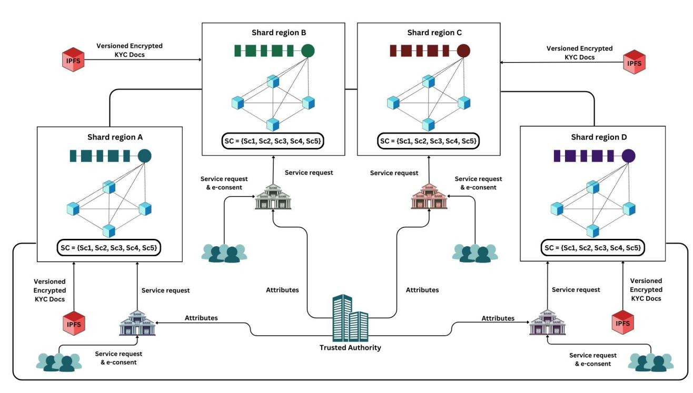
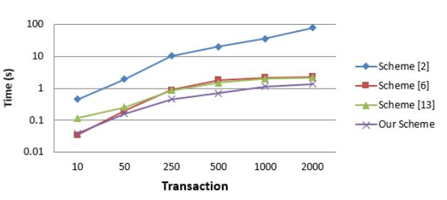
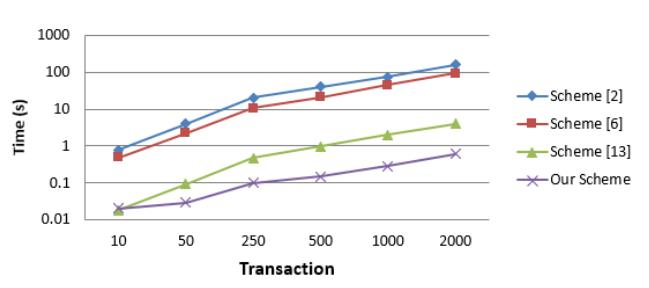
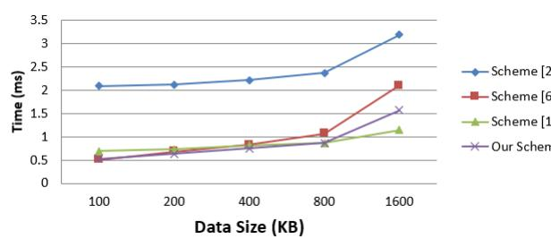
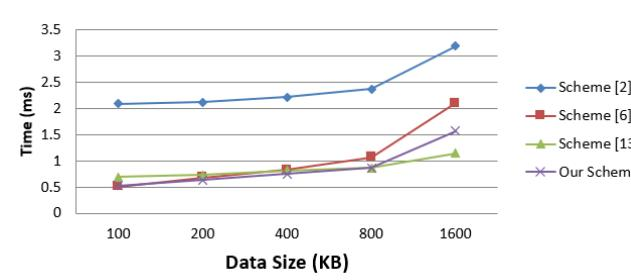
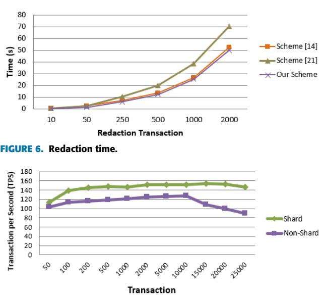

# Enabling Secure and Scalable GDPR-Compliant Blockchain-Based e-KYC With Efficient Redaction

SOMCHART FUGKEAW [,](https://orcid.org/0000-0001-7156-184X) (Member, IEEE), SURABORDIN SUNGCHAI [,](https://orcid.org/0009-0000-4533-1282) SUPAWIT NAKPRAME [,](https://orcid.org/0009-0007-9736-858X) AND PIPHATTRA SREEKONGPAN

Sirindhorn International Institute of Technology, Thammasat University, Pathum Thani 12120, Thailand

Corresponding author: Somchart Fugkeaw (somchart@siit.tu.ac.th)

**ABSTRACT** As electronic Know Your Customer (e-KYC) systems become integral to modern financial services, ensuring compliance with stringent privacy regulations—particularly the General Data Protection Regulation (GDPR)—has become paramount. However, most existing blockchain-based e-KYC solutions are limited by two critical shortcomings. First, they lack native support for data redaction, conflicting with GDPR's ''right to be forgotten,'' since data once recorded on-chain becomes immutable and globally persistent. Second, they fail to scale under high-volume cross-institutional transactions, where centralized authentication models and monolithic blockchain structures lead to computational bottlenecks, increased latency, and communication overhead across financial institutions FIs. To address these gaps, we propose a novel blockchain-based e-KYC framework that is GDPR-compliant, privacy-preserving, and highly scalable. Our solution introduces three key innovations: 1) ZK-Rollup-based authentication integrated with sharded blockchain architecture, enabling off-chain proof batching and distributed verification across shards for highthroughput, low-latency validation; 2) adaptive proxy re-encryption to support secure and dynamic customer data portability between host and requesting FIs; and 3) an optimized redactable blockchain protocol using off-chain Chameleon Hash collision generation and threshold cryptography-based key rotation to enable efficient, secure, and verifiable data updates in compliance with GDPR. Our experimental results show substantial performance gains in authentication verification, redaction throughput and cross-FI transaction efficiency, validating the practical applicability of our scheme in real-world, regulation-sensitive e-KYC deployments.

**INDEX TERMS** e-KYC, GDPR, redactable blockchain, zero-knowledge proofs.

# **I. INTRODUCTION**

The rapid growth of e-commerce has heightened the demand for secure, reliable, and efficient customer verification mechanisms. Among these, KYC process has emerged as a widely adopted approach to verify customer identities, preventing fraud, money laundering, and other financial crimes. By collecting and verifying personal information, such as government-issued IDs and proof of address, businesses can confirm the legitimacy of customers, thereby mitigating risks associated with online transactions. As digital platforms continue to expand, KYC has become an essential component in maintaining trust, security, and regulatory compliance across the e-commerce industry.

The associate editor coordinating the revi[ew](https://orcid.org/0000-0001-5822-3432) of this manuscript and approving it for publication was Mehdi Sookhak .

However, traditional KYC processes often rely on manual, paper-based verification systems that are not only time consuming and error-prone but also susceptible to data breaches. The advent of blockchain technology has introduced a paradigm shift, enabling decentralized and secure solutions for managing sensitive customer information. Despite its advantages, privacy concerns regarding the storage and sharing of personal data remain a pressing challenge.

e-KYC has gained widespread adoption among financial institutions FIs and banks worldwide, facilitating backend customer authentication without the direct exchange of credentials between parties. Modern e-KYC systems employ cryptographic-based access control solutions and advanced authentication mechanisms, such as two-factor authentication (2FA) and multi-factor authentication (MFA). Additionally, secure data exchanges between FIs are achieved through encryption and adherence to strict authorization policies. Blockchain technology further enhances e-KYC by improving security, traceability, and efficiency in banking applications. Its decentralized and immutable nature offers a secure, cost effective way to streamline KYC processes, ensuring customer privacy, reducing fraud, and complying with regulatory requirements. This makes blockchain an ideal solution for digital identity verification across the e-commerce and financial sectors, reducing dependence on centralized trusted third parties.

Despite these advancements, existing e-KYC systems [\[2\],](#page-18-0) [\[3\],](#page-18-1) [\[4\],](#page-18-2) [\[6\],](#page-18-3) [\[13\],](#page-19-0) face several unresolved challenges. First, scalable and anonymous authentication is critical, particularly when processing e-KYC requests involving a large number of customers and non-host FIs. Current e-KYC systems rely heavily on centralized authentication mechanisms like 2FA and MFA, managed by the core systems of individual FIs. These centralized approaches incur high communication costs and create bottlenecks during peak request volumes, especially in scenarios requiring large-scale e-KYC validations. For example, when multiple non-host FIs simultaneously request e-KYC validation for loan applications, centralized authentication systems often face delays due to network congestion and computation overload on the host FI.

Second, secure and dynamic data portability is a pressing requirement in real-world applications. FIs frequently need to share customer data securely and efficiently during processes like loan approvals, financial audits, or cross border transactions. However, existing e-KYC systems struggle to provide flexible and secure mechanisms for dynamic authentication and data transfer between multiple FIs while ensuring compliance with regulatory frameworks.

Third, compliance with privacy regulations such as GDPR [\[1\]](#page-18-4) poses a significant challenge. Blockchain's immutable nature conflicts with the 'right to be forgotten' clause, making it difficult to erase or redact personal data upon customer request. Once customer data—such as National ID numbers, digital consent records, encrypted Personally Identifiable Information (PII) metadata, or hashes pointing to KYC documents stored in InterPlanetary File System (IPFS)—is stored on-chain or indexed via blockchain references (e.g., IPFS content identifiers), it becomes practically immutable and globally verifiable. To overcome this, our system enables GDPR-compliant redaction using verifiable chameleon hash functions and collaborative key rotation, supporting data erasure without compromising blockchain consistency or integrity.

Additionally, ensuring that e-KYC verification requests remain confidential and occur only with explicit customer consent is a persistent issue in blockchain-based e-KYC systems. To the best of our knowledge, existing blockchainbased e-KYC systems[\[2\],](#page-18-0) [\[4\],](#page-18-2) [\[5\],](#page-18-5) [\[6\],](#page-18-3) [\[7\],](#page-18-6) [\[9\],](#page-19-1) [\[11\],](#page-19-2) [\[12\], la](#page-19-3)ck the ability to dynamically update or erase sensitive records in response to consent withdrawal or regulatory audits.

To address these challenges, we propose a novel secure and flexible, GDPR-compliant e-KYC scheme leveraging a redactable blockchain architecture. Our solution integrates advanced techniques to ensure secure, scalable, and efficient customer verification. First, we introduce an optimized authentication mechanism that combines Zero-Knowledge Rollup (ZK-Rollup) and a novel sharded proof verification strategy. Specifically, blockchain sharding has emerged as a prominent on-chain scaling approach, attracting considerable interest [\[22\],](#page-19-4) [\[23\],](#page-19-5) [\[24\],](#page-19-6) [\[25\],](#page-19-7) [\[26\]](#page-19-8) due to its potential to enhance blockchain system throughput and reduce latency. It achieves this by dividing the network into multiple smaller shards, with each shard independently handling a portion of the transactions concurrently. We designed a cross-shard synchronization mechanism to enable scalable verification in the entire consortium blockchain network. We also integrated zero-knowledge proofs (ZKP) to be done in the shards where the customers can perform e-KYC transactions. This mechanism enables transparent validation of customer credentials while efficiently handling large volumes of e-KYC requests. Transactions are grouped based on proximity to distributed verification services, batched into a single succinct ZKP off-chain, and then submitted to the blockchain. This approach significantly reduces on-chain computation and storage requirements, improving throughput and scalability.

Second, to facilitate secure and dynamic data portability, our scheme incorporates re-encryption. This mechanism enables encrypted data transfer between host and requesting FIs without exposing plaintext information. The system dynamically adjusts to varying authentication requirements and ensures secure access to customer data for critical operations, such as loan approvals and regulatory audits.

Finally, to ensure compliance with privacy regulations, we propose an optimized redactable blockchain protocol that leverages the Chameleon Hash algorithm for controlled data redaction. Our approach integrates off-chain redaction execution to improve scalability and efficiency, while the security of the redaction process is ensured through our proposed dynamic key rotation mechanism. This design guarantees privacy compliance, data integrity, and adaptability in managing sensitive customer information. To ensure GDPR alignment, our system offers predictable and verifiable redaction mechanisms capable of fulfilling the 'right to be forgotten,' while maintaining blockchain consistency and accountability through zero-knowledge proofbased validation and regulated access control. The proposed e-KYC solution is designed for deployment in financial consortium environments, such as banking networks, fintech alliances, and regulatory platforms, where secure, scalable, and privacy-compliant identity verification is essential.

To the best of our knowledge, we provide the first attempt in addressing the ''right to be forgotten'' issue of GDPR in blockchain-based e-KYC.

In summary, the key contributions of our proposed system include:

#### A. SCALABLE AND EFFICIENT AUTHENTICATION

Our scheme achieves high-throughput and scalable e-KYC authentication by integrating ZK-Rollup with a sharded blockchain architecture. ZK-Rollup enables succinct, offchain proof generation and batching, which minimizes on-chain computation and storage requirements. Meanwhile, sharded proof verification distributes authentication workloads across multiple shards, each responsible for managing a subset of users and transactions. This parallelism significantly reduces bottlenecks and latency under high request volumes. By leveraging cross-shard synchronization mechanisms and localized Merkle roots, our design supports efficient proof aggregation and validation, making the authentication process both scalable and cost-effective in real-world, high-volume scenarios.

## B. DYNAMIC AND SECURE DATA PORTABILITY

The system incorporates adaptive proxy re-encryption to enable secure and flexible data sharing between host and requesting FIs. This ensures that critical operations like loan approvals and regulatory audits are supported seamlessly.

#### C. SECURE AND OPTIMIZED REDACTION PROCESS

By leveraging the Chameleon Hash algorithm, combined with off-chain redaction execution, the protocol allows controlled modifications to stored data without compromising blockchain integrity. Additionally, the implementation of dynamic key rotation enhances the security of the redaction process and ensures long-term compliance with privacy regulations, including GDPR.

#### **II. RELATED WORK**

This section discusses works entailing e-KYC systems and literature addressing the redactable blockchain.

#### A. e-KYC SYSTEM

There are several e-KYC systems that employ blockchain to support core e-KYC functions such as authentication, public-cryptographic component storage, and secure data and transaction sharing. For example, Kumar et al. [\[8\]](#page-18-7) proposed a blockchain-based approach to decentralize the storage of personal data in the KYC process, addressing inefficiencies and operational redundancies in traditional methods. Their scheme focuses on data sovereignty by encrypting users' Personally Identifiable Information (PII), which is stored in a QR code format. Additionally, the system emphasizes enhanced user privacy and cost reduction through decentralized coordination among banks, regulators, and stakeholders.

Mamun et al. [9] [pro](#page-19-1)posed a secure and transparent KYC document verification system for banking using IPFS and blockchain technology. Their approach streamlines the KYC process by enabling customers to complete the process once at a single bank, generating a hash value via the IPFS network and sharing it securely through blockchain.

Fugkeaw [\[2\]](#page-18-0) introduced e blockchain-based e-KYC scheme, known as e-KYC TrustBlock, which leverages ciphertext-policy attribute-based encryption (CP-ABE) combined with client consent enforcement to ensure trust, security, and compliance with privacy standards. Furthermore, the scheme incorporates attribute-based encryption to facilitate privacy-preserving and fine-grained access control for sensitive transactions stored on the blockchain. A smart contract is also developed to create and enforce digital consents signed by customers, with these consents systematically recorded on the blockchain.

Suga [\[3\]](#page-18-1) introduced the e-KYC-e model, leveraging the ERC735 claim-style credentials in the Ethereum blockchain to enhance digital identity verification. The model utilizes decentralized identifiers (DIDs) and self-sovereign identity (SSI) concepts, enabling individuals to control their digital identities. Through a metaphor of ''cotton candy,'' the paper illustrates how multiple attributes (claims) can be linked to a specific identifier, creating a comprehensive and verifiable digital identity.

Patil and Sangeetha [\[7\]](#page-18-6) proposed a blockchain-based decentralized KYC verification framework for banks, leveraging the Ethereum blockchain to enhance the efficiency, security, and transparency of the KYC process. The framework enables all banks within the blockchain network to verify the legitimacy of customer-provided data through a voting mechanism. The KYC status of a customer is stored on the blockchain based on the consensus achieved through this process.

Schlatt et al. [\[11\]](#page-19-2) proposed a framework for digital KYC processes leveraging blockchain-based SSI to address inefficiencies and privacy concerns in traditional KYC methods. The framework employs a design science research approach to integrate SSI, enabling customers to maintain control over their personal data while ensuring compliance with data protection regulations. Takaragi et al. [\[13\]](#page-19-0) proposed a privacy-preserving eKYC framework tailored for Central Bank Digital Currencies (CBDCs), integrating delegatable anonymous credentials (DAC) and zero-knowledge range proofs (ZKRP). By leveraging ZKP, the system ensures that sensitive information, such as time stamps and ID registration validity, can be verified without revealing their content. This approach enables privacy enhanced public key infrastructure (PKI) and supports self sovereign identity management, contributing to a sustainable financial system.

Bhatia et al. [\[10\]](#page-19-9) proposed a cost-efficient blockchain based e-KYC platform that leverages biometric verification to address the limitations of traditional and digitized KYC processes. The platform allows users to complete video-based KYC verification after making an ether payment, upon which they receive a unique KYC key. This key enables FIs to verify user authentication directly on the blockchain without requiring repeated submission of documents, ensuring privacy and reducing redundancy. By leveraging blockchain's decentralized, transparent, and immutable properties, the proposed platform enhances security, minimizes operational costs, and streamlines the KYC process.

Patkar et al. [\[12\]](#page-19-3) proposed a privacy-preserving and trustworthy e-KYC system utilizing blockchain technology to address the inefficiencies and privacy concerns associated with traditional centralized KYC processes. The system leverages a decentralized blockchain network to securely store and manage customer identity data, eliminating the need for repetitive verification across multiple FIs. By employing cryptographic techniques, the proposed framework enhances data security, ensures transparency in data sharing with customer consent, and reduces operational costs. This approach optimizes the KYC verification process, fostering trust between customers and FIs.

Recently, Ahmed et al. [\[6\]](#page-18-3) introduced a novel approach to enhance the security and efficiency of e-KYC systems by integrating blockchain technology, Web 3.0, and quantum computing. The proposed framework addresses limitations in current e-KYC solutions, such as high key management costs and reliance on traditional encryption, by employing quantum encryption key methodologies to ensure stronger data protection and confidentiality.

Nevertheless, all the works mentioned above highlight significant advancements in e-KYC systems; however, they do not support redactability in blockchain system.

#### B. REDACTABLE BLOCKCHAIN

Recent advancements in redactable blockchain models offer promising solutions to balance data integrity with compliance, privacy, and usability. These solutions address the inherent immutability of blockchain systems while enabling selective data modification to meet regulatory requirements such as GDPR. Various techniques and frameworks have been proposed, leveraging mechanisms like chameleon hash functions, trapdoor hash functions, privacy-preserving methods, and integrations with revocable IPFS to enhance redactable blockchain systems.

One widely adopted technique for enabling redaction in blockchains is the use of chameleon hash functions. These functions allow authorized users to modify blockchain data securely without compromising its cryptographic integrity. Dong et al. [\[18\]](#page-19-10) employed a chameleon hash function in conjunction with multi-authority attribute-based encryption to enable authorized individuals to redact or replace content securely. This approach ensures that data visibility is restricted to authorized users, addressing privacy concerns in consortium blockchain settings. Zhang et al. [\[19\]](#page-19-11) extended this technique by integrating dynamic proactive secret sharing (DPSS), chameleon hash, and digital signatures into their trust-based redactable blockchain. Their model ensures traceability before and after modifications and securely restricts modification privileges. Similarly, Wang et al. [\[20\]](#page-19-12) used decentralized chameleon hash functions to support rapid and efficient copyright maintenance, allowing the modification of infringing content in educational data. Guo et al. [\[17\]](#page-19-13) developed an attribute-based chameleon hash function to facilitate transaction-level redactions of Electronic Health Records (EHR), ensuring compliance with privacy regulations while enabling secure and efficient redactions.

Several studies have focused on ensuring GDPR compliance through redactable blockchain models that support selective record removal and flexible access control. Yeh et al. [\[14\]](#page-19-14) proposed a GDPR-compliant mechanism combining a redactable blockchain with revocable IPFS. Their approach simplifies access control through enhanced proxy re-encryption, eliminating the complexities of group key management while allowing selective removal of records.

Another key innovation in redactable blockchain systems is the use of trapdoor hash functions to enable fine grained control over modifications. Zhou et al. [\[15\]](#page-19-15) utilized a trapdoor hash-based approach to allow efficient transaction editing, deletion, and smart contract repair. Their solution provides low-overhead and flexible permission control, demonstrating significant potential for real-world applications. Similarly, Xu et al. [\[21\]](#page-19-16) incorporated trapdoor hash functions in their PRHBS system to facilitate secure and flexible redactions in the healthcare sector. In [\[27\],](#page-19-17) The authors introduced a secure, efficient, and accountable data management approach utilizing a redactable blockchain. They also developed a distributed trapdoor recovery mechanism that ensures both efficiency and accountability. Recently, Wang [\[28\]](#page-19-18) et al. present a redactable blockchain framework that supports both transaction-level and block-level rewriting. Their approach involves using block-level rewriting which typically employed less frequently when transaction-level rewriting is not possible due to an invalid trapdoor.

In addition to supporting data redaction, several models prioritize privacy-preserving mechanisms to protect user anonymity. Heo et al. [\[16\]](#page-19-19) introduced zk-SNARKs to enhance privacy by generating one-time cryptographic keys for transactions, ensuring that user identities cannot be tracked. Their model further obscures cryptographic keys and signatures, providing an additional layer of security. To optimize performance, Heo et al. proposed a redaction fee scheme that incentivizes users to remove data rather than modify it, ensuring efficient ledger management and minimal performance overhead.

The integration of revocable IPFS with redactable blockchain models is another noteworthy approach to improving data management and ensuring compliance. Yeh et al. [\[14\]](#page-19-14) leveraged revocable IPFS to enable selective removal of files, maintaining both privacy and usability in their GDPR-compliant framework. Guo et al. [\[17\]](#page-19-13) employed a similar method for managing EHRs, enabling rapid redactions and ensuring compliance with privacy regulations.

Most existing redactable blockchain solutions perform chameleon hash computations directly on-chain, which can lead to computational overhead and scalability challenges, especially in scenarios with numerous deletion or redaction operations, such as large-scale e-KYC systems. In particular, current approaches fall short in efficiently scaling redaction processes for high throughput environments, supporting dynamic data portability across institutions, and reducing the computational and storage burden caused by frequent redactions.

#### **III. PRELIMINARIES**

This section provides an overview of the foundational technologies and concepts utilized in our framework, which combines e-KYC, GDPR, blockchain, chameleon hashing, and ZKP. We also discuss related works, highlighting the existing literature in these fields.

#### A. ZERO-KNOWLEDGE PROOF

A ZKP must satisfy three fundamental properties: Completeness, which ensures that if the statement is true, an honest verifier will be convinced by an honest prover with a high probability of correctness, thereby guaranteeing reliability in verification processes; Soundness, which guarantees that if the statement is false, no dishonest prover can convince an honest verifier with non-negligible probability, ensuring robustness against fraudulent claims and adversarial manipulations; and Zero-Knowledge, which means that if the statement is true, the verifier learns nothing beyond the validity of the statement, thereby maintaining strict privacy and security of the underlying information. These three principles collectively form the backbone of ZKP protocols, enabling secure and private verification. Mathematically, a ZKP protocol consists of a tuple (*P*, *V*, *S*) where *P* is the prover, who attempts to convince the verifier; *V* is the verifier, responsible for validating the proof; and *S* is a simulator that can reproduce the verifier's output without access to the witness, ensuring that no extraneous information is leaked in the process. This formalism provides a strong cryptographic framework that underpins numerous security sensitive applications.

#### B. CHAMELEON HASHING

The system utilizes Chameleon Hashing to enable selective modification (redaction) of blockchain data without disrupting its structure or cryptographic integrity, making the blockchain GDPR-compliant, and fulfilling the requirement of the ''right to be forgotten.''

- 1) **HGen:** (1*k* → (*hk*, *tdk*)): The algorithm generates a trapdoor key (*tdk*) The algorithm generates a trapdoor key (*tdk*) that enables modifications and a hash key (*hk*) from a prime number *p*, its subgroup, and a generator of quadratic residues modulo *g*.
- 2) **Hashing:** Hashing: To hash a message *m*, the algorithm combines it with a randomly generated value *r* and applies a collision-resistant hash function *H*.

| $h := r - (y \cdot H(m \parallel r) + g^s) \pmod{p}$ | (1) |
|------------------------------------------------------|-----|
|                                                      |     |

This hash value *h* uniquely identifies *m* while being tied to randomness *r* and the public hash key *hk*.

- 3) **Collision:** If a message *m* needs to be updated to *m* the trapdoor key (*tdk*) is used to adjust *r*so that the new hash value remains unchanged, thus preserving the Blockchain integrity.

′ ,

$$\begin{aligned} r' &= h + g^k \pmod{p} \\ &\text{where } k \text{ is a new random scalar} \\ s' &= k - H(m' \parallel r') \cdot x \pmod{p} \\ &\text{where } x = tdk \end{aligned} \tag{2}$$

Obtaining new values *r* ′ and *s* ′ that the message *m* remains the same hash value as the original *m*.

′

| $h = \text{Hash}(hk, m, r, s) = \text{Hash}(hk, m', r', s')$ | (3) |
|--------------------------------------------------------------|-----|
|--------------------------------------------------------------|-----|

To optimize performance and reduce computational costs, the redaction process occurs off-chain, potentially on a local computer. This approach minimizes the burden on blockchain nodes, as only the updated hash values and proof of redaction are recorded on-chain. The actual computation for adjusting *r* ′ and *s* ′ is performed externally, ensuring that blockchain integrity is maintained without requiring expensive on-chain operations.

# **IV. OUR PROPOSED SCHEME**

## A. SYSTEM MODEL

We propose a GDPR-compliant e-KYC system using a redactable blockchain. Figure [1](#page-5-0) provides an overview of the system model, which consists of the following entities:

- 1) The Trusted Authority (TA) is a statically designated, fully trusted entity responsible for generating public parameters and master keys, issuing credentials to financial institutions, and maintaining system-wide cryptographic integrity. This role is assumed by a regulatory body or jointly governed financial oversight organization and does not change dynamically over time. The TA's trust is foundational to the system's initialization and is assumed to be honest throughout.
- 2) Customers are the users of financial institutions, such as Bank A or Bank B, who enroll in the blockchainbased e-KYC system. Each customer possesses a unique customer Enrollment Smart Contract (SC2): cryptographic key pair Public/Private keys used for encrypting and decrypting their personal credential data. Before interacting with financial institutions, customers must provide e-consent, digitally signed using their private key (*PrivKeyCust*\_*ID* ). This consent grants FIs permission to store, process, and utilize the customer's KYC data. To ensure non-repudiation and accountability, the e-consent is stored immutably on the blockchain.
- 3) FIs: Financial institutions, such as Bank A and Bank B, act as the primary service providers interacting with the customers. They facilitate the e-KYC process by managing customer registration, verifying credentials, and ensuring data privacy and security. FIs interact with

**FIGURE 1.** System model.

smart contracts to execute processes like document redaction, data encryption, and KYC verification.

- 4) IPFS: The IPFS serves as the distributed storage layer for the encrypted KYC documents. Once the FI receives the customer's KYC documents, the files are encrypted and uploaded to the IPFS, generating a hash value (*h*) using SHA-256. This hash serves as a unique index to retrieve the document from the IPFS storage. The Distributed Hash Table (DHT) stores the mapping between the customer's citizen ID and the encrypted document, making it accessible but secure. IPFS ensures that KYC documents are stored in a tamper-resistant manner, enabling easy retrieval when required.
- 5) Consortium Blockchain is employed to maintain transaction logs of all KYC-related activities, ensuring integrity, privacy, and transparency across multiple FIs and stakeholders. The proposed system utilizes a consortium blockchain, governed by a federation of verified financial institutions. This setting ensures regulatory compliance, controlled access, and efficient governance—making it a suitable choice for privacy-sensitive and regulation-bound e-KYC ecosystems. To enhance scalability and decentralization, the blockchain is divided into shards, where each shard corresponds to a specific region or group of FIs. Sharding enables parallel processing of transactions within a shard while maintaining communication across collaboration. shards for seamless This structure

ensures efficient governance by trusted participants while maintaining high levels of decentralization.

- 6) Smart Contracts: The system utilizes a set of smart contracts (SCs) to automate and manage the entire e KYC lifecycle. These smart contracts perform various roles, as outlined below:

**e-Consent Generation Smart Contract (SC1):** This smart contract handles the coordination of e consent generation between customers and FIs. It allows FIs to request consent from customers to process their KYC documents. Once the customer provides digitally signed consent, it is immutably recorded on the blockchain. SC1 also supports consent revocation, enabling customers to withdraw their consent at any time.

**customer Enrollment Smart Contract (SC2):** This contract is responsible for authenticating new users, enrolling them in the e-KYC system, and uploading their encrypted credentials to IPFS. SC2 ensures that only legitimate customers are onboarded securely.

**Blockchain transaction encryption Smart Contract (SC3):** This smart contract encrypts the e-KYC transactions before updating onto the blockchain.

**e-KYC Document Verification Smart Contract (SC4):** SC3 verifies the authenticity and integrity of the customer's KYC documents stored in IPFS. By comparing the stored hash value with the computed hash of the retrieved document, this contract ensures that the data remains untampered and valid.

#### **Redaction Management Smart Contract (SC5):**

This smart contract facilitates the redaction process using chameleon hashing. It ensures that modified data retains hash consistency with the blockchain records while accurately reflecting changes to the underlying data. This capability supports compliance with GDPR's ''right to be forgotten'' without compromising the blockchain's integrity.

#### B. THREAT MODEL

Our system considers a multi-institutional e-KYC setting where adversaries may act maliciously or semi-honestly under partial trust assumptions. The threat model includes financial institutions (FIs), shard verifiers, IPFS nodes, and off-chain proxies, each with distinct risk profiles. We categorize threats across system components as follows:

#### 1) FINANCIAL INSTITUTION

Host and requesting FIs are modeled as semi-honest-butcurious. They follow the protocol correctly but may attempt to:

- 1) Infer private customer data from encrypted metadata, zk-proofs, or transaction patterns.
- 2) Replay or forward transformed ciphertext to unauthorized parties.
- 3) Retain access to customer data after revocation of consent or policy expiry.

#### 2) BLOCKCHAIN NETWORK AND VERIFIERS

While smart contracts are assumed to execute as programmed, malicious shard verifiers may attempt to:

- 1) Forge Merkle proofs or falsify synchronization states in cross-shard operations.
- 2) Skip redaction requests or misreport updated Merkle roots.
- 3) Accept invalid zk-rollup proofs unless verified by batch-checkable zk-SNARKs.

#### 3) PROXY RE-ENCRYPTION LAYER

The proxy is considered honest-but-curious—it performs re-encryption correctly but may attempt to:

- 1) Learn information from ciphertext metadata or transformation keys.
- 2) Correlate ciphertext and re-encryption events across sessions.

To mitigate this, PRE is implemented as unidirectional and non-interactive, and proxies never access private keys or plaintext. In addition, transformation keys are encapsulated with ephemeral randomness for unlinkability.

### 4) ZK-ROLLUP AUTHENTICATION

We assume malicious verifiers may replay, forge, or selectively reject zero-knowledge proofs or attempt batch proof manipulation in rollup chains.

To defend against these threats, zk-SNARKs are used for authentication soundness and privacy. Merkle root updates and batch verification ensure consistency across authentication batches.

#### 5) OFF-CHAIN STORAGE (IPFS)

IPFS nodes are considered semi-trusted: they store encrypted data reliably but are not capable of enforcing redaction or verifying correctness.

#### 6) ASSUMPTIONS

- The Trusted Authority (TA) is fully trusted to manage key generation and onboarding.
- All cryptographic primitives (ECC, AES, zk-SNARKs, Chameleon Hashes) are secure under standard hardness assumptions.
- No collusion occurs between untrusted parties (e.g., requesting FIs and verifiers).
- PKI between FIs is authenticated and secure.
- GDPR compliance, particularly the right to be forgotten, is enforced via verifiable redaction mechanisms involving chameleon hash updates, threshold trapdoor rotation, and zero-knowledge verification proofs.

#### C. KEY LIFECYCLE AND TRUST MANAGEMENT

Our adaptive PRE scheme includes comprehensive key lifecycle strategies to ensure secure and auditable identity data sharing. These mechanisms address revocation, rotation, and compromise resilience:

- 1) **redRevocation:** Transformation keys  $\text{TK}_{(U,F)}$  are time-scoped and bound to a user's consent policy  $\mathcal{U}$ . Upon consent withdrawal or policy expiration ( $t > \text{texp}$ ), smart contracts automatically revoke  $\text{TK}_{U,FI}$ , ensuring no further re-encryption operations.  $\text{ReEnc}(CT, \text{TK}_{U,FI})$  are possible.
- **2) Key Rotation:** Let  $\chi$  be the chameleon hash trapdoor and  $\mathbf{TK}_{U,FI}^{(i)}$  the transformation key at epoch  $i$ . Every  $\Delta t$  interval, a quorum  $Q \subseteq \mathbb{F}\mathbb{I}$  of authorized institutions jointly rotate  $\chi \rightarrow \chi'$  and  $\mathbf{TK}_{U,FI}^{(i)} \rightarrow \mathbf{TK}_{U,FI}^{(i+1)}$  through threshold consensus  $\mathcal{T}_{\text{rotate}}$ , maintaining forward secrecy and integrity.
- 3) **Compromise Mitation:** Each  $\text{TK}_{U, Fl}^{(0)}$  is derived using ephemeral randomness  $r_i \sim \mathbb{Z}_p$  such that  $\text{TK}_{U, Fl}^{(0)} = \text{Enc}_{\text{PKFl}}(r_i, k_U)$ , where  $k_U$  is the user's symmetric key. Since  $r_i$  is fresh and non-reusable, it thwarts correlation attacks. Moreover, the proxy node never learns  $k_U$ ,  $r_i$ , or the plaintext  $M$ , ensuring unidirectional confidentiality:

$$\begin{aligned} \text{Prox}: \quad & CT = \text{Enc}_{PK_U}(M), \\ & CT' = \text{ReEnc}(CT, \text{TK}_{U, FI}), \\ & \Rightarrow \text{Dec}_{SK_{\text{Fl}}}(CT') = M \end{aligned} \quad (4)$$

These strategies collectively ensure secure, privacypreserving, and GDPR-compliant re-encryption workflows across federated financial institutions.

#### D. SYSTEM PROCESS

This section describes the system process of our proposed e KYC model. Table [1](#page-7-0) presents a list of notations and symbols used in this paper.

**TABLE 1.** Notations used in the system.

| Notation        | Meaning                                                       |
|-----------------|---------------------------------------------------------------|
| $F$             | Personally Identifiable Information of one customer.          |
| $PrivK_{FIID}$  | Private key of the Financial institute.                       |
| $PrivDK_{FIID}$ | Private delegate key of the Financial institute.              |
| $pk$            | Proving keys used to enable ZKP during the e-KYC process.     |
| $vk$            | Verifying keys used to enable ZKP during the e-KYC process.   |
| $tdk$           | Trapdoor key which is used in the redaction phase.            |
| $CertFIID$      | Certification of each FIs that TA generated after validation. |
| $FI_{source}$   | A FI who provides customer data to the requested FIs.         |
| $FI_{req}$      | A FI who requested customer data from the source FIs.         |
| $k_{source}$    | A transformation key of the source FI.                        |
| $Sig_{source}$  | A signature of the source FI.                                 |

*Phase 1: Setup phase* In this phase, the Trusted Authority (TA) initializes the cryptographic variables and deploys the system's smart contracts. Keys are generated using Elliptic Curve Cryptography (ECC) with the P-256 (NIST curve) standard.

- 1) The TA generates the Master Secret Key ( $Msk_\alpha$ ) and the corresponding public key ( $P_\alpha$ ). For Master Secret Key ( $Msk_\alpha$ ), the TA selects a random scalar  $\alpha$  from the finite field of the elliptic curve  $\mathbb{Z}_q^*$ , where  $q$  is the prime order of the elliptic curve group.  $Msk_\alpha = \alpha$ . Public Key ( $P_\alpha$ ): Using the generator point  $P$  of the elliptic curve group, the TA computes the corresponding public key:  $P_\alpha = \alpha \cdot P$ .
- 2) The TA computes hash parameters to map specific inputs to points on the elliptic curve. These parameters support various cryptographic operations within the system:

- **Hash of Metadata of Personally Identifiable Information (PII):** *HPII* = *H*1(*metadata*). This hash value is used to securely reference metadata stored on the blockchain.
- **Key Generation for Financial Institutions:** The following hash function is used to generate unique cryptographic keys for financial institutions. *HFI* = *H*2(*FIID*).
- **Transformation Key for Redaction:** This hash function facilitates secure and efficient data redaction processes. *Hredaction* = *H*3(*Redaction\_Key*).
- **Hashed Index of Files Stored on IPFS:** It maps and securely retrieves files stored in IPFS. *Hindex* = *H*4(*IPFSCID*).

*Phase 2: Key Generation* This phase defines the cryptographic keys used by FIs and data owners. It involves interactions between the TA and FIs to generate secure key pairs and establish relationships.

# 1) ENTITY-SIDE OPERATIONS (FI)

The Financial institute generates a random value *rFIID* for computing pseudo-identifier *pidFIID* and compute *RFIID* which is then grouped together and sent to the Authority. The initial inputs are *(params)* and (*idFIID* ), the unique identifier for each financial institution. These inputs are used for the Key Generation Algorithm with the process below:

- 1) Generate Random Scalar  $r_{FID} \in \mathbb{Z}_+^*$
- 2) Compute *RFIID* = *rFIID* · *P* where *P* is the elliptic curve generator point.
- 3) Use a hash function *H*2 to compute the pseudoidentifier:

$$pid_{IFID} = H_2(r_{IFID} \oplus id_{IFID}) \cdot P \parallel id_{IFID} \quad (5)$$

- 4) Finally, FI sends (*RFIID* , *pidFIID* ) to the TA.

# 2) TRUSTED AUTHORITY-SIDE OPERATIONS

The TA, once received (*RFIID* , *pidFIID* ) from the FI, then chooses a random value *rA* for certificate generation and validates the data that were sent by the FIs. The certificate generation is returned to FIs so that they can use it to finalize their key pair.

- 1) TA generates a random scalar  $r_A \in \mathbb{Z}_{\geq 0}^*$
- 2) Compute *RA* = *rA* · *P*
- 3) Derive the certificate by combining both random numbers together:

$$Cert_{FI_{ID}} = R_{FI_{ID}} + R_A \quad (6)$$

- 4) Use a hash function *H*2 to compute Auxiliary Scalar *raux* so that the certificate cannot be forged:

$$r_{aux} = H_2(Cert_{FI_{ID}} \parallel pid_{FI_{ID}}) \cdot r_A + \alpha \quad (7)$$

- 5) Then, TA returns (*CertFIID* , *raux* ) to the FI.

# 3) ENTITY-SIDE FINALIZATION (FI)

The FI uses the received data to compute its private and public keys.

- 1) Combine its random scalar *rFIID* and *raux* and the certificate *CertFIID* to compute their Private Key:

$$\text{Priv}K_{FID} = H_2(\text{Cert}_{FID} \parallel pid_{FID}) \cdot r_{FID} + r_{aux} \quad (8)$$

- 2) Compute the public key:

$$PubK_{FI_{ID}} = PrivK_{FI_{ID}} \cdot P \quad (9)$$

- 3) Verify the public key to make sure it matches TA's certificate:

$$PubK_{FID} = H_2(Cert_{FID} \parallel pid_{FID}) \cdot Cert_{FID} + P_\alpha \quad (10)$$

### 4) DELEGATE KEY PAIRS GENERATION

Delegate key pairs are generated for secure redaction and delegation operations.

- Secret key  $PrivDK_{FI_{ID}} \in \mathbb{Z}_q^*$
- Public key *PubDKFIID* = *PrivDKFIID* · *P*

#### 5) SYMMETRIC KEY GENERATION

Use the delegate private key and metadata to derive a unique AES symmetric key. This key is stored securely in the FI's IPFS and used for decrypting ciphertext during the e-KYC phase.

| $SymKey = H_2(PrivDK_{FID} \parallel NatID)$ | (11) |
|----------------------------------------------|------|
|----------------------------------------------|------|

#### *Phase 3: Customer Enrollment phase*

This phase involves securely registering customer information in the system and adding it to the blockchain. The FIs are responsible for collecting customer data, obtaining explicit consent, and enrolling the customer using smart contracts. Two separate file types are managed in this phase: customer metadata and encrypted documents. In this phase, there are four steps as follows:

- 1) **Obtain Customer Data** Customers provide their personal information required for registration. This information is grouped as

## $$M = \{CustID, NatID, Name, Addr, DoB\}$$

**CustID:** Unique Customer ID assigned by the FI. **NatID:** National Identification Number. **Name:** Full name of the customer. **Addr:** Customer address. **DoB:** Date of Birth.

- 2) **Generate e-consent** Before adding customer data to the system, the FI must obtain explicit e-consent from the customer to ensure compliance with GDPR. The e-Consent Generation Smart Contract (SC1) is triggered to facilitate this process. This consent can include:

**Permission:** To store and process data on the blockchain and IPFS.

**Usage Information:** Details of how the data will be used.

**Revocation Rights:** Rights to withdraw consent at any time.

Below shows the algorithm executed by e-Consent Generation Smart Contract (SC1):

As shown in Algorithm [1,](#page-8-0) once the e-Consent Generation Smart Contract (SC1) is triggered, the system begins by verifying the identities of both the customer and the FI. After successful verification, the customer's consent is constructed by capturing essential details such as the customer ID, national ID, granted permissions, and intended data usage. These details are then digitally signed using the customer's private key, ensuring authenticity and non-repudiation. A unique consent object is created by hashing the consent information and bundling it with the customer's digital signature. This consent is immutably recorded on the blockchain, thereby enabling verifiable and auditable authorization. The generated consent

#### **Algorithm 1** e-Consent Generation

**Input:** *CustID, NatID, Permission, UsageDetails, FI\_ID* **Output:** *Consent*

1: **function** GenerateEConsent(CustID, NatID, Permission, UsageDetails, FI\_ID) 2: **Step 1:** Verify Customer and FI details 3: Verify(CustID, NatID) 4: Verify(FI\_ID) 5: **Step 2:** Record Consent Information 6: ConsentDetails ← {CustID, NatID, Permission, UsageDetails} 7: CustSig ← Sign(ConsentDetails, PrivKey\_CustID) 8: Consent ← {ConsentID: Hash(ConsentDetails), CustID, NatID, CustSig} 9: **Step 3:** Store Consent on Blockchain 10: RecordOnBlockchain(Consent) 11: **Step 4:** Return Consent for FI Records 12: **return** Consent 13: **end function**

#### **Algorithm 2** Customer Enrollment

**Input:** *CustID, NatID, FI\_ID, Metadata, Consent* **Output:** *EnrollmentTX*

1: **function ENROLLCUST**(CustID, NatID, FI\_ID, Metadata, Consent) → EnrollmentTX 2: **Step 1: Verify Consent** 3: VerifyConsent(Consent.ConsentID) 4: **Step 2: Compute Metadata Hash** 5: H\_Metadata ← Hash(Metadata) 6: **Step 3: Encrypt Customer Data and Upload to IPFS** 7: SymKey ← GenerateSymKey(PrivKey\_FI\_ID, NatID) 8: EncryptedData ← AES\_Encrypt(Metadata, SymKey) 9: CID ← UploadToIPFS(EncryptedData) 10: **Step 4: Record Enrollment on Blockchain** 11: EnrollmentTX ← {CustID, NatID, H\_Metadata, CID, FI\_ID, Consent.ConsentID} 12: RecordOnBlockchain(EnrollmentTX) 13: **Step 5: Return Transaction Receipt** 14: **return** EnrollmentTX 15: **end function**

object is subsequently returned and serves as a secure reference for future operations.

- 3) **Customer Enrollment via Smart Contract** Once the customer's data and consent have been collected, the FI triggers the Customer Enrollment Smart Contract (SC2) to securely store customer information. The procedure of SC2 is presented as follows: As described in Algorithm [2,](#page-8-1) the enrollment begins by verifying the existence and validity of the customer's previously issued consent using the corresponding

consent ID. Upon successful validation, the customer's metadata is hashed to ensure data integrity. The metadata is then encrypted using a symmetric key derived from the FI's private key and the customer's national ID, ensuring confidentiality. The encrypted data is uploaded to the IPFS, and its associated content identifier (CID) is obtained. A blockchain transaction is then composed containing the metadata hash, CID, customer and FI identifiers, and the reference to the consent ID. This transaction is recorded on-chain, and a receipt is returned to the FI, signifying a successful and GDPR-compliant enrollment process.

- 4) **Cross-Shard Synchronization** After adding the customer's data to the host shard, the host shard sends the enrollment record to other relevant shards. Then, other shards verify the data and store a reference or replicate the record, and send an acknowledgment back to the host shard to confirm successful synchronization. Below shows the procedure of cross-shard enrollment.

After successfully enrolling a customer on the host shard, the system initiates a cross-shard synchronization process to ensure that the enrollment record is verifiably recognized across all relevant shards. This mechanism enables distributed shards— each possibly managed by different financial institutions to maintain a consistent and synchronized view of customer records. Specifically, the host shard packages the customer's enrollment data (e.g., CustID, Metadata, CID, and ConsentID) and transmits it to other participating shards within the shard network. Upon receipt, each recipient shard independently verifies the integrity and authenticity of the shared data, stores either a full or reference copy (depending on policy), and responds with a signed acknowledgment. These acknowledgments ensure verifiable receipt and can later be aggregated into a Merkle tree to support proof of synchronization. Algorithm [3](#page-9-0) below depicts the procedure of our proposed cross-shard synchornization mechanism.

*Phase 4: Encryption phase* This phase describes the encryption processes used for securely storing customer data and ensuring its integrity within the e-KYC system. The encryption process secures data before uploading it to the blockchain. The encryption process uses public parameters (params), specific attributes from the customer data (*M*), the secret key of FI (*PrivKFIID*), and the delegate key (*PrivDKFIID* ). The resulting metadata is encrypted, hashed, and uploaded to the blockchain as part of the transaction. SC4 performs encryption through the following steps:

- 1) Compute a random value *r* used to generate a cryptographic commitment tied to metadata:

$$r = H_1(\text{PrivDK}_{FID} \parallel M) \quad (12)$$

#### **Algorithm 3** Cross-Shard Synchronization With Verifiable Proof

**Input:** *CustID, Metadata, CID, ConsentID*

**Output:** *Verified updates across relevant shards*

1: **function SYNCTORELEVANTSHARDS**(CustID, Metadata, CID, ConsentID) 2: RelevantShards ← LookupShardMap(CustID, Metadata.FIID) 3: BatchEntries ← [ ] **for** each ShardID in RelevantShards 4: TX ← {CustID, Metadata, CID, ConsentID} 5: Proof ← ComputeMerkleProof(TX) 6: SendShardUpdate(ShardID, TX, Proof) 7: BatchEntries.Append({ShardID, TX, Proof}) 8: Root ← ComputeMerkleRoot(BatchEntries) 9: SubmitToGlobalContract(Root, BatchEntries) 10: MonitorAcknowledgments(BatchEntries) 11: RetryFailedUpdates() 12: **end function**

2) Compute a point on the elliptic curve using *r* and the generator point *P*:

*R* = *r* · *P* (13)

- 3) Derive a shared secret using *R* and *PrivDKFIFIID* to encrypt the metadata:

$$C_{FI_D} = M \oplus H_1(R \parallel \text{PrivDK}_{FI_D}) \quad (14)$$

- 4) Compute a hash of *CFIID* and *M* for tamper-proofing:

$$h_{FIID} = H_1(C_{FIID} \parallel M) \quad (15)$$

- 5) Derive signature components *SigFIID* to bind *PrivKFIID* and *r*:

$$Sig_{FI_{ID}} = r - h_{FI_{ID}} \cdot PrivK_{FI_{ID}} \quad (16)$$

- 6) Combine all components into a hashed transaction *CustomerTX* and upload it to Blockchain:

*CustomerTX* = *H*1(*NatID*,*Consent*,*CID*, *hFIID* , *SigFIID* ) (17)

# *Phase 5: Decryption Phase*

In this phase, there are two major decryption parts: transaction decryption transaction and customer data decryption *CTM*

### E. TRANSACTION DECRYPTION PROCESS

Before decrypting *M*, the host FI runs the decryption algorithm as follows:

- **(1)** Uses unique identifier such as *NatID* to locate the corresponding *CustomerTX* on the Blockchain. To extract the necessary field CID, it is done through:

**CustomerTX** = {NatID, Consent, CID, 
$$h_{IID}$$
,  $sig_{IID}$ }

**(2)** Verifies the transaction Integrity by recomputing hash for validation.

$$h'_{FI_{ID}} = H_1(C_{FI_{ID}} \parallel M) \quad (18)$$

*Check if*

$$h'_{FI_{ID}} = h_{FI_{ID}}$$

If the hashes don't match, terminate the process as the metadata is invalid or has been tampered with.

#### F. CUSTOMER'S DATA DECRYPTION

To decrypt *M*, the algorithm: **(1)** Use the CID extracted from *CustomerTX* to locate and retrieve the encrypted data from the FI's IPFS node:

$$IPFS(CT_M) \rightarrow CID$$
 (19)

**(2)** *Decrypt the retrieved encrypted data using the symmetric key (SymKey):*

$$M = \text{DEC}_{\text{AES}}(\text{SymKey}, CT_M) \quad (20)$$

#### *Phase 6: e-KYC process*

In this phase, the system facilitates secure and privacy-preserving data sharing between FIs using ZKP and encryption. The process includes interactions between the source FI (*FIsource*) and the requesting FI (*FIreq*) to verify and share e-KYC data. The proposed system employs the ZK-Rollup technique for efficient proof aggregation and leverages sharded blockchain architecture for distributed proof verification. There are five steps in this phase.

**Step 1: System Setup** This step initializes the system's foundational cryptographic parameters, sets up the sharded blockchain infrastructure, and establishes secure inter-organizational trust for cross-FI e-KYC processing.

#### 1) TRUSTED SETUP FOR ZKP

To support privacy-preserving and succinct user authentication, our scheme employs zk-SNARKs. A one-time trusted setup is performed, which outputs a proving key pk and a verifying key vk:

$$\{pk, vk\} \leftarrow \text{Setup}(\lambda)$$
 (21)

The *pk* is used by clients to generate proofs, and *vk* is published for verifiers to validate those proofs

# 2) SHARD ASSIGNMENT

Users are divided into multiple shards, represented as:

$$S_1, S_2, \dots, S_n$$

Each shard is managed by a verifier node (*VNi*), and each shard maintains its own local Merkle tree to store user proofs securely.

# 3) INTER-FI KEY EXCHANGE

To establish secure data sharing between financial institutions, *FIsource* and *FIreq* exchange their public keys:

$$PubK_{FI_{source}}, PubK_{FI_{reg}}$$

# 4) PUBLIC PARAMETERS

The final step involves publishing public parameters that define the cryptographic and structural setup of the system. These parameters are represented as:

$$params = \{G, q, P, H, pk, vk, n\}$$

#### **Step 2: User Authentication with source FI**

This step enables the customer to authenticate with their *FIsource* using ZKP.

2.1) Proof Generation by Customer: The customer generates a ZKP (π*C*) showing ownership of a valid private key *PrivKC* without revealing it:

- Choose a random 
  $$r \in \mathbb{Z}_q^*$$
- Compute commitment:  $R = r \cdot P$
- Compute challenge:  $c = H(\text{CustID} \parallel R \parallel \text{params})$
- Compute response:  $s = (r + c \cdot \text{Priv}K_C) \bmod q$
- Construct the proof  $\pi_C = (\text{CustID}, R, s)$

2.2) Shard-Based Verification The customer sends π*C* to the assigned verifier node *VNi* in shard *Si* . The verifier checks if:

$$s \cdot P = R + c \cdot PubK_C \quad (22)$$

If valid, the proof is added to the shard's Merkle Tree and contributes to the global zk-rollup.

**Step 3: Customer Request for Data Sharing** The customer requests *FIsource* to share their data with *FIreq*. 1. Consent Submission (Customer): The customer creates and encrypts a consent message:

$$\begin{aligned} \text{Consent} &= \{\text{ConsentID}, \text{CustID}, \text{FI}_{\text{source}}, \\ &\quad \text{FI}_{\text{req}}, \text{Timestamp}, \text{CustSig}\} \\ \text{Enc}(\text{Consent}) &= \text{ENC}_{\text{RSA}}(\text{PubKFI}_{\text{source}}, \text{Consent}) \end{aligned} \quad (23)$$

The encrypted consent is sent to *FIreq*. 2. *FIreq* Authentication: The customer authenticates with *FIreq* using π*c*. *FIreq* verifies the proof and forwards *Enc*(*Consent*) to *FIsource*.

**Step 4: Data** *FIsource* **Preparation** *FIsource* prepares and re-encrypts customer data for sharing. The procedure of this step is as follows:

- 1) **Consent Validation:** *FI*source decrypts *Enc*(*Consent*) and validates the customer's signature:

| $Consent = DEC_{RSA}(PrivK_{FI_{source}}, Enc(Consent))$ | (24) |
|----------------------------------------------------------|------|
|----------------------------------------------------------|------|

- 2) **Data Retrieval:** *FI*source retrieves the encrypted customer data from IPFS:

| $\{Enc(M), Enc(SymKey)\}$                  |      |
|--------------------------------------------|------|
| $= \text{Blockchain.query}(\text{CustID})$ | (25) |

- 3) **Data Re-encryption:** *FI*source re-encrypts the symmetric key (SymKey) for *FI*req:

| $Enc(SymKey) = ENC_{PubK_{Flteq}}(SymKey)$ | (26) |
|--------------------------------------------|------|
|                                            |      |

- 4) **Transformation Key Generation:** A transformation key (*tk*source→req) is generated: Let meta denote the

# **Algorithm 4** Proof Generation and Shard-Based Verification

**Input:** *CustID, PrivKc, params*

### Output: Proof $\pi_c$

| 1: <b>procedure</b>                                                                       | <b>GENERATEPROOF(CustID,</b> | <b>PrivKc</b> |
|-------------------------------------------------------------------------------------------|------------------------------|--------------------------|
|                                                                                           | params)                      |                          |
| 2: <b><math>r \leftarrow</math> random value from <math>\mathbb{Z}_C^*</math></b>         |                              |                          |
| 3: <b><math>R \leftarrow r \cdot P</math></b>                                             |                              |                          |
| 4: <b><math>c \leftarrow H(\text{CustID} \parallel R \parallel \text{params})</math></b>  |                              |                          |
| 5: <b><math>s \leftarrow (r + c \cdot \text{PrivK}_c) \bmod q</math></b>                  |                              |                          |
| 6: <b><math>\pi_c \leftarrow (\text{CustID}, R, s)</math></b>                             |                              |                          |
| 7: <b>return <math>\pi_c</math></b>                                                       |                              |                          |
| 8: <b>end procedure</b>                                                                   |                              |                          |
| 9: <b>procedure VERIFYPROOF(<math>\pi_c</math>, PubKc)</b>                     |                              |                          |
| 10: <b>Input: <math>\pi_c = (\text{CustID}, R, s)</math></b>                              |                              |                          |
| 11: <b>If <math>s \cdot P == R + c \cdot \text{PubK}_c</math> then</b>                    |                              |                          |
| 12:     Add $\pi_c$ to $\text{VN}_1$ 's Merkle tree                                       |                              |                          |
| 13: <b>return</b> "Valid Proof"                                                           |                              |                          |
| 14: <b>Else</b>                                                                           |                              |                          |
| 15: <b>return</b> "Invalid Proof"                                                         |                              |                          |
| 16: <b>end procedure</b>                                                                  |                              |                          |
| 17: <b>procedure UPDATEMERKLETREE(<math>\pi_c</math>)</b>                                 |                              |                          |
| 18:     Add $\pi_c$ to Merkle tree                                                        |                              |                          |
| 19:     Compute new shard root:                                                           |                              |                          |
| 20: $root_c \leftarrow H(R_1 \parallel R_2 \parallel \dots \parallel R_n)$                |                              |                          |
| 21: <b>return</b> <i>roott</i>                                                 |                              |                          |
| 22: <b>end procedure</b>                                                                  |                              |                          |
| 23: <b>procedure AGGREGATEZKRollup</b>                                         |                              |                          |
| 24:     Aggregate all shard proofs into ZK-Rollup proof                                   |                              |                          |
|                                                                                           | <i>πrollup</i>    |                          |
| 25:     Submit ( <i>rootc</i> , <i>πrollup</i> ) to blockchain      |                              |                          |
| 26: <b>end procedure</b>                                                                  |                              |                          |
| 27: <b>Main Execution:</b>                                                                |                              |                          |
| 28: <b><math>\pi_c \leftarrow</math> GENERATEPROOF(CustID, PrivKc, params)</b> |                              |                          |
| 29: <b>result ← VERIFYPROOF(<math>\pi_c</math>, PubKc)</b>                     |                              |                          |
| 30: <b>If result == "Valid Proof" then</b>                                                |                              |                          |
| 31: $root_c \leftarrow$ UPDATEMERKLETREE( $\pi_c$ )                                       |                              |                          |
| 32: <b>AGGREGATEZKRollup</b>                                                   |                              |                          |
| 33: <b>End</b>                                                                            |                              |                          |

metadata extracted from the customer's record, such as: meta = CustID, NatID, Timestamp, *FIID*, ConsentID.

$$k_{\text{source} \rightarrow \text{req}} = H_3(\text{meta} \parallel r \cdot \text{PrivDK}_{FI_{\text{source}}} \cdot \text{PubK}_{FI_{\text{source}}}) \oplus H_3(\text{meta} \parallel r \cdot \text{PubK}_{FI_{\text{req}}}) \quad (27)$$

- 5) **Transformed Ciphertext Creation:** *FI*source transforms the metadata and outputs:

$$CT_{\text{meta}} = \{C_{FI_{\text{req}}}, \text{meta}, \text{pid}_{FI_{\text{req}}}, h_{FI_{\text{source}}}, \text{SigFI}_{\text{source}}\} \quad (28)$$

# **Step 5: Data Transfer to** *FIreq*

*FIsource* securely transfers the encrypted data to *FIreq*. The procedure of this step is as follows:

- 1) Data Transmission: *FI*source sends the following to *FI*req:

- Transformed ciphertext (*CT*meta).
- Re-encrypted symmetric key (*Enc*(*SymKey*)).
- Encrypted PII file (*Enc*(*M*)).

- 2) Proof Submission: *FI*source submits a ZKP (πsource→req) to the blockchain to prove the transformation process.

# **Step 6:** *FIreq* **Verification and Decryption**

*FIreq* verifies and decrypts the received data through the following procedure.

- 1) Symmetric Key Decryption: *FIreq* decrypts the symmetric key:

| $SymKey = DEC_{RSA}(PrivK_{I_{req}},$ $Enc(SymKey))$ | (29) |
|---------------------------------------------------------|------|
|---------------------------------------------------------|------|

- 2) PII Decryption: *FIreq* decrypts the PII file:

$$M = DEC_{AES}(SymKey, ENC(M)) \quad (30)$$

- 3) Metadata Verification: *FIreq* verifies the integrity of the metadata using the transformation key (*tksource*→*req*).
- 4) Data Authenticity Check: *FIreq* checks the hash value and signature from *FIsource* to ensure the data's integrity and authenticity.

*Phase 7: Optimized Redaction Phase* Our redaction protocol ensures GDPR-aligned erasure by enabling collaborative and auditable data removal from the blockchain. Through threshold key rotation and chameleon hashing, redaction is triggered only by authorized entities. Verifiability is enforced via zero-knowledge proofs and updated Merkle paths, ensuring no unauthorized alteration occurs while preserving regulatory auditability.

The redaction phase leverages off-chain processing for scal- able and efficient data modification and dynamic key rotation using threshold cryptography to enhance security. The follow- ing algorithm details the steps to implement the optimized redaction phase in which the updated Chameleon Hash is computed off-chain. in compliance with privacy regulations such as GDPR. This phase is executed by the Redaction smart contract. There are five steps as follows:

**Step 1: Validate Redaction Request** The Redaction smart contract verifies whether the transaction exists in the blockchain. If it exists, the customer's consent and the customer's digital signature are verified through the following functions.

Exists (*TXID*) = True

If *TXID* in Blockchain

Else False

VerifySignature(Consent, CustSig, *PubkCust*) = True

**Step 2: Retrieve Chameleon Hash** The smart contract retrieves the original transaction, including the data (*M*), randomization factor (*r*), and the Chameleon Hash (*HCH* ). In this step, *r* is decrypted off-chain using the trapdoor key shares.

Retrieve transaction components:

*Tx* = {*M*,*r*, *H*CH(*M*,*r*)} (31)

Decrypt the randomization factor:

| $r = \text{Decrypt}(Tdk_1, Tdk_2, \dots, Tdk_k)$ | (32) |
|--------------------------------------------------|------|
|--------------------------------------------------|------|

**Step 3: Generate Controlled Collision** A new randomization factor (*r* ′ ) is generated, and the updated Chameleon Hash is computed off-chain. The hash consistency is verified to ensure integrity. Generate a new randomization factor:

$$r' = \text{GenerateRandom}()$$
 (33)

Compute the updated Chameleon Hash:

| $H_{\text{CH}}(M', r') = H(M') + f(r', \text{PubK})$ | (34) |
|------------------------------------------------------|------|
|------------------------------------------------------|------|

Ensure: *H*CH(*M*′ ,*r* ′ ) = *H*CH(*M*,*r*)

**Step 4: Key Rotation** In this step, we introduce the Key rotation method using Threshold cryptography to ensure long-term security by periodically updating the trapdoor key (*Tdk*). Threshold cryptography splits the current trapdoor key into shares (*Tdk*1, *Tdk*2, . . . , *Tdkn*) distributed among n participants. A threshold t of these shares is required to reconstruct the key for secure rotation. The new key is then generated, split into shares, and securely redistributed based on Shamir's Secret Sharing.

The below pseudocode presents the key rotation procedure:

**Step 5: Audit and Logging:** An off-chain audit log records the redaction event. A hash of the audit log is stored on-chain for integrity and transparent

#### **V. SECURITY ANALYSIS**

In this section, we provide an analysis of the security properties of our proposed e-KYC scheme. In addition to the formal analysis done through theorem-based proofs under standard cryptographic hardness assumptions provided below, we consider a realistic threat model involving: (1) semi-honest financial institutions that follow protocol but may attempt inference, unauthorized retention, or data replay; (2) malicious shard verifiers that may forge Merkle proofs or ignore redaction triggers; and (3) semi-trusted IPFS nodes assumed to store encrypted data reliably without verifying content correctness. These informal assumptions guide our system design and underpin the security properties formally proven in this section.

#### A. CONFIDENTIALITY OF CUSTOMER DATA

*Theorem 1:* The encrypted customer metadata and Personally Identifiable Information (PII) remain confidential under the semantic security of AES and ECC-based public key encryption, assuming standard hardness assumptions (e.g., ECCDH).

*Proof:* Let *M* be the customer's metadata encrypted as:

EncryptedData = AES\_Encrypt(= *M*, SymKey)

## SymKey = $$H_2(\text{PrivDK}_{\text{FI}}, \text{NatID})$$

The symmetric key is derived using a one-way hash function over the FI's private delegate key and the customer's National ID. AES encryption is IND-CPA secure under the

#### **Algorithm 5 Redaction**

**def** *rotate\_trapdoor\_key(current\_shares, threshold)*:

**Input:** *current\_shares:* List of trapdoor key shares {*Tdk*1, . . . , *Tdkk* }

*threshold:* Minimum number of shares required to reconstruct *Td* (*t*)

*n:* Total number of participants

**Output:** *new\_shares:* New trapdoor key shares {*Tdk*new,1, . . . , *Tdk*new,*n*}

*Tdk*old: Archived old trapdoor key

1: **procedure** ROTATE\_TRAPDOOR\_KEY((current\_shares, threshold))

2: **Step 1:** Agreement Phase

3: agreeing\_shares ← col-

lect\_agreeing\_shares(current\_shares, threshold)

4: **if** size(agreeing\_shares) < threshold **then** 5: **return** ''Threshold not met for key rotation''

6: **End If**

7: **Step 2:** Reconstruct Current Key

## $T_d \leftarrow \text{reconstruct_key(agreeing\_shares)}$

 $T_d \leftarrow \text{Combine}(\{Tak_1, Tak_2, \dots, Tak_k\})$   
 10. Step 2. Concrete Now Key.
 

10: **Step 3:** Generate New Key

11: *Tdk*new ← generate\_random\_key() 12: **Step 4:** Create New Shares

| 1:3: | Step 4: Stream Share    |
|------|-------------------------|
|      | new_shares ← Empty List |

| 14: | coefficients | $\leftarrow$ | $\{dk_{\text{new}}\}$ | $+$ | $\{\text{random\_number}(1,$ |
|-----|--------------|--------------|-----------------------|-----|------------------------------|
|-----|--------------|--------------|-----------------------|-----|------------------------------|

prime\_field) for  $i$  in  $[1, \text{threshold} - 1]$ 

**15: For  $i \leftarrow 1$ ton**  
16:                 *x  $\leftarrow i$* 

**17**       $x \leftarrow i$        $\sum(\text{coeff} \cdot x^{\text{power}})$  for power, coeff in coefficients

mod prime\_field

18: new\_shares.append((*x*, *y*))

19: **End For**

20: **Step 5:** Secure Share Distribution

21: **For** each participant share **in** (participants, new\_shares)

22: encrypted\_share ← encrypt\_with\_public\_key (participant.public\_key, share)

23: send\_to\_participant(participant, encrypted\_share)

24: **End For**

25: **Step 6:** Archive Old Key

26: archive\_key(*Td* )

27: **return** new\_shares, *Tdk*new 28: **end procedure**

assumption that the symmetric key is random and secret. Since PrivDKFI is known only to the FI and the hash is pre-image resistant, an adversary cannot deduce *M* without knowledge of SymKey. Thus, the confidentiality of *M* is preserved under standard assumptions.

# B. SOUNDNESS OF CUSTOMER AUTHENTICATION

*Theorem 2:* The ZK-proof authentication protocol prevents impersonation by ensuring that only a customer possessing a valid private key *PrivKC* can generate a valid proof π*C* = (CustID, *R*,*s*).

*Proof:* The proof is accepted if:

$$s \cdot P = R + c \cdot \text{Pub}_{KC}$$

| $s = r + c \cdot \text{Priv}K_C$ | mod $q$ | (35) |
|----------------------------------|---------|------|
|                                  |         |      |

An adversary attempting to forge π*C* without *PrivKC* must solve the equation above, equivalent to solving the Elliptic Curve Discrete Logarithm Problem (ECDLP), which is assumed to be computationally infeasible. Hence, only the legitimate customer can produce *s*, ensuring authentication soundness.

#### C. PRIVACY-PRESERVING DATA PORTABILITY

*Theorem 3:* Our re-encryption-based sharing mechanism preserves the confidentiality of customer data across FIs while supporting dynamic data access.

*Proof:* FIsource encrypts SymKey for FIreq as:

| $\text{ENC}_{\text{Flreq}}(\text{SymKey}) = \text{ENC}_{\text{PubK}_{\text{Flreq}}}(\text{SymKey})$ | (36) |
|-----------------------------------------------------------------------------------------------------|------|
|-----------------------------------------------------------------------------------------------------|------|

*Transformation key for metadata:*

$$k_{\text{meta}} = H_3(M \parallel r \cdot \text{PrivDK}_A \cdot \text{PubK}_B) \oplus H_3(M \parallel r \cdot \text{PubK}_B) \quad (37)$$

This value is used to compute derived metadata but does not leak or expose any sensitive data because both components are computationally protected by the elliptic curve discrete logarithm problem (ECDLP) and the one-wayness of *H*3. Without *PrivDKA* or *PrivK*FIreq , a malicious intermediary cannot recover SymKey or decrypt *M*. This assumes the CPA-security of public key encryption and one-wayness of hash functions. Therefore, secure and private portability is ensured.

## D. REDACTION SOUNDNESS

*Theorem 4:* Our redactable blockchain protocol ensures that redaction operations are sound and verifiable, and unauthorized redactions cannot occur without consensus or detection.

*Proof:* Let *Tr* be a transaction with Chameleon hash *HCH*(*M*,*r*), where *M* is the original metadata and *r* is the random trapdoor value.

Let *HCH* be defined as:

| $HCH(M, r) = H(M)$ |                      |                 |      |
|--------------------|----------------------|-----------------|------|
|                    | $+f(r, \text{PubK})$ | $\text{mod } p$ | (38) |
|                    |                      |                 |      |

*where:*

- *H* is a collision-resistant hash function,
- *f* is a trapdoor function using the public key PubK,
- *p* is a large prime.

A redaction is valid if and only if there exists a new (*M*′ ,*r* ′ ) such that:

$$HCH(M', r') = HCH(M, r) \quad (39)$$

Given trapdoor key *Tdk* , the adversary must compute *r* ′ satisfying:

$$\begin{aligned} H(M) + f(r, \text{PubK}) \\ = H(M') + f(r', \text{PubK}) \quad \text{mod } p \end{aligned}$$

$$\begin{aligned} &\Rightarrow f(r', \text{PubK}) - f(r, \text{PubK}) \\ &= H(M) - H(M') \pmod{p} \end{aligned} \tag{40}$$

Since *f* is trapdoor-based, without *Tdk* , the adversary cannot compute *r* ′ such that *f* (*r* ′ , PubK) satisfies the equation above. Thus, collision is infeasible without the trapdoor.

**Soundness:** Follows from collision resistance of *H* and trapdoor nature of *f* .

**Privacy:** As the redaction is off-chain and verifiable through proof, sensitive data (*M*, *M*′ ) remains undisclosed.

**Verifiability:** Redaction updates are logged and verified via Merkle proofs across shards.

Hence, redactions are sound, private, and verifiable under the hardness assumptions of ECC and the collision-resistance of *H*.

#### E. SECURE KEY ROTATION UNDER THRESHOLD CRYPTOGRAPHY

*Theorem 5:* The trapdoor key *TDk* is protected via threshold cryptography, requiring at least *t* out of *n* parties to reconstruct the key.

*Proof: TDk* is split into *TDk*1 , . . . , *TDkn* using Shamir's Secret Sharing:

| $TD_k = \text{Reconstruct}(TD_{k_1}, \dots, TD_{k_t})$ | (41) |
|--------------------------------------------------------|------|
|--------------------------------------------------------|------|

Fewer than *t* shares reveal nothing due to polynomial interpolation hardness. Thus, redaction remains secure unless the threshold is breached.

# F. CROSS-SHARD MERKLE TREE VERIFIABILITY

*Theorem 6:* Let *TX* ∈ Shard*i* be the transaction enrolled by the host Shard *Si* . Let πMerkle = {*h Sibling j* , *bj*} *k j*=1 be the Merkle path of *TX*. The cross-shard synchronization mechanism correctly validates *TX* using Merkle Proof πMerkle with soundness and correctness.

**Proof of Soundness:** Assume an adversary generates a fake transaction *TX*′ ∈/ Shard *Si*'s Merkle Tree and a corresponding fake proof πMerkle such that the verification process accepts *TX*′ :

$$V(TX', \pi_{\text{Merkle}}) = \text{True} \quad (42)$$

This implies that either:

- 1) *H*(*TX*′ ) = *H*(*TX*), violating the collision resistance of *H*, or
- 2)  $\exists j \in [1, k] : H(h_{j-1} \parallel h_j^{Sibling}) = H(h_{j-1}^j \parallel h_j^{Sibling})$  implying a collision in  $H$ .

),

Hence, forging *TX*′ such that it passes Merkle verification without being in the original tree contradicts the collision resistance of the hash function. Thus, the mechanism is sound.

**Proof of Correctness:** Let πMerkle be honestly generated. The Merkle verification proceeds as:

- 1) Set *h*0 = *H*(*TX*)

2) Iteratively compute:

$$\begin{cases} H(h_{j-1} \parallel h_j^{\text{Sibling}}), & \text{if } b_j = 0 \\ H(h_j^{\text{Sibling}} \parallel h_{j-1}), & \text{if } b_j = 1 \end{cases} \quad (43)$$

3) If  $h_k = R_i$ , then the proof is accepted.

The procedure is deterministic and yields  $R_i$  only if  $TX \in \text{Merkle Tree } S_i$ . Therefore, correctness holds. Corollary 6.1: Cross-Shard Root Aggregation Verifiability

Let  $Root_{\text{shard}_i}$  be the local Merkle root of shard  $S_i$ , and let  $Proof_{\text{shard}_i}$  be the valid Merkle proof for transaction  $TX \in S_i$ . Then the global root  $R_{\text{global}}$  is defined as:

$$R_{\text{global}} = H(Root_{\text{shard}_1} \parallel Root_{\text{shard}_2} \parallel \dots \parallel Root_{\text{shard}_m})$$

This ensures cross-shard verifiability with compact proof chains, i.e., if

$$\text{VerifyMerkleProof}(TX, Proof_{\text{shard}_i}, Root_{\text{shard}_i}) = \text{True} \\ \text{and } Root_{\text{shard}_i} \in R_{\text{global}}$$

then  $TX$  is verifiable as part of the cross-shard state.

## VI. EVALUATION

Our redaction protocol ensures GDPR-aligned erasure by enabling collaborative and auditable data removal from the blockchain. Through threshold key rotation and chameleon hashing, redaction is triggered only by authorized entities. Verifiability is enforced via zero-knowledge proofs and updated Merkle paths, ensuring no unauthorized alteration occurs while preserving regulatory auditability.

This section presents the evaluation of our proposed shared blockchain-based e-KYC scheme by providing the details of functional analysis, computation cost analysis, and performance testing experiments. Our performance evaluation covers key cryptographic operations including authentication, encryption and decryption, and redactable blockchain operations.

## A. FUNCTIONALITY COMPARISON

We compare the functionality of our scheme with four e-KYC schemes including [2], [6], [11], and [13]. Table 2 presents the comparison of key features of our scheme and related works.

In this functionality comparison, we evaluate our proposed scheme against existing works based on four key functionalities: anonymous authentication, scalability improvement, secure data portability, and redaction. While some existing schemes incorporate a subset of these features, they exhibit limitations that prevent them from offering a fully secure, adaptable, and comprehensive solution. In [2] focuses on scalability improvement but lacks anonymous authentication, secure data portability, and redaction, making it unsuitable for scenarios requiring strong identity verification and data security. In [6] also emphasizes scalability but lacks secure data portability and redaction, limiting its usability in environments with strict data privacy regulations. In [11]

**TABLE 2.** Comparison of schemes based on features F1–F4.

| Scheme | F1 | F2 | F3 | F4 |
|--------|----|----|----|----|
| [2]    | X  | ✓  | X  | X  |
| [6]    | X  | ✓  | X  | X  |
| [11]   | ✓  | ✓  | ✓  | X  |
| [13]   | ✓  | ✓  | X  | X  |
| Ours   | ✓  | ✓  | ✓  | ✓  |

Note: F1= Anonymous Authentication, F2= Scalability Improvement F3= Secure data portability, F4= Redaction

includes authentication and scalability, ensuring a certain level of security and efficiency but does not support redaction or secure data portability, making it less adaptable for GDPR-compliant data handling. In [13] incorporates authentication, and scalability, However, it lacks secure data portability and data redaction, which restricts efficient and secure data transfer across different systems.

In contrast, our proposed system fully integrates all four key functionalities, providing a scalable, secure, and privacy-preserving architecture. By combining redaction, authentication, and secure data portability, our solution ensures efficient identity management, compliance with data protection laws, and enhanced security, making it a robust choice for decentralized applications and secure digital ecosystems.

## B. COMPUTATION COST ANALYSIS

To demonstrate the efficiency of the core e-KYC processes, we compare the computation cost related to the e-KYC user and credential authentication, data encryption/decryption cost, integrity verification, and redaction of our scheme and three e-KYC solutions including scheme [2], [6], and [13]. The list of notations used in the analysis is presented in Table 3.

### 1) CORE CRYPTOGRAPHIC OPERATION COST

Table 4 presents the comparison of the computation cost of core cryptographic operations of our scheme and three related works. The following notations are used to analyze the e-KYC- related computation cost.

Based on the cost details presented in Table 4, our comparison highlights key trade-offs between security, efficiency, and scalability across authentication and encryption methods. Traditional RSA-based authentication [2] incurs high computational costs due to *public key encryption* and

**TABLE 3.** List of notations used for computation cost analysis.

|  | Notation         | Meaning                                                                                         |
|--|------------------|-------------------------------------------------------------------------------------------------|
|  | $C_{RSASign}$    | RSA signing/verification cost                                                                   |
|  | $C_{ECCSign}$    | ECDA signing/verification cost                                                                  |
|  | $C_{Sym}$        | 256-bit AES Encryption/Decryption cost                                                          |
|  | $C_{Pub}$        | Public key encryption cost based on 1024-bit RSA                                                |
|  | $N$              | Number of nodes in the CP-ABE-based access policy                                               |
|  | $C_{exp}$        | Exponentiation and XOR operation cost                                                           |
|  | $C_m$            | Multiplication operation cost                                                                   |
|  | $C_{PQC}$        | Post Quantum Computing Encryption/Decryption cost $\mathcal{O}(n)$ for lattice-based encryption |
|  | $C_{QKD}$        | Quantum Key Distribution Setup with complexity $\mathcal{O}(n)$ for $n$ network nodes           |
|  | $C_{QKA}$        | Quantum Key Agreement Encoding with complexity $\mathcal{O}(\log n)$                            |
|  | $C_{QNetGen}$    | Quantum Network Access Control Setup with complexity $\mathcal{O}(\log n)$                      |
|  | $C_{QVer}$       | Quantum Key Agreement Verification cost with complexity $\mathcal{O}(\log n)$                   |
|  | $C_{QnetVer}$    | Quantum Network Access Control Verification cost with complexity $\mathcal{O}(\log n)$          |
|  | $C_{QHashVer}$   | Quantum hashing verification cost with complexity $\mathcal{O}(\log n)$                         |
|  | $C_{ECC}$        | ECC Encryption/Decryption cost                                                                  |
|  | $C_{ECCScanMIL}$ | Cost of an elliptic curve scalar multiplication                                                 |
|  | $C_{ECCAdd}$     | Cost of an elliptic curve point addition                                                        |
|  | $C_{Hash}$       | Cost of a cryptographic hash function                                                           |
|  | $C_{ModAdd}$     | Cost of a modular addition                                                                      |
|  | $C_{ZKRP}$       | $\approx 2n \times C_{ECCScalarMul} + \log(n) \times C_{ECCAdd}$                                |
|  | $C_{ZKRPVer}$    | $\approx \log(n) \times (C_{ECCScalarMul} + C_{ECCAdd})$                                        |

RSA signing cost, making it inefficient for large-scale e-KYC applications. Quantum-based authentication [6], leveraging Quantum Key Distribution and Quantum Key Agreement ensures post-quantum security but suffers from  $\mathcal{O}(n^2)$  encryption and  $\mathcal{O}(n)$  setup complexity, making it impractical for widespread adoption. In contrast, ECC-based authentication [13] balances security and efficiency by using ECC scalar multiplication, hashing, and modular addition, reducing overhead while maintaining strong security. However, ECC-based encryption and decryption remain more expensive than symmetric key approaches. Our proposed scheme optimizes authentication and encryption with lightweight ECC-based signing, AES encryption, and efficient ECC re-encryption for secure data transfer. Authentication verification leverages  $\mathcal{O}(\log n)$  Merkle tree proof checking, integrating *shared blockchains* and *ZK-Rollup* for scalable proof aggregation. Moreover, only our scheme has the ability to securely transfer encrypted customer data between FIs through ECC-based re-encryption. This further ensures efficiency in inter-bank transactions while maintaining data privacy and security.

Accordingly, compared to current e-KYC approaches, our approach ensures efficient authentication, low-cost encryption, and secure inter-FI data sharing, making it well-suited for real-world e-KYC applications.

# 2) BLOCKCHAIN REDACTION COST

In addition to the comparison of e-KYC related computation cost, we also provide the blockchain redaction computation cost analysis between our scheme and recent blockchain redaction approaches including scheme [14] and scheme [21].

Table 5 presents the list of notations used for redaction cost analysis and the result is displayed in Table 6.

As shown in Table 6, our scheme significantly optimizes blockchain redaction costs compared to previous works by offloading Chameleon Hash computation and collision generation to off-chain processing, thereby reducing the on-chain storage and computation burden. Unlike Scheme [14], and [21] which perform on-chain Chameleon Hash and collision generation, our scheme delegates these computations off-chain, thereby minimizing blockchain transaction overhead and improving system scalability. A critical cost factor is the key usage for redaction, where different schemes employ varying cryptographic mechanisms. Scheme [scheme14] incorporates multi-party redaction, leading to an increased computational cost of  $\mathcal{O}(n) \cdot (C_{ECC\_Dec} + C_{Hash})$ , where  $n$  is the number of participating entities involved in the redaction process.

In contrast, Scheme [21] leverages  $C_{CP-ABE_{Dec}}$  and puncturable encryption ( $C_{PE_{Update}}$ ) for fine-grained access control, allowing for dynamic key revocation. However, this introduces higher computational overhead, as each redaction request requires  $\mathcal{O}(|A|) + C_{CP-ABE_{Dec}} + C_{PE_{Update}}$ , where  $|A|$  represents the number of attributes in the access policy. The necessity to re-encrypt the trapdoor key ( $Tdk$ ) and update previous ciphertexts results in substantial computational costs, particularly in scenarios with frequent redaction requests. Our scheme adopts a threshold cryptography-based redaction approach, which distributes key shares among participants, ensuring that redaction is securely authorized without requiring all participants to be online. By leveraging Shamir's Secret Sharing, our scheme reduces the redaction key retrieval cost to  $\mathcal{O}(t) \cdot (C_{ECC_{Dec}} + C_{ModExp})$ , where  $t$  is the threshold number of required participants. Compared to Scheme [21], our approach eliminates the need for complex ciphertext updates and CP-ABE decryption, making it significantly more efficient for large-scale GDPR-compliant redaction requests.

#### C. EXPERIMENTAL ANALYSIS

This section presents the experimental evaluation conducted to assess the cryptographic and Redaction performance of our scheme in comparison with related schemes [2], [6], [13], [14], [21]. The experiments focused on cryptographic systems, blockchain deployment, and redaction testing.

# 1) EXPERIMENT ENVIRONMENT SETUP

---

To assess the performance of our proposed scheme and related works, we simulated the cryptographic operations, including setup, key generation, encryption, decryption, and redaction using standard cryptographic libraries. For our scheme, the implementation was developed using Python 3.8 with the PyCryptodome cryptographic library [29] and Zokrates for ZKP computations [30]. We then evaluated the data retrieval and redaction process by testing transaction throughput to validate the scalability of our proposed

---

**TABLE 4.** Computation cost.

| Scheme | Authen Gen/ Proof Gen                                          | AuthenVer/ Proof Ver                                               | Data Enc                                                                     | Data Dec                                                                        | Re-Encryption (data transfer across FIs) | Merkle Tree Proof Checking |
|--------|-------------------------------------------------------------------|-----------------------------------------------------------------------|------------------------------------------------------------------------------|---------------------------------------------------------------------------------|------------------------------------------------|-------------------------------|
| [2]    | $C_{RSASign}$                                                     | $C_{RSASign}$                                                         | $C_{sym} + C_{Pub}$ $+ (2 + 2 T )C_{exp}$ $+ C_m$                      | $C_{sym} +  N C_{exp} + ($ $I + 2 S )C_P +  N $ $C_P$                     | $N/A$                                          | $O(n)$                        |
| [6]    | $C_{QKD} + C_{QKA}$ $+ C_{QNetGen}$                            | $C_{Qver} + C_{QnetVer}$ $+ C_{QHashVer}$                          | $C_{PQC}$                                                                    | $C_{PQC}$                                                                       | $N/A$                                          | $O(\log n)$                   |
| [13]   | $C_{ECCSign} + (2 * C_{ECCSca}$ $Mul) + C_{Hash} + C_{ModAdd}$ | $C_{ECCSign} + (2 *$ $C_{ECCScaMul}) +$ $C_{Hash} + C_{ModAdd}$ | $C_{ECCScaMul}$ $+ (2 * C_{ECCScaMul}$ $+ C_{ECCAdd}) +$ $C_{ZKRP}$ | $C_{ECCScaMul}$ $+ (2 * C_{ECCScaMul}$ $+ C_{ECCAdd}) +$ $C_{ZKRPVer}$ | $N/A$                                          | $O(n)$                        |
| Ours   | $C_{ECCScaMul} + C_{Hash} +$ $C_{ModAdd}$                      | $C_{ECCScaMul} +$ $C_{Hash} + C_{ModAdd}$                          | $C_{sym}$                                                                    | $C_{sym}$                                                                       | $C_{ECC}$                                      | $O(\log n)$                   |

**TABLE 5.** List of notations used for redaction cost analysis.

| Meaning            | Meaning                                                   |
|--------------------|-----------------------------------------------------------|
| $C_{CH}$           | Chameleon Hashing Cost                                    |
| $C_{CH_-Col}$      | Collision Generation Cost                                 |
| $C_{ECC_-Dec}$     | Cost of ECC decryption                                    |
| $t$                | Threshold (out of $n$ participants)                       |
| $C_{ModExp}$       | Cost of modular exponentiations                           |
| $ A $              | Number of attributes in the Access Policy                 |
| $C_{CP-ABE_{Dec}}$ | Cost of Attribute-based Decryption                        |
| $C_{PE_-Update}$   | Cost of ciphertext update based on puncturable encryption |

**TABLE 6.** Redaction cost comparison.

| Operation                          | Scheme [14]                        | Scheme [21]                                            | Ours                                 |
|------------------------------------|------------------------------------|--------------------------------------------------------|--------------------------------------|
| Chameleon Hash Computation         | $C_{CH}$                           | $C_{CH}$                                               | $C_{CH}$ (Off-Chain)              |
| Collision Generation for Redaction | $C_{CH_{Col}}$                     | $C_{CH_{Col}}$                                         | $C_{CH_{Col}}$ (Off-chain)        |
| Key Usage for Redaction            | $O(n)^*(C_{ECC_{Dec}} + C_{Hash})$ | $O( A ) + C_{CP.ABE_{Dec}} + C_{CH} + C_{PE_{Update}}$ | $O(t)^*(C_{ECC_{Dec}} + C_{ModExp})$ |

scheme. Python's threading library was utilized to handle concurrent requests. For scheme [\[2\], w](#page-18-0)e used the toolkit and Java Pairing-Based Cryptography [\[35\], t](#page-19-22)o implement the core CP-ABE method. For scheme [\[6\], w](#page-18-3)e employed the Open Quantum Safe (liboqs) library [\[31\]](#page-19-23) to integrate post-quantum cryptographic primitives into the CP-ABE framework, ensuring resistance against quantum adversaries while preserving data confidentiality and access control. For scheme [\[13\], w](#page-19-0)e implemented the core cryptographic components using elliptic curve operations via libsecp256k1 [\[32\],](#page-19-24) while Pedersen commitments and ZKRP were realized using libsnark [\[33\], Z](#page-19-25)oKrates[\[30\], a](#page-19-21)nd the Bulletproofs library [\[34\]](#page-19-26) to ensure privacy-preserving data validation and commitment efficiency. In the redaction process, Scheme [\[14\]](#page-19-14) employs a trapdoor-based chameleon hash function to facilitate efficient collision generation, resulting in faster performance and lower computational cost [\[15\]. C](#page-19-15)onversely, Scheme [\[21\]](#page-19-16) leverages multi-authority Attribute-Based Encryption (ABE) alongside chameleon hash techniques to provide fine-grained access control and secure redaction verification, but this approach incurs higher computational overhead as the number of user attributes increases [\[18\].](#page-19-10)

The blockchain network was implemented using Ganache Ethereum as the blockchain test environment, while smart contracts written in Solidity facilitated transaction execution and data redaction processes. All experiments were conducted on a server equipped with an Intel(R) Xeon(R) E-2336 CPU @ 2.90GHz and 16 GB of RAM, running on the Ubuntu 20.04 Operating system.

# 2) CRYPTOGRAPHIC PERFORMANCE

To evaluate the cryptographic performance of our proposed scheme and related works, we implemented and tested the core cryptographic components by measuring the system performance in terms of processing time used for proof generation and verification, encryption and decyrption performance, and redaction. In addition, we conducted the

**TABLE 7.** Experimentation variables and parameters.

| Parameter                    | Setting                                 |
|------------------------------|-----------------------------------------|
| AES Key Length               | 256 Bits                                |
| Data Size                    | 100 KB, 200 KB, 400 KB, 800 KB, 1600 KB |
| Proof Aggregation Batch Size | 100 Transactions                        |

**FIGURE 2.** Proof generation time.

**FIGURE 3.** Proof verification time.

redaction throughput test to demonstrate the practicality of our proposed scheme in accommodating the high volumes of redaction transactions. Our approach leverages elliptic curve scalar multiplication with SHA-256 hashing and modular addition for the proof generation and verification process. Additionally, we first evaluated proof generation and verification, measuring execution times across transaction volumes ranging from 10 to 2000 transactions, while maintaining all other parameters constant across executions. We then integrated 256-bit AES encryption to ensure robust security for data encryption and decryption. Execution times were measured for encryption and decryption with varying data sizes, ranging from 100 KB to 1600 KB. Each data size was recorded five times, and the time was used for the final comparison with the four schemes: Our Scheme, Scheme [\[2\]](#page-18-0) Scheme [\[6\], an](#page-18-3)d Scheme [\[13\].](#page-19-0)

Figs. [2](#page-17-0) and [3](#page-17-1) present the authentication, proof generation, and verification times across different schemes. Scheme [\[2\],](#page-18-0) relying on RSA, incurs the highest computational cost due to expensive modular exponentiations. Scheme [\[6\],](#page-18-3) though secure with quantum key mechanisms, suffers from significant overhead caused by quantum network setup and key exchange protocols. Scheme [\[13\]](#page-19-0) improves efficiency by using elliptic curve cryptography (ECC) with hashing and modular addition, but still faces moderate overhead from ECC operations. In contrast, our proposed scheme eliminates costly signature operations by leveraging

**FIGURE 4.** Encryption time.

**FIGURE 5.** Decryption time.

lightweight cryptographic primitives—hashing and modular addition resulting in the lowest computation time and highest scalability for both proof generation and verification.

Figs. [4](#page-17-2) and [5](#page-17-3) compare encryption and decryption times across different schemes. Scheme [\[6\]](#page-18-3) shows the highest overhead due to computationally intensive post-quantum cryptographic operations. Scheme [\[2\]](#page-18-0) also incurs significant cost from its use of modular exponentiation in both symmetric and public-key encryption. Scheme [\[13\]](#page-19-0) offers better performance through elliptic curve operations and optimized cryptographic commitments, achieving slightly lower encryption and decryption times. Our proposed scheme, while marginally behind Scheme [\[13\]](#page-19-0) in decryption speed, excels overall by relying entirely on lightweight symmetric encryption. This eliminates expensive operations and maintains consistent performance as data size increases.

### 3) REDACTION PERFORMANCE

To evaluate the redaction performance of our proposed scheme, we implemented and tested the core cryptographic components based on our privacy-preserving redaction framework. In addition, we conducted the experiment to measure the redaction throughput of sharding and nonsharding setting. Our approach leverages elliptic curve scalar multiplication, combined with Chameleon hashing and modular addition, to optimize the redaction process. Additionally, we sent concurrent transactions when redacting sensitive records to improve the speed efficiency. We measured the redaction execution time by varying the number of customer transactions for redaction, ranging from 10 to 2000 transactions, while keeping other parameters constant across all executions. Each transaction was batched, and the average time was recorded for comparison against four schemes: Our Scheme, Scheme [\[14\], a](#page-19-14)nd Scheme [\[21\].](#page-19-16)

**FIGURE 7.** Redaction throughput performance.

Fig. [6](#page-18-8) illustrates the redaction time comparison across different schemes. Scheme [\[21\]](#page-19-16) exhibits the highest redaction time, mainly due to its reliance on CP-ABE with the total number of 10 used attributes for secure redaction verification. Scheme [\[14\]](#page-19-14) which shows relatively faster time and is close to our scheme. However, it remains relatively slower compared to Scheme [\[21\]](#page-19-16) for small transaction sizes. Our scheme performs consistently well across all transaction sizes, leveraging off-chain chameleon hash computation and collision generation to minimize on-chain gas costs. Although it exhibits a slight increase in redaction time at lower transaction counts, it scales much better as the number of redacted records grows. By relying on parallelized batch redaction and optimized modular exponentiation, our approach achieves a strong balance between performance, security, and scalability, making it well-suited for large-scale redaction applications.

Fig. [7](#page-18-9) illustrates the experimental results showing the scalability advantage of the sharded architecture over the non-sharded counterpart. In our experiment, we used four shards for comparison with the non-sharded setup. From 50 to 25,000 transactions, the sharded setup consistently outperforms the non-sharded version, maintaining high throughput levels-peaking at 153.79 TPS for 15,000 transactions compared to just 108.68 TPS in the non-sharded system. However, due to the computational resources used up, at the 25,000 transaction mark, the sharded system shows a drop to 146.7 TPS, while the non-sharded setup declines more sharply to 89.46 TPS. The result demonstrats that the sharded system sustains superior throughput and highlighting its effectiveness in supporting large-scale redaction workloads.

#### **VII. CONCLUSION**

In this paper, we presented a novel GDPR-compliant e-KYC framework that addresses critical limitations in existing blockchain-based identity verification systems, including the lack of redaction capability, scalability under highvolume cross-FI transactions, and secure data portability. Our approach integrates several core innovations: a sharded blockchain architecture for scalable and distributed e-KYC processing, ZK-Rollup combined with sharded proof verification for high-throughput and privacy-preserving authentication, adaptive proxy re-encryption for secure and dynamic data sharing between financial institutions, and an optimized redactable blockchain protocol that supports fine-grained redactions through off-chain chameleon hash computations and threshold-based trapdoor key management.

We formally analyzed the security of our scheme with rigorous theorems and simulation-based proofs, ensuring properties such as confidentiality, integrity, redaction soundness, and Merkle-based cross-shard verifiability. Furthermore, our system design minimizes leakage, provides verifiable access control, and supports the enforcement of user consent in compliance with data protection laws. Performance evaluations demonstrate significant improvements in authentication throughput, redaction cost, and cross-shard synchronization efficiency compared to state-of-the-art e-KYC systems.

Overall, our work offers a practical, scalable, and privacy-preserving solution for digital identity management in regulated environments. In future work, we aim to upgrade the cryptographic foundations of our framework by integrating post-quantum algorithms such as CRYSTALS-Kyber and Dilithium, to ensure continued GDPR compliance and resilience against quantum adversaries, while also extending redactable support to smart contracts and regulatory audit trails. Furthermore, while our system design incorporates shard coordination mechanisms to maintain inter-shard consistency, a formal scalability analysis under high-volume adversarial conditions will be implemented.

#### **REFERENCES**

- [\[1\]](#page-1-0) *General Data Protection Regulation (GDPR)*. Accessed: Jan. 8, 2025. [Online]. Available: https://gdpr-info.eu [\[2\]](#page-1-1) S. Fugkeaw, ''Enabling trust and privacy-preserving e-KYC system using blockchain,'' *IEEE Access*, vol. 10, pp. 49028–49039, 2022, doi: [10.1109/ACCESS.2022.3172973.](http://dx.doi.org/10.1109/ACCESS.2022.3172973) [\[3\]](#page-1-2) Y. Suga, ''ICH 3-party model for claims distribution on the blockchain and their application to the e-KYC-e model,'' in *Proc. IEEE 4th Global Conf. Life Sci. Technol. (LifeTech)*, Osaka, Japan, Mar. 2022, pp. 512–513, doi: [10.1109/LifeTech53646.2022.9754919.](http://dx.doi.org/10.1109/LifeTech53646.2022.9754919) [\[4\]](#page-1-3) B. Jaber, D. Kriwiesh, and M. A. AlRagheb, ''A blockchain framework in the banking sector based in e-KYC system conceptual framework,'' in *Proc. 2nd Int. Conf. Cyber Resilience (ICCR)*, Feb. 2024, pp. 1–4, doi: [10.1109/iccr61006.2024.10532852.](http://dx.doi.org/10.1109/iccr61006.2024.10532852) [\[5\]](#page-1-4) S. Feulner, ''Self-sovereign identity for digital KYC,'' in *Decentralization Technologies. Financial Innovation and Technology*. Cham, Switzerland: Springer, 2024, doi: [10.1007/978-3-031-66047-4\\_7.](http://dx.doi.org/10.1007/978-3-031-66047-4_7) [\[6\]](#page-1-5) G. M. F. Ahmed, I. Hasan, M. S. Hassan, R. Khan, A. J. Al Gefari,
- Z. Buksh, J. Liu, and A. B. M. S. Ali, ''Enhancing e-KYC security and privacy: Harnessing quantum computing and blockchain in Web 3.0,'' *Distrib. Ledger Technologies: Res. Pract.*, vol. 3, no. 4, pp. 1–23, Dec. 2024, doi: [10.1145/3686166.](http://dx.doi.org/10.1145/3686166) [\[7\]](#page-1-4) P. Patil and M. Sangeetha, ''Blockchain-based decentralized KYC verification framework for banks,'' *Proc. Comput. Sci.*, vol. 215, pp. 529–536, Jan. 2022. [\[8\]](#page-2-0) D. M. Kumar, Nikhil, and P. Anand, ''A blockchain based approach for an efficient secure key process with data sovereignty,'' *Int. J. Sci. Technol. Res.*, vol. 9, pp. 3403–3407, Jan. 2020.

- [\[9\]](#page-1-4) A. A. Mamun, S. R. Hasan, M. S. Bhuiyan, M. S. Kaiser, and
- M. A. Yousuf, ''Secure and transparent KYC for banking system using IPFS and blockchain technology,'' in *Proc. IEEE Region 10 Symp. (TENSYMP)*, Dhaka, Bangladesh, Jun. 2020, pp. 348–351, doi: [10.1109/TENSYMP50017.2020.9230987.](http://dx.doi.org/10.1109/TENSYMP50017.2020.9230987) [\[10\]](#page-2-1) S. Bhatia, L. Vishwakarma, and D. Das, ''Cost-efficient blockchainbased e-KYC platform using biometric verification,'' in *Proc. Int. Conf. Inf. Netw. (ICOIN)*, Vietnam, Jan. 2024, pp. 403–408, doi: [10.1109/icoin59985.2024.10572111.](http://dx.doi.org/10.1109/icoin59985.2024.10572111) [\[11\]](#page-1-4) V. Schlatt, J. Sedlmeir, S. Feulner, and N. Urbach, ''Designing a framework for digital KYC processes built on blockchain-based self-sovereign identity,'' *Inf. & Manage.*, vol. 59, no. 7, 2021, Art. no. 103553, doi: [10.1016/j.im.2021.103553.](http://dx.doi.org/10.1016/j.im.2021.103553) [\[12\]](#page-1-4) M. Patkar, A. Giri, P. Gite, A. Shinde, and K. Shetye, ''Privacy preserving and trustworthy E-KYC system using blockchain,'' in *Data Science and Big Data Analytics (IDBA)* (Data-Intensive Research), D. Mishra,
- X. S. Yang, A. Unal, and D. S. Jat, Eds., Singapore: Springer, 2024, doi: [10.1007/978-981-99-9179-2\\_49](http://dx.doi.org/10.1007/978-981-99-9179-2_49) [\[13\]](#page-1-6) K. Takaragi, T. Kubota, S. Wohlgemuth, K. Umezawa, and H. Koyanagi, ''Secure revocation features in eKYC-privacy protection in central bank digital currency,'' *IEICE Trans. Fundamentals Electron., Commun. Comput. Sci.*, vol. 3, pp. 325–332, Mar. 2023. [\[14\]](#page-3-0) L.-Y. Yeh, W.-H. Hsu, and C.-Y. Shen, ''GDPR-compliant personal health record sharing mechanism with redactable blockchain and revocable IPFS,'' *IEEE Trans. Dependable Secure Comput.*, vol. 21, no. 4, pp. 3342–3356, Jul. 2024, doi: [10.1109/TDSC.2023.3325907.](http://dx.doi.org/10.1109/TDSC.2023.3325907) [\[15\]](#page-3-1) G. Zhou, X. Ding, H. Han, and A. Zhu, ''Fine-grained redactable blockchain using trapdoor-hash,'' *IEEE Internet Things J.*, vol. 10, no. 24, pp. 21203–21216, Dec. 2023, doi: [10.1109/JIOT.2023.3279434.](http://dx.doi.org/10.1109/JIOT.2023.3279434) [\[16\]](#page-3-2) J. W. Heo, G. Ramachandran, and R. Jurdak, ''Decentralised redactable blockchain: A privacy-preserving approach to addressing identity tracing challenges,'' in *Proc. IEEE Int. Conf. Blockchain Cryptocurrency (ICBC)*, Dublin, Ireland, May 2024, pp. 215–219, doi: [10.1109/ICBC59979.2024.10634438.](http://dx.doi.org/10.1109/ICBC59979.2024.10634438) [\[17\]](#page-3-3) H. Guo, W. Li, C. Meese, and M. Nejad, ''Decentralized electronic health records management via redactable blockchain and revocable IPFS,'' in *Proc. IEEE/ACM Conf. Connected Health, Appl., Syst. Eng. Technol. (CHASE)*, Wilmington, DE, USA, Jun. 2024, pp. 167–171, doi: [10.1109/CHASE60773.2024.00028.](http://dx.doi.org/10.1109/CHASE60773.2024.00028) [\[18\]](#page-3-4) Y. Dong, Y. Li, Y. Cheng, and D. Yu, ''Redactable consortium blockchain with access control: Leveraging chameleon hash and multi-authority attribute-based encryption,'' *High-Confidence Comput.*, Jan. 2024, Art. no. 100168. [\[19\]](#page-3-5) Y. Zhang, Z. Ma, S. Luo, and P. Duan, ''Dynamic trust-based redactable blockchain supporting update and traceability,'' *IEEE Trans. Inf. Forensics Security*, vol. 19, pp. 821–834, 2024, doi: [10.1109/TIFS.2023.3326379.](http://dx.doi.org/10.1109/TIFS.2023.3326379) [\[20\]](#page-3-6) L.-E. Wang, Y. Wei, P. Liu, and X. Li, ''Secure and trusted copyright protection for educational data on redactable blockchains,'' in *Proc. IEEE 29th Int. Conf. Parallel Distrib. Syst. (ICPADS)*, Dec. 2023, pp. 617–622, doi: [10.1109/ICPADS60453.2023.00096.](http://dx.doi.org/10.1109/ICPADS60453.2023.00096) [\[21\]](#page-3-7) S. Xu, J. Ning, X. Li, J. Yuan, X. Huang, and R. H. Deng, ''A privacy-preserving and redactable healthcare blockchain system,'' *IEEE Trans. Services Comput.*, vol. 17, no. 2, pp. 364–377, Mar. 2024, doi: [10.1109/TSC.2024.3356595.](http://dx.doi.org/10.1109/TSC.2024.3356595) [\[22\]](#page-1-7) Y. Liu, X. Xing, H. Cheng, D. Li, Z. Guan, J. Liu, and Q. Wu, ''A flexible sharding blockchain protocol based on cross-shard Byzantine fault tolerance,'' *IEEE Trans. Inf. Forensics Security*, vol. 18, pp. 2276–2291, 2023, doi: [10.1109/TIFS.2023.3266628.](http://dx.doi.org/10.1109/TIFS.2023.3266628) [\[23\]](#page-1-7) P. Zheng, Q. Xu, Z. Zheng, Z. Zhou, Y. Yan, and H. Zhang, ''Meepo: Multiple execution environments per organization in sharded consortium blockchain,'' *IEEE J. Sel. Areas Commun.*, vol. 40, no. 12, pp. 3562–3574, Dec. 2022, doi: [10.1109/JSAC.2022.3213326.](http://dx.doi.org/10.1109/JSAC.2022.3213326) [\[24\]](#page-1-7) A. Liu, J. Chen, K. He, R. Du, J. Xu, C. Wu, Y. Feng, T. Li, and J. Ma, ''DYNASHARD: Secure and adaptive blockchain sharding protocol with hybrid consensus and dynamic shard management,'' *IEEE Internet Things J.*, vol. 12, no. 5, pp. 5462–5475, Mar. 2025, doi: [10.1109/JIOT.2020.3049906.](http://dx.doi.org/10.1109/JIOT.2020.3049906) [\[25\]](#page-1-7) M. Li, X. Luo, K. Xue, Y. Xue, W. Sun, and J. Li, ''A secure and efficient blockchain sharding scheme via hybrid consensus and dynamic management,'' *IEEE Trans. Inf. Forensics Security*, vol. 19, pp. 5911–5924, 2024, doi: [10.1109/TIFS.2024.3406145.](http://dx.doi.org/10.1109/TIFS.2024.3406145) [\[26\]](#page-1-7) M. Li, K. Xue, X. Luo, W. Sun, D. S. L. Wei, Q. Sun, and J. Lu, ''S3 Voting: A blockchain sharding based e-voting approach with security and scalability,'' *IEEE Trans. Dependable Secure Comput.*, vol. 22, no. 2, pp. 1596–1611, Mar. 2025, doi: [10.1109/TDSC.2024.3446392.](http://dx.doi.org/10.1109/TDSC.2024.3446392) [\[27\]](#page-3-8) Y. Xu, S. Xiao, H. Wang, C. Zhang, Z. Ni, W. Zhao, and G. Wang, ''Redactable blockchain-based secure and accountable data management,'' *IEEE Trans. Netw. Service Manage.*, vol. 21, no. 2, pp. 1764–1776, Apr. 2024, doi: [10.1109/TNSM.2023.3255265.](http://dx.doi.org/10.1109/TNSM.2023.3255265) [\[28\]](#page-3-9) W. Wang, H. Peng, J. Duan, L. Wang, X. Hu, and Z. Zhao, ''Resilient and redactable blockchain with two-level rewriting and version detection,'' *IEEE Trans. Inf. Forensics Security*, vol. 20, pp. 1163–1175, 2025, doi: [10.1109/TIFS.2024.3520830.](http://dx.doi.org/10.1109/TIFS.2024.3520830) [\[29\]](#page-15-1) *PyCryptodome Library*. Accessed: Feb. 2, 2025. [Online]. Available: https://pycryptodome.readthedocs.io [\[30\]](#page-15-2) *ZoKrates*. Accessed: Feb. 3, 2025. [Online]. Available: https://zokrates.github.io [\[31\]](#page-16-3) Open-Quantum-Safe. (2025). *GitHub-Open-quantum-safe/liboqs: C Library for Prototyping and Experimenting With Quantumresistant Cryptography*. Accessed: Feb. 3, 2025. [Online]. Available: https://github.com/open-quantum-safe/liboqs [\[32\]](#page-16-4) (2025). *Bitcoin Core Developers*. Accessed: Feb. 8, 2025. [Online]. Available: https://github.com/bitcoin-core/secp256k1 [\[33\]](#page-16-5) SCIPR Lab. (2025). *Libsnark: A C*++ *Library for ZkSNARK Proofs*. Accessed: Feb. 8, 2025. [Online]. Available: https://github.com/sciprlab/libsnark [\[34\]](#page-16-6) Dalek Cryptography. (2025). *Bulletproofs: Short Zero-knowledge Proofs for Confidential Transactions*. Accessed: Feb. 8, 2025. [Online]. Available: https://github.com/dalek-cryptography/bulletproofs [\[35\]](#page-16-7) A. De Caro and V. Iovino. (2025). *JPBC: Java Pairing Based Cryptography Library*. Accessed: Feb. 12, 2025. [Online]. Available: http://gas.dia.unisa.it/projects/jpbc/ SOMCHART FUGKEAW (Member, IEEE) received the bachelor's degree in management information systems from Thammasat University, Bangkok, Thailand, the master's degree in computer science from Mahidol University, Thailand, and the Ph.D. degree in electrical engineering and information systems from The University of Tokyo, Japan, in 2017. He is currently an Associate Professor with the Sirindhorn International Institute of Technology, Thammasat University. His research interests include information security, access control, cloud computing security, big data analysis, and high-performance computing. SURABORDIN SUNGCHAI is currently pursuing the bachelor's degree in computer engineering from the Sirindhorn International Institute of Technology, Thammasat University. His research interests include network security and cloud computing. SUPAWIT NAKPRAME is currently pursuing the bachelor's degree in computer engineering from the Sirindhorn International Institute of Technology, Thammasat University. His research interests include information security, cryptography, and cloud computing. PIPHATTRA SREEKONGPAN is currently pursuing the bachelor's degree in computer engineering from the Sirindhorn International Institute of Technology, Thammasat University. Her research interests include network security, web security, and programing languages.