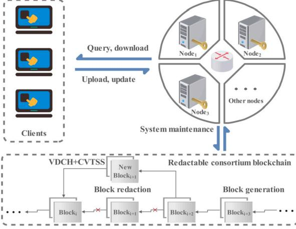
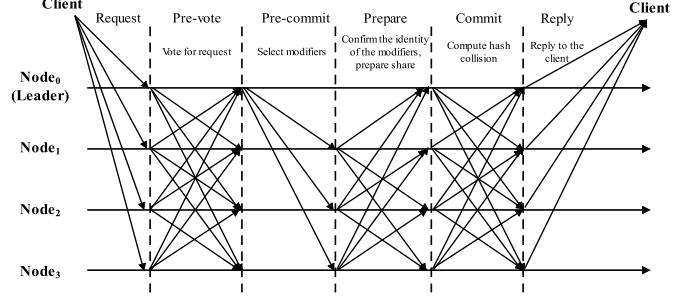
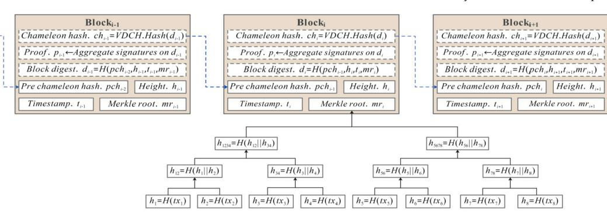
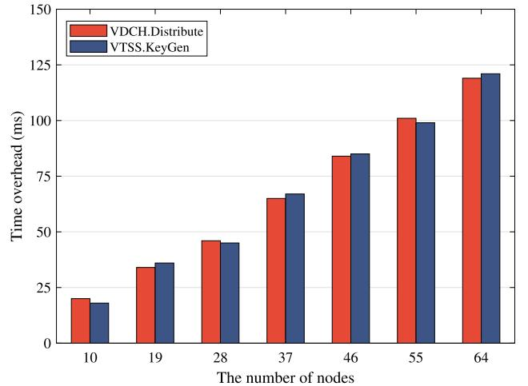
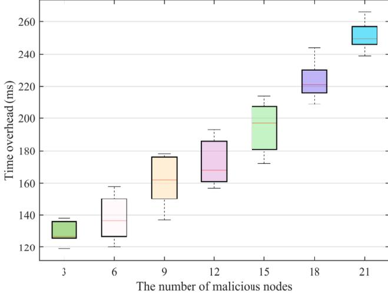
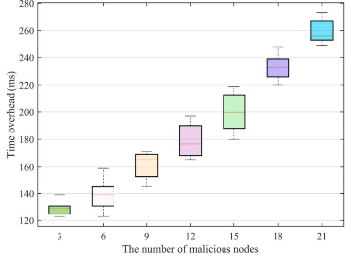
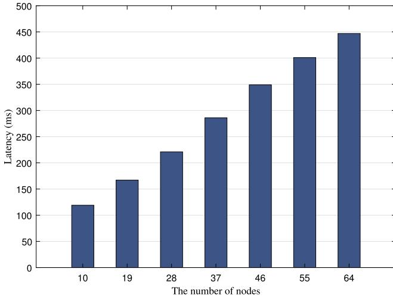
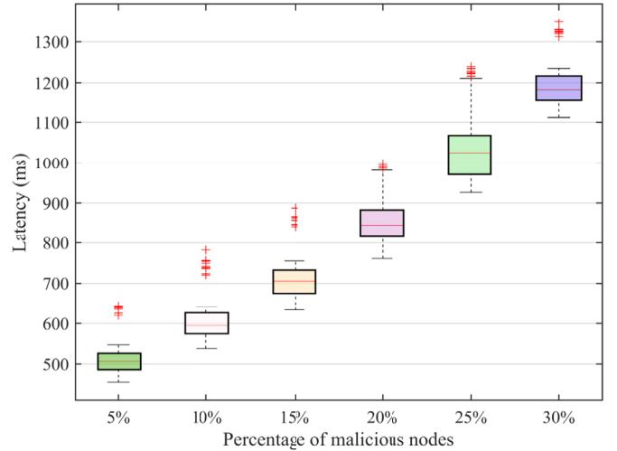
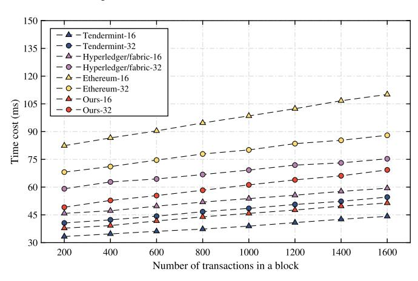

# Redactable consortium blockchain based on verifiable distributed chameleon hash functions

Xiangyu Wu<sup>a</sup>, Xuehui Du<sup>a,\*</sup>, Qiantao Yang<sup>ab</sup>, Na Wang<sup>a</sup>, Wenjuan Wang

# A R T I C L E I N F O A B S T R A C T

### *Keywords:*

Redactable consortium blockchain

Chameleon hash Threshold signature

Zero-knowledge proof

Consensus

With the evolving application demands, the inherent immutability of consortium blockchains hinders their widespread adoption. For example, expired data stored on the chain cannot be deleted, and erroneous data cannot be redacted, seriously limiting the flexibility of consortium blockchains. However, existing redactable blockchain solutions need to be improved in aspects of decentralization, efficiency, and fault tolerance. This paper develops a new verifiable distributed chameleon hash (VDCH) function to solve the above problems. With VDCH, nodes share chameleon keys with a secure multi-party computation protocol based on a verifiable keysharing scheme, and the collision shares can be verified with a Schnorr non-interactive zero-knowledge proof protocol, which enhances the fault tolerance of the consortium chain while maintaining its decentralized nature. Then, this paper proposes a consensus protocol called CVTSS based on verifiable threshold signatures, which provides protocol support for collaborative hash collision computation by multiple nodes using VDCH, thus avoiding the dependence on Nakamoto consensus and improving the redaction efficiency. Meanwhile, CVTSS uses threshold signatures to prevent malicious nodes from tampering with data using one-time chameleon keys. Finally, this paper constructs an efficient, practical, and secure redactable consortium chain scheme based on VDCH and CVTSS. Theoretical analysis and experimental results show that the proposed scheme can operate safely in the presence of malicious nodes with an acceptable time cost.

# **1. Introduction**

With the popularity of bitcoin [\[28](#page-15-0)], Ethereum [[36\]](#page-15-0), and some other derivative technologies [\[1,](#page-14-0)[24](#page-15-0)], more and more researchers attempt to apply blockchain technology into corporate or government business. However, public chains have low efficiency and are resourceconsuming, and private chains need high decentralization to bring the advantages of blockchain technology into play, so public and private chains cannot be applied to many business scenarios. In this case, consortium chain becomes a practical blockchain technology that balances the decentralized features of public chains with the efficiency and privacy of private chains to provide innovation and diversity for businesses in logistics [\[29](#page-15-0)[,15](#page-14-0)], manufacturing [\[25](#page-15-0),[34\]](#page-15-0), and insurance [\[10](#page-14-0),[21\]](#page-14-0).

However, with the development of technology and applications, the immutability of consortium chains adversely affects many businesses mainly in three aspects: ① immutability may be abused for malicious purposes. For example, hackers may post links to undesirable websites on the chain, affecting the healthy growth of youth [\[35](#page-15-0)]. ② An increasing number of applications based on consortium chains require the ability to edit data with certain flexibility. For example, data stored on the chain may contain users' privacy-sensitive information, and users may want to remove their private data from the chain. Also, some useless data must be removed to save storage space on the end device. ③ The introduction of relevant data protection regulations [[31\]](#page-15-0) poses a challenge to the legality of consortium chain applications, as immutability facilitates the dissemination of illegal data [\[30,35\]](#page-15-0). Thus, it is crucial to achieve controlled redaction of data stored on consortium chains in specific situations.

Currently, the implementations of controllable and redactable blockchain can be mainly classified into two categories: ① the scheme based on Nakamoto consensus [\[28](#page-15-0)], ② and the scheme based on the chameleon hash (CH) [\[23\]](#page-14-0) function. In the Nakamoto consensus-based redactable blockchain scheme, nodes rely on standard rules to agree on the final state of the block being redacted, usually through on-chain voting, and if the nodes eventually determine the new state of the block, then the redaction operation is approved by honest nodes. However,

<sup>a</sup> *He'nan Province Key Laboratory of Information Security, He'nan, 450000, China*<sup>1</sup> The ZhengZhou University, No. 97 Wenhua Road, Zhengzhou, He'nan, 450000, China

<sup>\*</sup> Corresponding author.

*E-mail address:* [1378406814@mail.nwpu.edu.cn](mailto:1378406814@mail.nwpu.edu.cn) (X. Du).

**Table 1** Comparisons of redactable blockchain.

| Schemes |         |        | Method          | Setting                | Authority |             | Key protection | Redactor        | Verifiability of |
|---------|---------|--------|-----------------|------------------------|-----------|-------------|----------------|-----------------|------------------|
| DMT19   | [12     | ]      | Voting          | Permissionless         | N/A       |             | N/A            | All users       | N/A              |
| TBMT+21 |         | [32 ]  | Voting          | Permissioned/less      | N/A       |             | N/A            | All users       | N/A              |
| MZ19    | [ 27]   |        | Voting          | Permissionless         | N/A       |             | N/A            | All users       | N/A              |
| AMVA17  | [ 2     | ]      | CH, MPC         | Permissioned/less      | N/A       | ✗           |                | (t,n)-Threshold | ✗                |
| DSSS19  | [ 11]   |        | CH, CP-ABE      | Permissioned/less      | Central   | authority   | ✓              | Authorized      | users N/A        |
| TLL20   | [33 ]   |        | CH, CP-ABE,     | Signature Permissioned | Central   | authority   | ✓              | Authorized      | users N/A        |
|         | MXNH+22 | [ 26 ] | CH, CP-ABE      | Permissioned           | Multiple  | authorities | ✓              | Authorized      | users N/A        |
|         | XNMH+21 | [ 37 ] | CH, Signature   | Permissioned           | Central   | authority   | ✓              | Authorized      | users N/A        |
| JSZL+21 |         | [20]   | CH, Signature   | Permissioned           | Central   | authority   | ✓              | All users       | N/A              |
|         | HZMW+19 | [ 17 ] | CH              | Permissioned           | N/A       |             | ✓              | (t,n)-Threshold | ✗                |
| HZMR+21 |         | [18 ]  | CH, Signature   | Permissioned           | N/A       |             | ✓              | (t,n)-Threshold | ✗                |
| JCHD+22 |         | [19 ]  | CH, MPC         | Permissionless         | N/A       |             | ✓              | All users       | ✗                |
| ZLLY+20 |         | [39]   | CH              | Permissioned           | Central   | authority   | ✓              | (t,n)-Threshold | ✗                |
| ZNXL+21 | [       | 38]    | CH              | Permissioned           | Central   | authority ✗ |                | (t,n)-Threshold | ✓                |
| Ours    |         |        | CH, Voting, MPC | Permissioned           | N/A       |             | ✓              | (t,n)-Threshold | ✓                |

**Key protection:** With multiple users secretly sharing the trapdoor, the solution protects the trapdoor from being exposed during the recovery process.

**Verifiability of shares:** With multiple users secretly sharing trapdoors, the solution can provide the ability to verify the collision share calculated by any user.

this scheme has a high consensus latency and cannot be applied to consortium chain applications that require high efficiency. In CH-based blockchain redactable schemes [\[2,](#page-14-0)[39,](#page-15-0)[17,19](#page-14-0)[,38](#page-15-0),[26\]](#page-15-0), CH is the linchpin for implementing redaction operations. The difference in the general hash function is that the CH has a pair of public and private keys, and the public key is used for calculating the hash value. In the absence of the private key, it is impossible to compute a hash collision in polynomial time, but it is straightforward for the person in charge of the private key to compute a hash collision. Thus, the person who holds the private key can complete the redaction operation without breaking the hash chain.

To sum up, constructing a redactable consortium chain using CH seems to be an optimal solution in terms of efficiency. However, the existing redactable blockchain schemes based on CH suffer from three problems: ① the existing scheme either gives the key of CH to one node for safekeeping or lets multiple nodes split the key into several shares through a secure multi-party computation (MPC) protocol and then each node keeps one share of the key. In the former case, there is a centralization problem contrary to the decentralization concept of the consortium chain. For the latter case, the existing scheme cannot determine among nodes whether their generated collision shares are correct, and if one node gives an incorrect collision share, the security of the scheme cannot be guaranteed. ② An attacker can find the onetime chameleon key [\[8\]](#page-14-0) from the hash collision and uses it to make arbitrary changes to the redacted data, so the consistency of the system cannot be guaranteed. ③ Most existing schemes are implemented on public chains, and they often adopt the Nakamoto consensus protocol, and the consensus efficiency could be higher. As a result, these schemes are not suitable for the consortium chain system that requires high efficiency.

This paper proposes a redactable consortium blockchain scheme based on verifiable distributed chameleon hash functions to address the above issues. The main contributions of this paper are summarized as follows:

- In this paper, a verifiable distributed chameleon hash function VDCH is developed. Nodes share chameleon keys using a secure multi-party computation protocol based on a verifiable keysharing regime, thus preserving the decentralized nature of the consortium chain system. Meanwhile, VDCH computes and verifies chameleon hash collision shares using a Schnorr non-interactive zero-knowledge proof protocol [\[16](#page-14-0)], which allows nodes to verify the correctness of the collision shares with each other without exposing the subkeys, thus improving the fault tolerance of the scheme.

- In this paper, a consensus protocol called CVTSS is designed based on verifiable threshold signatures. The CVTSS provides protocol support for the collaborative computation of chameleon hash collisions by multiple nodes using VDCH, which avoids the dependence on Nakamoto consensus and improves the efficiency of the redaction process. Meanwhile, the CVTSS aggregates the consensus conclusions of multiple nodes for redaction requests into threshold signatures to provide signature proof for the redaction results, which can prevent malicious nodes from abusing one-time chameleon keys to redact blockchain at will.
- This paper proves the security of VDCH and CVTSS through detailed theoretical analysis, establishes a redactable consortium chain scheme based on VDCH and CVTSS, and verifies through simulation experiments that the proposed scheme can complete the modification operation even in the presence of malicious nodes at an acceptable time cost.

It is noteworthy that our proposed VDCH and CVTSS are complementary. Although CVTSS can prevent malicious users from modifying blocks at will, distributing the trapdoor of the chameleon hash function to different nodes can avoid power concentration and potential abuse. Since it is difficult to guarantee that the node alone in charge of the complete chameleon hash trapdoor can perform its duties properly, the node may refuse to compute the appropriate hash collision for selfish interests. Then, in the decentralized management of the chameleon hash trapdoor, CVTSS allows nodes to cooperate in calculating hash collisions in an orderly manner while avoiding malicious tampering.

The rest of the paper is organized as follows: Section 2 summarizes the related works on redactable blockchain in recent years. Then, relevant background knowledge is presented in Section [3](#page-2-0). Sections [4,](#page-3-0) [5](#page-4-0), and [6](#page-10-0) present the framework, design details, and establishment of the redactable consortium chain for the proposed scheme in this paper, respectively. The evaluation results of the proposed scheme are provided in Section [7](#page-11-0). Finally, the paper is concluded in Section [8.](#page-14-0)

### **2. Related work**

According to the technologies behind it, the redactable blockchain can be divided into two types: non-chameleon-hash-based schemes and chameleon-hash-based schemes. The former is generally based on protocols or mechanisms to implement block redaction. The latter applies the chameleon hash function to the blockchain, thereby allowing flexible redaction of blocks without changing the hash value. As shown in Table 1, the current mainstream redactable blockchains are constructed on various CH or consensus voting mechanisms.

<span id="page-2-0"></span>

## 2.1. Non-chameleon-hash-based schemes

Deuber et al. [12] designed two hash chains and stipulated that the nodes in the system ensure the validity of the modified blocks by voting, and then the consistency of the data storage of the nodes across the network is maintained using a proof-of-work consensus protocol. Thyagarajan et al. [32] proposed the Reparo scheme, where the voting mechanism in Reparo is similar to the one designed by Deuber et al. The validity of the modified blocks is determined by node voting, while the system’s consistency is maintained with a distributed database where both old and new blocks are stored for subsequent queries. Marsalek et al. [27] designed a dual-chain architecture, i.e., the original and modified chains, where the original chain preserves the original state of the blocks, and the new state is stored on the redactable chain. The nodes in the system add redacted blocks to the redactable chain by voting. However, the schemes adopting the Nakamoto consensus protocol are less efficient in redaction and consume more computational resources, so they are not suitable for a consortium chain that requires high efficiency and pursues economic benefits.

## 2.2. Chameleon-hash-based schemes

Ateniese et al. [2] creatively used the chameleon hash function instead of the traditional hash function in the blockchain. The hash value is associated with the hash key of the chameleon hash function. When the block data needs to be modified, the trapdoor holder can easily find the correct hash collision. The researchers also proposed to share the trapdoor secretly among network participants to preserve the decentralized property of the blockchain. However, some issues still need to be addressed, e.g., how to reach an agreement between multiple nodes on redaction and how to protect the trapdoor from being exposed after recovery.

To support controlled redaction of blockchain, Derler et al. [11] proposed a variant of chameleon hash function called policy-based chameleon hash (PCH) by introducing an attribute-based encryption method, where the hash value is associated with an access policy and an ephemeral trapdoor (CHET) [6]. Ephemeral trapdoors are distributed through ciphertext-policy attribute-based encryption (CP-ABE) [14], and those entities authorized by a central authority (CA) can modify block data if they satisfy the access policy of the ciphertext. Based on PCH, other options have been investigated to address issues such as difficulty in accountability [33], reliance on authority center [26], K-time redaction [37], and self-management [20] issues. However, the existence of central authorities may lead to centralization problems. Additionally, data modifiers and data owners may collude with each other and cooperate to find suitable hash collisions using CHET’s ephemeral trapdoor and long-term trapdoor.

To avoid the authority centralization to modify blocks, sharing the trapdoor secretly among participants is an effective solution. In this regard, Huang et al. [17] applied the threshold chameleon hash to the blockchain to distribute the redaction authority to multiple authorized nodes. In a follow-up paper in 2021, the researchers constructed a redactable blockchain called SRB [18] supporting updatability and anonymity by designing a linkable-and-redactable ring signature that optimizes the distribution and management of trapdoors. Jia et al. [19] designed a more flexible distributed CH and proposed to use RSA accumulator technology to verify blockchain consistency efficiently. Zhang et al. [39] proposed a redactable blockchain based on CH to address the issue of distributed management of data in the edge computing architecture. Zhang and Ni et al. [38] proposed a redactable blockchain based on the threshold chameleon hash, which relies on the key center to complete key distribution and then uses smart contracts to realize key verification and aggregation, effectively solving the problem of industrial data security management.

## 3. Background

### 3.1. Gap Diffie-Hellman group

Let  $G$  be a cyclic multiplicative group generated by  $g$ , whose order is a large prime  $q$ . Three problems are defined on  $G$ :

**Definition 1** (*Discrete logarithm (DL) problem*). Given  $g^a \in G$ , where  $a \leftarrow_R Z_q^*$ , compute  $a$ .

**Definition 2** (*Computation Diffie-Hellman (CDH) problem*). Given  $g, g^a, g^b \in G$ , where  $a, b \leftarrow_R Z_q^*$ , compute  $g^{ab}$ . An algorithm  $\mathcal{A}$  is said to solve the CDH problem with an advantage  $\varepsilon$  if  $\mathbf{Adv}_G^{\text{CDH}}(\mathcal{A}) = \mathbf{Pr}[\mathcal{A}(g, g^a, g^b) = g^{ab}] \geq \varepsilon$ , where the probability  $\varepsilon$  is taken over the random choices of  $a$  and  $b$  that  $\mathcal{A}$  makes.

**Definition 3** (*Decision Diffie-Hellman (DDH) problem*). Given  $g, g^a, g^b, g^c \in G$ , where  $a, b, c \leftarrow_R Z_q^*$ , to determine whether the equation  $c = ab$  holds.

 $G$  can be considered a Gap Diffie-Hellman (GDH) group if no algorithm on  $G$  can solve the CDH problem in polynomial time, but there exists an algorithm  $\mathcal{A}$  that can solve the DDH problem in polynomial time with non-negligible probability.

### 3.2. Chameleon hash function

The chameleon hash function has a pair of public and private keys. It is collision-resistant for those who do not have the private key, while the key holder can efficiently compute the hash collision. A typical chameleon hash function consists of the following five algorithms:

1. 1. *Setup*. The *Setup* algorithm takes a security parameter  $\lambda$  as input and obtains the public parameter  $params \leftarrow \text{Setup}(1^\lambda)$ . For convenience,  $params$  is assumed to be the implicit input to all other algorithms.
2. 2. *KeyGen*. The *KeyGen* algorithm takes the public parameter  $params$  as input and outputs a pair of public and private keys for the hash function:  $(sk, pk) \leftarrow \text{KeyGen}(params)$ .
3. 3. *CHash*. Given a message  $m$ ,  $m$  and  $pk$  are then used as input to the *CHash* algorithm, which outputs the chameleon hash of  $m$ :  $(h, r) \leftarrow \text{CHash}(m, pk)$ , where  $r$  is randomness.
4. 4. *CCheck*. *CCheck* is a deterministic algorithm to verify the correctness of the chameleon hash value. Given the message  $m$ , the corresponding hash  $(h, r)$ , and the public key  $pk$ , it outputs the verification result  $d \leftarrow \text{CCheck}(pk, m, h, r)$ , where  $d \in \{0, 1\}$ , and  $d = 1$  if the verification is successful.
5. 5. *Adapt*. The *Adapt* algorithm takes the private key  $sk$ , the new message  $m'$ , the old message  $m$ , and the corresponding hash  $(h, r)$  as input, and it outputs a new randomness  $r' \leftarrow \text{Adapt}(sk, m, h, r, m')$ .

For the chameleon hash function, its correctness holds provided that for any  $\lambda \in \mathbb{N}$  and all  $m, m' \in M$ , the equation  $\text{CCheck}(pk, m, h, r) = \text{CCheck}(pk, m', h, r') = 1$  always holds.

### 3.3. Schnorr non-interactive zero-knowledge proof protocol

The Schnorr non-interactive zero-knowledge (SNIZK) proof protocol enables the prover to prove to the verifier that he has the secret value without exposing it. In this paper, SNIZK is adopted to verify the correctness of the collision shares computed by nodes in the VDCH which is designed in Section 5.1. Here, SNIZK will be briefly reviewed.

The prover and verifier agree on the system parameters  $(G, g, q, H)$ , where  $q$  is a large prime,  $G$  is a cyclic multiplicative group generated by  $g$  with an order of  $q$ , and  $H$  is a one-way hash function. The prover

<span id="page-3-0"></span>

Fig. 1. Framework of redactable consortium blockchain.

chooses a random  $x$  from  $G$  as his private key and then broadcasts  $y = g^x$  as his public key. Then, the verifier has to verify that the prover has  $x$  without knowing what  $x$  is.

First, the prover chooses a random value  $r$  from  $G$  and computes  $R = g^r$ ,  $c = H(R, y)$ , and  $s = xc + r$  in turn. Finally, the prover sends  $(R, s)$  to the verifier. The verifier computes  $e = H(R, y)$  and verifies that the provers know  $x$  by determining whether the equation  $R = g^s y^{-e}$  holds. The correctness can be proved by Equation (1).

$$R = g^s y^{-e} = g^{xH(R,y)+r-xH(R,y)} = g^r = R \quad (1)$$

Note that in the above process, the  $c$  given by the prover is computed by the hash function, and since the output values of the one-way hash function will be uniformly distributed over an integer domain, the prover needs to generate the commitment  $R$  before predicting  $c$ . Thus, the provers could not fool the verifier by designing  $c$ .

## 4. Overview

### 4.1. System model

Fig. 1 presents the overall framework of the redactable consortium blockchain scheme designed in this paper. There are two types of entities in the whole system: consortium chain nodes and clients, and their functions are described in detail below.

- • The consortium chain nodes expose various interfaces to the outside, such as query and request interfaces, for clients to interact with the blockchain. Meanwhile, the nodes are responsible for collecting transactions, validating transactions, packaging transactions, executing chameleon hash functions, and running consensus protocols (e.g., tendermint [4]) to generate new blocks. When a client sends a request to redact the blockchain, the nodes start to reach an agreement on the request through the CVTSS protocol designed in Section 5.2. Then, a certain number of nodes are selected to use VDCH designed in Section 5.1 to compute the hash collision of the new block, and feedback on the result to the client.
- • The client is a device authenticated by the blockchain system, and it can send transactions to the nodes, and query historical transactions. Besides, it can send requests to the system to redact the block.

### 4.2. Threat assumptions

In terms of security, this paper assumes that the attacker has the following capabilities:

- • The attacker can intercept the messages sent between the nodes in the network but cannot break the encryption and signature regimes, so it cannot successfully tamper with the messages sent by the nodes.
- • The attacker can control some of the nodes in the system, but the number of nodes that can be controlled does not exceed the threshold.
- • The attacker can solve the DDH problem in polynomial time but cannot solve the DL and CDH problems.

### 4.3. Definitions of VDCH

**Definition 4.** The proposed verifiable distributed chameleon hash function (VDCH) consists of the following eight algorithms:

1. 1.  $param_{VDCH} \leftarrow VDCH.Setup(\lambda)$ : On input the security parameter  $\lambda$  and output the system parameters  $param_{VDCH}$ .
2. 2.  $(\ell_i, x_i, X_i) \leftarrow VDCH.Distribute(param_{VDCH}, t)$ : On input system Any node  $i$  takes the system parameters  $param_{VDCH}$  as input, and runs the algorithm to output its own private key component  $\ell_i$ , secret value  $x_i$  and identifier  $X_i$ .
3. 3.  $(pk_i, sk_i, hk) \leftarrow VDCH.KeyGen(\{X_i\}_{i=1}^t)$ : Without loss of generality, assuming that the first  $t$  nodes are selected to execute the KeyGen algorithm. Any node  $i$  takes the identifiers  $\{X_i\}_{i=1}^t$  of the selected nodes as input, and runs the algorithm to output its own public-private key pair  $pk_i, sk_i$  and the hash key  $hk$  of VDCH.
4. 4.  $(h, a, r) \leftarrow VDCH.Hash(m, hk)$ : On input message  $m$  and hash key  $hk$ , output chameleon hash  $h$ , customized identity  $a$  and chameleon randomness  $r$ .
5. 5.  $(s_i, d_i, \tau_i) \leftarrow VDCH.ShareGen(m, m', a, sk_i, x_i)$ : Any selected node  $i$  takes the old message  $m$ , new message  $m'$ , private key  $sk_i$  and secret value  $x_i$ , and then runs the algorithm to output the collision share  $(s_i, d_i, \tau_i)$ .
6. 6.  $\{0, 1\} \leftarrow VDCH.ShareVer(m, m', s_i, d_i, X_i, \tau_i)$ : On input old message  $m$ , new message  $m'$ , collision share  $(s_i, d_i, \tau_i)$  generated by node  $i$  and its identifier  $X_i$ , output 0 or 1.
7. 7.  $r' \leftarrow VDCH.Adapt(\{\tau_i, d_i\}_{i=1}^t, m, m', r)$ : On input the collision shares  $\{\tau_i, d_i\}_{i=1}^t$  generated by selected  $t$  nodes, and new message  $m'$ , old message  $m$  and the old chameleon randomness  $r$ , output a new chameleon randomness  $r'$ .
8. 8.  $\{0, 1\} \leftarrow VDCH.ColVer(r, m, r', m')$ : On input old message  $m$ , old chameleon randomness  $r$ , new message  $m'$ , new chameleon randomness  $r'$ , output 0 or 1.

### 4.4. Definitions of verifiable threshold signature scheme in CVTSS

**Definition 5.** The verifiable threshold signature scheme (VTSS) in our proposed CVTSS consists of the following seven algorithms:

1. 1.  $param_{VTSS} \leftarrow VTSS.Setup(\lambda)$ : Input the security parameter  $\lambda$  and output the system parameters  $param_{VTSS}$ .
2. 2.  $(x_i, y_i, y) \leftarrow VTSS.KeyGen(param_{VTSS})$ : On input system parameters  $param_{VTSS}$ , outputs node's public-private key pair  $(x_i, y_i)$  and the public key  $y$  of VTSS.
3. 3.  $h \leftarrow VTSS.Hash(m)$ : On input message  $m$ , output hash value  $h$ .
4. 4.  $(i, \sigma_i, h) \leftarrow VTSS.Sign(m, x_i)$ : On input message  $m$  and private key  $x_i$  of node  $i$ , output the tuple  $(i, \sigma_i, h_i)$  which consists of the number  $i$  of node  $i$ , sub-signature  $\sigma_i$  and the hash value  $h$  of  $m$ .
5. 5.  $\{0, 1\} \leftarrow VTSS.VerSig(i, \sigma_i, m)$ : On input sub-signature  $(i, \sigma_i)$  generated by node  $i$  and message  $m$ , output 0 or 1.
6. 6.  $\sigma \leftarrow VTSS.AggSig(\{i, \sigma_i\}_{i=1}^k, m)$ : Without loss of generality, assuming that the first  $k$  nodes generate sub-signatures, where  $t \leq k \leq n$ . On input  $\{\{1, \sigma_1\}, \dots, \{k, \sigma_k\}\}$ , output complete signature  $\sigma$ .
7. 7.  $\{0, 1\} \leftarrow VTSS.VerCmp(y, \sigma, m)$ : On input public key  $y$  of VTSS, signature  $\sigma$  and message  $m$ , output 0 or 1.

<span id="page-4-0"></span>

```
 $\forall \lambda, \forall \text{param}_{\text{VDCH}} \leftarrow \text{VDCH.Setup}(\lambda),$ 
 $\forall n \text{ and } \{\{\ell_1, x_1, X_1\}, \dots, \{\ell_n, x_n, X_n\}\},$  where  $\{\ell_i, x_i, X_i\} \leftarrow \text{VDCH.Distribute}(\text{param}_{\text{VDCH}})$  for  $(1 \leq i \leq n),$ 
without loss of generality,  $\forall k, \{\{sk_1, pk_1\}, \dots, \{sk_k, pk_k\}\},$  where  $\{sk_i, pk_i\} \leftarrow \text{VDCH.KeyGen}(\{X_i\}_{i=1}^k)$  and  $k \geq \text{threshold},$  and  $(sk, hk) \leftarrow \text{Lagrange interpolation on } \{\{\ell_1\}, \dots, \{\ell_k\}\},$ 
 $\forall m, (m, r, h, \alpha) \leftarrow \text{VDCH.Hash}(m, hk),$ 
 $\forall m' \text{ and } D = \{\{d_1, \tau_1\}, \dots, \{d_t, \tau_t\}\},$  where  $(s_i, d_i, \tau_i) \leftarrow \text{VDCH.ShareGen}(m, m', \alpha, sk_i, x_i)$  for  $(1 \leq i \leq t),$ 
 $r' \leftarrow \text{VDCH.Adapt}(D, m, m', r),$ 
 $\text{VDCH.ShareVer}(m, m', s_i, d_i, X_i, \tau_i) = 1 \text{ for } (1 \leq i \leq t) \text{ and } \text{VDCH.ColVer}(r, m, r', m') = 1.$
```

Fig. 2. Definition of correctness of VDCH.

#### 4.5. Security requirements

In this section, we give security requirements for our VDCH and CVTSS.

##### 4.5.1. Security requirements of VDCH

A secure verified distributed chameleon hash should satisfy the following properties.

**Verifiability:** Our proposed VDCH should satisfy verifiability defined as below. It describes that the collision shares calculated by any nodes can be verified.

**Correctness:** Our proposed VDCH should satisfy correctness defined as in Fig. 2. It describes that any properly computed chameleon hash and chameleon hash collision share should pass verification successfully.

**Collision-resistance:** Collision-resistance satisfies the property: for all probabilistic polynomial-time (PPT) adversary  $\mathcal{A}$ , even if they are granted with access to random oracle  $\mathcal{O}_H$  and adaption oracle  $\mathcal{O}_{\text{Adapt}}$ , no adversary can generate a valid collision (never has been queried before). Our proposed VDCH is collision resistant if for any adversary  $\mathcal{A}$  against VDCH, we have the probability  $\Pr[\text{CollRes}_{\mathcal{A}}^{\lambda}] = 1 \leq \varepsilon(\lambda)$  in the experiment  $\text{CollRes}_{\mathcal{A}}^{\lambda}$  defined below where the symbol  $\varepsilon(\lambda)$  denotes a negligible function and  $\lambda$  is the security parameter.

```
Experiment: CollRes $_{\mathcal{A}}^{\lambda}.$ 
 $\text{param}_{\text{VDCH}} \leftarrow \text{VDCH.Setup}(\lambda);$ 
 $\{(\ell_i, x_i)\}_{i=1}^n \leftarrow \text{VDCH.Distribute}(\text{param}_{\text{VDCH}});$ 
 $(sk_i, pk_i, sk, hk) \leftarrow \text{VDCH.KeyGen}(\{X_i\}_{i=1}^{\ell_i});$ 
 $(m^*, r^*, m^{**}, r^{**}) \leftarrow \mathcal{A}^{\mathcal{O}_{\text{Adapt}}, \mathcal{O}_H}(hk);$ 
Return 1 if VDCH.ColVer( $r^*, m^*, r^{**}, m^{**}) = 1 \wedge$ 
 $m^* \neq m^{**} \wedge$  never queried the collision on  $m^*,$ 
else return 0.
Oracle  $\mathcal{O}_H(m):$ 
 $\varepsilon \leftarrow H_1(m, ts);$ 
 $\alpha \leftarrow H_0(\varepsilon, hk);$ 
 $h \leftarrow g^{\varepsilon} \alpha^{H_1(m)};$ 
Return  $(m, \varepsilon, \alpha, h).$ 
Oracle  $\mathcal{O}_{\text{Adapt}}(h, m, r, m'):$ 
 $r' \leftarrow \text{VDCH.Adapt}(h, m, r, m');$ 
Return  $r'.$
```

Note, collision-resistance is a definition identical to key-exposure freeness, since the exposure of the key means that any collision can be found.

```
 $\forall \lambda, \text{param}_{\text{VTSS}} \leftarrow \text{VTSS.Setup}(\lambda),$ 
 $\forall n, \{\{x_1, y_1\}, \dots, \{x_n, y_n\}\}$  where  $\{x_i, y_i\} \leftarrow \text{VTSS.KeyGen}(\text{param}_{\text{VTSS}})$  for  $(1 \leq i \leq n),$  and without loss of generality,  $(x, y) \leftarrow \text{Lagrange interpolation on } \{\{x_1, y_1\}, \dots, \{x_k, y_k\}\},$  where  $k \geq t,$ 
 $\forall k, \forall m \text{ and } L = \{\{1, \sigma_1\}, \dots, \{k, \sigma_k\}\}$  where  $\{i, \sigma_i, h\} \leftarrow \text{VTSS.Sign}(m, x_i)$  for  $(1 \leq i \leq k)$  and  $k \geq t,$ 
 $\sigma \leftarrow \text{VTSS.AggSig}(L, m),$ 
 $\text{VTSS.VerSig}(i, \sigma_i, m) = 1 \text{ for } (i, \sigma_i) \in L \text{ and } \text{VTSS.VerCmp}(y, \sigma, m) = 1.$
```

Fig. 3. Definition of correctness of VTSS.

**Correctness:** Our proposed VTSS should satisfy correctness defined as in Fig. 3. It describes that any generated signatures should pass verification successfully.

**Unforgeability:** For digital signatures, the well-known security notion is unforgeable against chosen-message attack (UF-CMA) presented by Goldwasser et al. [13]. Therefore, with respect to the unforgeability of threshold signature schemes, we will define it alone the same lines. In the random oracle model, we suppose the efficient adversary  $\mathcal{A}$  can corrupt and control at most  $t-1$  nodes  $(n_1^*, \dots, n_{t-1}^*)$ , and  $\mathcal{A}$  is also allowed to access to the signing oracle  $\mathcal{O}_S$  and the random oracle  $\mathcal{O}_H$ . In the end, the adversary  $\mathcal{A}$  returns a new valid signature  $\sigma^*$  on message  $m^*$ . There is natural restriction that the signature  $\sigma^*$  has not been obtained from  $\mathcal{O}_S$  before. We consider the following experiment  $\text{UF-CMA}_{\mathcal{A}}^{\lambda}$ , where  $\mathcal{A}$  is an UF-CMA adversary against VTSS and  $\lambda$  is the security parameter.

```
Experiment: UF-CMA $_{\mathcal{A}}^{\lambda}.$ 
 $\text{param}_{\text{VTSS}} \leftarrow \text{VTSS.Setup}(\lambda);$ 
 $\{(x_i, y_i)\}_{i=1}^n \leftarrow \text{VTSS.KeyGen}(\text{param}_{\text{VTSS}});$ 
 $(x, y) \leftarrow \text{Lagrange interpolation on } \{\{x_1, y_1\}, \dots, \{x_k, y_k\}\}$ 
for  $\forall k \geq t;$ 
 $(\sigma^*, m^*) \leftarrow \mathcal{A}^{\mathcal{O}_H, \mathcal{O}_S}(\text{corrupt } n_1^*, \dots, n_{t-1}^*);$ 
Return 1 if VTSS.VerCmp( $y, \sigma, m^*$ ) = 1  $\wedge$  never queried
the signature on  $m^*,$  else return 0.
Oracle  $\mathcal{O}_H(m):$ 
 $h \leftarrow H(m);$ 
Return  $h.$ 
Oracle  $\mathcal{O}_S(m, x):$ 
 $\sigma \leftarrow H(m)^*;$ 
Return  $\sigma.$
```

We then define the success probability of  $\mathcal{A}$  via  $\text{Succ}^{\text{UF-CMA}_{\mathcal{A}}^{\lambda}} = \Pr[\text{UF-CMA}_{\mathcal{A}}^{\lambda} = 1].$ 

## 5. The proposed VDCH and CVTSS

The proposed VDCH preserves the decentralized nature of the blockchain by delegating the redaction authority to multiple nodes, and the verifiability of the hash collision share improves the fault tolerance of the system. The proposed CVTSS enables multiple nodes to collaboratively compute hash collision using VDCH. Meanwhile, CVTSS aggregates the consensus conclusions of nodes for redaction requests into threshold signatures to prove the redaction results, thus resolving the problems caused by one-time key exposure. The two core technologies mentioned above are described in detail in the following.

### 5.1. Verifiable distributed chameleon hash functions

#### 5.1.1. Construction of VDCH

1. 1.  $\text{param}_{\text{VDCH}} \leftarrow \text{VDCH.Setup}(\lambda)$ : Each node  $P_i (i = 1, \dots, n)$  executes the  $\text{Setup}$  algorithm with the security parameters  $\lambda$  as input to obtain the system parameters  $\text{param}_{\text{VDCH}} = (G, q, g, H_0, H_1)$ , where  $q$  is a large prime, and  $G$  is a GDH group generated by  $g$ , whose order is

 $q$ .  $H_0 : \{0, 1\}^* \rightarrow G$  and  $H_1 : \{0, 1\}^* \rightarrow Z_q^*$  are collision-resistant hash functions. The following algorithms take  $param_{VDCH}$  as the default input for convenience.

1. $(\ell_i, x_i, X_i) \leftarrow VDCH.Distribute(param_{VDCH})$ : Each node  $P_i (i=1, \dots, n)$  constructs a random  $(t-1)$ -degree polynomial  $f_i(x) = \sum_{k=0}^{t-1} a_{i,k} x^k$ , where  $a_{i,k} \leftarrow R_q^*$  is kept secret by  $P_i$ . Then, the verification message  $c_{i,k} = g^{a_{i,k}}(k=0, \dots, t-1)$  and identifier  $X_i = g^{f_i(i)}$  are broadcasted, where  $x_i = f_i(i)$  is kept as a secret value.  $P_i$  computes the secret shares  $\ell_{i \rightarrow j} = f_i(X_j)$  for the remaining nodes  $P_j (j \in \{1, \dots, n\} \setminus \{i\})$  in the system and sends them to  $P_j$  via a secret channel, where  $\ell_{i \rightarrow i} = f_i(X_i)$  is kept secret by  $P_i$ . After  $P_i$  receives the secret shares  $\ell_{j \rightarrow i} (j \in \{1, \dots, n\} \setminus \{i\})$  from other nodes, it verifies the correctness of the secret shares by checking whether the equation  $g^{\ell_{j \rightarrow i}} = \prod_{k=0}^{t-1} (c_{j,k})^{X_i^k}$  holds, and if the secret shares are not correct, it reports to the system, requests to remove the node  $P_j$ , and lets  $n = n - 1$ . Under normal circumstances, the private key component  $\ell_i = \sum_{j=1}^n \ell_{j \rightarrow i}$  is calculated. Finally,  $sk = \sum_{i=1}^n f_i(0)$  and  $g^{sk}$  are taken as the private and public keys of VDCH. Note that any ( $\geq t$ ) nodes can recover  $sk$  by contributing their private key components  $\ell$  using Lagrangian interpolation.
2. $(pk_i, sk_i, hk) \leftarrow VDCH.KeyGen(\{X_i\}_{i=1}^t)$ : Without loss of generality, assuming that the first  $t$  nodes  $P_1, \dots, P_t$  are selected, and their identifiers  $\{X_1, \dots, X_t\}$  are used as input to the KeyGen algorithm. Node  $P_i (i=1, \dots, t)$  computes its private key  $sk_i = \ell_i \cdot \prod_{j=1, j \neq i}^t \frac{-X_j}{X_i - X_j}$ , and the corresponding public key is  $pk_i = g^{sk_i}$ , which is broadcasted to the network. Any node  $P_i$  can compute the hash key  $hk = \prod_{k=1}^t pk_k = g^{(sk_1 + \dots + sk_t)}$  of VDCH after receiving the public keys of  $t$  nodes. Correspondingly, the trapdoor is  $sk = sk_1 + \dots + sk_t$ , which is not visible to any node.
3. $(h, r) \leftarrow VDCH.Hash(m, hk)$ : Given a message  $m$ , the node first computes  $\varepsilon = H_1(m, ts)$ , where  $ts$  represents the timestamp, indicating the time when the message  $m$  arrives at the system. Then, the node computes the custom identifier  $\alpha = H_0(\varepsilon, hk)$  and the random value  $r = (\alpha, g^\varepsilon, hk^\varepsilon)$ , which prevents the trapdoor of VDCH from being compromised [9]. Finally,  $h = g^\varepsilon \alpha^{H_1(m)}$  is computed, and  $(m, r, h)$  is used as the chameleon hash of the message  $m$ .
4. $(s_i, d_i, \tau_i) \leftarrow VDCH.ShareGen(m, m', \alpha, sk_i, x_i)$ : Without loss of generality, assuming that the first  $t$  nodes  $P_1, \dots, P_t$  are selected to compute the hash collision of  $(m, r, h, \alpha)$ . Given an old message  $m$ , a new message  $m'$ , and a customized identity  $\alpha$ .  $P_i (i=1, \dots, t)$  computes  $s_i = sk_i \cdot (H_1(m) - H_1(m')) + x_i$  and  $d_i = \alpha^{s_i}$ , where  $x_i$  is the secret value generated by  $P_i$ . Then, let  $\tau_i = \alpha^{x_i}$ , and finally,  $(s_i, d_i, \tau_i)$  is taken as the collision share.
5. $\{0, 1\} \leftarrow VDCH.ShareVer(m, m', s_i, d_i, X_i, \tau_i)$ : Any node can verify the collision share  $(s_i, d_i, \tau_i)$  calculated by  $P_i (i \in \{1, \dots, n\})$ . First, it is checked whether the equations  $X_i = g^{s_i} pk_i^{(H_1(m') - H_1(m))}$  and  $d_i = \alpha^{s_i}$  hold. If they hold, then, continue to check whether  $(g, X_i, \alpha, \tau_i)$  is a legal Diffie-Hellman tuple. If it is, the algorithm outputs 1; otherwise, it outputs 0, indicating that the collision share of  $P_i$  is wrong.
6. $r' \leftarrow VDCH.Adapt(\{\tau_i, d_i\}_{i=1}^t, m, m', r)$ : Assuming that the collision shares provided by nodes  $P_1, \dots, P_t$  are correct, node  $P_i (i=1, \dots, t)$  computes  $e = \prod_{i=1}^t d_i \cdot (\prod_{i=1}^t \tau_i)^{-1} = \alpha^{(sk_1 + \dots + sk_t)(H_1(m) - H_1(m'))}$  and then computes  $r' = (g^{e'}, hk^{e'}) = (g^\varepsilon \cdot \alpha^{(H_1(m) - H_1(m'))}, hk^\varepsilon \cdot e)$ , and  $r'$  is taken as the output of the algorithm.  
    $\alpha^{sk} = hk^{(e' - \varepsilon)(H_1(m) - H_1(m'))^{-1}}$  can be considered as a one-time chameleon key, and given a new message  $m''$ , a new hash collision can be computed with the one-time chameleon key:  $r'' = (g^\varepsilon \cdot \alpha^{(H_1(m) - H_1(m''))}, hk^\varepsilon \cdot \alpha^{sk(H_1(m) - H_1(m''))})$ . To address this issue, Ateniese et al. [2] constructed a generic transformation from a public-coin chameleon hash function with enhanced collision resistance. However, this scheme is incomplete because the witness used in the hash function may not be the same as the content being encrypted. The PCH designed by Derler et al. [11] can also solve the one-time key exposure issue, but their scheme needs to rely on a strongly trusted third party. Section 5.2 describes how to

use threshold signatures to solve the problems posed by one-time keys. Compared to the scheme [2], our approach is sound, and its security is based on the unforgeability of the signature, which is pointed out in Section 4.5.2 and proven in Section 5.2.4.

1. $0, 1 \leftarrow VDCH.ColVer(r, m, r', m')$ : To verify the given pair of hash collision  $(r, m, r', m')$ , first, check whether the equation  $g^{e'} \alpha^{H_1(m')} = g^\varepsilon \alpha^{H_1(m)}$  holds, then, verify whether  $(g, hk, g^{e'}, hk^{e'})$  is a legal Diffie-Hellman tuple. If all the above verifications pass, then the hash collision calculation is successful, and the algorithm outputs 1; otherwise, it outputs 0.

### 5.1.2. Security analysis

**Verifiability:** We show verifiability of our VDCH as follows.

Firstly, the identifier  $X_i$  of any node  $P_i (i=1, \dots, n)$  should be verifiable. After any node  $P_i (i=1, \dots, n)$  constructs a  $(t-1)$ -degree polynomial  $f_i(x)$  that only he knows, the node computes and broadcasts his identifier  $X_i = g^{f_i(i)}$ . Once other nodes receive the identifier of  $P_i$ , they will verify its correctness with the equation  $\prod_{k=0}^{t-1} c_{i,k}^{i^k} = X_i$ .

Then, the public key of any node should be verifiable. After any node  $P_i (i=1, \dots, n)$  broadcasts the verification information  $c_{i,k} (k=1, \dots, t-1)$  to the whole network, the nodes in the network can check the consistency of  $c_{i,k} (k=1, \dots, t-1)$  by comparing with each other. Therefore,  $P_i$  cannot forge the private key share  $\ell_{i \rightarrow j}$  of other nodes  $P_j (j=1, \dots, n)$ . Thus, after receiving the public key sent by  $P_j (j=1, \dots, t)$ , any honest node can perform verification in the following steps: first, calculate  $u_j = \prod_{i=1, i \neq j}^t \frac{-X_j}{X_j - X_i}$  ( $u_j$  is unique), then calculate  $w_j = \prod_{i=1}^n (\prod_{k=0}^{t-1} c_{i,k}^{i^k})$ , and then check whether Equation  $w_j^{u_j} = pk_j$  holds. If it holds, the public key sent by  $P_j$  is correct; otherwise, it is incorrect. The following equation can prove the correctness of the above verification process:

$$\begin{aligned} w_j^{u_j} &= \left( \prod_{i=1}^n \left( \prod_{k=0}^{t-1} c_{i,k}^{i^k} \right) \right) \prod_{i=1, i \neq j}^t \frac{-X_j}{X_j - X_i} \\ &= g^{\left( \sum_{i=1}^n (a_{i,0} X_i^0 + \dots + a_{i,t-1} X_i^{t-1}) \right) \cdot \prod_{i=1, i \neq j}^t \frac{-X_j}{X_j - X_i}} \\ &= g^{\sum_{i=1}^n f_i(X_j) \cdot \prod_{i=1, i \neq j}^t \frac{-X_j}{X_j - X_i}} \\ &= g^{\ell_j \cdot \prod_{i=1, i \neq j}^t \frac{-X_j}{X_j - X_i}} \\ &= pk_j \end{aligned}$$

Finally, the correctness of the collision shares calculated by other nodes can be verified. The correctness of the collision share  $(s_i, d_i, \tau_i)$  sent by node  $P_i (i=1, \dots, n)$  is proven as follows: first, the verifier computes  $X'_i = g^{s_i} pk_i^{(H_1(m') - H_1(m))}$  and verifies it by the Equation (2).

$$Ver(pk_i, (s_i, d_i, \tau_i), m, m') = True \Leftrightarrow X'_i = X_i \quad (2)$$

Its correctness can be proven by the following equation:

$$\begin{aligned} X'_i &= g^{s_i} pk_i^{(H_1(m') - H_1(m))} \\ &= g^{sk_i(H_1(m) - H_1(m')) + x_i + sk_i(H_1(m') - H_1(m))} \\ &= g^{x_i} = X_i \end{aligned}$$

 $X_i$  and  $pk_i$  are not forgeable, so the correctness of  $s_i$  can be verified in the above way. Meanwhile, since  $\alpha$  is public, the correctness of  $d_i$  can be verified by checking whether equation  $d_i = \alpha^{s_i}$  holds. For  $\tau_i$ , the correct  $\tau_i$  should be equal to  $\alpha^{x_i}$ , and  $\alpha = H_0(\omega, hk)$  is an element in the GDH group  $G$ , so  $\alpha$  can be represented by  $g^\Delta$ , where  $\Delta$  is a fixed value. Therefore, the correctness of  $\tau_i$  can be verified by determining whether  $(g, g^{x_i}, g^\Delta, g^{\Delta x_i})$  is a legal Diffie-Hellman tuple, and this is equivalent to solving the DDH problem on the GDH group.

**Correctness:** The correctness of the hash collision of VDCH can be proved by Equation (3).

$$g^{e'} \alpha^{H_1(m')} = g^\varepsilon \alpha^{(H_1(m) - H_1(m'))} \alpha^{H_1(m')} = g^\varepsilon \alpha^{H_1(m)} \quad (3)$$

<span id="page-6-0"></span>**Collision-resistance:** Suppose  $\mathcal{A}$  is a PPT adversary against the collision-resistance of VDCH. Next, we show how to construct an algorithm  $B$  that uses  $\mathcal{A}$  to solve CDH problem with non-negligible probability.

At setup stage,  $B$  runs VDCH. Setup to get  $param_{VDCH}$ , and randomly generates  $n$  private key components  $\{\ell_i\}_{i=1}^n$  and  $t$  public-private key pairs  $\{(sk_i, pk_i)\}_{i=1}^t$ , and then generates trapdoor key  $sk$  and public key  $hk = g^{sk}$ .  $B$  sends  $param_{VDCH}$  and  $hk$  to  $\mathcal{A}$ , and controls random oracle  $\mathcal{O}_H$  and adaption oracle  $\mathcal{O}_{Adapt}$  queries.  $B$  constructs lists  $L_H$  and  $L_C$  for storing  $\mathcal{O}_H$  and  $\mathcal{O}_{Adapt}$  queries, respectively.  $B$  randomly selects a guess value  $j$  within the limit of the number of queries  $\mathcal{A}$  is allowed to make, the result of  $\mathcal{A}$ 's  $j$ th query to  $\mathcal{O}_H$  will be used in the challenge phase.  $B$  then chooses another random value  $q_0 \in G$  ( $q_0$  can be considered to be equivalent to  $g^{b'}$  and  $b' \in Z_q^*$  is an unknown number), which is used to simulate the hash function  $H_0$ .

1. 1)  $\mathcal{O}_H$  query stage: The adversary  $\mathcal{A}$  can make an  $\mathcal{O}_H$  query at any stage other than the challenge stage, and if the query  $m_i$  of  $\mathcal{A}$  is already in  $L_H$ ,  $B$  sends the result recorded in  $L_H$  directly back to  $\mathcal{A}$ , otherwise,  $B$  randomly selects  $b_i, \bar{b}_i \leftarrow Z_q^*$ , and lets  $H_1(m_i, ts) = b_i$  and  $H_1(m) = \bar{b}_i$ , where  $ts$  denotes the timestamp at the time of the query. If this is  $\mathcal{A}$ 's  $j$ th query to  $\mathcal{O}_H$ , i.e.  $i = j$ ,  $B$  computes  $\alpha_i = H_0(b_i, hk) = q_0^{b_i}$ , otherwise, computes  $\alpha_i = H_0(b_i, hk) = hk^{b_i}$  (since  $b_i$  is uniformly distributed on  $Z_q^*$ ,  $\alpha_i$  also satisfies the condition of uniform distribution on  $G$ ), then,  $B$  computes  $h_i = g^{b_i} \alpha_i^{\bar{b}_i}$ , and stores  $(m_i, h_i)$  and  $(\alpha_i, b_i)$  to  $L_H$ . In the end,  $B$  sends  $(m_i, h_i)$  and  $(\alpha_i, b_i)$  as an answer to  $\mathcal{A}$ .
2. 2)  $\mathcal{O}_{Adapt}$  query stage:  $\mathcal{A}$  submits  $(h, m, r, m')$  to  $B$ . If  $m$  is equal to  $m_j$  which is stored in  $L_H$ ,  $B$  will abort this query, otherwise,  $B$  lets  $r = (\alpha_i, g^{\varepsilon_i}, hk^{\varepsilon_i})$ , where  $\varepsilon_i$  corresponds to  $b_i$  and  $\alpha_i$  corresponds to  $hk^{b_i}$ .  $B$  randomly selects  $\bar{b}'_i \in Z_q^*$  for  $m'$  and records  $(m', \bar{b}'_i)$  in  $L_H$ . Finally, the collision  $(\alpha_i, g^{\varepsilon'_i} = g^{\varepsilon_i} \alpha_i^{(\bar{b}_i - \bar{b}'_i)}, hk^{\varepsilon'_i} = hk^{\varepsilon_i} \alpha_i^{sk(\bar{b}_i - \bar{b}'_i)})$  is computed and sent to  $\mathcal{A}$ , and the collision is then recorded into  $L_C$ .
3. 3) Challenge stage:  $\mathcal{A}$  outputs a collision  $(h^*, m^*, m^{*'}, r^*, r^{*'})$ , if  $m^*$  is not equal to  $m_j$  which is stored in  $L_H$ , then,  $B$  has not been able to utilize  $\mathcal{A}$  to solve the CDH problem, otherwise,  $B$  lets  $r^* = (\alpha^*, g^{\varepsilon^*}, hk^{\varepsilon^*})$  and  $r^{*'} = (\alpha^*, g^{\varepsilon^{*'}}, hk^{\varepsilon^{*'}})$ , then,  $B$  can obtain the equation  $g^{\varepsilon^*} \alpha^{*H_1(m^*)} = g^{\varepsilon^{*'}} \alpha^{*H_1(m^{*'})}$ . Here,  $B$  uses a CDH instance  $(g, g^a, g^b)$  to build the game, such that  $hk = g^{sk} = g^a$  and  $\alpha^* = q_0^{b_j} = g^{b' b_j} = g^b$  ( $b = b' b_j \in Z_q^*$ , since  $b'$  is an unknown number,  $b$  is also unknown).  $B$  can compute  $\alpha^{*sk} = (hk^{\varepsilon^{*'} - \varepsilon^*})^{(H_1(m^*) - H_1(m^{*'}))^{-1}} = g^{sk \cdot b} = g^{ab}$  as a solution to the CDH problem based on the output of  $\mathcal{A}$ . Therefore, we can reduce the collision-resistance of our VDCH to the CDH problem.

In the above reduction process, it is assumed that  $\mathcal{A}$  is allowed to be able to make  $q_H$   $\mathcal{O}_H$  queries and  $q_A$   $\mathcal{O}_{Adapt}$  queries. Since all of  $\mathcal{A}$ 's  $\mathcal{O}_H$  queries are answered with random numbers,  $\mathcal{A}$ 's view is identically distributed with the real attack. Assuming that  $\mathcal{A}$  can output collisions with a non-negligible probability  $\varepsilon$ , then the probability that  $B$  can solve the CDH problem is  $(1 - \frac{1}{q_H})^{q_A} \cdot \frac{1}{q_H} \cdot \varepsilon$  if  $B$ 's guess is correct and the experiment is not interrupted.

## 5.2. Consensus protocol based on verifiable threshold signatures

VDCH can calculate hash collisions under decentralized conditions to perform redaction operations on the blockchain, but how to make nodes redact block data in an orderly manner using VDCH in a distributed environment is a practical problem. To resolve this problem, this paper proposes a consensus protocol CVTSS based on verifiable threshold signatures, which requires that redaction requests to the consortium chain must reach consensus across the network before they can be passed, and in the consensus process, CVTSS drives multiple nodes to collaborate to complete the redaction task using VDCH. Meanwhile,

the CVTSS protocol aggregates the consensus conclusions of multiple nodes for redaction requests into threshold signatures to provide proof for the redaction results, thus solving the problems caused by one-time key exposure and ensuring the consistency of the consortium chain. The CVTSS consensus protocol is described below.

### 5.2.1. Construction of VTSS

This section introduces the verifiable threshold signature scheme (VTSS) constructed on the GDH group for the CVTSS protocol, which consists of seven algorithms:

1. 1.  $(param_{VTSS}) \leftarrow VTSS.Setup(\lambda)$ : On input security parameter  $\lambda$ , output public parameters  $param_{VTSS} = (G, q, g, H)$ . Here,  $G$  is a GDH group generated by  $g$ , whose order is a large prime  $q$ , and  $H$  is a collision-resistant hash function  $H : \{0, 1\}^* \rightarrow G^*$ . For the convince of description, the public parameters  $(G, q, g, H)$  are the default input to, and  $\lambda$  to the following algorithms.
2. 2.  $(x_i, y_i) \leftarrow VTSS.KeyGen(param_{VTSS})$ : Node  $P_i (i = 1, \dots, n)$  randomly generates a  $(t-1)$ -degree polynomial  $f_i(x) = \sum_{k=0}^{t-1} a_{i,k} x^k$ , where  $P_i$  keeps  $a_{i,k} \leftarrow {}_R Z_q^*$  secret and then broadcasts the verification message  $c_{i,k} = g^{a_{i,k}}$ ,  $(k = 0, \dots, t-1)$ . Then,  $P_i$  computes  $\ell_{i \rightarrow j} = f_i(j)$  for the other nodes  $P_j (j \in \{1, \dots, n\} \setminus \{i\})$  and sends it over an encrypted channel to  $P_j$ . After receiving  $\ell_{i \rightarrow j}$ ,  $P_j$  verifies the correctness of  $\ell_{i \rightarrow j}$  by checking whether the equation  $g^{\ell_{i \rightarrow j}} = \prod_{k=0}^{t-1} (c_{i,k})^k$  holds. Finally,  $P_i$  computes its private key  $x_i = \sum_{j=1}^n \ell_{i \rightarrow j}$  and public key  $y_i = g^{x_i}$  and broadcasts the public key  $x = \sum_{i=1}^n f_i(0) = \sum_{i=1}^t x_i \cdot \prod_{j=1, j \neq i}^{t-1} \frac{-j}{i-j}$  is used as the full private key of the VTSS, and any  $t$  or more nodes can recover  $x$  by contributing their private keys  $(i, x_i)$ , and  $y = g^x = \prod_{i=1}^k y_i \prod_{j=1, j \neq i}^{t-1} \frac{-j}{i-j}$  is used as the full public key, where  $t \leq k \leq n$ .
3. 3.  $h \leftarrow VTSS.Hash(m)$ : On input message  $m$ , compute  $h = H(m)$ , and takes  $h$  as the output of the algorithm.
4. 4.  $(i, \sigma_i, h) \leftarrow VTSS.Sign(m, x_i)$ : To sign the message  $m$ , node  $P_i (i = 1, \dots, n)$  computes  $h = VTSS.Hash(m)$ ,  $\sigma_i = h^{x_i}$ , and then it computes  $(i, \sigma_i, h)$  as the output of the algorithm.
5. 5.  $\{0, 1\} \leftarrow VTSS.VerSig(i, \sigma_i, m)$ : Given a signature  $(i, \sigma_i)$  of node  $P_i (i = 1, \dots, n)$ , it first computes  $h = VTSS.Hash(m)$  and then checks whether  $(g, y_i, h, \sigma_i)$  is a Diffie-Hellman tuple to determine the validity of the signature (where  $y_i$  is the public key of  $P_i$ ). If the signature is valid, the algorithm outputs 1; otherwise, it outputs 0.
6. 6.  $\sigma \leftarrow VTSS.AggSig( $\{i, \sigma_i\}_{i=1}^t, m$ ): The signature collector verifies the validity of node signatures using the VTSS.VerSig algorithm, and after collecting  $t$  legitimate signatures from different nodes, it computes the complete signature  $\sigma = \prod_{i=1}^t \sigma_i^{\varphi_i}$ , where  $\varphi_i = \prod_{j=1, j \neq i}^t \frac{-j}{i-j}$  (assuming that the first  $t$  nodes send legitimate signatures to the signature collector).$
7. 7.  $\{0, 1\} \leftarrow VTSS.VerCmp(y, \sigma, m)$ : Given a complete signature against the message  $m$ , any node  $P_i (i = 1, \dots, n)$  first computes  $h = VTSS.Hash(m)$ . Then, the validity of the complete signature can be determined by checking whether  $(g, y, h, \sigma)$  is a legitimate Diffie-Hellman tuple, where  $y$  is the public key of VTSS. If the signature is valid, the algorithm outputs 1; otherwise, it outputs 0.

### 5.2.2. Consensus messages and their verification methods

This section describes the various messages used in CVTSS and provides algorithms to verify their correctness.

- • *request*. The client constructs  $request \leftarrow (REQUEST, num, cid, m, \sigma_{cid})$ , where  $num$  represents the unique number corresponding to the request;  $cid$  represents the client's identifier, and the blockchain node can find the infrast

<span id="page-7-0"></span>other entity forges the request message by verifying the correctness of the signature.

The process of verifying the *request* message is shown in Algorithm 1. First, it checks if the signature in the request message is correct and whether the request satisfies the predefined redaction rule  $R$ . If both checks are successful, the algorithm returns 1, indicating that the client's request is legitimate; otherwise, it returns 0.

---

**Algorithm 1:** Validate *request*.
 

---

**Input:** Pre-defined rules  $R$ , *request* message;

**Output:** 0, 1;

```
1 Parse request  $\rightarrow (num, cid, m, \sigma_{cid})$ ;
  // Verify signature.
2 if VerifySig(request,  $\sigma_{cid}$ ) = false then
  3     return 0;
4 end
  // Verify rules.
5 if VerifyRules(request,  $R$ ) = false then
  6     return 0;
7 end
8 return 1;
```

---

• *prevote*. A *prevote* message is a vote by a blockchain node on the client's *request*. Note that there are two types of vote: **yes** and **no**. A *prevote* message can be represented as (PREVOTE,  $\sigma_{cid}, v, \sigma_{pv}$ ), where  $i$  denotes the node number, and  $\sigma_{cid}$  is the client's signature of the *request* message. Putting  $\sigma_{cid}$  into *prevote* allows nodes to verify with each other whether the *request* message sent by the client is consistent or not, thus avoiding the problem of inconsistency in the redaction of the blockchain by nodes due to the mischief of the client, which sends different legitimate redaction requests to different nodes.  $v$  indicates whether the node agrees to the redaction request, and if  $v = true$ , then it agrees to the client's request.  $\sigma_{pv}$  indicates the node's signature on *prevote* message, and  $\sigma_{pv} = \text{VTSS.Sign}(m, x_i)$  if  $v$  is equal to *true*, and  $\sigma_{pv} = \text{VTSS.Sign}(num, x_i)$  if  $v$  is equal to *false*, where  $m$  and  $num$  are the fields in the *request* message, and  $x_i$  denotes the node's private key.

The process of verifying the *prevote* message is shown in Algorithm 2. First, the client's signature carried in the *prevote* message is checked: if it is not valid, the algorithm returns 3, indicating that the *prevote* message sent by the node is incorrect; if it is valid, the signature will be compared with the client's signature in the locally stored *request* message, and if it does not match, the algorithm returns 0, indicating that the client sent different requests to different nodes. After all the above checks are passed, it is judged whether the *prevote* message carries information about whether it supports redaction requests. If the returned result is 1, the node is against redaction, and if the returned result is 2, then it supports redaction.

• *precommit*. The primary node in the system generates the *precommit* message and it unifies the network-wide opinion on the redaction request. However, it is noteworthy that the primary node cannot affect the network-wide opinion on redaction requests. The *precommit* message can be represented as (PRECOMMIT,  $l, \sigma_{cmp}, \sigma_l, \Omega$ ), where  $l$  denotes the number of the primary node;  $\sigma_{cmp}$  denotes the complete signature obtained by aggregating at least  $t$   $\sigma_{pv}$  signatures (the signatures of the nodes in the *prevote* message) using the VTSS.AggSig algorithm;  $\sigma_l = \text{VTSS.Sign}(\Omega, x_l)$  denotes the signature of the primary node for the *precommit* message;  $\Omega$  denotes a collection of nodes' voting signatures. If the primary node receives at least  $t$  *prevote* messages in favor of redaction, the primary node puts  $(i, \sigma_{pv})$  of these messages into  $\Omega$  in order of the size of the signatures. If the primary node does not receive enough votes to favor the redaction, let  $\Omega$  equal  $\emptyset$ . Setting  $\sigma_{cmp}$  and  $\Omega$  prevents the primary node from lying. If the primary node attempts to lie that there are at least  $t$  nodes in the network that oppose the redaction, it

---

**Algorithm 2:** Validate *prevote*.
 

---

**Input:** Locally stored *request* message, *prevote* message;

**Output:** 0, 1, 2, 3;

```
1 Parse prevote  $\rightarrow (i, \sigma_{cid}, v, \sigma_{pv})$ ;
2 Parse request  $\rightarrow (num, cid, m, \sigma_{cid, local})$ ;
3 if VerifySig(request,  $\sigma_{cid}$ ) = false then
  4     return 3;
5 end
6 if Compare(request,  $\sigma_{cid}$ ) = false then
    // Client sent inconsistent requests.
    return 0;
7 end
8 end
9 if  $v = false$  then
10    if VTSS.VerSig(num,  $\sigma_{pv}, x_i$ ) = 0 then
11        return 3;
12    end
13    return 1;
14 end
15 if  $v = true$  then
16    if VTSS.VerSig( $m, \sigma_{pv}, x_i$ ) = 0 then
17        return 3;
18    end
19    return 2;
20 end
```

---

can make the set  $\Omega$  equal to an empty set, but it cannot aggregate the valid complete signature  $\sigma_{cmp}$ , so the lie fails. Additionally, if the primary node attempts to falsely claim that there are at least  $t$  nodes in the network that support the redaction, then it will face two problems: ① the primary node cannot provide at least  $t$  valid pro-redaction voting signatures, i.e., it cannot put enough signed votes into the set  $\Omega$ . ② The primary node cannot aggregate valid complete signatures  $\sigma_{cmp}$ . Thus, once the primary node lies, other nodes can easily detect it.

---

**Algorithm 3:** Validate *precommit*.
 

---

**Input:** Locally stored *request* message, the public key  $y$  of VTSS, *precommit* message;

**Output:** 0, 1, 2;

```
1 Parse precommit  $\rightarrow (l, \sigma_{cmp}, \sigma_l, \Omega)$ ;
2 Parse request  $\rightarrow (num, cid, m, \sigma_{cid})$ ;
3 if  $\Omega \neq \emptyset$  then
4     if VTSS.VerCmp( $y, \sigma_{cmp}, num$ ) = 0 then
5         return 0;
6     end
7     return 2;
8 end
9 if  $\Omega \neq \emptyset$  then
10    if VTSS.VerCmp( $y, \sigma_{cmp}, m$ ) = 0 then
11        return 0;
12    end
13    for  $(i, \sigma_{pv})$  in  $\Omega$  do
14        if VTSS.VerSig( $(i, \sigma_{pv}, m)$ ) = 0 then
15            return 0;
16        end
17    end
18    return 1;
19 end
```

---

The process of verifying the *precommit* message is shown in Algorithm 3. First, it checks whether  $\Omega$  in the *precommit* message is equal to  $\emptyset$ , and if it is, it verifies whether the signature  $\sigma_{cmp}$  is legitimate. If it is not legal, the algorithm returns 0, indicating that the primary node is trying to spoof other nodes; if the signature is legal, the algorithm returns 2, indicating that a quorum of nodes does not support redaction. If  $\Omega$  is not an empty set, it is also necessary to verify the legitimacy of the complete signature  $\sigma_{cmp}$  and check the legality of each signature in  $\Omega$ . If there is an illegitimate signature, it is indicated that the primary node attempts to spoof other nodes. If all signatures are legitimate, then the algorithm returns 1, indicating that a quorum of nodes supports redaction.

- • *prepare*. The *prepare* message is generated by the node responsible for computing hash collisions, and once all  $t$  legitimate *prepare* messages are collected, the correct hash collision can be computed. The *prepare* message can be represented as (PREPARE,  $i, (s_i, d_i, \tau_i), \sigma_{pp}, \sigma_l$ ), where  $i$  is the node number, and  $(s_i, d_i, \tau_i)$  is the collision share generated by VDCH.ShareGen algorithm.  $\sigma_{pp} = \text{VTSS.Sign}(s_i, x_i)$  is the node's signature of the *prepare* message.  $\sigma_l$  denotes the signature of the primary node on the *precommit* message, it can make other nodes verify with each other whether the *precommit* message sent by the primary node is consistent. Especially, the set  $\Omega$  needs to be checked for consistency because  $\Omega$  is concerned with how to choose the node to compute the hash collision of the nodes.

<span id="page-8-0"></span>The process of verifying the *prepare* message is shown in Algorithm 4. First, the algorithm checks the legitimacy of the primary node's signature  $\sigma_l$ . If it is not legitimate, the algorithm returns 0, indicating that the *prepare* message is incorrect; if it is legitimate, the algorithm continues to compare it with the locally stored  $\sigma_l^{local}$ . If the signatures are not the same, it indicates that the primary node sends a different *precommit* message to another node, and the algorithm returns 2. If the previous check steps all pass, the algorithm continues to check if the collision share provided by *prepare* is legal, and if it is legal, the algorithm returns 1; otherwise, it returns 0. It is worth noting that in line 10 of Algorithm 4, the node takes the locally calculated digest of the redacted block as the input of VDCH.ShareVer, so if other nodes do not redact the specified transaction as required, their calculated collision shares will not pass the verification.

---

**Algorithm 4:** Validate *prepare*.
 

---

**Input:** Locally stored *precommit* message, *prepare* message;  
**Output:** 0, 1, 2;  
 1 Parse *prepare*  $\rightarrow (i, X_i, s_i, d_i, \tau_i, \sigma_{pp}, \sigma_l)$ ;  
 2 Parse *precommit*  $\rightarrow (l, \sigma_{cmp}, \sigma_{llocal}, \Omega)$ ;  
 3 **if** VTSS.VerSig( $l, \sigma_l, \Omega$ ) = 0 **then**  
 4     return 0;  
 5 **else**  
 6     **if**  $\sigma_l \neq \sigma_l^{local}$  **then**  
 7         // Primary node sent inconsistent *precommit*.  
 8     return 2;  
 9 **end**  
 10 **if** VDCH.ShareVer( $d_b, d_w, s_i, d_i, X_i, \tau_i$ ) = VTSS.VerSig( $i, \sigma_{pp}, s_i$ ) = 1 **then**  
 11     return 1;  
 12 **end**  
 13 return 0;

---

- • *commit*. The *commit* message is generated by the node that has computed the hash collision. The *commit* message is represented as (COMMIT,  $i, r_{new}, \sigma_{co}, \sigma_d$ ), where  $r_{new}$  is the new randomness computed by VDCH.Adapt algorithm;  $i$  is the node number;  $\sigma_{co} = \text{VTSS.Sign}(r_{new}, x_i)$  is the node's signature of the *commit* message;  $\sigma_d$  is the signature of the redacted block digest (the digest of the block will be described in Section 6.1).

The process of verifying the *commit* message is shown in Algorithm 5. First, the algorithm checks the legitimacy of the node's signature on the *commit* message. If it is not legitimate, the algorithm returns 0; otherwise, it continues to check whether the hash collision carried in the *commit* message is correct; if so, the algorithm returns 1; otherwise, it returns 0.

### 5.2.3. Basic consensus process of CVTSS

As shown in Fig. 4, the consensus process of CVTSS is divided into six phases, namely **Request**, **Pre-vote**, **Pre-commit**, **Prepare**, **Commit**, and **Reply**. These six phases are described in detail below:

---

**Algorithm 5:** Validate *commit*.
 

---

**Input:** Origin message  $m$ , new message  $m'$ , origin randomness  $r$ ;  
**Output:** 0, 1;  
 1 Parse *commit*  $\rightarrow (i, r_{new}, \sigma_{co})$ ;  
 2 **if** VTSS.VerSig( $i, \sigma_{co}, r_{new}$ ) = 1 **then**  
 3     **if** VDCH.VerCol( $r, m, r_{new}, m'$ ) = 1 **then**  
 4         return 1;  
 5     **end**  
 6     return 0;  
 7 **end**  
 8 return 0;

---



Fig. 4. The basic process of CVTSS.

- • **Request:** The client constructs  $request \leftarrow (\text{REQUEST}, num, cid, m, \sigma_{cid})$  and broadcasts it to the whole network.
- • **Pre-vote:** On receiving a *request* message, each node saves it locally and then calls Algorithm 1 to verify the legitimacy of the *request* message. Subsequently, the node constructs  $prevote \leftarrow (\text{PREVOTE}, i, \sigma_{cid}, v, \sigma_{pv})$ , where the values of  $v$  and  $\sigma_{pv}$  are related to the output of Algorithm 1. When Algorithm 1 outputs 1, let  $v = true$  and then let  $\sigma_{pv} = \text{VTSS.Sign}(m, x_i)$ . If Algorithm 1 outputs 0, let  $v = false$  and then let  $\sigma_{pv} = \text{VTSS.Sign}(num, x_i)$ . Next, the node broadcasts the *prevote* message. On receiving a *prevote* message from another node, Algorithm 2 is called to check the legitimacy of the *prevote* message. If the result returned by Algorithm 2 is 0, it indicates that the client has sent a different request to a different node, and then this consensus process should be terminated. If Algorithm 2 returns 1, it indicates that this *prevote* message does not support the client's redaction request. If the result is 2, then the *prevote* message supports redaction. If the result is 3, the *prevote* message is not valid and should be discarded. If the node receives at least  $t$  *prevote* messages with the same opinion (either for or against the client's redaction request), it enters the **Pre-commit** phase.
- • **Pre-commit:** Once a node enters the **Pre-commit** stage, it indicates that in the node's view, it can see a unified opinion of most nodes (at least  $t$  nodes) across the network about the client's request: either against or in favor of it. At this point, the node starts to compute  $l = \text{VTSS.Hash}(m, round)\%n$ , i.e., the number of the primary nodes, where  $round$  denotes the round of consensus, and its initial value is 0. Whenever the primary node is evil or down and enters the next consensus round,  $round$  will increment by 1, and  $n$  denotes the total number of nodes in the system. The use of the hash function can enable the primary node to be selected randomly and ensure the consistency of the calculation results of the nodes. Next, each node needs to judge whether  $l$  is the same as its number, and if it is, it needs to perform the duties of the primary node in this round of consensus. Suppose  $P_l$  is the primary node, then it needs to construct  $precommit \leftarrow (\text{PRECOMMIT}, l, \sigma_{cmp}, \sigma_l, \Omega)$ , where  $\sigma_{cmp}$  and  $\Omega$  are related to its observed opinions of the network-wide nodes on the redaction request. If  $P_l$  receives at least  $t$  *prevote* messages in favor of the redaction, the signatures  $(i, \sigma_{pv})$  from these *prevote* messages are put into  $\Omega$  in order of signature size, and all the signatures in  $\Omega$  are aggregated into the complete signature  $\sigma_{cmp}$ . If  $P_l$  receives at least  $t$  of *prevote* messages against the redaction,

<span id="page-9-0"></span>let  $\Omega = \emptyset$ , and the VTSS.AggSig algorithm is used to aggregate  $t$  of the signatures against the redaction into signature  $\sigma_{cmp}$ . Finally,  $P_i$  broadcasts the *precommit* message to the whole network.

• **Prepare:** On receiving a *precommit* message, each node calls Algorithm 3 to process the message. If Algorithm 3 returns 0, it indicates that the primary node is malicious and attempts to cheat other nodes. Then, the node broadcasts the evidence of the primary node's evil to the whole network, and when it obtains the response from most of the nodes (at least  $t$  nodes) in the network, the system rollbacks to the **Pre-commit** stage, let  $round = round + 1$ , and the number of the new primary node is  $l_{new} = \text{VTSS.Hash}(m, round)\%n$ . Subsequently, the new primary node broadcasts a *precommit* message to the whole network. If the result returned by Algorithm 3 is 1, it indicates that at least  $t$  nodes in the system are in favor of the client's request, and then the nodes corresponding to the first  $t$  votes in the  $\Omega$  are chosen to be responsible for computing the hash collision. Without loss of generality, assuming that node  $P_i$  is responsible for computing the hash collision. It computes its key pair  $(sk_i, pk_i)$  by using the VDCH.KeyGen algorithm, simulates the execution of the client's redaction request to obtain the digest of the redacted block (the block digest will be introduced in Section 6.1), invokes the VDCH.ShareGen algorithm to compute the collision share  $(s_i, d_i, \tau_i)$ , and finally construct the *prepare*←(PREPARE,  $i, (s_i, d_i, \tau_i), \sigma_{pp}, \sigma_i$ ) message and broadcasts it. If the result returned by Algorithm 3 is equal to 2, it indicates that at least  $t$  nodes are against redacting block data, then the nodes in the system can directly reply to the client to reject the redaction, and the consensus process will be terminated.

• **Commit:** When node  $P_i$  ( $i = 1, \dots, n$ ) receives a *prepare* message, it first determines whether the message comes from the node responsible for computing the hash collision. If it does not, the message is directly point-dropped; otherwise, the message is analyzed by calling Algorithm 4. If Algorithm 4 returns 0, the *prepare* message is incorrect, the correct hash collision cannot be computed based on the collision share provided by the message, and the node with problems needs to be replaced by a node that favors the redaction request. The specific operation is to broadcast the incorrect *prepare* message as evidence at first and then wait for responses from other nodes. When most (at least  $t$  nodes) nodes consider that the node needs to be replaced, the system rollbacks to the **Prepare** phase. If this is the  $k$ th time in this round that an incorrect *prepare* message is found, the node corresponding to the  $(t + k)$ th vote in the  $\Omega$  set is selected to replace the node that leads to the error, and then the node responsible for computing hash collisions re-computes the key pair and collision shares. If Algorithm 4 returns 1, then the *prepare* message carries the correct collision share. If  $t$  correct *prepare* messages are received, the node uses VDCH.Adapt algorithm to compute the new randomness  $r_{new}$  corresponding to the hash collision, executes the client's redaction request and computes the redacted block's digest  $d$  (the block digest will be described in Section 6.1), and then calls the VTSS.Sign algorithm to compute the signature  $\sigma_d$  for  $d$ . Finally, the *commit*←(COMMIT,  $i, r_{new}, \sigma_{co}, \sigma_d$ ) message is constructed and broadcasted. If Algorithm 4 returns 2, it indicates that the primary node broadcasts inconsistent *precommit* messages in the **Pre-commit** phase, and then the node broadcasts the inconsistent *precommit* messages posted by the primary node as evidence to the whole network and waits for responses from other nodes. If most (at least  $t$  nodes) nodes request to change the primary node, the node performs a change operation similar to that in the **Prepare** phase.

• **Reply:** When a node receives a *commit* message, it calls Algorithm 5 to analyze the message. If the algorithm returns 1, it indicates that the sender has successfully computed a hash collision. If the algorithm returns 0, then the *commit* message is not legitimate. When any node receives  $t$  legitimate *commit* messages, it aggregates the signatures  $\sigma_d$  in *commit* messages into a complete signature and

puts it into the redacted block for proof of the redaction result. Finally, a successful redaction message is replied to the client.

#### 5.2.4. Security analysis

**Correctness:** Each node publishes its own public key  $\{\{y_i = g^{x_i}\}, \dots, \{y_n = g^{x_n}\}\}$ , and the public key of VTSS can be computed by the following equation (4).

$$y = \prod_{i=1}^k \prod_{j=1, j \neq i}^k \frac{-j}{i-j} \quad (4)$$

Where  $t \leq k \leq n$ . Therefore, for  $\forall m$ , the validity of any sub-signature  $(i, \sigma_i, h)$  on  $m$  computed by VTSS.Sign( $m, x_i$ ) can be verified by verifying whether  $(g, y_i, h, \sigma_i)$  is a valid Diffie-Hellman tuple. Since,  $h = \text{VTSS.Hash}(m)$  is an element on  $G$ ,  $h$  can be represented by  $g^\Delta$ . Thus,  $(g, y_i, h, \sigma_i)$  can also be represented by  $(g, g^{x_i}, g^\Delta, g^{\Delta x_i})$ . Obviously,  $(g, g^{x_i}, g^\Delta, g^{\Delta x_i})$  is a valid Diffie-Hellman tuple. Therefore, the sub-signature  $(i, \sigma_i, h)$  is correct.

For  $\forall k(t \leq k \leq n)$ , the complete signature  $\sigma$  on  $m$  computed by VTSS.AggSig( $\{i, \sigma_i\}_{i=1}^k, m$ ) can be verified by verifying whether  $(g, y, h, \sigma)$  is a valid Diffie-Hellman tuple, where  $\sigma = \prod_{i=1}^k \prod_{j=1, j \neq i}^k \frac{-j}{i-j} = \prod_{i=1}^k (g^{\Delta x_i}) \prod_{j=1, j \neq i}^k \frac{-j}{i-j} = y^\Delta$ . Here,  $(g, y, h, \sigma)$  can be represented by a Diffie-Hellman tuple  $(g, y, h, y^\Delta)$ . Therefore, the complete signature  $\sigma$  is correct.

**Unforgeability:** Suppose  $\mathcal{A}$  is an adversary that can forge the fake signature of the proposed VTSS scheme with probability  $\text{Succ}^{\text{UF-CMA}^\Delta}_{\mathcal{A}} = \varepsilon$  after querying the hash oracle and the signing oracle  $q_h$  times and  $q_s$  times, respectively, under chosen-message attack. Then the CDH problem in  $G$  can be solved with another probability  $\varepsilon'$ , where  $\text{Adv}_G^{\text{CDH}}(\mathcal{A}) = \varepsilon' \geq \frac{(t-1)! \cdot (n-t+1)!}{n!} \cdot \varepsilon - \frac{1}{q} - \frac{qh \cdot q_s}{q}$  ( $q$  is the prime order of  $G$ ).

**Proof.** We first define a sequence of games  $\text{Game}_1, \text{Game}_2, \text{Game}_3, \text{Game}_4, \text{Game}_5$  starting from the actual  $\text{Game}_0$ . Then, through these games, we reduce the CDH problem instance (given  $g, g^a, g^b \in G$ , and compute  $g^{ab}$ ) to an attack on verifiable threshold signature. We show that  $\mathcal{A}$  can help us to solve the CDH problem in  $G$ .

 $\text{Game}_0$ : The adversary  $\mathcal{A}$  is allowed to access a random oracle  $\mathcal{O}_H$  and signing oracle  $\mathcal{O}_S$  in the random oracle model [3]. In addition,  $\mathcal{A}$  can control at most  $t-1$  nodes  $P_1^*, \dots, P_{t-1}^*$ . At the end of the attack, the adversary outputs its forged signature, and then we check whether it is a valid signature. We use  $F_0$  to denote that the forged signature is valid and  $F_j$  to denote the same meaning in any game  $\text{Game}_i$ . So, we have

$$\varepsilon = \text{Succ}_{\mathcal{A}}^{\text{UF-CMA}} = \Pr[F_0] \quad (5)$$

 $\text{Game}_1$ : In this game, we conjecture that the  $t-1$  nodes  $P_1^{\text{star}}, \dots, P_{t-1}^{\text{star}}$  controlled by  $\mathcal{A}$  are  $P_1, \dots, P_{t-1}$ . If the guess is incorrect, we abort the game. Since the probability of guessing correctly is  $\frac{(t-1)! \cdot (n-t+1)!}{n!}$ , we will have

$$\Pr[F_1] = \frac{(t-1)! \cdot (n-t+1)!}{n!} \Pr[F_0] \quad (6)$$

 $\text{Game}_2$ : In this game, we simulate the VTSS.KeyGen algorithm in the following steps:

1. 1) We construct  $t-1$  random polynomials  $f'_1(x), \dots, f'_{t-1}(x)$  for nodes  $P_1, \dots, P_{t-1}$ , where  $f'_1(0) = a'_1, \dots, f'_{t-1}(0) = a'_{t-1}$ . Then, we set the full public key  $y$  as the challenge  $g^a$ , i.e.  $y = g^a$ .
2. 2) We construct random polynomials  $f'_i(x)$  for other nodes  $P_i$ ,  $(t \leq i \leq n-1)$ . Then, we construct polynomial  $f'_n(x)$  for node  $P_n$ , where  $f'_n(0) = a - \sum_{i=1}^{n-1} f'_i(0)$ . Now, we can set key for nodes  $P_1, \dots, P_{t-1}$ , i.e.  $x'_i = \sum_{j=1}^{n-1} f'_j(i)$ ,  $(1 \leq i \leq t-1)$  and  $y'_i = g^{x'_i}$ . Then, for other nodes  $P_i$ ,  $(t \leq i \leq n)$ , their public keys are  $y'_i = g^{\sum_{j=1}^n f'_j(i)}$ .
3. 3) We construct another  $t-1$  random polynomials  $f_1(x), \dots, f_{t-1}(x)$ . We also construct random polynomials  $f_i(x), \dots, f_n(x)$  for nodes  $P_1, \dots, P_n$ , where  $f_n(0) = a - \sum_{i=1}^{n-1} f_i(0)$ . Now, we can set private

<span id="page-10-0"></span>and public keys for nodes  $P_1, \dots, P_{t-1}$ , where  $x_i = \sum_{j=1}^n f_j(i)$  and  $y_i = g^{x_i}$ ,  $(1 \leq i \leq t-1)$ . As for the other nodes  $P_t, \dots, P_n$ , their public keys are  $y_i = g^{\sum_{j=1}^n f_j(i)}$ ,  $(t \leq i \leq n)$ .

4) In the end, we have the values  $y_i, y'_i$ ,  $(1 \leq i \leq n)$  and  $x_i, x'_i$ ,  $(1 \leq i \leq t-1)$  and feed them to  $\mathcal{A}$ .

With the above construction, the distributions of these values are unchanged. Even though  $\mathcal{A}$  corrupted the  $t$ -1 nodes  $P_1, \dots, P_{t-1}$ , he still can't distinguish it from the real game. Therefore, we will have

$$\Pr[F_2] = \Pr[F_1] \quad (7)$$

Game<sub>3</sub>: In this game, we will simulate  $\mathcal{O}_H$ , and each query will be recorded into hash list  $L_H$ . To embed the challenge  $g^b \in G$  into oracle answer, when a new query  $m$  is queried, we choose a random number  $u \leftarrow Z_q^*$  and compute  $H(m) = \text{VTSS.Hash}(m) = g^{ub}$ . We then store  $(m, u, g^{ub})$  in  $L_H$  and return  $H(m)$  as the answer to the oracle query. Clearly, in the random oracle model,  $u$  is chosen randomly from  $Z_q^*$ , then  $H(m)$  is uniformly distributed in  $G$ , so, this game is completely indistinguishable from the previous one. Hence, we will have

$$\Pr[F_3] = \Pr[F_2] \quad (8)$$

Game<sub>4</sub>: In this game, we only keep the valid signature/message  $(\sigma, m)$  and  $m$  has been queried from  $\mathcal{O}_H$ . Since  $H(m)$  is uniformly distributed in  $G$ , the tuple  $(g, y, H(m), \sigma)$  is a valid Diffie-Hellman tuple that occurs with probability  $\frac{1}{q}$ . Thus, we will have

$$|\Pr[F_4] - \Pr[F_3]| \leq \frac{1}{q} \quad (9)$$

Game<sub>5</sub>: In this game, we simulate total  $q_s$  times  $\mathcal{O}_S$ . For any new message  $m$  that is queried for a signature, we abort the simulation if  $L_H$  contains a 3-tuple  $(m, u, g^{ub})$ , otherwise, we choose another random number  $u \leftarrow Z_q^*$ , set  $H(m) = g^{ub}$  and store  $(m, u, g^{ub})$  in  $L_H$ . We also compute  $\sigma = H(m)^a$  and then  $\sigma$  provides a valid signature for  $m$ . In this game, if there is no abort, this oracle perfectly simulates the signature. As we abort with probability at most  $\frac{q_h}{q}$ , we will have

$$|\Pr[F_5] - \Pr[F_4]| \leq \frac{q_h \cdot q_s}{q} \quad (10)$$

At the end of Game<sub>5</sub>, we have completed the simulation of  $\mathcal{O}_H$  and  $\mathcal{O}_S$ . When the adversary  $\mathcal{A}$  outputs a forgery  $(\sigma^*, m^*)$ , we look up the hash list  $L_H$  and find the entry  $(m, u, g^{ub})$  such that  $m = m^*$ . Then the output of the CDH problem challenge is  $g^{ab} = (\sigma^*)^{u-1} = g^{uabu-1} = g^{ab}$ . We then conclude that

$$\Pr[F_5] \leq \text{Adv}_G^{\text{CDH}}(\mathcal{A}) \quad (11)$$

Base on Eqs. (5)-(11), we can deduce that  $\epsilon' \geq \frac{(t-1)!(n-t+1)!}{n!} \cdot \epsilon - \frac{1}{q} - \frac{q_h \cdot q_s}{q}$ . Thus, the proof is completed.  $\square$ 

**Lemma 1.** *A malicious node cannot defame an honest primary node.*

**Proof.** The proof is conducted in two cases: ① the primary node receives enough legitimate votes in favor of the redaction, and then the primary node will put these votes into  $\Omega$  when constructing a *precommit* message; then, the nodes that receive *precommit* messages will verify the legitimacy of these messages and conclude that the primary node is not evil and no other node will succeed in defaming the primary node at this point. ② When the primary node does not receive enough legitimate votes in favor of the redaction, it constructs a *precommit* message with an empty set of  $\Omega$  in the *precommit* message. The malicious node must produce enough legitimate votes to defame the primary node, but the malicious node does not have enough votes. To sum up, a malicious node cannot defame an honest primary node.  $\square$ 

**Lemma 2.** *When there are  $f$  malicious nodes in the system,  $3f+1$  is the minimum number of nodes to ensure system activity and security.*

**Proof.** The CVTSS protocol exploits broadcast communication between nodes to verify the validity of consensus messages with each other. If there are  $f$  nodes that do not respond during the broadcast, these  $f$  nodes may be all malicious nodes, all honest nodes, or some of them are malicious nodes, and some are honest nodes. Accordingly, among the  $n-f$  responses, there may be no responses from malicious nodes or  $f$  or less than  $f$  incorrect responses from malicious nodes. Considering the worst case where  $n-f$  responses have  $f$  incorrect responses from malicious nodes, to reach a correct consensus through  $n-f$  responses, the number of responses from honest nodes must be greater than the number of responses from malicious nodes, i.e.,  $n-f-f > f$ . To sum up,  $n > 3f$  is necessary to ensure the activity and security of the system, and in this case, the minimum value of  $n$  is  $3f+1$ .  $\square$ 

**Lemma 3.** *Suppose the number of malicious nodes in the system equals  $f$  and the total number of nodes in the system is  $n$ . If CVTSS wants to satisfy the activity, then  $t \leq n-f$ .*

**Proof.** Assuming  $t > n-f$ , when  $f$  malicious nodes fail or do evil, the remaining nodes can never compute hash collisions, and CVTSS must fail to execute.  $\square$ 

**Lemma 4.** *The CVTSS protocol satisfies security provided that  $2t-n > f$ .*

**Proof.** Suppose there are two sets  $S_1$  and  $S_2$  with  $t$  nodes. There is no honest node in the intersection of  $S_1$  and  $S_2$ , then  $f$  malicious nodes join  $S_1$  and  $S_2$  simultaneously, and the consensus vote generated by  $S_1$  disagrees with the consensus vote generated by  $S_2$ . In the system, some nodes may perform the redaction operation while others reject the redaction, and the system's consistency cannot be guaranteed. Therefore, to ensure system consistency, there must be honest nodes in the intersection of  $S_1$  and  $S_2$ , i.e.,  $2t > n+f \Leftrightarrow 2t-n > f$ .  $\square$ 

## 6. Constructing a redactable consortium chain

In this section, a redactable consortium chain will be implemented by replacing the hash function with VDCH and then using CVTSS as the consensus protocol executed by the nodes in the redaction phase. To support the redaction operations on the transaction in the block, the block structure in the redactable consortium chain needs to be redefined. Therefore, in Section 6.1, this paper gives the solution to the new block structure. Then, in Section 6.2 and 6.3, the processes of generating new blocks and redacting old blocks are described, respectively. Finally, Section 6.4 explains why our scheme is tamper-proof.

### 6.1. Redactable block structure

Fig. 5 illustrates the block structure in the redactable consortium chain scheme proposed in this paper. In this figure,  $h_i$  denotes the height of the block, also known as the block's serial number, which is an incremental variable used to identify the block uniquely.  $t_i$  is a time variable indicating the time when the block was generated.  $mr_i$  is called the Merkle root. Each piece of transaction data in the block is treated as a leaf node of the Merkle tree, and every two adjacent leaves are united to perform a hash operation to obtain the content of the upper nodes, and through continuous calculations in this way, the value of  $mr_i$  can be obtained.  $pch_{i-1}$  is the chameleon hash value of the previous block.  $d_i = H(pch_{i-1}, h_i, t_i, mr_i)$  denotes the digest of the  $i$ th block, which is computed using a collision-resistant hash function  $H$ .  $p_i$  denotes the signature proof of the block.  $p_i$  is obtained by aggregating the VTSS signatures of several nodes for  $d_i$  into a complete signature.  $ch_i$  denotes the chameleon hash of the  $i$ th block, and it is computed by the VDCH chameleon hash function.

<span id="page-11-0"></span>

**Fig. 5.** Block structure in redactable blockchain.

### *6.2. Block generation*

Based on Fig. 5, the generation of new blocks in the proposed redactable consortium chain scheme is described in detail below.

First, a primary node designated by a consensus protocol (e.g., ten-dermint [4]) packs some legitimate transaction data into a new *block* (with a block height  $h_i$ ) and computes  $mr_i$ . Then, let the  $pch_{i-1}$  of the new block point to the chameleon hash  $ch_{i-1}$  of the  $(i-1)$ th block. Next, the primary node calculates the block's digest  $d_i$  and the chameleon hash  $ch_i$ . Subsequently, the primary node broadcasts  $block_i$  to the other nodes in the system. After the other nodes receive  $block_i$ , they first verify the new blocks' legitimacy with each other through the consensus protocol. In the consensus process, the nodes that consider the new block legitimate calculate voting signatures for the new block by using the VTSS.Sign algorithm. Afterward, the voting signatures that reach a threshold are aggregated by the VTSS.AggSig algorithm into a complete signature stored on the block as a signature proof  $p_i$  for  $block_i$ . Finally, the new block is appended to the chain.

### *6.3. Block redaction*

From the block structure shown in Fig. 5, it can be seen that the Merkle root and the digest of the block are calculated using the traditional hash function, and only the hash value of the block is calculated using the chameleon hash function. Thus, when the transaction data stored in the block is changed, the digest of the block also varies, and as a result, the chameleon hash value of the block changes. Therefore, to redact the transaction data within the block without breaking the hash chain, the nodes in the system need to collaborate to compute the chameleon hash collision using the CVTSS consensus protocol introduced in Section [5.2](#page-6-0)

Note that in the redactable consortium chain designed in this paper, only the transaction data stored in the block body can be redacted, and once other data are redacted, it cannot pass the verification of data consistency, thus ensuring the security of the consortium chain system.

### *6.4. Tamper-proof features*

Although the redactable consortium chain breaks the limitation that the data of the blockchain cannot be redacted, it still ensures the tamper-proof of consortium chain data by only allowing the redaction operation to be executed under controlled circumstances.

The redactable consortium chain scheme proposed in this paper relies on the distributed chameleon hash function and consensus protocol to control the redaction operation. The distributed chameleon hash function makes it impossible for any entity to complete the redaction operation alone. By contrast, the consensus protocol can guarantee the normality of the redaction operation even in the presence of malicious nodes, and the detailed proof is provided in Section [5.2.4.](#page-9-0) Meanwhile, even if the one-time chameleon key is compromised, no entity can use

**Table 2** Definitions and conversions of primitive operations.

| Operation                                    | Conversion                  |
|----------------------------------------------|-----------------------------|
| $T_0$ (Modular inversion)                    | $T_0 \approx 11.6 T_m$ [22] |
| $T_e$ (Two elliptic curve points addition)   | $T_e \approx 0.12 T_m$ [22] |
| $T_e$ (Elliptic curve scalar multiplication) | $T_e \approx 29 T_m$ [22]   |
| $T_e$ (Exponentiation in group G)            | $T_e \approx 21 T_m$ [22]   |
| $T_e$ (Map-to-point hash operation)          | $T_e \approx 29 T_m$ [22]   |

the one-time chameleon key to bypass the consensus process to tamper with the block data. This is because if the redaction operation is not approved by the CVTSS protocol, then even if the attacker changes the block data from  $m$  to  $m'$  and computes the corresponding hash collision by using a one-time chameleon key, the field  $p$  in the block still stores the full signature against the data  $m$ . Since the attacker does not know the full private key of the VTSS scheme and cannot compute a legitimate complete signature against the data  $m'$ , the verifier can easily determine whether the block data has been tampered with by verifying the legitimacy of the field  $p$ .

### **7. Evaluation**

This section presents the complexity analysis for VDCH and VTSS, followed by simulation experiments to evaluate the time cost of redacting the block data for the redactable consortium chain scheme proposed in this paper.

### *7.1. Complexity analysis*

It is crucial to analyze the complexity of the VDCH proposed in this paper because it has a non-negligible impact on the system’s overall performance. In this section, to facilitate numerical analysis,  $T_m$  (the overhead required to perform one multiplication operation in the group) is taken as the unit of measurement. Then, the definitions and conversions of primitive operations based on [22] are listed in Table 2.

VDCH is compared with the work [[2,17,19](#page-14-0),[18,](#page-14-0)[39,38\]](#page-15-0) for analysis. To make the comparison results more meaningful, the scheme [[2](#page-14-0)] is introduced into the decentralized mode. Table [3](#page-12-0) shows the computational overhead required for a single node at different stages. In the system setup stage, all compared schemes need to generate chameleon hash keys. Since [\[17](#page-14-0)] and [[18\]](#page-14-0) generate chameleon hash keys in the process of constructing the ring signature scheme, their computational overhead is small, and only a few exponential operations need to be performed. However, such an approach is fragile because it requires that all nodes must be honest and reliable, making it difficult to guarantee the security of the scheme if any node makes an error. Similarly, although [\[39\]](#page-15-0) and [[38\]](#page-15-0) are not based on MPC to generate keys, they require a trusted key generator to distribute keys for each node, so their computational overhead is relatively small. Our scheme and [\[2\]](#page-14-0) and [\[19](#page-14-0)] are based on MPC to generate keys, so the computational overhead is related to the total number of nodes.

<span id="page-12-0"></span>

**Table 3**  
Complexity comparison between similar schemes.

| Schemes      | System setup                                                                                                                                                   | Hash                                | Adapt                                                              | Collision verify                                        |
|--------------|----------------------------------------------------------------------------------------------------------------------------------------------------------------|-------------------------------------|--------------------------------------------------------------------|---------------------------------------------------------|
| AMVA17 [2]   | $n(t-1)(T_m + T_c + T_e) + (n-1)T_e \approx 22.12n(t-1)T_m + 0.12(n-1)T_m$                                                                                     | $T_e + T_h + T_e \approx 50.12T_m$  | $T_e + T_h + T_m \approx 30.12T_m$                                 | $T_e + T_h + T_e \approx 50.12T_m$                      |
| HZMW+19 [17] | $T_e \approx 21T_m$                                                                                                                                            | $2T_e + T_h + T_m \approx 72T_m$    | $T_m + T_e + 2T_h + T_e \approx 80.12T_m$                          | $T_{DDH} + 2T_e + T_h + T_m \approx 72T_m + T_{DDH}$    |
| JCHD+22 [19] | $n(t^2-1)(T_e + T_m + T_e) + n(t+1)T_e + (t-1)T_e + 2(t-1)T_m + t(tT_e + T_m) + T_m + T_e \approx (22.12n(t^2-1) + 21n(t+1) + 2.12(t-1) + (12.6t^2 + 22t))T_m$ | $2T_e + T_h + T_m \approx 72T_m$    | $3T_e + 3tT_m + (t+1)T_e + tT_e + T_h \approx (92.12 + 14.72t)T_m$ | $T_{DDH} + 2T_e + T_h + T_m \approx 72T_m + T_{DDH}$    |
| HZMR+21 [18] | $2T_e \approx 42T_m$                                                                                                                                           | $3T_m + 2T_e + 2T_h \approx 103T_m$ | $3T_h + 3T_m + 2T_e + T_e \approx 132.12T_m$                       | $T_{DDH} + 3T_m + 2T_e + 2T_h \approx 103T_m + T_{DDH}$ |
| ZLLY+20 [39] | $2T_e + (t-1)(T_e + T_m + T_e) \approx (22.12 + 19.88)T_m$                                                                                                     | $2T_e + T_m + T_h \approx 72T_m$    | $2tT_e + (3t-2)T_m + T_e + tT_e \approx (24.24 + 9.6)T_m$          | $T_e + T_e + T_m \approx 33.6T_m$                       |
| ZNXL+21 [38] | $(n-1)T_m + (t-1)(T_e + T_m + T_e) + T_e \approx (22.12 + n-2.12)T_m$                                                                                          | $2T_e + T_m + T_h \approx 72T_m$    | $T_e + 3tT_m + (3t+1)T_e + (t+1)T_e \approx (14.96 + 32.72)T_m$    | $2T_e + T_m + T_h \approx 72T_m$                        |
| Ours         | $(4 + nt-n)(T_e + T_e + T_m) + T_e - 3T_e - 2T_m + tT_e \approx 18.64T_m + 22.12n(t-1)T_m + 100.08tT_m$                                                        | $2T_e + T_m + T_h \approx 72T_m$    | $(3 + 2)T_m + 2T_e + (3 + 2)T_e + T_e \approx (66 + 102.12)T_m$    | $T_{DDH} + 2T_e + T_h + T_m \approx 72T_m + T_{DDH}$    |

n: The total number of nodes in the network.

t: The number of nodes involved in computing hash collisions.

 $T_{DDH}$ : The time required to resolve DDH problem.

In the stage of generating the chameleon hash, the computational overhead required for all schemes is constant and similar. Similarly, when verifying hash collisions, the difference in the computational overhead required by all schemes is small, except for those designed based on CDH problem, which require extra arithmetic power to solve DDH problem. Finally, in the Adapt phase, our scheme consumes more arithmetic power compared to [2] and [19]. That is because each node needs to verify the correctness of the collision share among each other. The verifiability of the collision shares is essential for improving the security of the scheme, so the additional overhead is worthwhile.

## 7.2. Simulation experiments

### 7.2.1. Experimental setup

This section evaluates the performance of the proposed redactable consortium chain through simulation experiments. Specifically, this paper constructs a consortium chain based on Tendermint [5]. The consortium chain nodes are deployed on two workstations (Intel(R) Xeon(R) Gold 6248R, 3.00 GHz, 32 GB RAM, Ubuntu 20.04) with multiple nodes running on each workstation, and the traditional hash functions run by the nodes are replaced with the proposed distributed chameleon hash function VDCH. The nodes use the CVTSS protocol to process the redaction requests sent by the clients and compute hash collisions using VDCH. The client is deployed on a laptop (Intel(R) Core(TM) i7-8650U CPU @ 1.90 GHz 16 GB RAM, Windows 10). The threshold values  $t$  mentioned in VDCH and CVTSS are set according to Lemma 2 and Lemma 3.

### 7.2.2. Timecost of key generation

The VDCH.Distribute and VTSS.KeyGen algorithms are called by all nodes in the system initialization phase to generate the chameleon key shares and the key shares in the threshold signature scheme. This section tests the time cost of VDCH.Distribute and VTSS.KeyGen algorithms in different cases. It can be seen that all nodes need to collaborate to generate the key shares, so the number of nodes affects the execution efficiency of the VDCH.Distribute and VTSS.KeyGen algorithms. Fig. 6 shows the variation of the time cost of the VDCH.Distribute and VTSS.KeyGen algorithms when the number of nodes in the system gradually increases. According to the experimental results, when the number of nodes in the system increases, the time cost of nodes generating key shares also increases gradually, and the time cost incurred by the VDCH.Distribute algorithm differs little from that of VTSS.KeyGen.

In addition, it is foreseeable that if there are malicious nodes in the system, it will also have a non-negligible impact on the key share



**Fig. 6.** Performance evaluation (runtimes in ms) of VDCH.Distribute and VTSS.KeyGen.

generation process, so relevant experiments are conducted in this paper. When the total number of nodes in the system is set to 64, the threshold value  $t$  is set to 43, and the number of malicious nodes is gradually increased from 3 to 21, while the number of malicious nodes is kept no more than one-third of the total number of nodes. The behavior of malicious nodes in the system is restricted to sending wrong share information when generating key shares. From Fig. 7(a) and Fig. 7(b), it can be observed that the time required for nodes to generate key shares increases with the number of malicious nodes; this is because once a node is discovered to be evil, the honest nodes will broadcast the behavior of the malicious nodes and wait for other nodes to respond, incurring additional time cost.

### 7.2.3. Consensus latency

Compared with the redactable blockchain scheme that uses the Nakamoto consensus protocol, the CVTSS used in the proposed scheme is a deterministic consensus protocol, with a relatively lower consensus latency and higher efficiency. This section tests the consensus latency of CVTSS. Specifically, the client on the laptop sends a request to modify the block data to the consortium chain system running on the workstation, and when the system receives the request, the client starts timing, and the nodes in the consortium chain begin to execute the CVTSS pro-

<span id="page-13-0"></span>

(a) Box-Plots of the VDCH.Distribute algorithm in ms.



(b) Box-Plots of the VTSS.KeyGen algorithm in ms.

Fig. 7. Box-Plots of the VDCH.Distribute and VTSS.KeyGen algorithms in ms.



(a) The relationship between the latency of CVTSS and the number of nodes.



(b) The relationship between the latency of CVTSS and the number of malicious nodes.

Fig. 8. The latency of CVTSS in different situations.

tocol to reach consensus on the client’s request until the client receives the feedback result from the nodes; at this time, the timing ends, and the time required for this round of consensus is calculated. One thousand experiments are carried out in different cases, and then the average value is taken to ensure the accuracy of the calculation results. Meanwhile, the redaction requests from the client are all legitimate i.e., the honest nodes execute the complete CVTSS consensus protocol to negotiate on the redaction requests each time. Thus, the consensus process will not be terminated at the **Prepare** stage.

Fig. 8(a) shows the consensus latency of CVTSS for different total numbers of nodes in the system. It can be found that when the number of nodes in the system increases, the consensus latency also increases gradually; this is because, with more nodes, the number of consensus messages to be processed by each node in the network increases. Meanwhile, experiments on the effect of malicious nodes on consensus latency are also conducted. In these experiments, the total number of nodes is set to 64, the threshold  $r$  is set to 43, and then the change in consensus latency of CVTSS with the number of malicious nodes accounting for 5%, 10%, 15%, 20%, 25%, and 30% of the total nodes is tested, respectively. Fig. 8(b) shows the experimental results, from which it can be seen that the presence of malicious nodes adversely affects the con-

sensus latency, making it increase with the number of malicious nodes, but the resulting consensus latency is acceptable generally. In contrast, a redactable blockchain scheme using the Nakamoto consensus protocol often requires waiting for an hour for the final confirmation of the redaction results to be recorded on the chain, so the consensus latency of CVTSS is relatively low.

#### 7.2.4. Comparison with classic blockchains

To evaluate the overall overhead of our proposed redactable consortium chain, it is compared with several classic blockchains<sup>1,2,3</sup>. From Fig. 9, when the total number of nodes is 16, Ethereum takes the most time to pack transactions, about 80 milliseconds to pack 200 transactions into the block. Compared to Tendermint, our scheme takes more time to pack transactions because it involves the computation of chameleon hash. However, compared with Hyperledger/fabric, our scheme has some superiority because it uses the Tendermint consensus

<sup>1</sup> Tendermint v0.34.11.

<sup>2</sup> Hyperledger/fabric v0.6.1-preview.

<sup>3</sup> go-ethereum v1.10.10.

<span id="page-14-0"></span>

**Fig. 9.** Comparison with other classic blockchains in terms of overhead.

algorithm in the normal appending block phase, which is an improved version of the PBFT [7] consensus algorithm used by Hyperledger/fabric.

The speed of Ethereum packing transactions increases when the number of nodes increases to 32. This is because the increased number of nodes is equivalent to increased network arithmetic power, which can solve difficult problems in the PoW consensus algorithm faster. In contrast, in our scheme and the other two blockchains, the speed of packing transactions decreases as the number of nodes increases due to the impact of increased network communication overhead on the consensus between nodes.

### **8. Conclusion**

A redactable consortium chain scheme is proposed in this paper for distributed scenarios. The proposed scheme can legally redact block data under controlled conditions, thus overcoming the limitation of immutability in promoting consortium chain applications. Compared with previous schemes, the difference is that the private key of the chameleon hash function designed in this paper is split into multiple shares and handed over to different nodes for safekeeping, and the evil nodes can be effectively detected in the splitting process. Meanwhile, only a threshold number of nodes is required to recover the complete private key of the chameleon hash function. Most importantly, when calculating hash collisions, honest nodes can verify the legitimacy of the collision shares sent by other nodes to prevent malicious nodes from mixing in and adversely affecting the scheme's security. Additionally, this paper designs a deterministic consensus protocol CVTSS that can induce the network-wide nodes to reach a consensus on the redaction requests sent by the clients in a short time; also, it solves the problem that the one-time key leakage of the chameleon hash function can cause the redacted blocks to be tampered with arbitrarily. The security of the proposed scheme is verified through theoretical analysis and experiments. In the future, we will further combine reputation and consensus mechanisms with a distributed chameleon hash function that supports dynamic changes of nodes, and when a node commits evil after the key generation process, it can be effectively removed from the system, and the private key share of the chameleon hash function kept by the node can be recovered. Also, when a node newly joins the system, it can be given the private key share of the chameleon hash function so that it can participate in the maintenance process of the consortium chain system.

# **Declaration of competing interest**

The authors declare that they have no known competing financial interests or personal relationships that could have appeared to influence the work reported in this paper.

The data that has been used is confidential.

### **Acknowledgments**

This work was supported by the National Natural Science Foundation of China (Grant No. 62102449).

### **References**

[1] E. [Androulaki,](http://refhub.elsevier.com/S0743-7315(23)00147-8/bib1DA982310AC919F9282BD78AF75B5452s1) A. Barger, V. Bortnikov, C. Cachin, K. Christidis, A. De Caro, D. Enyeart, C. Ferris, G. Laventman, Y. Manevich others, [Hyperledger](http://refhub.elsevier.com/S0743-7315(23)00147-8/bib1DA982310AC919F9282BD78AF75B5452s1) fabric: a distributed operating system for [permissioned](http://refhub.elsevier.com/S0743-7315(23)00147-8/bib1DA982310AC919F9282BD78AF75B5452s1) blockchains, in: Proceedings of the Thirteenth EuroSys [Conference,](http://refhub.elsevier.com/S0743-7315(23)00147-8/bib1DA982310AC919F9282BD78AF75B5452s1) 2018, pp. 1–15. [2] G. Ateniese, B. Magri, D. Venturi, E. Andrade, [Redactable](http://refhub.elsevier.com/S0743-7315(23)00147-8/bibA4707594A72024C6D5C7AEA55EF1A0B6s1) blockchain – or – rewriting history in bitcoin and friends, in: 2017 IEEE European [Symposium](http://refhub.elsevier.com/S0743-7315(23)00147-8/bibA4707594A72024C6D5C7AEA55EF1A0B6s1) on Security and Privacy (EuroS&P), 2017, [pp. 111–126.](http://refhub.elsevier.com/S0743-7315(23)00147-8/bibA4707594A72024C6D5C7AEA55EF1A0B6s1) [3] M. Bellare, P. [Rogaway,](http://refhub.elsevier.com/S0743-7315(23)00147-8/bib08E3D532CBB23951A83711CFF69423ECs1) Random oracles are practical: a paradigm for designing efficient protocols, in: [Proceedings](http://refhub.elsevier.com/S0743-7315(23)00147-8/bib08E3D532CBB23951A83711CFF69423ECs1) of the 1st ACM Conference on Computer and [Communications](http://refhub.elsevier.com/S0743-7315(23)00147-8/bib08E3D532CBB23951A83711CFF69423ECs1) Security, Association for Computing Machinery, New York, NY, USA, 1993, [pp. 62–73.](http://refhub.elsevier.com/S0743-7315(23)00147-8/bib08E3D532CBB23951A83711CFF69423ECs1) [4] E. Buchman, J. Kwon, Z. Milosevic, The latest gossip on bft consensus, [arXiv:1807.](http://refhub.elsevier.com/S0743-7315(23)00147-8/bibF4D89BBA01E411CA1B5C84D356E5ABB8s1) [04938,](http://refhub.elsevier.com/S0743-7315(23)00147-8/bibF4D89BBA01E411CA1B5C84D356E5ABB8s1) 2019. [5] Ethan Buchman, Tendermint/tendermint, [https://github.com/tendermint/](https://github.com/tendermint/tendermint/tree/v0.34.11) [tendermint/tree/v0.34.11](https://github.com/tendermint/tendermint/tree/v0.34.11), 2021. [6] J. Camenisch, D. Derler, S. Krenn, H.C. Pöhls, K. Samelin, D. Slamanig, [Chameleon](http://refhub.elsevier.com/S0743-7315(23)00147-8/bib57523FD4C863DEC6B2E8A47762D29F8As1)hashes with ephemeral trapdoors, in: S. Fehr (Ed.), Public-Key [Cryptography](http://refhub.elsevier.com/S0743-7315(23)00147-8/bib57523FD4C863DEC6B2E8A47762D29F8As1) – PKC 2017, Springer Berlin Heidelberg, Berlin, Heidelberg, 2017, [pp. 152–182.](http://refhub.elsevier.com/S0743-7315(23)00147-8/bib57523FD4C863DEC6B2E8A47762D29F8As1) [7] M. Castro, B. Liskov, et al., Practical byzantine fault [tolerance,](http://refhub.elsevier.com/S0743-7315(23)00147-8/bib89E723FA802F4F2E1A02D1114D8C1F7Ds1) in: OsDI, vol. 99, 1999, [pp. 173–186.](http://refhub.elsevier.com/S0743-7315(23)00147-8/bib89E723FA802F4F2E1A02D1114D8C1F7Ds1) [8] X. Chen, F. Zhang, W. Susilo, Y. Mu, Efficient generic [on-line/off-line](http://refhub.elsevier.com/S0743-7315(23)00147-8/bib9DEF755A99557FEABA8E490139F25927s1) signatures without key exposure, in: J. Katz, M. Yung (Eds.), Applied [Cryptography](http://refhub.elsevier.com/S0743-7315(23)00147-8/bib9DEF755A99557FEABA8E490139F25927s1) and Network Security, Springer Berlin [Heidelberg,](http://refhub.elsevier.com/S0743-7315(23)00147-8/bib9DEF755A99557FEABA8E490139F25927s1) Berlin, Heidelberg, 2007, pp. 18–30. [9] X. Chen, F. Zhang, H. Tian, B. Wei, K. Kim, [Key-Exposure](http://refhub.elsevier.com/S0743-7315(23)00147-8/bib4DD39A939F37FFF4F6B639A0CA602809s1) Free Chameleon Hashing and Signatures Based on Discrete Logarithm Systems, [Cryptology](http://refhub.elsevier.com/S0743-7315(23)00147-8/bib4DD39A939F37FFF4F6B639A0CA602809s1) ePrint Archive, Paper [2009/035,](http://refhub.elsevier.com/S0743-7315(23)00147-8/bib4DD39A939F37FFF4F6B639A0CA602809s1) 2009. [10] M. Demir, O. Turetken, A. Ferworn, Blockchain based [transparent](http://refhub.elsevier.com/S0743-7315(23)00147-8/bib37C6EA327225D2AC1AD96A67310C072Bs1) vehicle insurance [management,](http://refhub.elsevier.com/S0743-7315(23)00147-8/bib37C6EA327225D2AC1AD96A67310C072Bs1) in: 2019 Sixth International Conference on Software Defined Systems (SDS), IEEE, 2019, [pp. 213–220.](http://refhub.elsevier.com/S0743-7315(23)00147-8/bib37C6EA327225D2AC1AD96A67310C072Bs1) [11] D. Derler, K. Samelin, D. Slamanig, C. Striecks, [Fine-grained](http://refhub.elsevier.com/S0743-7315(23)00147-8/bib05616162871C3F18BCF0A01899F0CB49s1) and controlled rewriting in blockchains: [chameleon-hashing](http://refhub.elsevier.com/S0743-7315(23)00147-8/bib05616162871C3F18BCF0A01899F0CB49s1) gone attribute-based, in: Proceedings 2019 Network and Distributed System Security [Symposium,](http://refhub.elsevier.com/S0743-7315(23)00147-8/bib05616162871C3F18BCF0A01899F0CB49s1) Internet Society, San Diego, CA, [2019.](http://refhub.elsevier.com/S0743-7315(23)00147-8/bib05616162871C3F18BCF0A01899F0CB49s1) [12] D. Deuber, B. Magri, S.A.K. [Thyagarajan,](http://refhub.elsevier.com/S0743-7315(23)00147-8/bib6D8A53DB5BF782002A487A7295AFC700s1) Redactable blockchain in the permissionless setting, in: 2019 IEEE [Symposium](http://refhub.elsevier.com/S0743-7315(23)00147-8/bib6D8A53DB5BF782002A487A7295AFC700s1) on Security and Privacy (SP), ISSN 2375- 1207, 2019, [pp. 124–138.](http://refhub.elsevier.com/S0743-7315(23)00147-8/bib6D8A53DB5BF782002A487A7295AFC700s1) [13] S. [Goldwasser,](http://refhub.elsevier.com/S0743-7315(23)00147-8/bibFCEA2D395943C46DC10D6F3DCFEC964Bs1) S. Micali, R.L. Rivest, A digital signature scheme secure against adaptive [chosen-message](http://refhub.elsevier.com/S0743-7315(23)00147-8/bibFCEA2D395943C46DC10D6F3DCFEC964Bs1) attacks, SIAM J. Comput. 17 (2) (1988) 281–308. [14] V. Goyal, O. Pandey, A. Sahai, B. Waters, [Attribute-based](http://refhub.elsevier.com/S0743-7315(23)00147-8/bib04107CEAC626D29EABE0817782B5FAA3s1) encryption for fine-grained access control of encrypted data, in: [Proceedings](http://refhub.elsevier.com/S0743-7315(23)00147-8/bib04107CEAC626D29EABE0817782B5FAA3s1) of the 13th ACM Conference on Computer and [Communications](http://refhub.elsevier.com/S0743-7315(23)00147-8/bib04107CEAC626D29EABE0817782B5FAA3s1) Security, CCS '06, Association for Computing Machinery, New York, NY, USA, 2006, [pp. 89–98.](http://refhub.elsevier.com/S0743-7315(23)00147-8/bib04107CEAC626D29EABE0817782B5FAA3s1) [15] N. Hackius, M. Petersen, [Blockchain](http://refhub.elsevier.com/S0743-7315(23)00147-8/bib1DBFB1DA29F5E30AE7730C8FA573706Es1) in logistics and supply chain: trick or treat?, in: [Digitalization](http://refhub.elsevier.com/S0743-7315(23)00147-8/bib1DBFB1DA29F5E30AE7730C8FA573706Es1) in Supply Chain Management and Logistics: Smart and Digital Solutions for an Industry 4.0 [Environment,](http://refhub.elsevier.com/S0743-7315(23)00147-8/bib1DBFB1DA29F5E30AE7730C8FA573706Es1) in: Proceedings of the Hamburg International [Conference](http://refhub.elsevier.com/S0743-7315(23)00147-8/bib1DBFB1DA29F5E30AE7730C8FA573706Es1) of Logistics (HICL), vol. 23, Epubli GmbH, Berlin, 2017, pp. 3–18. [16] F. Hao, Schnorr non-interactive [zero-knowledge](http://refhub.elsevier.com/S0743-7315(23)00147-8/bib7AB5DCC52FAD88E08242DBDCBDBDBEF2s1) proof, in: RFC, vol. 8235, 2017, [pp. 1–13.](http://refhub.elsevier.com/S0743-7315(23)00147-8/bib7AB5DCC52FAD88E08242DBDCBDBDBEF2s1) [17] K. Huang, X. Zhang, Y. Mu, X. Wang, G. Yang, X. Du, F. [Rezaeibagha,](http://refhub.elsevier.com/S0743-7315(23)00147-8/bib84216E71181A3C03F239F7107F4C4982s1) Q. Xia, M. Guizani, Building redactable consortium blockchain for industrial [Internet-of-things,](http://refhub.elsevier.com/S0743-7315(23)00147-8/bib84216E71181A3C03F239F7107F4C4982s1) IEEE Trans. Ind. Inform. 15 (6) (2019) [3670–3679.](http://refhub.elsevier.com/S0743-7315(23)00147-8/bib84216E71181A3C03F239F7107F4C4982s1) [18] K. Huang, X. Zhang, Y. Mu, F. [Rezaeibagha,](http://refhub.elsevier.com/S0743-7315(23)00147-8/bib489BE6AD0D5F581F962B87111EBFACF1s1) X. Du, Scalable and redactable blockchain with update and [anonymity,](http://refhub.elsevier.com/S0743-7315(23)00147-8/bib489BE6AD0D5F581F962B87111EBFACF1s1) Inf. Sci. 546 (2021) 25–41. [19] M. Jia, J. Chen, K. He, R. Du, L. Zheng, M. Lai, D. Wang, F. Liu, [Redactable](http://refhub.elsevier.com/S0743-7315(23)00147-8/bib6720A21A9AEB635BBC1AA4717CADE7A7s1) blockchain from [decentralized](http://refhub.elsevier.com/S0743-7315(23)00147-8/bib6720A21A9AEB635BBC1AA4717CADE7A7s1) chameleon hash functions, in: IEEE Transactions on [Information](http://refhub.elsevier.com/S0743-7315(23)00147-8/bib6720A21A9AEB635BBC1AA4717CADE7A7s1) Forensics and Security, IEEE Trans. Inf. Forensics Secur. 17 (2022) [2771–2783.](http://refhub.elsevier.com/S0743-7315(23)00147-8/bib6720A21A9AEB635BBC1AA4717CADE7A7s1) [20] Y. Jia, S.-F. Sun, Y. Zhang, Z. Liu, D. Gu, [Redactable](http://refhub.elsevier.com/S0743-7315(23)00147-8/bib32E2D77A95A33E04B78A65E02CCAF0D9s1) blockchain supporting supervision and [self-management,](http://refhub.elsevier.com/S0743-7315(23)00147-8/bib32E2D77A95A33E04B78A65E02CCAF0D9s1) in: Proceedings of the 2021 ACM Asia Conference on Computer and [Communications](http://refhub.elsevier.com/S0743-7315(23)00147-8/bib32E2D77A95A33E04B78A65E02CCAF0D9s1) Security, ASIA CCS '21, Association for Computing Machinery, New York, NY, USA, 2021, [pp. 844–858.](http://refhub.elsevier.com/S0743-7315(23)00147-8/bib32E2D77A95A33E04B78A65E02CCAF0D9s1) [21] A.K. Kar, L. Navin, Diffusion of [blockchain](http://refhub.elsevier.com/S0743-7315(23)00147-8/bib87B6721936C5AA8922A24B97014BD190s1) in insurance industry: an analysis through the review of academic and trade [literature,](http://refhub.elsevier.com/S0743-7315(23)00147-8/bib87B6721936C5AA8922A24B97014BD190s1) Telemat. Inform. 58 (2021) 101532. [22] A. Karati, S.H. Islam, M. Karuppiah, Provably secure and lightweight [certificateless](http://refhub.elsevier.com/S0743-7315(23)00147-8/bibECA8FCD1B9817E5E6DC82664D24DC936s1) signature scheme for IIoT [environments,](http://refhub.elsevier.com/S0743-7315(23)00147-8/bibECA8FCD1B9817E5E6DC82664D24DC936s1) in: IEEE Transactions on Industrial Informatics, IEEE Trans. Ind. Inform. 14 (8) (2018) [3701–3711.](http://refhub.elsevier.com/S0743-7315(23)00147-8/bibECA8FCD1B9817E5E6DC82664D24DC936s1) [23] H. Krawczyk, T. Rabin, [Chameleon](http://refhub.elsevier.com/S0743-7315(23)00147-8/bib4D576451F4E1F8E3B3E317CEFE434361s1) Hashing and Signatures, Cryptology ePrint Archive, Paper [1998/010,](http://refhub.elsevier.com/S0743-7315(23)00147-8/bib4D576451F4E1F8E3B3E317CEFE434361s1) 1998.

- <span id="page-15-0"></span>[24] J. Kwon, E. Buchman, Cosmos [whitepaper,](http://refhub.elsevier.com/S0743-7315(23)00147-8/bibE07CEFB15F5B7B082FE8713492BB8270s1) Netw. Distrib. Ledgers (2019) 27. [25] J. Leng, G. Ruan, P. Jiang, K. Xu, Q. Liu, X. Zhou, C. Liu, [Blockchain-empowered](http://refhub.elsevier.com/S0743-7315(23)00147-8/bib9B491FA641583B85BACC38FC8AB057A3s1) sustainable [manufacturing](http://refhub.elsevier.com/S0743-7315(23)00147-8/bib9B491FA641583B85BACC38FC8AB057A3s1) and product lifecycle management in industry 4.0: a survey, Renew. Sustain. Energy Rev. 132 (2020) 110112, [Elsevier.](http://refhub.elsevier.com/S0743-7315(23)00147-8/bib9B491FA641583B85BACC38FC8AB057A3s1) [26] J. Ma, S. Xu, J. Ning, X. Huang, R.H. Deng, Redactable blockchain in [decentralized](http://refhub.elsevier.com/S0743-7315(23)00147-8/bib261A18A032A713C2E604FC613EB4DC8Ds1) setting, in: IEEE [Transactions](http://refhub.elsevier.com/S0743-7315(23)00147-8/bib261A18A032A713C2E604FC613EB4DC8Ds1) on Information Forensics and Security, IEEE Trans. Inf. Forensics Secur. 17 (2022) [1227–1242.](http://refhub.elsevier.com/S0743-7315(23)00147-8/bib261A18A032A713C2E604FC613EB4DC8Ds1) [27] A. Marsalek, T. Zefferer, A correctable public [blockchain,](http://refhub.elsevier.com/S0743-7315(23)00147-8/bibBA1EA16DAAA14032576A968C6E95949Es1) in: 2019 18th IEEE International [Conference](http://refhub.elsevier.com/S0743-7315(23)00147-8/bibBA1EA16DAAA14032576A968C6E95949Es1) on Trust, Security and Privacy in Computing and Commu[nications/13th](http://refhub.elsevier.com/S0743-7315(23)00147-8/bibBA1EA16DAAA14032576A968C6E95949Es1) IEEE International Conference on Big Data Science and Engineering [\(TrustCom/BigDataSE\),](http://refhub.elsevier.com/S0743-7315(23)00147-8/bibBA1EA16DAAA14032576A968C6E95949Es1) ISSN 2324-9013, 2019, pp. 554–561. [28] S. Nakamoto, Bitcoin: a [peer-to-peer](http://refhub.elsevier.com/S0743-7315(23)00147-8/bib0F89D2597646FBF4D7A2B6208820C708s1) electronic cash system, Decent. Bus. Rev. [\(2008\)](http://refhub.elsevier.com/S0743-7315(23)00147-8/bib0F89D2597646FBF4D7A2B6208820C708s1) 21260. [29] I.J. Orji, S. Kusi-Sarpong, S. Huang, D. [Vazquez-Brust,](http://refhub.elsevier.com/S0743-7315(23)00147-8/bibB90478B90C478FD7C65D4452B4922338s1) Evaluating the factors that influence [blockchain](http://refhub.elsevier.com/S0743-7315(23)00147-8/bibB90478B90C478FD7C65D4452B4922338s1) adoption in the freight logistics industry, Transp. Res., Part E, Logist. Transp. Rev. 141 (2020) 102025, [Elsevier.](http://refhub.elsevier.com/S0743-7315(23)00147-8/bibB90478B90C478FD7C65D4452B4922338s1) [30] Jordan Pearson, The bitcoin blockchain could be used to spread malware, interpol says, [https://www.vice.com/en/article/ezv8jn/the-bitcoin-blockchain-could](https://www.vice.com/en/article/ezv8jn/the-bitcoin-blockchain-could-be-used-to-spread-malware-interpol-says)[be-used-to-spread-malware-interpol-says](https://www.vice.com/en/article/ezv8jn/the-bitcoin-blockchain-could-be-used-to-spread-malware-interpol-says), 2015. [31] P. [Regulation,](http://refhub.elsevier.com/S0743-7315(23)00147-8/bibB42E679A6FF086EC3CBB09B04A5A5371s1) General data protection regulation, Intouch 25 (2018) 1–5. [32] S.A.K. [Thyagarajan,](http://refhub.elsevier.com/S0743-7315(23)00147-8/bib5646BF26E2DB08563938CACE9424664Ds1) A. Bhat, B. Magri, D. Tschudi, A. Kate, Reparo: publicly verifiable layer to repair [blockchains,](http://refhub.elsevier.com/S0743-7315(23)00147-8/bib5646BF26E2DB08563938CACE9424664Ds1) in: N. Borisov, C. Diaz (Eds.), Financial Cryptography and Data Security, in: Lecture Notes in Computer Science, [vol. 12675,](http://refhub.elsevier.com/S0743-7315(23)00147-8/bib5646BF26E2DB08563938CACE9424664Ds1) Springer Berlin Heidelberg, Berlin, [Heidelberg,](http://refhub.elsevier.com/S0743-7315(23)00147-8/bib5646BF26E2DB08563938CACE9424664Ds1) 2021, pp. 37–56. [33] Y. Tian, N. Li, Y. Li, P. [Szalachowski,](http://refhub.elsevier.com/S0743-7315(23)00147-8/bib373A0E3EEB656793B9CC96432DCEA466s1) J. Zhou, Policy-based chameleon hash for blockchain rewriting with black-box [accountability,](http://refhub.elsevier.com/S0743-7315(23)00147-8/bib373A0E3EEB656793B9CC96432DCEA466s1) in: Annual Computer Security [Applications](http://refhub.elsevier.com/S0743-7315(23)00147-8/bib373A0E3EEB656793B9CC96432DCEA466s1) Conference, ACSAC '20, Association for Computing Machinery, New York, NY, USA, 2020, [pp. 813–828.](http://refhub.elsevier.com/S0743-7315(23)00147-8/bib373A0E3EEB656793B9CC96432DCEA466s1) [34] K. Toyoda, P.T. Mathiopoulos, I. Sasase, T. Ohtsuki, A novel [blockchain-based](http://refhub.elsevier.com/S0743-7315(23)00147-8/bib805CCC54F9362B75771BD3929EAA768Fs1) product ownership management system (POMS) for [anti-counterfeits](http://refhub.elsevier.com/S0743-7315(23)00147-8/bib805CCC54F9362B75771BD3929EAA768Fs1) in the post supply chain, IEEE Access 5 (2017) [17465–17477,](http://refhub.elsevier.com/S0743-7315(23)00147-8/bib805CCC54F9362B75771BD3929EAA768Fs1) IEEE. [35] Phillip Tracy, Researchers find child pornography in the bitcoin blockchain, [https://](https://www.dailydot.com/debug/child-porn-blockchain/) [www.dailydot.com/debug/child-porn-blockchain/](https://www.dailydot.com/debug/child-porn-blockchain/), 2018. [36] G. Wood, et al., Ethereum: a secure [decentralised](http://refhub.elsevier.com/S0743-7315(23)00147-8/bib202948A96C34D1AC5F9BFE8E80BDCF19s1) generalised transaction ledger, [Ethereum](http://refhub.elsevier.com/S0743-7315(23)00147-8/bib202948A96C34D1AC5F9BFE8E80BDCF19s1) Proj. Yellow Pap. 151 (2014) 1–32. [37] S. Xu, J. Ning, J. Ma, X. Huang, R.H. Deng, K-time modifiable and [epoch-based](http://refhub.elsevier.com/S0743-7315(23)00147-8/bib4339E82D7E7F71393CEBA8B1EDE4E6EEs1) redactable blockchain, IEEE Trans. Inf. Forensics Secur. 16 (2021) [4507–4520.](http://refhub.elsevier.com/S0743-7315(23)00147-8/bib4339E82D7E7F71393CEBA8B1EDE4E6EEs1) [38] C. Zhang, Z. Ni, Y. Xu, E. Luo, L. Chen, Y. Zhang, A [trustworthy](http://refhub.elsevier.com/S0743-7315(23)00147-8/bibBBC27DF840B83686D963D32606703FEDs1) industrial data [management](http://refhub.elsevier.com/S0743-7315(23)00147-8/bibBBC27DF840B83686D963D32606703FEDs1) scheme based on redactable blockchain, J. Parallel Distrib. Comput. 152 (2021) [167–176.](http://refhub.elsevier.com/S0743-7315(23)00147-8/bibBBC27DF840B83686D963D32606703FEDs1) [39] J. Zhang, Y. Lu, Y. Liu, X. Yang, Y. Qi, X. Dong, H. Wang, [Serving](http://refhub.elsevier.com/S0743-7315(23)00147-8/bib0E2C18AE3F4CF876789DD01F894FBB27s1) at the edge: a redactable [blockchain](http://refhub.elsevier.com/S0743-7315(23)00147-8/bib0E2C18AE3F4CF876789DD01F894FBB27s1) with fixed storage, in: G. Wang, X. Lin, J. Hendler, W. Song,
  - Z. Xu, G. Liu (Eds.), Web Information Systems and [Applications,](http://refhub.elsevier.com/S0743-7315(23)00147-8/bib0E2C18AE3F4CF876789DD01F894FBB27s1) in: Lecture Notes


in Computer Science, vol. 12432, Springer [International](http://refhub.elsevier.com/S0743-7315(23)00147-8/bib0E2C18AE3F4CF876789DD01F894FBB27s1) Publishing, Cham, 2020,

[pp. 654–667.](http://refhub.elsevier.com/S0743-7315(23)00147-8/bib0E2C18AE3F4CF876789DD01F894FBB27s1)

**Xiangyu Wu** received his B.S.degree from Northwestern Polytechnical University, China, in 2020. He is currently pursuing the Ph.D. degree in Information Engineering University, Zhengzhou, China. His main research interests include blockchain, trust management and access control.


**Xuehui Du** received the Ph.D. degree from Information Engineering University. She is currently a professor of Information Engineering University, Zhengzhou, China. Her main research interests include cloud computing security and information system security.

**Qiantao Yang** received the B.S. degree from China Pharmaceutical University, China, in 2021. He is currently pursuing the M.S. degree in ZhengZhou University. His main research interests


include blockchain and privacy computing.


**Na Wang** received the Ph.D. degree from Information Engineering University. She is currently a professor of Information Engineering University, Zhengzhou, China. Her main research interests include cloud computing security and network and information security.

**Wenjuan Wang** received the Ph.D. degree from Information Engineering University. She is currently a professor of Information Engineering University, Zhengzhou, China. Her main research interests include cloud computing security and information security.