# Verifiable and Redactable Blockchains With Fully Editing Operations

Jun Shen [,](https://orcid.org/0000-0001-9574-2418) Xiaofeng Chen [,](https://orcid.org/0000-0001-5858-5070) *Senior Member, IEEE*, Zheli Liu [,](https://orcid.org/0000-0002-2984-2661) and Willy Susilo [,](https://orcid.org/0000-0002-1562-5105) *Fellow, IEEE*

*Abstract*— Blockchain technology has been highly praised for its immutability, attracting considerable attention in the academic and industrial community. However, since permanent storage in blockchains would result in copyright disputes and harmful information spreads, it is desired to equip blockchains with mutability nowadays for legal and moral duty restrictions. A redactable blockchain is a variation, which enables the editing of block objects without affecting other blocks in the blockchain. Most existing redactable blockchains can only support editing operations such as modification and deletion, rather than insertion. However, insertion is necessary for some scenarios, especially when patching codes are needed for smart contracts and mistaken deletions occur. In addition, we argue that the verifiability of blockchains is also significantly important, especially for the redactable ones, in which one block may have multiple versions. Hence, an efficient mechanism is required to invalidate history versions and incent distributed adoptions of editing operations. In this paper, we propose a verifiable and redactable blockchain with fully editing operations for the first time. One distinguishable property is the simultaneous achievement of fully editability of block objects and verifiability of blockchain state, with acceptable extra cost. Specifically, we construct the redactable blockchain based on a double trapdoor chameleon hash family, enabling computationally efficient and key-exposure resistant block editing. Additionally, we combine trapdoorless universal accumulators and the largest sequence number principle to make the blockchain state verifiable. Furthermore, we present a comprehensive analysis and extensive experiments to demonstrate the security and feasibility of the proposed redactable blockchain.

*Index Terms*— Redactable blockchains, verifiability, fully editing, chameleon hash, cryptographic accumulator.

## I. INTRODUCTION

B LOCKCHAIN is an emerging technology integration of distributed consensus, smart contract and cryptography, with excellent characteristics of decentralization, distribution,

Manuscript received 10 March 2022; revised 20 September 2022 and 4 April 2023; accepted 15 May 2023. Date of publication 21 June 2023; date of current version 29 June 2023. This work was supported in part by the National Natural Science Foundation of China under Grant 61960206014 and Grant 62032012, in part by the Fundamental Research Funds for the Central Universities under Grant ZDRC2204, and in part by the Key Research and Development Program of Shaanxi under Grant 2020ZDLGY08-03. The associate editor coordinating the review of this manuscript and approving it for publication was Prof. Pete Burnap. *(Corresponding author: Xiaofeng Chen.)*

Jun Shen and Xiaofeng Chen are with the State Key Laboratory of Integrated Service Networks (ISN), Xidian University, Xi'an 710071, China (e-mail: demon\_sj@126.com; xfchen@xidian.edu.cn).

Zheli Liu is with the College of Cyber Science and the College of Computer Science, Nankai University, Tianjin 300071, China (e-mail:

liuzheli@nankai.edu.cn). Willy Susilo is with the School of Computing and Information Technology, Institute of Cybersecurity and Cryptology, University of Wollongong,

Wollongong, NSW 2522, Australia (e-mail: wsusilo@uow.edu.au). Digital Object Identifier 10.1109/TIFS.2023.3288429

transparency, etc. [\[1\], \[2\], \[3\]. Su](#page-15-0)ch a technology has attracted extensive attention in recent years, turning up a wave of research and application in industry and academic societies, involving scopes from financial systems to healthcare or even politics [\[4\], \[5\], \[6\].](#page-15-3)

A blockchain in its most primitive form is a decentralized and append-only data structure, recording immutable timestamped data objects. It is wildly accepted that immutability is one of the most highly praised features of the blockchain, which underpins the security and transparency of blockchain applications, eliminating the need for third-party intermediaries and trust among entities in untrusted environments. With such a feature, blockchains would exercise persistent and substantial impact on economic and social systems [\[7\], \[8\].](#page-15-5)

Despite the benefits, it is argued that an immutable permanent storage is not absolutely appropriate for all applications envisaged for the blockchain. In other words, the immutability might result in some unfavorable aspects that impede the wide adoption of the blockchain [\[9\], \[10\]. T](#page-15-7)ake Bitcoin as an instance, since its ability to attach arbitrary messages in transactions has been abused by malicious users, some improper or even illegal contents, such as privacy violations and child pornography, are recorded permanently. Scared of prosecutions due to holding these illegal contents, a considerable number of users refuse to download the blockchain, severely disrupting the Bitcoin ecosystem. Thus, redactions are necessary when old data objects become a liability. Furthermore, it is clear that our society disapproves of and is not ready for permanent storage yet. For example, the General Data Protection Regulation (GDPR) of the European Union imposes the "Right to Be Forgotten" as a key data subject right, which allows individuals the right to require an organization to delete their personal data without undue delay. As a consequence, it is no longer legal to use immutable blockchains to record personal data. Therefore, in light of various data protection policies and regulations, it is important to break the immutability of

blockchains. Ateniese et al. [\[11\] fi](#page-15-8)rst introduced the approach of rewriting and compressing the contents of a blockchain. It is universally learned that the immutability of blockchains results from the collision resistance property of the cryptographic hash function, which is employed to chain blocks by recursively nesting hash digests. Inspired, the main idea in [\[11\]](#page-15-8) is to substitute a chameleon hash function [\[12\] f](#page-15-9)or the common ones. Thus, the block content can be adapted with the knowledge of trapdoor key, keeping the state of other blocks consistent. Subsequent to this breakthrough work,

1556-6021 © 2023 IEEE. Personal use is permitted, but republication/redistribution requires IEEE permission. See https://www.ieee.org/publications/rights/index.html for more information.

an increasing number of researchers have devoted great efforts to studying redactable blockchains involving various aspects, including but not limited to fine-grained control, instance redaction and permissionless setting [\[13\], \[14\], \[15\], \[16\].](#page-15-13)

Most of these existing works support two types of editing operations, namely modification and deletion, while few of them have considered block insertion, which differs from conventional append operation and is essential to some scenarios. Take Bitcoin 2.0 applications for example, in which smart contracts and overlay applications would not work well for lack of scalability if the blockchain does not support insertion. Specifically, smart contracts are sequences of computer programs running on the blockchain database, programmed to self-execute when the conditions written in the source code are met. The DAO is such a contract, which was hacked and lost 3,641,694 ETH due to code vulnerabilities [\[17\]. I](#page-15-14)f a patching code could be inserted, the losses would be cut in time then. Besides, since redactable blockchains enable the delete operation, inevitably there might be some mistaken deletions. At this juncture, an insert operation is seriously needed. To this end, Dousti and Küpçü [\[18\] a](#page-15-15)ttempted to propose a signature-based redactable blockchain supporting all the three editing operations. Unfortunately, such an approach is incompatible with block deletion and suffers from inconsistent blockchain state due to the imperfect verification strategies.

To the best of our knowledge, though extensive researches were conducted on redactable blockchains, it seems that there is no such research work on the verifiability of redactable blockchains. However, it is significantly required in the realworld applications. Conventionally, blockchain validating is executed mainly by checking the connectivity of hash values, i.e., the "chain", without caring for the version of block objects. A blockchain, especially the chameleon hash based redactable one, can pass verification, even though it did not update modified blocks to the latest versions. Such a versioning problem is not involved in deletion and insertion, yet it is hard to ensure that these two operations are adopted distributively in time. This is because the blockchain adopting block deletion/insertion or not is always interconnected, unaffecting the validation result or even subsequent block appending. From the above, we can see that without verifiable blockchain state, there would be no effective and strongly executive redactable blockchains. Therefore, it is of significant importance to accomplish verifiability of blockchain state for redactable blockchains supporting fully editing operations.

# *A. Our Contribution*

In this paper, we aim to design a verifiable and redactable blockchain with fully editing operations, achieving full redactability and verifiability simultaneously. The contributions are summarized as follows.

- We propose a novel framework for redactable blockchain with verifiability and fully editability for the first time. In this framework, block objects support editing operations involving appending, inserting, modifying and deleting. Furthermore, editing operations are validated to

incent in-time adoption of redactions and blockchain state is verified to invalidate history versions of blocks.

- • We employ a double trapdoor chameleon hash family to construct a verifiable and redactable blockchain with fully editing operations, which achieves history-independent and key-exposure resistant redactions. Extensive experiments show that the overhead imposed by such a blockchain is small and seems acceptable, and thus the feasibility of our approach.

#### *B. Related Work*

The concept of redactable blockchains was first put forward by Ateniese et al. [\[11\], s](#page-15-8)atisfying the demand of removing improper content and guaranteeing the right to be forgotten. In this work, they realized the re-writing of block content by finding collisions of a key-exposure resistant chameleon hash function, without affecting other blocks in the blockchain. However, Derler et al. [\[13\] a](#page-15-10)rgued that such a block-level approach is too coarse-grained, and presented a fine-grained transaction-level editing solution of blockchains. This solution is based on the newly proposed policy-based chameleon hashes (PCH), which utilizes ciphertext-policy attribute-based encryption (CP-ABE) and chameleon-hashes with ephemeral trapdoors (CHETs) to strictly specify entities who can find hash collisions and thus to execute editing. However, such a solution suffers from unsatisfactory efficiency due to its several complex and costly techniques. An alternative to realize transaction-level editing is mutable transaction, which was introduced by Puddu et al. [\[14\]. S](#page-15-11)uch a transaction contains multiple inactive transaction versions and one activate version, where which one is active is controlled by mutability policy and enforced by consensus. When there is a request for redacting a transaction, miners check the policy and cooperate via a multi-party computation (MPC) protocol to decrypt and activate the required version. However, such an approach suffers from knavish mutability policies established by malicious users and faces the scalability issue caused by MPC [\[15\]. I](#page-15-12)n order to refrain from utilizing largescale MPC, Deuber et al. [\[16\] u](#page-15-13)tilizes consensus-based voting methodology to propose the first redactable blockchain for permissionless setting. When an editing operation is proposed, miners vote in the blockchain via consensus. If enough votes are collected within the period limit, the redaction is approved to be applied. Such an approach is efficient but suffers from vote erasure attack [\[19\], w](#page-15-16)here redactions of voting blocks might erase the votes already collected for a redaction, putting the blockchain in an inconsistent state. Dousti and Küpçü [\[19\]](#page-15-16) divided the existing solutions into moderated and unmoderated categories, and presented several attacks, including moderator circumvention attack against RSA-based construct [\[20\], r](#page-15-17)eversion attack on the chameleon hash based [\[11\],](#page-15-8) [\[13\], m](#page-15-10)iner

corruption attack against voting-based approach [\[16\], e](#page-15-13)tc. Recently, Dousti and Küpçü [\[18\] p](#page-15-15)ointed out that all the existing works could only support two types of editing operations, i.e., modification and deletion. They attempt to give a signature-based moderated redactable blockchain that supports fully editing operations, including modification, deletion

and insertion. However, the proposed construct actually fails to be compatible with the delete operation. Besides, it suffers from inconsistent blockchain states due to defective verification strategies.

Other approaches [21], [22], [23] and applications [24], [25] concerning blockchain re-writings have also been researched recently. To the best of our knowledge, unfortunately, there is no appropriate redactable blockchain focusing on verifiable blockchain state and supporting all dynamic operations. In contrast, we explore redactable blockchains with verifiability and fully editing operations simultaneously.

#### *C. Organization*

The remaining sections are organized as follows. Section II reviewed some preliminaries, including chameleon hash functions, non-interactive succinct proofs and trapdoorless universal accumulators. In Section III, we describe the problem statement, involving the blockchain structure, the formal definition and security definitions of the proposed verifiable and redactable blockchain. The detailed description of the proposed blockchain is presented in section IV. In Section V, we analyze the security of the blockchain. Section VI discusses the evaluation of performance. Finally, the conclusion is drawn in Section VII.

## II. PRELIMINARIES

We review preliminaries including chameleon hash functions, non-interactive succinct proofs and trapdoorless universal accumulators.

## *A. Chameleon Hash Functions*

Chameleon hash functions are put forward by Krawczyk and Rabin [26], which are trapdoor one-way hash functions and allow the trapdoor holder to figure out collisions for arbitrary given input. However, such a function suffers from the key exposure problem. Plenty of researchers have devoted considerable attention to addressing the problem and improving the security of chameleon hash functions [12], [27]. Chen et al. also proposed a computationally efficient and key-exposure resistant double trapdoor chameleon hash family [28], which is a tuple of following algorithms  $\mathcal{CH} = (KGen, HGen, RHGen, Verify, Adapt)$ .

- 

  •  $\mathcal{CH.KGen}(1^\lambda) \rightarrow (tk, hk)$ . On input the security parameter  $\lambda$ , it outputs trapdoor key  $tk = (x, t)$  and hash key  $hk = Y$ , where  $x, t \xleftarrow{S} \mathbb{Z}_q$ ,  $Y = xP$ ,  $P$  is generator of group  $\mathbb{G}_0$ .
- *Ch.HGen( $tk, m$ )*  $\rightarrow (h, \xi)$ . On input trapdoor  $tk$  and message  $m$ , it computes  $h = tP$  as the hash value. Then pick  $k \xrightarrow{s} \mathbb{Z}_q$ , compute checking string  $\xi = (r, K)$ , where  $K = kP$ ,  $r = t - H_{\mathbb{Z}_q}(m, K) \cdot (k + x)$  and  $H_{\mathbb{Z}_q} : \{0, 1\}^* \rightarrow \mathbb{Z}_q$ .
- •  $\mathcal{C}\mathcal{H}.\mathcal{R}\mathcal{H}\text{Gen}(m, \xi, hk) \rightarrow (h)$ . In this algorithm,  $h$  can be calculated without  $tk$  via  $h = H_{\mathbb{Z}_q}(m, K) \cdot (K + hk) + rP$ .

- •  $\mathcal{CH}.\text{Verify}(h, m, \xi, hk) \rightarrow (\{0, 1\})$ . With the inputs, it checks  $h \stackrel{?}{=} H_{\mathbb{Z}_q}(m, K) \cdot (K + hk) + rP$ . Output 1 if the equation holds, and 0 otherwise.
- •  $\mathcal{CH}.\text{Adapt}(rk, h, m, \xi, m') \rightarrow (\xi')$ . This algorithm finds a collision  $\xi' = (r', K')$  for a new message  $m'$ , where  $r' = t - H_{\mathbb{Z}_q}(m', K') \cdot (k' + x)$ ,  $K' = k'P$  and  $k' \xleftarrow{S} \mathbb{Z}_q$ .

Note that, in such a chameleon hash function,  $t$  can be regarded as the specific trapdoor for hash value  $h = tP$ . With the same  $(x, Y)$  pair, different  $t$ 's correspond to different hash values, which relieves the storage burden of trapdoor holder.

The collision resistance of this double trapdoor chameleon hash family allows the adversary to access the collision-finding oracle to see arbitrary collisions also for the target hash, but not for the target message. Then the adversary cannot find any collisions for the messages which have not been queried to the oracle.

*Definition 1 (Collision Resistance):* The collision resistance of the double trapdoor chameleon hash family  $\mathcal{CH}$  is based on the following experiment:

$$\text{Exp}_{\mathcal{CH}, \mathcal{A}}^{\text{CollRes}} (1^\lambda)$$
  
 $(tk, hk) \leftarrow \mathcal{CH}.\text{KGen}(1^\lambda)$   
 $\mathcal{Q} \leftarrow \emptyset$   
 $(m^*, \xi^*, m'^*, \xi'^*, h^*) \leftarrow \mathcal{A}^{\text{OAdapt}(tk, \dots, \cdot)}(hk)$   
 where  $\mathcal{O}_{\text{Adapt}}(tk, h, m, \xi, m')$   
 return  $\perp$ , if  $\mathcal{CH}.\text{Verify}(h, m, \xi, hk) \neq 1$   
 $\xi' \leftarrow \mathcal{CH}.\text{Adapt}(tk, h, m, \xi, m')$   
 return  $\perp$ , if  $\xi' = \perp$   
 $\mathcal{Q} \leftarrow \mathcal{Q} \cup \{m, m'\}$   
 return  $\xi'$   
 return 1, if  $\mathcal{CH}.\text{Verify}(h^*, m^*, \xi^*, hk) = 1 \wedge$   
 $\mathcal{CH}.\text{Verify}(h^*, m'^*, \xi'^*, hk) = 1 \wedge$   
 $m^* \neq m'^* \wedge m^* \notin \mathcal{Q}$   
 return 0

*CH* is said to be collision resistant if for any PPT adversary *A* and security parameter *λ*, it holds that

$$\Pr \left[ \text{Exp}_{\mathcal{CH}, \mathcal{A}}^{\text{CollRes}} \left( 1^\lambda \right) = 1 \right] \leq \text{negl}(\lambda) ,$$

where  $\text{negl}(\cdot)$  is a negligible function.

The key-exposure freeness of the double trapdoor chameleon hash family allows the adversary to access the collision-finding oracle, and the adversary cannot figure out the trapdoor key.

*Definition 2 (Key-exposure Freeness):* The key-exposure freeness of the double trapdoor chameleon hash family  $Ch$  is based on the following experiment:

$$\text{Exp}_{\mathcal{CH}, \mathcal{A}}^{\text{KExpF}}(1^\lambda)$$
  
 $(tk, hk) \leftarrow \mathcal{CH}.\text{KGen}(1^\lambda)$   
 $(tk^*) \leftarrow \mathcal{A}^{\mathcal{O}_{\text{Adapt}(tk, \dots, \dots)}}(hk)$   
 where  $\mathcal{O}_{\text{Adapt}}(tk, h, m, \xi, m')$   
 return  $\perp$ , if  $\mathcal{CH}.\text{Verify}(h, m, \xi, hk) \neq 1$   
 $\xi' \leftarrow \mathcal{CH}.\text{Adapt}(tk, h, m, \xi, m')$   
 return  $\perp$ , if  $\xi' = \perp$   
 return  $\xi'$   
 return 1, if  $tk^* = tk$   
 return 0

*CH* is said to be key-exposure free if for any PPT adversary *A* and security parameter *λ*, it holds that

$$\Pr \left[ \text{Exp}_{\mathcal{CH}, \mathcal{A}}^{\text{KExpF}} \left( 1^\lambda \right) = 1 \right] \leq \text{negl}(\lambda).$$

#### *B. Non-Interactive Succinct Proofs*

The cryptographic accumulator employed in our verifiable and redactable blockchain is based on two non-interactive, succinct and efficiently verifiable proofs for hidden order groups, namely NI-PoE and NI-PoKE [29].

NI-POE is an argument for a discrete-log relation  $\mathcal{R}_{\text{POE}} = \{x \in \mathbb{Z}, u, w \in \mathbb{G}_1 : u^x = w\}$ , described as follows, where  $H_{\text{prime}} : \{0, 1\}^* \rightarrow \text{Primes}(\lambda)$  is a hash function and  $\lambda$  is the security parameter.

- NI-PoE.Prove  $(x, u, w) \rightarrow (Q)$ . With the inputs, it computes  $l \leftarrow H_{\text{prime}}(x, u, w)$  and  $q \leftarrow \lfloor x/l \rfloor$ , and outputs  $Q \leftarrow u^q$  as the proof.
- NI-PoE.Verify  $(x, u, w, Q) \rightarrow (\{0, 1\})$ . The algorithm computes  $l \leftarrow H_{\text{prime}}(x, u, w)$  and  $r \leftarrow x \bmod l$ . Check  $Q^l u^r \stackrel{?}{=} w$  and output 1 if the equation holds.

NI-PoE can be adapted to construct NI-PoKE, which is an argument of knowledge for  $\mathcal{R}_{\text{PoKE}} = \{((u, w \in \mathbb{G}_1) ; x \in \mathbb{Z}) : u^x = w\}$ .  $H_{\mathbb{G}_1} : \{0, 1\}^* \rightarrow \mathbb{G}_1$  and  $H_{\lambda} : \{0, 1\}^* \rightarrow [0, 2^{\lambda}]$  are two hash functions. The argument of knowledge is presented as follows.

- NI-PoKE.Prove  $(x, u, w) \rightarrow (z, q, Q)$ . With the inputs, it computes  $u' \leftarrow H_{\text{Gr}_1}(u, w)$ ,  $z \leftarrow u^x$ ,  $l \leftarrow H_{\text{prime}}(u, w, z)$ ,  $a \leftarrow H_{\lambda}(u, w, z, l)$  and  $q \leftarrow \lfloor x/l \rfloor$ , and outputs  $(z, Q \leftarrow (uu'^a)^q, r \leftarrow x \bmod l)$  as the proof.
- • NI-PoKE.Verify  $(u, w, z, r, Q) \rightarrow (\{0, 1\})$ . The algorithm computes  $u' \leftarrow H_{\mathbb{G}_1}(u, w)$ ,  $l \leftarrow H_{\text{prime}}(u, w, z)$  and  $a \leftarrow H_\lambda(u, w, z, l)$ . Output 1 if  $Q^l(uu^{aa})^r = wz^a$ .

# *C. Trapdoorless Universal Accumulators*

The trapdoorless universal accumulator [29] extends the classic RSA-based accumulator [30], [31], supports both membership and non-membership proofs and is designed for a decentralized setting. Since our blockchain does not involve all algorithms of such an accumulator, here we just present a simplified version, i.e.,  $\mathcal{UA} = (\text{Setup}, \text{Add}, \text{Del}, \text{MWit}, \text{N-MWit}, \text{MVfy}, \text{N-MVfy})$  built on a group  $\mathcal{G}_1$  of unknown order.

- $\mathcal{U}\mathcal{A}$ .Setup  $(\lambda^\lambda) \rightarrow (S, A(S))$ . With security parameter  $\lambda$ , the setup algorithm outputs the element set  $S \leftarrow \emptyset$  and initializes accumulator state  $A(S) \leftarrow h$ , where  $h \leftarrow \mathbb{G}_1$ .
- $\mathcal{U}\mathcal{A}.\text{Add}(A(S), S, x) \rightarrow (A(S'))$ . This algorithm is for element addition. If  $x \in S$ , output  $A(S') \leftarrow A(S)$  directly. Otherwise, update  $A(S') \leftarrow A(S)^x$ .
- $\mathcal{UA.Del}(A(S), S, x) \rightarrow (A(S'))$ . The element deletion algorithm outputs  $A(S') \leftarrow A(S)$  if  $x \notin S$ . Otherwise, let  $S' \leftarrow S \setminus \{x\}$ , compute  $x^* \leftarrow \prod_{x_i \in S'} x_i$ , and update accumulator  $A(S') \leftarrow h^*$ .
- •  $\mathcal{UAMWit}(A(S), S, x) \rightarrow (\pi)$ . To prove the member ship of  $x$  in  $S$ , the algorithm computes  $x^* \leftarrow \prod_{x_i \in \mathcal{S} \setminus \{x\}} x_i$

and  $w \leftarrow h^*$ . Output  $\pi \leftarrow \text{NI-PoE.Prove}(x, w, A(S))$  as the membership proof.

- $\mathcal{U}.A.N-MWit(A(S), S, x) \rightarrow (\pi)$ . To show that  $x \notin S$ , it computes  $x^* \leftarrow \prod_{x_i \in S} x_i$ , utilizes the extended euclidean algorithm Exgcd( $x, x^*$ ) to obtain  $\alpha, \beta \in \mathbb{Z}$ , and lets  $d \leftarrow h^\alpha$ ,  $v \leftarrow A(S)^\beta$ . Output proof  $\pi = (\pi_d, \pi_h) \leftarrow (\text{NI-PoKE.Prove}(A(S), v, \beta), \text{NI-PoE}(x, d, hv^{-1}))$ .
- $\mathcal{U}\mathcal{A}\mathcal{MVV}(A(S), x, w, \pi) \rightarrow (\{0, 1\})$ . The algorithm takes membership proofs as inputs and outputs 1 if NI-PoE.Verify( $x, w, A(S), \pi$ )  $\rightarrow 1$ .
- 
   $\mathcal{UA.N-MVfy}(A(S), x, v, d, \pi) \rightarrow (\{0, 1\})$ . On input non-membership proofs, the algorithm outputs 1 if both NI-PoKE.Verify( $A(S), v, \pi_d$ )  $\rightarrow$  1 and NI-PoE.Verify( $x, d, hv^{-1}, \pi_h$ )  $\rightarrow$  1 hold.

Note that in the proposed redactable blockchain, it is unnecessary to maintain the element set  $S$  of the accumulator, since these elements can be parsed from the blocks. Besides, since the deletion algorithm is costy without the knowledge of group order, it is executed by the regulator with the RSA group order in the proposed blockchain.

#### III. PROBLEM STATEMENT

We first introduce the proposed blockchain structure. Then, we formalize the syntax and security definitions of the proposed blockchain.

## *A. The Proposed Blockchain Structure*

Similar to notations in [11] and [32], we define a block as a tuple  $B = \langle p, m, i, A, w, ctr, \xi \rangle$ , shown in Fig. 1.  $H_1 : \{0, 1\}^* \rightarrow \{0, 1\}^\lambda$  is a cryptographic collision-resistant hash function and  $\mathcal{CH}$  is a chameleon one. Then a block is valid if

**validblock**D (
$$B$$
) :=  $H_1 \left( ctr, \mathcal{CH}.\text{RHGen} \left( cont, \xi, hk \right) \right) < D.$ 

Here,  $p$  is hash of the front block,  $cont = p || m || i || A || w$ ,  $m$  indicates the Merkle root of transactions included in  $B$ ,  $i$  is a globally unique sequence number,  $A$  denotes the accumulator state of the whole chain up to  $B$  and  $w$  is the witness for  $A$ ,  $ctr$  is the nonce winning Proof of Work (PoW) game,  $\xi$  is the checking string corresponding to chameleon hash value generated on  $cont$ , and  $D$  is the difficulty level.

A blockchain  $\mathcal{C}$  is a chain of blocks in essential, which is usually extended to a longer one by appending blocks to the rightmost position. The rightmost block is called the head of the chain. Suppose that  $\mathcal{C}$  with  $\text{Head}(\mathcal{C}) = B$  is extended to  $\mathcal{C}' := \mathcal{C} || B'$ , where  $B' := \langle p', m', i', A', w', ctr', \xi' \rangle$  such that  $p' = H_1(ctr, \mathcal{C}\mathcal{H}.\text{RHGen}(cont, \xi, hk))$ .

In addition,  $\text{Len}(\mathcal{C})$  denotes the number of blocks contained in  $\mathcal{C}$ . Suppose that  $\text{Len}(\mathcal{C}) = n$ , then for  $0 \leq k \leq n$ ,  ${}^{k!}\mathcal{C}$  is the chain resulted from cutting off the leftmost  $k$  blocks from  $\mathcal{C}$ , while  $\mathcal{C}^{[k}$  indicates the chain derived from removing the rightmost  $k$  blocks. Thus,  $\mathcal{C}' := \mathcal{C}^{[n-k+1]} \|B^* \|^{k-1} \mathcal{C}$  extends  $\mathcal{C}$  by inserting a new block  $B^*$  into the  $k$ -th position. Besides,  $\mathcal{C}' := \mathcal{C}^{[n-k+1]} \|B^* \|^{k!} \mathcal{C}$  edits  $\mathcal{C}$  by modifying the  $k$ -th block, and  $\mathcal{C}' := \mathcal{C}^{[n-k+1]} \|^{k!} \mathcal{C}$  shrinks  $\mathcal{C}$  by deleting the  $k$ -th block.

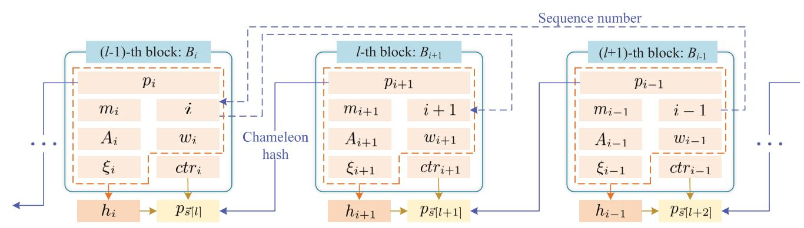

Fig. 1. The proposed verifiable and redactable blockchain structure.

#### *B. The Formal Definition*

*Definition 3:* The verifiable and redactable blockchain with fully editing operations consists of algorithms defined below:

- Setup  $(1^\lambda) \rightarrow (pp)$ . This probabilistic algorithm takes the security parameter  $\lambda$  as input and outputs system parameter  $pp$ .
- KGenR( $pp$ )  $\rightarrow$   $(sk, pk)$ . The input of this probabilistic algorithm is  $pp$ , and the output is secret and public key pair of regulator  $\mathcal{R}$ .
- KGenB (*sk*, *pk*, *i*) → (*tk*, *hk*). On input the key pair of  $\mathcal{R}$  and a globally unique sequence number, this probabilistic algorithm outputs a specific chameleon hash key pair for the block with sequence number *i*.
- Append  $(\mathcal{C}, \text{Len}(\mathcal{C}), m, ctr, (tk_i, hk)) \rightarrow (\mathcal{C}')$ . This deterministic algorithm is executed to append a new block with Merkle root  $m$  and nonce  $ctr$  to  $\mathcal{C}$ , outputting the updated blockchain  $\mathcal{C}'$ .
- ValApp  $(B_i, \mathcal{C}, \text{Len}(\mathcal{C})) \rightarrow (\{0, 1\})$ . This is a probabilistic algorithm, verifying the validity of  $B_i$  appended to
- Insert  $(\mathcal{C}, \text{Len}(\mathcal{C}), m, ctr, l, (tk_i, tk_{\overline{\mathcal{C}}[l]}, hk)) \rightarrow (\mathcal{C}')$ . This algorithm is deterministic. It inserts a new block with  $m$  and  $ctr$  in blockchain  $\mathcal{C}$  to obtain  $\mathcal{C}'$ .
- Vallns  $\left(B_i, B'_{[l]}, l, \mathcal{C}, \text{Len}(\mathcal{C})\right) \rightarrow (\{0, 1\})$ . This probabilistic algorithm verifies the validity of insert operations.
- Modify  $(\mathcal{C}, \text{Len}(\mathcal{C}), m', l, (tk_{\mathcal{S}[l]}, hk), \phi(N)) \rightarrow (\mathcal{C}')$ . This deterministic algorithm is to modify the  $l$ -th block in  $\mathcal{C}$ .
- ValMod  $(B_i, I, \mathcal{C}, \text{Len}(\mathcal{C})) \rightarrow (\{0, 1\})$ . This probabilistic algorithm verifies the validity of modifications.
- Delete  $(\mathcal{C}, \text{Len}(\mathcal{C}), L, m, ctr, (tk_{s_a}, tk_i, hk), \phi(N)) \rightarrow (\mathcal{C}')$ . This deterministic algorithm is used to delete blocks indicated by set  $L$  in  $\mathcal{C}$ .
- ValDel  $(B_i, L, \mathcal{C}, \text{Len}(\mathcal{C})) \rightarrow (\{0, 1\})$ . This probabilistic algorithm verifies the validity of deletions.
- ValChain  $(\mathcal{C}, \text{Len}(\mathcal{C})) \rightarrow (\{0, 1\})$ . This probabilistic algorithm verifies the validity of blockchain  $\mathcal{C}$ .

# *C. Security Definitions*

A secure verifiable and redactable blockchain with fully editing operations should satisfy properties in two aspects. One is block security indicating the unforgeability of individual block, and the other is blockchain security including chain sequence growth, chain sequence quality and editable common presequence. The definitions are as follows.

*Definition 4 (Block Security):* Blocks in a verifiable and redactable blockchain with fully editing operations are secure if it is infeasible for any PPT adversary  $\mathcal{A}$  to put a forged block  $B^*$  concerning  $cont^* = p_i || m^* || i || A^* || w^*$  in blockchain  $\mathcal{C}$  approved by honest users, while  $cont_i = p_i || m_i || i || A_i || w_i$  is the actual content. That is, for any security parameter  $\lambda$  and all editing operations, there is

- • If  $\mathcal{A}$  attempts to append  $B^*$  in  $\mathcal{C}$ , then

$$\Pr \left[ \mathcal{A}^{\mathcal{O}(tk_i, cont_i)}(hk, \mathcal{C}, \text{Len}(\mathcal{C}), cont^*, ctr) \rightarrow \mathcal{C}^* \right]$$

## $$\wedge \text{ValApp}(B^*, \mathcal{C}, \text{Len}(\mathcal{C})) \rightarrow 1$$

: 
$$(tk_i, hk) \leftarrow \text{KGenB}(sk, pk, i), (sk, pk) \leftarrow$$

$$\text{KGenR}(pp), pp \leftarrow \text{Setup}(1^\lambda) ] \leq \text{negl}(\lambda),$$

where 
$$\mathcal{C}^* := \mathcal{C} || B^* |$$
.

- If  $\mathcal{A}$  attempts to insert  $B^*$  at the  $l$ -th position in  $\mathcal{C}$ , then

$$\Pr \left[ \mathcal{A}^{\mathcal{O}(tk_i, cont_i)}(hk, \mathcal{C}, \text{Len}(\mathcal{C}), cont^*, ctr, l) \rightarrow \mathcal{C} \right]$$

$$\wedge \text{Vallns} \left( B^*, B'_{\mathcal{S}[l]}, l, \mathcal{C}, \text{Len}(\mathcal{C}) \right) \rightarrow 1$$

: 
$$(tk_i, hk) \leftarrow \text{KGenB}(sk, pk, i), (sk, pk) \leftarrow$$

$$\text{KGenR}(pp), pp \leftarrow \text{Setup}(1^\lambda)] \leq \text{negl}(\lambda),$$

where 
$$\mathcal{C}^* := \mathcal{C}^{\lceil n-l+1 \rceil} \|B^*\| B'_{\mathcal{S}[l]} \|l' \mathcal{C}\|$$
.

- ## S[U]
- If  $B^*$  pretend to be the modification target at the  $l$ -th position in  $\mathcal{C}$ , then

$$\Pr \left[ \mathscr{A}^{\mathcal{O}(tk_{\mathcal{S}[l], \cdot})} (hk, \mathcal{C}, \text{Len}(\mathcal{C}), \text{cont}^*, l) \rightarrow \mathcal{C} \right]$$

$$\wedge \text{ValMod} \left( B^*, I, \mathcal{C}, \text{Len}(\mathcal{C}) \right) \rightarrow 1$$

$$(tk_{\vec{s}[l]}, hk) \leftarrow \text{KGenB}(sk, pk, \vec{s}[l]), (sk, pk) \leftarrow$$

$$\text{KGenR}(pp), pp \leftarrow \text{Setup}(1^\lambda) ] \leq \text{negl}(\lambda),$$

where "..." indicates 
$$cont_{\tilde{S}[l]}$$
 and  $cont'_{\tilde{S}[l]}$ , and  $C^* := C^{[n-l+1]} || B^* ||' C$ .

- If  $\mathcal{A}$  attempts to output  $B^*$  as the block recording deletion event in  $\mathcal{C}$ , then

$$\Pr \left[ \mathcal{A}^{\mathcal{O}(tk_i, cont_i)} (hk, \mathcal{C}, \text{Len}(\mathcal{C}), L, cont^*, ctr) \rightarrow \mathcal{C}^* \right]$$

## L $$\wedge \text{ValDel}(B^*, L, \mathcal{C}, \text{Len}(\mathcal{C})) \rightarrow 1$$

: 
$$(tk_i, hk) \leftarrow \text{KGenB}(sk, pk, i), (sk, pk) \leftarrow$$

$$\text{KGenR}(pp), pp \leftarrow \text{Setup}(1^\lambda)] \leq \text{negl}(\lambda),$$

where 
$$\mathcal{C}^* := \mathcal{C}^{\lceil n - L_{\min} + 1 \rceil} || B'_{S_d} ||^{L_{\max} + 1} \mathcal{C} || B^* ||$$
.

Here, **Setup** is honest,  $\mathcal{O}$  is the chameleon hash oracle,  $tk_i$  is specific trapdoor for  $B_i$  and  $\text{negl}(\cdot)$  is a negligible function.

Inspired by [16] and [32], we define blockchain security as follows. First, since blocks can be deleted and the state consensus in the proposed blockchain is the largest sequence number principle instead of the longest chain rule, we introduce a new definition that is suitable for the current scenario.

*Definition 5 (Chain Sequence Growth):* Given local block-chains  $\mathcal{C}_1$  and  $\mathcal{C}_2$  possessed by two honest users at the onset of two rounds  $ro_1$  and  $ro_2$  respectively, where  $ro_2$  is at least  $x$  rounds ahead of  $ro_1$ . Then, it holds that

$$\max_{j \in \text{Len}(C_2)} \vec{s}[j] - \max_{j \in \text{Len}(C_1)} \vec{s}[j] \geq x \cdot \tau,$$

where  $\tau \in (0, 1]$  is the speed coefficient.

Next, the chain quality property in [32] states that the ration of adversarial blocks in arbitrary segment of blockchains held by honest users is strictly controlled. Similarly, we define Chain Sequence Quality as follows.

*Definition 6 (Chain Sequence Quality):* Given a number of  $\gamma$  blocks with successive sequence numbers in blockchain possessed by an honest user, the ratio of adversarial blocks in this bunch is at most  $\gamma$ , where  $\gamma \in (0, 1]$  is the quality coefficient and indicates the fraction of network resources controlled by the adversary.

The final is editable common presequence adapted from the common prefix property [32] and editable common prefix [16], which is defined to account for edits in the blockchain.

*Definition 7 (Editable Common Presequence):* Given local blockchains  $C_1$  and  $C_2$  possessed by two honest users at the onset of rounds  $ro_1$  and  $ro_2$ , where  $ro_1 \leq ro_2$ . Then for the editable common presequence parameter  $\kappa \in \mathbb{N}$ , one of the following is satisfied:

- Blocks with sequence number no larger than  $\max_{j \in [\text{Len}(\mathcal{C}_1)]} \vec{s}[j] - \kappa$  in  $\mathcal{C}_1$  compose the presequence of  $\mathcal{C}_2$ , which means that only append and insert operations are executed in rounds between  $ro_1$  and  $ro_2$ .
- For each block  $B^*$  contained in the segment of  $\mathcal{C}_1$  with sequence number no larger than  $\max_{j \in [\text{Len}(\mathcal{C}_1)]} \lceil j \rceil - k$  but not in  $\mathcal{C}_2$ , there must be an authorized modification or deletion executed in rounds between  $ro_1$  and  $ro_2$ .

#### IV. THE PROPOSED VERIFIABLE AND REDACTABLE BLOCKCHAIN

We start with the high-level description of the proposed blockchain, and then give the complete description.

# *A. High-Level Description*

We argue that directly utilizing a chameleon hash function to chain blocks is not sufficient for constructing a secure redactable blockchain. Though such an approach re-writes blocks by finding hash collisions, unaffecting other blocks in the blockchain, it causes problems of lazy redaction update and valid histories.

We employ the largest sequence number principle as a substitute for the longest chain rule to incent users to compete for profits based on the latest blockchain version, addressing the lazy redaction update problem. In addition, to invalidate history versions of redacted blocks, we equip the redactable blockchain with efficient verifiability via the trapdoorless universal accumulator, which is utilized as a commitment to all blocks in the blockchain.

Specifically, when there are append and insert operations, the miner uses *UA.Add* to update accumulator state and *UA.MWit* to give the membership witness of the block. Since insertion breaks the connectivity of “chain”, *Ch.Adapt* should be executed for the block right behind the inserted one. Then, to modify a block, *UA.Del* is run to erase the history version, and *UA.Add* is to add the new one into the accumulator. After that, the miner runs *UA.MWit* and *UA.N-MWit* to give the non-membership and membership witnesses of invalid and valid versions, separately. As for deletion, merely utilizing *UA.Del* to update the accumulator state makes intuitive sense. However, the lazy redaction update issue still exists since the latest block does not change before and after deletion. Thus, appending an extra block recording the deletion event and updating the largest sequence number are necessary. As supplementary, the miner executes *UA.Add* for the recording block, and runs *UA. N-MWit* and *UA.MWit* to generate witnesses for the deleted and appended blocks.

## *B. The Complete Description*

---

In order for the proposed verifiable and redactable blockchain with fully dynamic operations to work, we start with adjusting the consensus of wildly accepted blockchains like Bitcoin. On the one hand, we still utilize PoW as the membership selection algorithm to determine which miner's primary goal is used to propose a new block. On the other hand, the state consensus is now the largest sequence number principle. Such a novel consensus states that users must select the blockchain with the largest sequence number as the canonical one and extend it subsequently.

---

For simplicity, we use  $\mathcal{M}$  to signify blockchain miner, which is a user competing for profits through PoW. Besides,  $\mathcal{V}$  represents users failing to solve the PoW puzzle in the current round, which are responsible for verifying the validity of the blockchain extension. In addition,  $\mathcal{R}$  is a trusted network regulator, holding trapdoor key for executing editing operations in blockchains.

The concrete construct consists of the following algorithms.

- Setup  $(1^\lambda) \rightarrow (pp)$ . Given the security parameter  $\lambda$ , it runs as follows:

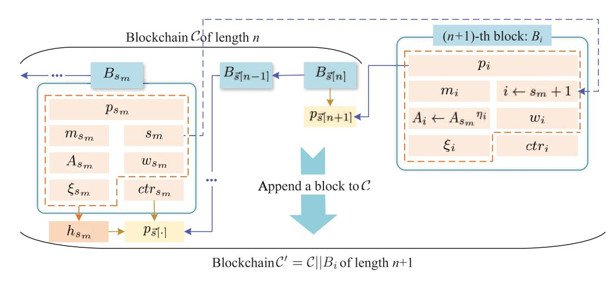

Fig. 2. The append operation.

- 3) Select a generator  $h \in \mathbb{Z}_N^*$  randomly, and initialize the accumulator state as  $A_0 \leftarrow h$ .
- 4) Select two cryptographic hash functions:

$$\begin{cases} H_1 : \{0, 1\}^* \rightarrow \{0, 1\}^\lambda \\ H_{\text{prime}} : \{0, 1\}^* \rightarrow \text{Primes}(\lambda). \end{cases}$$

- 5) Output the public parameter:

$$pp \leftarrow \{\mathbb{G}_0, q, P, \mathbb{Z}_N^*, h, H_1, H_{\text{prime}}, A_0\}.$$

- •  $\text{KGenR}(pp) \rightarrow (sk, pk)$ . On input  $pp$ , the secret and public key pair for  $\mathcal{R}$  is generated as follows:

- KGenB  $(sk, pk, i) \rightarrow (tk_i, hk)$ . On input  $(sk, pk)$  of  $\mathcal{G}$  and the globally unique sequence number  $i$ , it runs as follows:

- 1)  $\mathcal{R}$  chooses  $t_i \xleftarrow{\mathcal{R}} \mathbb{Z}_q$  as a specialized trapdoor.
- 2) The specific chameleon hash key pair for block with sequence number  $i$  is  $(tk_i, hk) = ((sk, t_i), pk)$ .

- • Append  $(\mathcal{C}, \text{Len}(\mathcal{C}), m, ctr, (t_k, hk)) \rightarrow (\mathcal{C}')$ . Inputs of the algorithm are a blockchain  $\mathcal{C}$  with  $\text{Len}(\mathcal{C}) = n$ , chameleon hash key pair  $(t_k, hk)$ . To append  $B_i$  with Merkle root  $m$  and PoW winning nonce  $ctr$ , the algorithm executes as follows, which is depicted in Fig. 2 and described detailedly in Algorithm 1:

- 1)  $\mathcal{M}$  calculates  $p_i$  through **Head**( $\mathcal{C}$ ) =  $B_{\mathfrak{T}[n]}$ , and obtains the sequence number by plus 1 for the largest one in  $\mathcal{C}$ .

- 2)  $\mathcal{M}$  updates accumulator state to  $A_i$  by adding  $\eta_i \leftarrow H_{\text{prime}}(m|i)$  derived from  $B_i$ , and gives the corresponding witness  $w_i$ .

- 3)  $\mathcal{R}$  generates the checking string  $\xi_i$  corresponding to  $cont_i$  in  $B_i$  via  $tk_i$ .

- 4)  $\mathcal{M}$  outputs the updated blockchain  $\mathcal{C}' \leftarrow \mathcal{C} || B_i$ .

- ValApp  $(B_i, \mathcal{C}, \text{Len}(\mathcal{C})) \rightarrow ((0, 1))$ . On input this appended block  $B_i$  and  $\mathcal{V}$ 's local chain  $\mathcal{C}$  with  $\text{Len}(\mathcal{C}) = n$ , it runs as follows and is described in Algorithm 2.

- 1)  $\mathcal{V}$  verifies the validity of sequence number, connectivity with the front block, correctness of the PoW

## Algorithm 1 Append Block

**Require:**  $\mathcal{C}, \text{Len}(\mathcal{C}), m, ctr, (tk_i, hk).$ 

### Ensure: $C'$

**Ensure:**  $\mathcal{C}'$ .

- 1: parse  $\mathcal{C}$  as  $(B_1, B_2, \dots, B_{\tilde{s}[n]})$ ;
- 2: parse  $B_{\tilde{s}[n]} := \langle p_{\tilde{s}[n]}, ctr_{\tilde{s}[n]}, m_{\tilde{s}[n]}, \tilde{s}[n], \xi_{\tilde{s}[n]}, A_{\tilde{s}[n]} | w_{\tilde{s}[n]} \rangle$ ;
- 3:  $cont_{\tilde{s}[n]} \leftarrow p_{\tilde{s}[n]} || \tilde{s}[n] || A_{\tilde{s}[n]} || w_{\tilde{s}[n]}$ ;
- 4:  $h_{\tilde{s}[n]} \leftarrow \mathcal{C}\mathcal{H}.\text{RHGen}(cont_{\tilde{s}[n]}, \xi_{\tilde{s}[n]}, hk)$ ;
- 5:  $p_i \leftarrow H_1(ctr_{\tilde{s}[n]} || h_{\tilde{s}[n]})$ ; {hash of the front block}
- 6:  $s_m \leftarrow \max_{j \in [n]} \tilde{s}[j], i \leftarrow s_m + 1$ ; {sequence number}
- 7:  $\eta_i \leftarrow H_{\text{prime}}(m || i), A_i \leftarrow A_{s_m}^{\eta_i}$ ; {accumulator state}
- 8:  $Q_i \leftarrow \text{NI-PoE.Prove}(\eta_i, A_{s_m}, A_i)$ ;
- 9:  $w_i \leftarrow Q_i$ ; {witness of  $A_i$ }
- 10:  $(h_i, \xi_i) \leftarrow \mathcal{C}\mathcal{H}.\text{HGen}(tk_i, p_i || m || i || A_i || w_i)$ ; {checking string}
- 11:  $B_i := \langle p_i, ctr, m, i, \xi_i, A_i, w_i \rangle$ ;
- 12:  $\mathcal{C}' \leftarrow \mathcal{C} || B_i$ ;
- 13: **return**  $\mathcal{C}'$

solution, and consistency of the accumulator state and witnesses.

- | 2) | Outputs | decision | 1 | if | all | the | above | conditions |
  |----|---------|----------|---|----|-----|-----|-------|------------|
  |    | are     | met.     |   |    |     |     |       |            |

- Insert  $(\mathcal{C}, \text{Len}(\mathcal{C}), m, ctr, l, (tk_i, tk_{\tilde{s}[l]}, hk)) \rightarrow (\mathcal{C}')$ . The inputs are a blockchain  $\mathcal{C}$  with  $\text{Len}(\mathcal{C}) = n$ , chameleon hash key pairs  $(tk_i, hk)$  for block  $B_i$  and  $(tk_{\tilde{s}[l]}, hk)$  for  $B_{\tilde{s}[l]}$ . To insert  $B_i$  with  $m$  and  $ctr$  at the  $l$ -th position in  $\mathcal{C}$ , it is schematically shown in Fig. 3 and executed as follows, of which the details are in Algorithm 3.

- 1) *M* sticks previous hash value of the original *l*-th block  $B_{\tilde{S}[l]}$ , and obtains sequence number *i*, accumulator state  $A_i$  and witness  $w_i$  by the similar way in Append.

- 2)  $\mathcal{H}$  generates checking strings  $\xi_i$  for  $B_i$  via  $tk_i$  and adapts  $\xi'_{[l]}$  for  $B'_{[l]}$  via  $tk_{[l]}$ , since front block of the original  $l$ -th one changes.

- 3)  $\mathcal{M}$  updates  $\mathcal{C}$  to  $\mathcal{C}' \leftarrow \mathcal{C}^{[n-l+1]} \|B_i\|_{B_{\mathcal{S}[l]}}^l \|^{\mathcal{C}}$ .

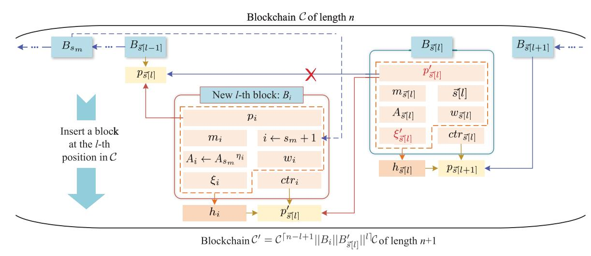

Fig. 3. The insert operation.

#### Algorithm 2 Validate Append Operation

**Require:**  $B_i, \mathcal{C}, \text{Len}(\mathcal{C})$ .

Ensure:  $\{0, 1\}$ .

1. 1: parse  $B_i := \langle p_i, ctr_i, m_i, i, \xi_i, A_i, w_i \rangle$ ,  $w_i := Q_i$ ;
2. 2: **if** block structure is valid **then**
3. 3:      $s_m \leftarrow \max_{j \in [n]} \vec{s}[j]$  of  $\mathcal{C}$ ;
4. 4:     parse  $B_{s_m} := \langle \dots, A_{s_m}, \cdot \rangle$ ;
5. 5:      $cont_i \leftarrow p_i || m_i || i || A_i || w_i$ ;
6. 6:      $h_i \leftarrow \mathcal{C}\mathcal{H}.\text{RHGen}(cont_i, \xi_i, hk)$ ;
7. 7:     **if**  $i == s_m + 1$  **and**  $p_i == H_1(ctr_{\vec{s}[n]} || h_{\vec{s}[n]})$  **and**  $H_1(ctr_i || h_i) < D$  **then**
8. 8:          $\eta_i \leftarrow H_{\text{prime}}(m_i || i)$ ;
9. 9:         **return** NI-PoE.Verify( $\eta_i, A_{s_m}, A_i, Q_i$ )
10. 10:     **end if**
11. 11: **end if**
12. 12: **return** 0

- • Vallns  $(B_i, B'_{s[l]}, l, \mathcal{C}, \text{Len}(\mathcal{C})) \rightarrow (\{0, 1\})$ . On input the block  $B_i$  to be inserted at position  $l$ , the updated block  $B'_{s[l]}$  used to be at  $l$ , and  $\mathcal{V}$ 's local chain  $\mathcal{C}$  with  $\text{Len}(\mathcal{C}) = n$ , the algorithm runs as follows, of which details are presented in Algorithm 4.

- 1)  $\mathcal{V}$  checks entries like that in ValApp, except for additional checking of “chain” between  $B_i$  and  $B'_{s[i]}$
- 2)  $\mathcal{V}$  outputs the verification result 0 or 1.

- Modify  $(\mathcal{C}, \text{Len}(\mathcal{C}), m', l, (tk_{\tilde{\mathcal{U}}[l]}, hk), \phi(N)) \rightarrow (\mathcal{C}')$ . The inputs are  $\mathcal{C}$  with  $\text{Len}(\mathcal{C}) = n$ , target Merkle root  $m'$  of the  $l$ -th block  $B_{\tilde{\mathcal{U}}[l]}$ , chameleon hash key pair  $(tk_{\tilde{\mathcal{U}}[l]}, hk)$  for  $B_{\tilde{\mathcal{U}}[l]}$ , and accumulator trapdoor  $\phi(N)$ . The algorithm executes as follows, of which the diagram is in Fig. 4 and the details are in Algorithm 5.

- 1)  $\mathcal{M}$  retains previous hash and PoW nonce of the original  $B_{\tilde{S}[l]}$ , and obtains sequence number  $i'$  routinely.
- 2)  $\mathcal{H}$  erases  $H_{\text{prime}}(m_i || i)$  derived from the original  $B_{\mathbb{S}[l]}$  efficiently, from the accumulator state via  $\phi(N)$ .

#### Algorithm 3 Insert Block

**Require:**  $\mathcal{C}, \text{Len}(\mathcal{C}), m, ctr, l, (tk_i, tk_{\vec{s}[l]}, hk)$ .

### Ensure: $C'$

**Ensure:**  $\mathcal{C}'$ .

1. 1: parse  $\mathcal{C}$  as  $(B_1, B_2, \dots, B_{\tilde{s}[n]})$ ;
2. 2: parse  $B_{\tilde{s}[l]} := \langle p_{\tilde{s}[l]}, ctr_{\tilde{s}[l]}, m_{\tilde{s}[l]}, \tilde{s}[l], \xi_{\tilde{s}[l]}, A_{\tilde{s}[l]}, w_{\tilde{s}[l]} \rangle$ ;
3. 3:  $cont_{\tilde{s}[l]} \leftarrow p_{\tilde{s}[l]} || m_{\tilde{s}[l]} || \tilde{s}[l] || A_{\tilde{s}[l]} || w_{\tilde{s}[l]}$ ;
4. 4:  $h_{\tilde{s}[l]} \leftarrow \mathcal{CH.RHGen}(cont_{\tilde{s}[l]}, \xi_{\tilde{s}[l]}, hk)$ ;
5. 5:  $s_m \leftarrow \max_{j \in [n]} \tilde{s}[j], i \leftarrow s_m + 1$ ; {sequence number}
6. 6:  $\eta_i \leftarrow H_{\text{prime}}(m|i), A_i \leftarrow A_{s_m}^{\eta_i}$ ; {accumulator state}
7. 7:  $Q_i \leftarrow \text{NI-PoE.Prove}(\eta_i, A_{s_m}, A_i)$ ;
8. 8:  $w_i \leftarrow Q_i$ ; {witness of  $A_i$ }
9. 9:  $cont_i \leftarrow p_{\tilde{s}[l]} || m|i| | A_i || w_i$ ;
10. 10:  $(h_i, \xi_i) \leftarrow \mathcal{CH.HGen}(tk_i, cont_i)$ ; {checking string}
11. 11:  $B_i := \langle p_{\tilde{s}[l]}, ctr, m, i, \xi_i, A_i, w_i \rangle$ ;
12. 12:  $p'_{\tilde{s}[l]} \leftarrow H_1(ctr||h_i)$ ; {front block of  $B_{\tilde{s}[l]}$  changes}
13. 13:  $cont'_{\tilde{s}[l]} \leftarrow p'_{\tilde{s}[l]} || m_{\tilde{s}[l]} || \tilde{s}[l] || A_{\tilde{s}[l]} || w_{\tilde{s}[l]}$ ;
14. 14:  $\xi'_{\tilde{s}[l]} \leftarrow \mathcal{CH.Adapt}(tk_{\tilde{s}[l]}, h_{\tilde{s}[l]}, cont_{\tilde{s}[l]}, \xi_{\tilde{s}[l]}, cont'_{\tilde{s}[l]})$ ; {adaptation}
15. 15:  $B'_{\tilde{s}[l]} := \langle p'_{\tilde{s}[l]}, ctr_{\tilde{s}[l]}, m_{\tilde{s}[l]}, \tilde{s}[l], \xi'_{\tilde{s}[l]}, A_{\tilde{s}[l]}, w_{\tilde{s}[l]} \rangle$ ;
16. 16:  $\mathcal{C}' \leftarrow \mathcal{C}^{[n-l+1]} || B_i || B'_{\tilde{s}[l]} ||^l \mathcal{C}$ ;
17. 17: **return**  $\mathcal{C}'$

- 3)  $\mathcal{M}$  continues to update the accumulator state to  $A_{i'}$  by adding  $H_{\text{prime}}(m'||i')$  from the updated  $B_{i'}$ , and gives witnesses  $w_{i'}$  for both the validity of  $A_{i'}$  and the non-membership of all history versions of the modified block.
- 4)  $\mathcal{R}$  adapts the checking string for *contit* using *tks[it]*.
- (5)  $\mathcal{M}$  updates  $\mathcal{C}$  to  $\mathcal{C}' \leftarrow \mathcal{C}^{[n-l+1] \parallel B_i \parallel l^C}$ .

- ValMod  $(B_i, l, \mathcal{C}, \text{Len}(\mathcal{C})) \rightarrow (\{0, 1\})$ . On input the updated  $l$ -th block  $B_i$  and  $\mathcal{V}$ 's local chain  $\mathcal{C}$  with  $\text{Len}(\mathcal{C}) = n$ , it runs as follows, and the details are shown in Algorithm 6.

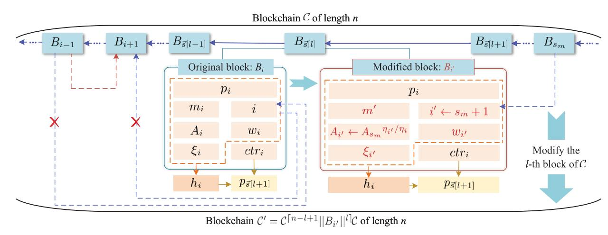

Fig. 4. The modify operation.

## Algorithm 4 Validate Insert Operation

**Require:**  $B_i, B'_{\bar{s}[l]}, l, \mathcal{C}, \text{Len}(\mathcal{C})$ .

Ensure:  $\{0, 1\}$ .

1. 1: parse  $B_i := \langle p_i, ctr_i, m_i, i, \xi_i, A_i, w_i \rangle, w_i := Q_i$ ;
2. 2: parse  $B'_{\tilde{s}[l]} := \langle p'_{\tilde{s}[l]}, ctr'_{\tilde{s}[l]}, m'_{\tilde{s}[l]}, \tilde{s}'[l], \xi'_{\tilde{s}[l]}, A'_{\tilde{s}[l]}, w'_{\tilde{s}[l]} \rangle$ ;
3. 3: parse  $B_{\tilde{s}[l-1]} := \langle \cdot, ctr_{\tilde{s}[l-1]}, \dots \rangle$  in  $\mathcal{C}$ ;
4. 4: **if** block structure is valid **then**
5. 5:      $s_m \leftarrow \max_{j \in [n]} \tilde{s}[j]$  of  $\mathcal{C}$ , parse  $B_{s_m} := \langle \dots, A_{s_m}, \cdot \rangle$ ;
6. 6:     calculate  $h_i, h'_{\tilde{s}[l]}, h_{\tilde{s}[l-1]}$  by  $\mathcal{CH.RHGen}(\cdot, \cdot, hk)$ ;
7. 7:     **if**  $i = s_m + 1$  **and**  $p_i == H_1(ctr_{\tilde{s}[l-1]} || h_{\tilde{s}[l-1]})$  **and**  
    $H_1(ctr_i || h_i) < D$  **and**  $p'_{\tilde{s}[l]} == H_1(ctr_i || h_i)$  **then**
8. 8:      $\eta_i \leftarrow H_{\text{prime}}(m_i || i)$ ;
9. 9:     **return** NI-PoE.Verify( $\eta_i, A_{s_m}, A_i, Q_i$ )
10. 10: **end if**
11. 11: **end if**
12. 12: **return** 0

needed since modification dose not impact front or behind blocks.

- 2)  $\mathcal{V}$  verifies the validity of accumulator witnesses concerning deletion of  $B_{\tilde{S}[l]}$ , addition of  $B_l$  and non-membership of its all history versions.
- 3)  $\mathcal{V}$  outputs the verification result 0/1 relying on the above verification results.

- • Define  $(\mathcal{C}, \text{Len}(\mathcal{C}), L, m, ctr, (tk_{s_t}, tk_t), hk), \phi(N) \rightarrow (\mathcal{C}')$ . The inputs are blockchain  $\mathcal{C}$  with  $\text{Len}(\mathcal{C}) = n$ , a set  $L \subset [n]$  indicating consecutive blocks from  $B_{\tilde{L}[L_{max}]}$  to  $B_{\tilde{L}[L_{max}]}$  to be deleted, chameleon hash key pairs  $(tk_{s_t}, hk)$  for the  $(L_{max} + 1)$ -th block  $B_{s_t}$  and  $(tk_t, hk)$  for a new block  $B_i$  with Merkle root  $m$  and nonce  $ctr$  recording the deletion event to be appended to  $\mathcal{C}$ , and accumulator trapdoor  $\phi(N)$ . Fig. 5 shows the schematic and Algorithm 7 presents the details.

- 1)  $\mathcal{M}$  regards Head ( $\mathcal{C}$ ) as front block of  $B_i$  if  $n \notin L$ , and the  $(L_{min} - 1)$ -th block  $B_{s_i}$  otherwise. Generate previous hash and sequence number of  $B_i$  as usual.
- 2)  $\mathcal{A}$  deletes elements derived from blocks specified in  $L$  from the accumulator state efficiently. Here  $\mathcal{U}, \mathcal{A}, \text{Del}$  is executed via accumulator trapdoor.

## Algorithm 5 Modify Block

**Require:**  $\mathcal{C}, \text{Len}(\mathcal{C}), m', l, (tk_{\bar{s}[l]}, hk), \phi(N).$ 

Ensure:  $C'$ .

**End if:**  $\mathcal{C}$ .

1. 1: parse  $B_{\tilde{s}[l]} := \langle p_i, ctr_i, m_i, i, \xi_i, A_i, w_i \rangle$  in  $\mathcal{C}$ ;
2. 2:  $cont_i \leftarrow p_i \|m\| \|i\| A_i \|w_i\|$ ;
3. 3:  $h_i \leftarrow \mathcal{CH.RHGen}(cont_i, \xi_i, hk)$ ;
4. 4:  $s_m \leftarrow \max_{j \in [n]} \tilde{s}[j], i' \leftarrow s_m + 1$ ; {sequence number}
5. 5: initialize  $\hat{\eta}_{i'} \leftarrow \eta_i = H_{\text{prime}}(m_i \|i)$ ;
6. 6:  $\tilde{\eta}_0 \leftarrow \prod_{j \in [n] \setminus \{i\}} H_{\text{prime}}(m_{\tilde{s}[j]} \|\tilde{s}[j]),$   
    $\bar{A}_{i'} \leftarrow h^{\tilde{\eta}_0 \bmod \phi(N)}$ ; { $\mathcal{R}$  deletes  $\eta_i$  from accumulator}
7. 7:  $Q_{i',1} \leftarrow \text{NI-PoE.Prove}(\eta_i, \bar{A}_{i'}, A_{s_m})$ ; {witness for deletion of  $\eta_i$  from accumulator}
8. 8:  $\eta_{i'} \leftarrow H_{\text{prime}}(m' \|i'), A_{i'} \leftarrow (\bar{A}_{i'})^{\eta_{i'}}$ ; {accumulator state}
9. 9:  $Q_{i',2} \leftarrow \text{NI-PoE.Prove}(\eta_{i'}, \bar{A}_{i'}, A_{i'})$ ; {witness for addition of  $\eta_{i'}$  into accumulator}
10. 10:  $\tilde{\eta} \leftarrow \tilde{\eta}_0 \cdot \eta_{i'}$ ;
11. 11: **if**  $w_i == (\cdots, \hat{\eta}_i, \cdots)$  **then**
12. 12:    $\hat{\eta}_{i'} \leftarrow \hat{\eta}_{i'} \cdot \hat{\eta}_i$ ;
13. 13: **end if**
14. 14:  $(\alpha, \beta) \leftarrow \text{Exgcd}(\hat{\eta}_{i'}, \tilde{\eta}), \mu_{i'} \leftarrow h^\alpha, v_{i'} \leftarrow A_{i'}\beta$ ;
15. 15:  $(z_{i'}, d_{i'}, Q_{i',3}) \leftarrow \text{NI-PoKE.Prove}(\beta, A_{i'}, v_{i'})$ ; {witness validity of non-membership witness}
16. 16:  $Q_{i',4} \leftarrow \text{NI-PoE.Prove}(\hat{\eta}_{i'}, \mu_{i'}, h \cdot v_{i'}^{-1})$ ; {witness non-membership of all previous versions in  $B_i$ }
17. 17:  $w_{i'} \leftarrow (Q_{i',1}, \bar{A}_{i'}, Q_{i',2}, z_{i'}, Q_{i',3}, d_{i'}, \hat{\eta}_{i'}, \mu_{i'}, v_{i'}, Q_{i',4})$ ; {witness corresponding to  $A_{i'}$ }
18. 18:  $cont_{i'} \leftarrow p_i \|m' \| \|i'\| A_{i'} \|w_{i'}\|$ ;
19. 19:  $\xi_{i'} \leftarrow \mathcal{CH.Adapt}(tk_{\tilde{s}[l]}, h_i, cont_i, \xi_i, cont_{i'})$ ; {adaptation}
20. 20:  $B_{i'} := \langle p_i, ctr_i, m', i', \xi_{i'}, A_{i'}, w_{i'} \rangle$ ;
21. 21:  $\mathcal{C}' \leftarrow \mathcal{C}^{[n-l+1]} \|B_{i'}\|^l \mathcal{C}$ ;
22. 22: **return**  $\mathcal{C}'$

## 22. return c

 $\phi(N)$  and by allowing inputting a set of elements rather than one to be deleted.

- 3)  $\mathcal{M}$  continues to update the accumulator state by adding the information of  $B_i$ , and gives witness  $w_i$  for both validity of the new accumulator state and

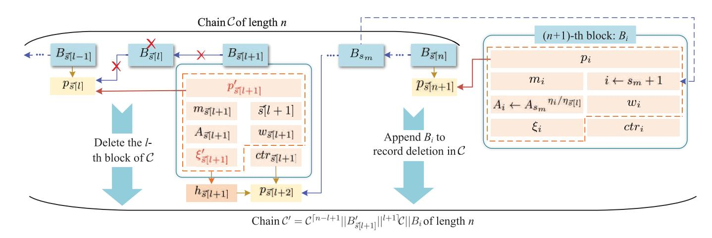

Fig. 5. The delete operation.

#### Algorithm 6 Validate Modify Operation

**Require:**  $B_i, \mathcal{C}, l, \text{Len}(\mathcal{C})$ .

Ensure:  $\{0, 1\}$ .

| 1:  | parse $B_i := \langle p_i, ctr_i, m_i, i, \xi_i, A_i, w_i \rangle$ ,                                                                |
|-----|-------------------------------------------------------------------------------------------------------------------------------------|
|     | $w_i := (Q_{i,1}, \bar{A}_i, Q_{i,2}, z_i, Q_{i,3}, d_i, \hat{\eta}_i, \mu_i, v_i, Q_{i,4})$ ,                                      |
| 2:  | parse $B_{\tilde{s}[l]} := \langle \dots, m_{\tilde{s}[l]}, \tilde{s}[l], \dots \rangle$ in $\mathcal{C}$ ;                         |
| 3:  | <b>if</b> block structure is valid <b>then</b>                                                                                      |
| 4:  | $s_m \leftarrow \max_{j \in [n]} \tilde{s}[j]$ of $\mathcal{C}$ , parse $B_{s_m} := \langle \dots, A_{s_m}, \cdot \rangle$ ,        |
| 5:  | $cont_i \leftarrow p_i \ m_i \   i  \ A_i \  w_i$ ;                                                                                 |
| 6:  | $h_i \leftarrow \mathcal{C}\mathcal{H}.\text{RHGen}(cont_i, \xi_i, hk)$ ;                                                           |
| 7:  | <b>if</b> $H_1(ctr_i \  h_i) < D$ <b>and</b> $i == s_m + 1$ <b>then</b>                                                             |
| 8:  | $\eta_i \leftarrow H_{\text{prime}}(m_i \  i), \eta_{\tilde{s}[l]} \leftarrow H_{\text{prime}}(m_{\tilde{s}[l]} \  \tilde{s}[l])$ ; |
| 9:  | <b>return</b> $\text{NI-PoE.Verify}(\eta_{\tilde{s}[l]}, \bar{A}_i, A_{s_m}, Q_{i,1})$ <b>and</b>                                   |
|     | $\text{NI-PoE.Verify}(\eta_i, \bar{A}_i, A_i, Q_{i,2})$ <b>and</b>                                                                  |
|     | $\text{NI-PoKE.Verify}(A_i, v_i, z_i, d_i, Q_{i,3})$ <b>and</b>                                                                     |
|     | $\text{NI-PoE.Verify}(\hat{\eta}_i, \mu_i, hv_i^{-1}, Q_{i,4})$                                                                     |
| 10: | <b>end if</b>                                                                                                                       |
| 11: | <b>end if</b>                                                                                                                       |
| 12: | <b>return</b> 0                                                                                                                     |

### non-membership of all history versions of deleted blocks.

- 4)  $\mathcal{R}$  generates checking string  $\xi_i$  for  $B_i$  via  $tk_i$  and adapts  $\xi_{s_d}$  for  $B_{s_d}$  via  $tk_{s_d}$ .
- 5)  $\mathcal{M}$  shrinks  $\mathcal{C}$  to  $\mathcal{C}' \leftarrow \mathcal{C}^{[n-L_{\min}+1]} \|B_{sa}'\|^{L_{\max}+1}$   
   $\mathcal{C} ||B_i$  with  $\text{Len}(\mathcal{C}') = n - |L| + 1$ .

- ValDel  $(B_i, L, \mathcal{C}, \text{Len}(\mathcal{C})) \rightarrow (\{0, 1\})$ . On input the recording block  $B_i$ , position set  $L \subset [n]$  of deleted blocks, and  $\mathcal{V}$ 's local chain  $\mathcal{C}$  with  $\text{Len}(\mathcal{C}) = n$ , it runs as follows, and the details are in Algorithm 8.

#### Algorithm 7 Delete Block

**Require:**  $\mathcal{C}, \text{Len}(\mathcal{C}), L, m, ctr, (tk_{s_a}, tk_i, hk), \phi(N).$ 

**Ensure:**  $C'$ .

**Ensure:**  $\mathcal{C}'$ 

- 1: parse  $B_{s_i}$ ,  $B_{s_a}$  in  $\mathcal{C}$ ;
- 2:  $cont_{s_a} \leftarrow p_{s_a} \|m_{s_a}\| |s_a| |A_{s_a}| |w_{s_a}|$ ;
- 3:  $h_{s_a} \leftarrow \mathcal{C}\mathcal{H}.\mathcal{R}\mathcal{H}\mathcal{Gen}(cont_{s_a}, \xi_{s_a}, hk)$ ;
- 4:  $p' \leftarrow H_1(ctr_{s_i} \|h_{s_i}), cont'_{s_a} \leftarrow p' \|m_{s_a}\| |s_a| |A_{s_a}| |w_{s_a}|$ ;
- 5:  $\xi' \leftarrow \mathcal{C}\mathcal{H}.\mathcal{Adapt}(tk_{s_a}, h_{s_a}, cont_{s_a}, \xi_{s_a}, cont'_{s_a})$ ;
- 6:  $B'_{s_a} := \langle p', ctr_{s_a}, m_{s_a}, s_a, \xi', A_{s_a}, w_{s_a} \rangle$ ;
- 7:  $s_m \leftarrow \max_{j \in [n]} \vec{s}[j], i \leftarrow s_m + 1$ ; {sequence number}
- 8:  $p_i \leftarrow H_1(ctr_{\vec{s}[n]} \|h_{\vec{s}[n]})$ ;
- 9:  $\tilde{\eta}_0 \leftarrow \prod_{l \in [n] \setminus L} H_{\text{prime}}(m_{\vec{s}[l]} \|\vec{s}[l]), \bar{A}_l \leftarrow h^{\tilde{\eta}_0 \bmod \phi(N)}(\mathcal{R})$  erases blocks indicated in  $L$  from accumulator
- 10: initialize  $\hat{\eta}_1 \leftarrow 1, \hat{\eta}_2 \leftarrow 1$ ;
- 11: **for**  $l \in L$  **do**
- 12:    $\hat{\eta}_1 \leftarrow \hat{\eta}_1 \cdot H_{\text{prime}}(m_{\vec{s}[l]} \|\vec{s}[l])$ ;
- 13:   **if**  $w_{\vec{s}[l]} == (\cdots, \hat{\eta}_{\vec{s}[l]}, \cdots)$  **then**
- 14:      $\hat{\eta}_2 \leftarrow \hat{\eta}_2 \cdot \hat{\eta}_{\vec{s}[l]}$ ;
- 15:   **end if**
- 16: **end for**
- 17:  $Q_{i,1} \leftarrow \text{NI-PoE.Prove}(\hat{\eta}_1, \bar{A}_i, A_{s_m})$ ; {witness for deletion of blocks indicated by  $L$ }
- 18:  $\eta_i \leftarrow H_{\text{prime}}(m | i), A_i \leftarrow \bar{A}_i^{\eta_i}$ ; {accumulator state}
- 19:  $Q_{i,2} \leftarrow \text{NI-PoE.Prove}(\eta_i, \bar{A}_i, A_i)$ ; {witness for addition of  $\eta_i$  in accumulator}
- 20:  $\hat{\eta}_i \leftarrow \hat{\eta}_1 \cdot \hat{\eta}_2, \tilde{\eta} \leftarrow \tilde{\eta}_0 \cdot \eta_i$ ;
- 21:  $(\alpha, \beta) \leftarrow \text{Exgcd}(\hat{\eta}_i, \tilde{\eta}), \mu_i \leftarrow h^\alpha, \nu_i \leftarrow A_i^\beta$ ;
- 22:  $(z_i, d_i, Q_{i,3}) \leftarrow \text{NI-PoKE.Prove}(\beta, A_i, \nu_i)$ ; {witness validity of non-membership witness}
- 23:  $Q_{i,4} \leftarrow \text{NI-PoE.Prove}(\hat{\eta}_i, \mu_i, h\nu_i^{-1})$ ; {witness non-membership of all previous versions of deleted blocks}
- 24:  $w_i \leftarrow (Q_{i,1}, \bar{A}_i, Q_{i,2}, z_i, Q_{i,3}, d_i, \hat{\eta}_i, \mu_i, \nu_i, Q_{i,4})$ ; {witness corresponding to  $A_i$ }
- 25:  $(h_i, \xi_i) \leftarrow \mathcal{C}\mathcal{H}.\mathcal{H}\mathcal{Gen}(tk_i, p_i \|m | i \| A_i \| w_i)$ ; {checking string}
- 26:  $B_i := \langle p_i, ctr, m, i, \xi_i, A_i, w_i \rangle$ ;
- 27:  $\mathcal{C}' \leftarrow \mathcal{C}^{[n-L_{min}+1]} \|B'_{s_a}\|^{L_{max}+1} \mathcal{C} \|B_i$ ;
- 28: **return**  $\mathcal{C}'$

#### Algorithm 8 Validate Delete Operation

**Require:**  $B_i, L, \mathcal{C}, \text{Len}(\mathcal{C}).$ 

**Ensure:**  $\{0, 1\}$ .

1. 1: parse  $B_i := \langle p_i, ctr_i, m_i, i, \xi_i, A_i, w_i \rangle$ ,
   - $w_i := (Q_{i,1}, \bar{A}_i, Q_{i,2}, z_i, Q_{i,3}, d_i, \hat{\eta}_i, \mu_i, v_i, Q_{i,4})$ ;
2. 2: parse  $B_{\vec{s}[L_{min}-1]} := \langle \dots, s_i, \dots \rangle$ ,  $B_{\vec{s}[L_{max}+1]} := \langle \dots, s_a, \dots \rangle$ ,  $B_{\vec{s}[n]} := \langle \dots, \vec{s}[n], \dots \rangle$  in  $C$ ;
   1. 3: **if** block structure is valid **then**
3. 4:  $s_m \leftarrow \max_{j \in [n]} \vec{s}[j]$  of  $C$ , parse  $B_{s_m} := \langle \dots, A_{s_m}, \cdot \rangle$ ;
4. 5:  $h_i, h_{s_i}, h_{s_a}, h_{\vec{s}[n]}$  by  $C\mathcal{H}.RHGen(\dots, hk)$ ;
5. 6: **if**  $H_1(ctr_i || h_i) < D$  **and**  $i == s_m + 1$  **and**  $p_i == H_1(ctr_{\vec{s}[n]} || h_{\vec{s}[n]})$  **and**  $p_{s_a} == H_1(ctr_{s_i} || h_{s_i})$  **then**
6. 7:  $\eta_i \leftarrow H_{\text{prime}}(m_i || i)$ ,  $\hat{\eta}_1 \leftarrow \prod_{l \in L} H_{\text{prime}}(m_{\vec{s}[l]} || \vec{s}[l])$ ;
7. 8: **return** NI-PoE.Verify( $\hat{\eta}_1, \bar{A}_i, A_{s_m}, Q_{i,1}$ ) **and** NI-PoE.Verify( $\eta_i, \bar{A}_i, A_i, Q_{i,2}$ ) **and** NI-PoKE.Verify( $A_i, v_i, z_i, d_i, Q_{i,3}$ ) **and** NI-PoE.Verify( $\hat{\eta}_i, \mu_i, hv_i^{-1}, Q_{i,4}$ )
8. 9: **end if**
9. 10: **end if**
10. 11: **return** 0

## Algorithm 9 Validate Blockchain

**Require:**  $\mathcal{C}$ ,  $\text{Len}(\mathcal{C})$ .

Ensure:  $\{0, 1\}$ .

| 1: parse $\mathcal{C}$ as $(B_1, B_2, \cdots, B_{\tilde{s}[n]})$ ;                                                                                                          |
|-----------------------------------------------------------------------------------------------------------------------------------------------------------------------------|
| 2: <b>for</b> $j \in [n]$ <b>do</b>                                                                                                                                         |
| 3: $\text{cont}_{\tilde{s}[j]} \leftarrow p_{\tilde{s}[j]} \ m_{\tilde{s}[j]}\   \tilde{s}[j]  \ A_{\tilde{s}[j]}\  \ w_{\tilde{s}[j]}\ $ ;                                 |
| 4: $h_{\tilde{s}[j]} \leftarrow \mathcal{C}\mathcal{H}.\text{RHGen}(\text{cont}_{\tilde{s}[j]}, \xi_{\tilde{s}[j]}, hk)$ ;                                                  |
| 5: <b>if</b> $H_1(\text{ctr}_{\tilde{s}[j]} \ h_{\tilde{s}[j]}) \geq D$ <b>or</b> $H_1(\text{ctr}_{\tilde{s}[j-1]} \ h_{\tilde{s}[j-1]}) \neq p_{\tilde{s}[j]}$ <b>then</b> |
| 6: <b>return</b> 0                                                                                                                                                          |
| 7: <b>end if</b>                                                                                                                                                            |
| 8: <b>end for</b>                                                                                                                                                           |
| 9: $\tilde{\eta} \leftarrow \prod_{j \in [n]} H_{\text{prime}}(m_{\tilde{s}[j]} \ \tilde{s}[j])$ ;                                                                          |
| 10: $s_m \leftarrow \max_{j \in [n]} \tilde{s}[j]$ of $\mathcal{C}$ , parse $B_{s_m} := \langle \cdot, \cdot, A_{s_m}, \cdot \rangle$ ;                                     |
| 11: <b>if</b> $A_{s_m} \neq h^{\tilde{\eta}}$ <b>then</b> {verification of accumulator state}                                                                               |
| 12: <b>return</b> 0                                                                                                                                                         |
| 13: <b>end if</b>                                                                                                                                                           |
| 14: <b>return</b> 1                                                                                                                                                         |

- • ValChain  $(\mathcal{C}, \text{Len}(\mathcal{C})) \rightarrow (\{0, 1\})$ . On input  $\mathcal{C}$  with  $\text{Len}(\mathcal{C}) = n$ ,  $\mathcal{V}$  verifies as follows, of which details are described in Algorithm 9.

Note that, in **Delete**, blocks indicated by multiple sets can be deleted in batch mode, on condition that the connectivity of front and behind blocks is maintained well, which can be derived easily and is omitted here for simplicity.

*Remark 1:* According to the above description, we can see that  $\mathcal{R}$  is a central authority responsible for holding the

trapdoor key of the chameleon hash family and providing a trusted setup for the trapdoorless universal accumulator.

However, such power possessed by  $\mathcal{R}$  can be controlled in two ways, as is summarized in [33], where either 1) it may be available to some fully trusted single party (like  $\mathcal{R}$ ) in a permissioned setting, or 2) the trapdoor key is generated using MPC and the accumulator is also setup in a distributed way by some set of parties.

Hence, the proposed blockchain can be adjusted to the permissionless setting in theory similar to [11], where there is no central trusted authority. The main idea is to have the chameleon hash family and the trapdoorless universal accumulator be secretly setup among some set of users that are in charge of redacting the blockchain. Such a set of users can be found among users with higher levels of trustworthiness and contribution in the blockchain, like full nodes in Bitcoin, which are believed and accepted by the rest lightweight users forming the majority. However, finding such a set of users is a challenging task, which needs some specifically designed consensus mechanism and is out of the scope of this paper. Since we focus on how to equip redactable blockchains with verifiability and fully editability in this paper, which is independent of which of the above two approaches is going to be used. Thus, we presented the blockchain by introducing the fully trusted  $\mathcal{R}$  for simplicity, and the extension to the permissionless setting is omitted here.

#### V. SECURITY ANALYSIS

We analyze the security of proposed verifiable and redactable blockchain, involving block security, chain sequence growth, chain sequence quality, and editable common presequence.

*Theorem 1:* If the chameleon hash function  $\mathcal{CH}$  satisfies both collision resistance and key-exposure freeness, then the verifiable and redactable blockchain with fully editing operations satisfies the propriety of block security.

*Proof:* Suppose that there exists a PPT adversary  $\mathcal{A}$  against the block security, then we can construct a PPT algorithm  $\mathcal{B}$  breaking collision resistance or key-exposure freeness of chameleon hash functions.

To succeed,  $\mathcal{A}$  should output a block  $B^* = (p_i, ctr_i, m^*, i, \xi^*, A^*, w^*)$  at the challenge phase, such that at least one of the following events happen with non-negligible probability:

- 1)  $E_1 : \text{ValApp}(B^*, \mathcal{C}, \text{Len}(\mathcal{C})) \rightarrow 1.$
- 2)  $E_2 : \text{Vallns} \left( B^*, B'_{\mathcal{S}[L]}, l, \mathcal{C}, \text{Len}(\mathcal{C}) \right) \rightarrow 1.$
- 3)  $E_3 : \text{ValMod}(B^*, l, \mathcal{C}, \text{Len}(\mathcal{C})) \rightarrow 1$ .
- (4)  $E_4 : \text{ValDel}(B^*, L, \mathcal{C}, \text{Len}(\mathcal{C})) \rightarrow 1.$

We claim that if any of these events occurs with non-negligible probability, the underlying hardness assumptions are broken with overwhelming probability.

We start with the situation when  $E_1$  happens, which implies the simultaneous satisfaction of the following conditions:

$$\begin{cases} i == \max_{j \in \text{Len}(\mathcal{C})} \bar{s}[j] + 1 \\ H_1(ctr_i | | h_i) < D \\ \text{NI-PoE.Verify}(\eta^*, A_{s_m}, A^*, Q^*) \rightarrow 1, \end{cases}$$

where  $h_i \leftarrow \mathcal{C}\mathcal{H}.\text{RHGen}(\text{cont}^*, \xi^*, hk)$ ,  $\text{cont}^* \leftarrow p_i \|m^* \| |i| \|A^* \| w^*$  and  $\eta^* \leftarrow H_{\text{prime}}(m^* \|i)$ .

Observe that without the attack launched by  $\mathcal{A}$ , the exact message concerning  $B_i$  is  $cont_i = p_i || m_i || i || A_i || w_i$ , and that the corresponding checking string fed back from  $\mathcal{R}$  is  $\xi_i$ . Obviously, there are  $h_i = \mathcal{CH}.\text{RHGen}(cont_i, \xi_i, hk)$  and  $ctr_i$  satisfying  $H_1(ctr_i || h_i) < D$ . If  $h_i = \mathcal{CH}.\text{RHGen}(cont^*, \xi^*, hk)$  holds for  $B^*$ , collision resistance of  $\mathcal{CH}$  is broken by  $\mathcal{B}$ , which happens with negligible probability [28]. Alternatively, if  $\mathcal{A}$  reuses a collision correctly generated by  $\mathcal{R}$ , a valid forgery implies that the sequence number equals  $\max_{j \in \text{Len}(\mathcal{C})} \bar{s}[j] + 1$ . However, for the fact that the reused collision is calculated before the current round, the forgery succeeds with negligible probability.

Since  $E_2$  is similar to  $E_1$  besides the operation position, the analysis can be easily derived from the above and the probability is negligible as well.

### Verification conditions of $E_3$ are

$$\begin{cases} i == \max_{j \in \text{Len}(C)} \vec{s}(j) + 1 \\ H_1 (ctr_i || h_i) < D \\ \text{NI-PoE.Verify} (\eta^*, \bar{A}_i, A^*, Q_{i,2}^*), \end{cases}$$

where  $\bar{A}_i^{\eta_3[l]} = A_{s_m}$  and  $\eta_3[l] \leftarrow H_{\text{prime}}(m_{\bar{s}[l]}||\bar{s}[l])$  are generated from  $B_{\bar{s}[l]} = (p_i, ctr_i, m_{\bar{s}[l]}, \bar{s}[l], \xi_{\bar{s}[l]}, A_{\bar{s}[l]}, w_{\bar{s}[l]})$  before modification.

We observe that  $\mathcal{A}$  already holds at least two collisions of  $h$ , before forgery, namely  $(cont_{\tilde{S}[1]}, \xi_{\tilde{S}[1]})$  and  $(cont_i, \xi_i)$ , correctly generated by  $\mathcal{R}$ . If  $\mathcal{A}$  outputs another collision  $(cont^*, \xi^*)$  of  $h$  to make  $B^*$  pass validation with non-negligible probability, then  $\mathcal{B}$  breaks key-exposure freeness property of  $\mathcal{CH}$  with  $\mathcal{A}$ 's ability, which is proved infeasible in [28] however. Besides, the alternative that  $\mathcal{A}$  replays  $(cont^*, \xi^*)$  correctly generated by  $\mathcal{R}$  is infeasible, of which the analysis is similar to that of  $E_1$ .

Finally, we analyze the occurrence of  $E_4$ , which is similar to that of  $E_3$ , except for the position of newly generated recording block. Thus, we conclude that the probability of  $E_4$  is negligible.  $\square$ 

Recall that the proposed verifiable and redactable blockchain is a transformation of conventional blockchains, which modifies the consensus to largest sequence number principle, enables the verification of blockchain state, etc. Inspired by the security analysis in [16] and [32], we prove that an immutable blockchain  $\Gamma$  satisfies chain sequence growth, chain sequence quality and editable common presequence first, and then demonstrate that our verifiable and redactable blockchain  $\Gamma'$  preserves these properties aforementioned.

We begin by introducing some relevant parameters:

- • *n*: the total number of users in the blockchain.
- *t*: the number of users controlled by *A*.
- $q_r$ : the maximum number of queries submitted by a user to compete in a round.
- • *p*: the success probability of a single query.
- *f*: the probability that at least one honest user succeeds in competing in a round, and there is

$$f = 1 - (1 - p)^{q_r(n-t)} \geq \frac{pq_r(n-t)}{1 + pq_r(n-t)}.$$

- $\epsilon$ : the quality of concentration of random variables in executions.
- $\delta$ : the advantage of honest users ( $\delta \geq 2f + 2\epsilon$ ), and it is obvious that  $\frac{t}{n-t} \leq 1 - \delta$ .

For each round  $ro_i$ ,  $j \in [q_r]$  and  $k \in [t]$ , there are three Boolean random variables  $\check{X}_{ro_i}$ ,  $\check{X}_{ro_i}$  and  $\check{X}_{ro_i jk}$ . If an honest user wins the competition in round  $ro_i$ , then  $\check{X}_{ro_i} = 1$  and  $ro_i$  is a successful round, otherwise  $\check{X}_{ro_i} = 0$ . If exactly one honest user wins, then  $\check{X}_{ro_i} = 1$  and  $ro_i$  is called a *uniquely* successful round, otherwise  $\check{X}_{ro_i} = 0$ . If the  $k$ -th corrupted user wins via the  $j$ -th query in  $ro_i$ , then  $\check{X}_{ro_i jk} = 1$ , and  $\check{X}_{ro_i jk} = 0$  otherwise.

*Theorem 2:* If  $\Gamma$  satisfies  $(\tau, x)$ -chain sequence growth, then the proposed  $\Gamma'$  satisfies  $(\tau, x)$ -chain sequence growth as well, where the speed coefficient is  $\tau = (1 - \epsilon)f$ .

*Proof:* First, we prove that  $\Gamma$  satisfies  $(\tau, x)$ -chain sequence growth by induction on  $x \geq 0$ . For the basis  $(ro_1 = ro_2)$ , if an honest user has a chain  $\mathcal{C}_1$  with the largest sequence number  $s_{max}$  at  $ro_1$ , then  $\mathcal{C}_1$  must have been broadcast at round earlier than  $ro_1$ , which is followed by that all honest users received  $\mathcal{C}_1$  by  $ro_1$ .

| 
For the inductive step, every honest user will receive a chain with the largest sequence number at least <math>s'_{max}</math> <math>s_{max} + \sum_{r_{o_i}=r_{o_1}}^{r_{o_2}-2} \dot{X}_{r_{o_i}}</math> by round <math>(r_{o_2} - 1)</math> by the inductive hypothesis. When <math>\dot{X}_{r_{o_2}} = 0</math>, the statement follows directly. Assume <math>\dot{X}_{r_{o_2}} = 1</math>, observe that every honest user queries with a blockchain of the largest sequence number at lest <math>s'_{max}</math> at round <math>(r_{o_2} - 1)</math>. It follows that successful honest users at round <math>(r_{o_2} - 1)</math> broadcasts a blockchain with the largest sequence number <math>s'_{max} + 1 = s_{max} + \sum_{r_{o_i}=r_{o_1}}^{r_{o_2}-1} \dot{X}_{r_{o_i}}</math>.
 |
|----------------------------------------------------------------------------------------------------------------------------------------------------------------------------------------------------------------------------------------------------------------------------------------------------------------------------------------------------------------------------------------------------------------------------------------------------------------------------------------------------------------------------------------------------------------------------------------------------------------------------------------------------------------------------------------------------------------------------------------------------------------------------------------------------|
|----------------------------------------------------------------------------------------------------------------------------------------------------------------------------------------------------------------------------------------------------------------------------------------------------------------------------------------------------------------------------------------------------------------------------------------------------------------------------------------------------------------------------------------------------------------------------------------------------------------------------------------------------------------------------------------------------------------------------------------------------------------------------------------------------|

Since the expectation of  $\dot{X}_{ro_i}$  is  $\mathbb{E}[\dot{X}_{ro_i}] = f$ , there is  $\mathbb{E}\left[\sum_{ro_i=ro_1}^{ro_2-1} \dot{X}_{ro_i}\right] = xf$ . In a typical execution, the bound for  $\sum_{ro_i=ro_1}^{ro_2-1} \dot{X}_{ro_i}$  is  $(1-\epsilon)\mathbb{E}\left[\sum_{ro_i=ro_1}^{ro_2-1} \dot{X}_{ro_i}\right] < \sum_{ro_i=ro_1}^{ro_2-1} \dot{X}_{ro_i} <$ 

$$(1 + \epsilon)\mathbb{E} \left[ \sum_{r_{o_i}=r_{o_1}}^{r_{o_2}-1} \dot{X}_{r_{o_i}} \right], \text{ so there is}$$

$$(1 - \epsilon)fx < \sum_{r_{o_i}=r_{o_1}}^{r_{o_2}-1} \dot{X}_{r_{o_i}},$$

i.e., the speed coefficient is  $\tau = (1 - \epsilon)f$ . This completes the proof that  $\Gamma$  satisfies  $(\tau, x)$ -chain sequence growth, where  $\tau = (1 - \epsilon)f$ .

Second, we consider the situation when it comes fully editing operations, i.e., when  $\Gamma$  is extended to  $\Gamma'$ . Note that the sequence number always increases by 1 after each operation. Therefore, we conclude that  $\Gamma'$  satisfies  $(\tau, x)$ -chain sequence growth whenever  $\Gamma$  satisfies  $(\tau, x)$ -chain sequence growth, and this completes the proof.  $\square$ 

**Theorem 3:** If  $\Gamma$  satisfies  $(\gamma, y)$ -chain sequence quality, then the proposed  $\Gamma'$  satisfies  $(\gamma, y)$ -chain sequence quality, where the quality coefficient  $\gamma = (1 + \frac{\delta}{2}) \frac{t}{n-t} < 1 - \frac{\delta}{2}$ .

*Proof:* First, we prove that  $\Gamma$  satisfies  $(\gamma, y)$ -chain sequence quality. Denote  $B_i$  as the block with sequence number  $i$  in  $\Gamma$  possessed by an honest user at some round  $ro$ , and consider some  $L_1$  blocks with consecutive sequence numbers:  $B_u, \dots, B_v$ . Define  $L_2$  as the least number of blocks with consecutive sequence numbers that include the  $L_1$  given

ones:  $B_{u'}, \dots, B_{v'}$ , which implies  $u' \leq u$  and  $v \leq v'$ . Also, these blocks have two properties: 1)  $B_{u'}$  was created by an honest user or is  $B_1$  if such a block does not exist, 2) there exists a round at which an honest user was trying to extend the blockchain with the largest sequence number being  $v'$ . Define also  $ro_1$  as the round that  $B_{u'}$  was created ( $ro_1 = 0$  if  $B_{u'}$  is the genesis block) and  $ro_2$  as the first round that an honest user attempts to extend the blockchain with the largest sequence number being  $v'$ , and let  $R = \{ro : ro_1 \leq ro < ro_2\}$  with  $|R| = y$ . Let  $L_0$  be the number of blocks from honest users that are included in the  $L_1$  blocks, towards a contradiction, we assume that

$$L_0 \leq L_1 \left[ 1 - \left( 1 + \frac{\delta}{2} \right) \frac{t}{n-t} \right] \leq L_2 \left[ 1 - \left( 1 + \frac{\delta}{2} \right) \frac{t}{n-t} \right].$$

Suppose that all the  $L_2$  blocks have been computed during rounds in  $R$ . Then, according to the definition of  $L_0$ ,  $L_1$  and  $L_2$ , as well as the above inequality, there is

$$\begin{aligned} \ddot{X}(R) &\geq L_2 - L_0 \geq L_2 \left(1 + \frac{\delta}{2}\right) \frac{t}{n-t} \\ &\geq \dot{X}(R) \left(1 + \frac{\delta}{2}\right) \frac{t}{n-t}. \end{aligned}$$

Recall  $f \geq \frac{pq_r(n-t)}{1+pq_r(n-t)}$ , the expectation of  $\ddot{X}_{ro_i}$  is

$$\mathbb{E}[\vec{X}_{ro_i}] = pq_r t = \frac{t}{n-t} pq_r(n-t) \leq \frac{t}{n-t} \cdot \frac{f}{1-f}.$$

In a typical execution, the bound for  $\vec{X}(R)$  is  $\vec{X}(R) < (1 + \epsilon)\mathbb{E}[X(R)]$ , so there is

$$\vec{X}(R) < (1 + \epsilon)|R| \frac{t}{n-t} \cdot \frac{f}{1-f} \leq \frac{(1 + \epsilon)(1 - \delta)f|R|}{1-f}.$$

According to the above bound and  $(1-\epsilon)|f|R| < \dot{X}(R) < (1+\epsilon)|f|R|$  in the proof of **Theorem 2**, there is

$$\vec{X}(R) < \left(1 + \frac{\delta}{2}\right) \dot{X}(R) \frac{t}{n-t} < \left(1 - \frac{\delta}{2}\right) \dot{X}(R).$$

Thus, it contradicts  $\ddot{X}(R) \geq \dot{X}(R) (1 + \frac{\delta}{2}) \frac{t}{n-t}$ . This completes the proof that  $\Gamma$  satisfies  $(\gamma, y)$ -chain sequence quality, where the quality coefficient is  $\gamma = (1 + \frac{\delta}{2}) \frac{t}{n-t} < 1 - \frac{\delta}{2}$ .

Second, we consider that  $\Gamma$  is extended to  $\Gamma'$ . Though  $\Gamma$  supports fully editing operations, the sequence numbers of blocks generated during a round are successive. An adversary  $\mathcal{A}$  attempts to edit honest  $B$  into malicious  $B^*$ , by containing illegal content, to increase the fraction of adversarial blocks in  $\Gamma'$ , breaking chain sequence quality. However, as is proved in **Theorem 1**,  $\mathcal{A}$  would succeed with negligible probability because only honest blocks is incorporated to  $\Gamma'$ . This completes the proof.  $\square$ 

Theorem 4: If  $\Gamma$  satisfies  $\kappa$ -editable common presequence, then the  $\Gamma$  proposed  $\Gamma'$  satisfies  $\kappa$ -editable common presequence.

*Proof:* First, we prove that  $\Gamma$  satisfies  $\kappa$ -editable common presequence by using Reduction to Absurdity. Consider blockchains  $C_1$  and  $C_2$ , which are possessed by two honest users at  $ro_1$  and  $ro_2$  separately, in violation of the editable common presequence property, i.e., blocks with sequence

number no larger than  $\max_{j \in [\text{Len}(\mathcal{C}_1)]} \bar{s}[j] - \kappa$  in  $\mathcal{C}_1$  do not compose the presequence of  $\mathcal{C}_2$ , denoted by  $\mathcal{C}_1 \xrightarrow{seq} \kappa \prec \mathcal{C}_2$  (otherwise  $\mathcal{C}_1 \xrightarrow{seq} \kappa \prec \mathcal{C}_2$ ). Let  $r_0$  be the smallest round satisfying  $r_0 \leq r_0 \leq r_{o2}$ , where an honest user adopts  $\mathcal{C}_2'$  such that  $\mathcal{C}_1 \xrightarrow{seq} \kappa \prec \mathcal{C}_2'$ . Observe that by our assumptions such  $r_0$  is well defined, e.g.,  $r_{o2}$  is such a round though not necessarily the smallest one.

We consider two cases. In case  $ro = ro_1$ , we deduce that at round  $ro$ , two honest users have adopted  $\mathcal{C}_1$  and  $\mathcal{C}'_2$  separately, for which it holds  $\mathcal{C}_1 \xrightarrow{seq}^{-\kappa} \prec \mathcal{C}'_2$ . Given that  $\mathcal{C}'_2$  is adopted at  $ro$  by an honest user and  $\mathcal{C}_1$  is the blockchain possessed by an honest user in the same round, it holds that  $\max_{j \in [\text{Len}(\mathcal{C}_1)]} \vec{s}[j] \leq \max_{j \in [\text{Len}(\mathcal{C}'_2)]} \vec{s}[j]$  due to the largest sequence number principle. Consider the fact that at the same round,  $\mathcal{C}_1$  is adopted by an honest user and  $\mathcal{C}'_2$  is either adopted or diffused by an honest user, there are  $\mathcal{C}_1 \xrightarrow{seq}^{-\kappa} \prec \mathcal{C}'_2$  and  $\mathcal{C}'_2 \xrightarrow{seq}^{-\kappa} \prec \mathcal{C}_1$ , we obtain a contradiction.

 $C_2$ , let  $C_1'$  be the blockchain he/she adopted at round  $(ro - 1)$ .

Then there are  $\mathcal{C}'_1 \xrightarrow{\sigma_{\text{cc}}} - \mathcal{C}_2$  and  $\mathcal{C}'_2 \xrightarrow{\sigma_{\text{cc}}} - \mathcal{C}_1$ . We claim that

$$\begin{aligned} & \left( C_2' \xrightarrow{\text{seq}} -\kappa \prec C_1' \right) \wedge \left( C_1 \xrightarrow{\text{seq}} -\kappa \prec C_1' \right) \\ & \wedge \left( \max_{j \in [\text{Len}(C_2' \xrightarrow{\text{seq}} -\kappa)]} \vec{s}[j] \geq \max_{j \in [\text{Len}(C_1 \xrightarrow{\text{seq}} -\kappa)]} \vec{s}[j] \right) \\ \Rightarrow & C_1 \xrightarrow{\text{seq}} -\kappa \prec C_2' \xrightarrow{\text{seq}} -\kappa, \end{aligned}$$

which implies directly that  $\mathcal{C}_1 \xrightarrow{\text{seq}} \kappa \prec \mathcal{C}_2$  and contradicts the definition of *ro*. This completes the proof that  $\Gamma$  satisfies  $\kappa$ -editable common presequence.

Second, we consider the situation when  $\Gamma$  is extended to  $\Gamma'$ . When insert operation is supported,  $\Gamma'$  directly satisfies such a property concerning sequence numbers. However, in case of modify and delete operations, some blocks in the blockchain at  $ro_1$  would disappear at  $ro_2$ . Consider an adversary  $\mathcal{A}$  proposing  $B^*$  to replace one block (the modification scenario) or several blocks (the deletion scenario). Observe that if such a block is malicious, the operation would not be validated by honest users. Therefore, the disappearance of blocks at  $ro_2$  must result from authorized modify or delete operations. This concludes the proof.  $\square$ 

*How these properties play together:* Through above properties, we indicate that  $\Gamma'$  is a live and persistent blockchain, which is immutable against edits unauthorized by  $\mathcal{R}$ .

# VI. PERFORMANCE ANALYSIS

We implement the primary functionalities of the proposed blockchain based on Bitcoin, since Bitcoin is a typical blockchain and its inner design is wildly accepted. To evaluate performance, the experimental results are compared with that of [11] supporting modification and deletion, as well as uneditable Bitcoin.

Similar to [11], we set the PoW difficulty target to be 0, so that the accurate runtime of each operation is measured

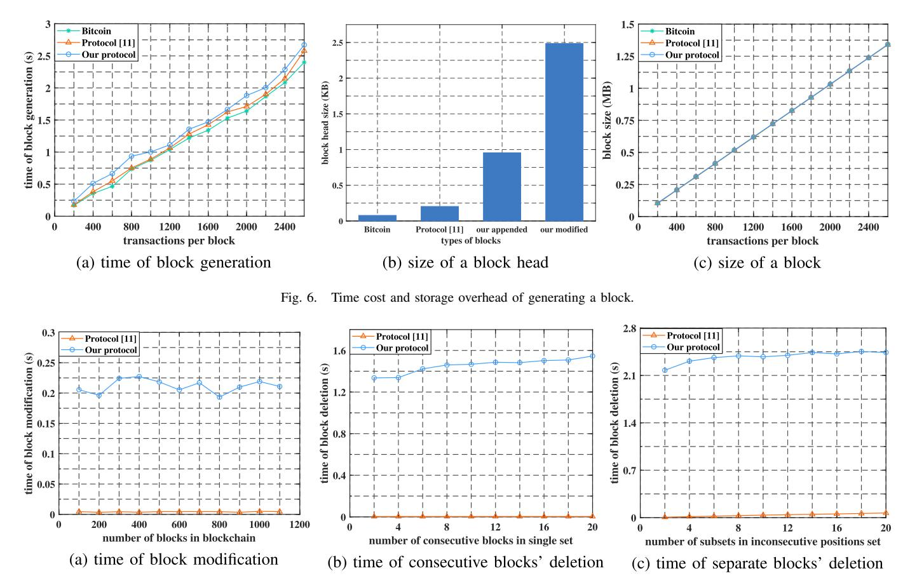

Fig. 7. Time cost of modifying and deleting blocks.

without the influence brought by solving PoW puzzles. Besides, the impact of communication is not considered in the test of each functionality and all transactions considered are of type Pay-to-PubkeyHash. Experiments are conducted on Ubuntu 20.04.4 LTS (2 GB memory) working on VMware 12.5.2 running in a PC equipped with Intel(R) Core(TM) i5-7500 CPU @ 3.40GHz and a 8GB RAM. The double trapdoor chameleon hash family is implemented with the P-256 curve and the trapdoorless universal accumulator is implemented with the key size of 3072 bits, which both offer 128-bit security level. Programs are executed in Python 3.8.10.

We demonstrate that our blockchain is practical from three aspects. The first is how much the block generation overhead is, relative to [11] and Bitcoin, when no editing operation occurs. The second is how long it takes to edit (modify/delete) an existing block, compared with [11]. And the final is cost of validating various operations as well as the whole blockchain.

# *A. Generate a Block*

We test the cost of generating a block in Fig. 6. Note that, the block generation in our blockchain contains not only appending a block like [11] and Bitcoin, but also inserting one at any position in the blockchain. For simplicity, however, we do not distinguish these two operations, since the difference between them is just one call of  $\mathcal{CH}$ . Adapt, which is negligible for both operations. From Fig. 6(a), we can see that the time

required to create blocks in Bitcoin is the least, for lacking of redactability. Besides, our runtime is slightly higher than that of [11], because we run *UA.Add* and *UA.MWit* additionally to realize verifiability of blockchain state. In Fig. 6(b) we show a comparison of the size of block heads in these three blockchains. Since we need to record membership witness of block's current content and non-membership witnesses of history versions, the size of block head is slightly bigger than the other two. However, such a storage cost difference is negligible for the whole block, as is shown in Fig. 6(c). Overall, the additional overhead in the process of block generation is small enough, which does not affect the efficiency of our verifiable and redactable blockchain.

# *B. Edit Blocks*

Comparisons of the runtime to modify and delete blocks in our blockchain versus [11] are presented in Fig. 7. From Fig. 7(a), we can see that the computational cost of blockchain modification in this paper and [11] are both constant, while ours is slightly higher. This is because we call  $\mathcal{U}\mathcal{A}\mathcal{D}\mathbf{el}$  to invalidate history version of modified blocks to resist reversion attacks. Delete operation is tested in Fig. 7(b)-(c), where set  $L$  is divided into two categories: one containing consecutive positions, and the other containing inconsecutive positions. The latter can be regarded as a set containing multiple subsets of consecutive positions. Since one chameleon hash adaptation is needed behind each deleted subset in [11], the runtime remains

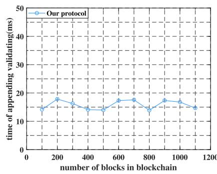

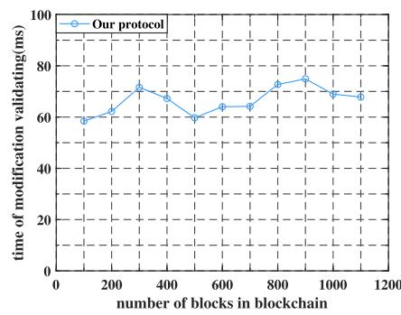

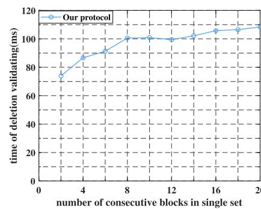

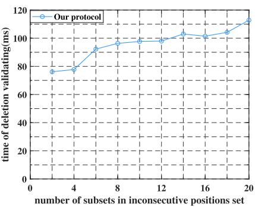

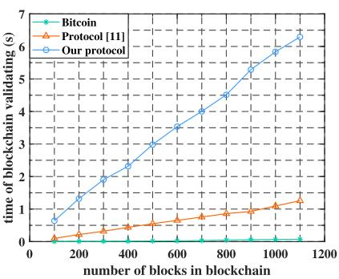

Fig. 8. Time cost of validating dynamic operations and the blockchain.

unchanged with the number consecutive blocks in a set while increases with the number of subsets. In our blockchain, except for *CH.Adapt*, we need to compute  $H_{\text{prime}}(\cdot)$  for all deleted blocks and multiply them together. As a consequence, the run time of deletion increases in both categories. However, since the additional cost is for realizing the verifiability of blockchain state, it is acceptable in practice.

## *C. Validate Editing Operations and Blockchain*

Since the proposed redactable blockchain is verifiable, we test the overhead of validating each operation in Fig. [8.](#page-14-3) It is obvious in Fig. [8\(a\)-\(b\)](#page-14-3) that the validation time of block creation and modification does not change with the length of blockchain, costing around tens of milliseconds throughout, which is user friendly. The runtime of validating block deletion in two categories is tested in Fig. [8\(c\)-\(d\),](#page-14-3) separately. Since *H*prime(·) of all deleted blocks should be computed and multiplied together, the runtime increases with both the number of subsets and the size of *L*. Note that such a runtime is just in millisecond grade. In Fig. [8\(e\),](#page-14-3) we compare how long it takes to validate a blockchain with length ranging from 100 to 1100 with [\[11\] a](#page-15-8)nd Bitcoin. Although the validating time of all three blockchains increases as the length of the blockchain grows, it takes longer in the proposed blockchain than the other two. This is because current versions of all existing blocks should be collected to compare with the latest accumulator state, which can resist reversion attacks seriously affecting [\[11\]. B](#page-15-8)esides, it is worth noting that users who download and validate the entire blockchain are typically volunteers with spare computation and bandwidth dedicated to maintaining the security and stability of the blockchain. Alternatively, they may be solo miners who have substantially invested in high-performance equipment and seek significant exclusive profits. Therefore, in practice, the efficiency of blockchain validation can be further improved and would not be a significant computational burden.

In summary, the additional overhead of the proposed redactable blockchain in generating and editing blocks, as well as validating these operations, is minor and seems acceptable, without a noticeable impact on efficiency and availability. While the additional cost brought by validating the blockchain state is not negligible, it appears to be an acceptable tradeoff for maintaining the security and stability of the redactable blockchain or gaining greater profits. Nevertheless, finding a more efficient construction of accumulators that shorten the runtime of blockchain validation is an important future work.

# VII. CONCLUSION

We propose a verifiable and redactable blockchain supporting fully editing operations, enabling redactions of block objects and validation of blockchain state simultaneously for the first time, which has broad application prospects. Extensive experiments are conducted to show that these features in such a blockchain are achieved with seemingly acceptable overhead compared with the related work. In addition, a comprehensive analysis is presented to demonstrate the security in aspects of an individual block and the whole blockchain.

# REFERENCES

[\[1\]](#page-0-0) S. Nakamoto. (2008). *Bitcoin: A Peer-to-Peer Electronic Cash System*. [Online]. Available: https://bitcoin.org/bitcoin.pdf [\[2\]](#page-0-0) M. Pilkington, "Blockchain technology: Principles and applications," in *Research Handbook on Digital Transformations*. Cheltenham, U.K.: Edward Elgar Publishing, 2016, pp. 225–253.

[\[3\]](#page-0-0) R. Zhang, R. Xue, and L. Liu, "Security and privacy on blockchain," *ACM Comput. Surv.*, vol. 52, no. 3, pp. 1–34, 2019. [\[4\]](#page-0-1) M. Belotti, N. Božic, G. Pujolle, and S. Secci, "A vademecum on ´ blockchain technologies: When, which, and how," *IEEE Commun. Surveys Tuts.*, vol. 21, no. 4, pp. 3796–3838, 4th Quart., 2019. [\[5\]](#page-0-1) D. V. Dimitrov, "Blockchain applications for healthcare data management," *Healthcare Inf. Res.*, vol. 25, no. 1, pp. 51–56, 2019. [\[6\]](#page-0-1) H. Huang, X. Chen, and J. Wang, "Blockchain-based multiple groups data sharing with anonymity and traceability," *Sci. China Inf. Sci.*, vol. 63, no. 3, pp. 1–13, Mar. 2020. [\[7\]](#page-0-2) C. Catalini and J. S. Gans, "Some simple economics of the blockchain," *Commun. ACM*, vol. 63, no. 7, pp. 80–90, Jun. 2020. [\[8\]](#page-0-2) A. Reyna, C. Martín, J. Chen, E. Soler, and M. Díaz, "On blockchain and its integration with IoT. Challenges and opportunities," *Future Gener. Comput. Syst.*, vol. 88, pp. 173–190, Nov. 2018. [\[9\]](#page-0-3) E. Politou, F. Casino, E. Alepis, and C. Patsakis, "Blockchain mutability: Challenges and proposed solutions," *IEEE Trans. Emerg. Topics Comput.*, vol. 9, no. 4, pp. 1972–1986, Oct. 2021. [\[10\]](#page-0-3) Y. Jia, S.-F. Sun, Y. Zhang, Z. Liu, and D. Gu, "Redactable blockchain supporting supervision and self-management," in *Proc. ACM ASIACCS*, May 2021, pp. 844–858. [\[11\]](#page-0-4) G. Ateniese, B. Magri, D. Venturi, and E. Andrade, "Redactable blockchain—Or—Rewriting history in Bitcoin and friends," in *Proc. IEEE Eur. Symp. Secur. Privacy (EuroSP)*, Apr. 2017, pp. 111–126. [\[12\]](#page-0-5) G. Ateniese and B. D. Medeiros, "On the key exposure problem in chameleon hashes," in *Proc. SCN*. Berlin, Germany: Springer, 2004, pp. 165–179. [\[13\]](#page-1-0) D. Derler, K. Samelin, D. Slamanig, and C. Striecks, "Fine-grained and controlled rewriting in blockchains: Chameleon-hashing gone attributebased," in *Proc. NDSS*, 2019, pp. 1–15. [\[14\]](#page-1-0) I. Puddu, A. Dmitrienko, and C. Srdjan, "µchain: How to forget without hard forks," *Cryptol. ePrint Arch.*, Jun. 2020. [Online]. Available: http://eprint.iacr.org/2017/106 [\[15\]](#page-1-0) X. Li, J. Xu, L. Yin, Y. Lu, Q. Tang, and Z. Zhang, "Escaping from consensus: Instantly redactable blockchain protocols in permissionless setting," *IEEE Trans. Dependable Secure Comput.*, early access, pp. 1–20, Oct. 2022, doi: [10.1109/TDSC.2022.3212601.](http://dx.doi.org/10.1109/TDSC.2022.3212601) [Online]. Available: https://eprint.iacr.org/2021/223 [\[16\]](#page-1-0) D. Deuber, B. Magri, and S. A. K. Thyagarajan, "Redactable blockchain in the permissionless setting," in *Proc. SP*, May 2019, pp. 124–138. [\[17\]](#page-1-1) M. I. Mehar et al., "Understanding a revolutionary and flawed grand experiment in blockchain: The DAO attack," *J. Cases Inf. Technol.*, vol. 21, no. 1, pp. 19–32, 2019. [\[18\]](#page-1-2) M. S. Dousti and A. Küpçü, "Tri-op redactable blockchains with block modification, removal, and insertion," *Turkish J. Electr. Eng. Comput. Sci.*, vol. 30, no. 2, pp. 376–391, Jan. 2022. [\[19\]](#page-1-3) M. S. Dousti and A. Küpçü, "Moderated redactable blockchains: A definitional framework with an efficient construct," in *Proc. DDPM CBT*. Berlin, Germany: Springer, 2020, pp. 355–373. [\[20\]](#page-1-4) D. Grigoriev and V. Shpilrain, "RSA and redactable blockchains," *Int. J. Comput. Math., Comput. Syst. Theory*, vol. 6, no. 1, pp. 1–6, Jan. 2021. [\[21\]](#page-2-1) M. Florian, S. Henningsen, S. Beaucamp, and B. Scheuermann, "Erasing data from blockchain nodes," in *Proc. EuroSPW*, Jun. 2019, pp. 367–376. [\[22\]](#page-2-1) K. Huang, X. Zhang, Y. Mu, F. Rezaeibagha, and X. Du, "Scalable and redactable blockchain with update and anonymity," *Inf. Sci.*, vol. 546, pp. 25–41, Feb. 2021. [\[23\]](#page-2-1) S. Xu, J. Ning, J. Ma, G. Xu, J. Yuan, and R. H. Deng, "Revocable policy-based chameleon hash," in *Proc. ESORICS*. Berlin, Germany: Springer, 2021, pp. 327–347. [\[24\]](#page-2-2) K. Huang et al., "Building redactable consortium blockchain for industrial Internet-of-Things," *IEEE Trans. Ind. Informat.*, vol. 15, no. 6, pp. 3670–3679, Jun. 2019. [\[25\]](#page-2-2) J. Xu, K. Xue, H. Tian, J. Hong, D. S. L. Wei, and P. Hong, "An identity management and authentication scheme based on redactable blockchain for mobile networks," *IEEE Trans. Veh. Technol.*, vol. 69, no. 6, pp. 6688–6698, Jun. 2020. [\[26\]](#page-2-3) H. Krawczyk and T. Rabin. (1998). *Chameleon Hashing and Signatures*. [Online]. Available: https://citeseerx.ist.psu.edu/pdf/cd94a5cd 939a2f05c892ecaca3713188f4754d63 [\[27\]](#page-2-4) X. Chen, F. Zhang, W. Susilo, H. Tian, J. Li, and K. Kim, "Identitybased chameleon hashing and signatures without key exposure," *Inf. Sci.*, vol. 265, pp. 198–210, May 2014. [\[28\]](#page-2-5) X. Chen et al., "Efficient generic on-line/off-line (threshold) signatures without key exposure," *Inf. Sci.*, vol. 178, no. 21, pp. 4192–4203, Nov. 2008. [\[29\]](#page-3-1) D. Boneh, B. Bünz, and B. Fisch, "Batching techniques for accumulators with applications to IOPs and stateless blockchains," in *Proc. CRYPTO*. Berlin, Germany: Springer, 2019, pp. 561–586. [\[30\]](#page-3-2) J. Camenisch and A. Lysyanskaya, "Dynamic accumulators and application to efficient revocation of anonymous credentials," in *Proc. CRYPTO*. Berlin, Germany: Springer, 2002, pp. 61–76. [\[31\]](#page-3-2) J. Li, N. Li, and R. Xue, "Universal accumulators with efficient nonmembership proofs," in *Proc. ACNS*. Berlin, Germany: Springer, 2007, pp. 253–269. [\[32\]](#page-3-3) J. Garay, A. Kiayias, and N. Leonardos, "The Bitcoin backbone protocol: Analysis and applications," in *Proc. EUROCRYPT*. Berlin, Germany: Springer, 2015, pp. 281–310. [\[33\]](#page-10-4) D. Derler, K. Samelin, and D. Slamanig, "Bringing order to chaos: The case of collision-resistant chameleon-hashes," in *Proc. PKC*. Berlin, Germany: Springer, 2020, pp. 462–492. Jun Shen received the B.S. and M.S. degrees from the Nanjing University of Information Science and Technology, Nanjing, China, in 2015 and 2018, respectively. She is currently pursuing the Ph.D. degree with the School of Cyber Engineering, Xidian University, Xi'an, China. Her research interests include cloud computing security and blockchains. Xiaofeng Chen (Senior Member, IEEE) received the B.S. and M.S. degrees in mathematics from Northwest University, China, in 1998 and 2000, respectively, and the Ph.D. degree in cryptography from Xidian University in 2003. Currently, he is with Xidian University as a Professor. He has published over 200 research papers in refereed international conferences and journals. His work has been cited more than 10000 times at Google Scholar. His research interests include applied cryptography and cloud computing security. He is an Editorial Board Member of IEEE TRANSACTIONS ON DEPENDABLE AND SECURE COM-PUTING, IEEE TRANSACTIONS ON KNOWLEDGE AND DATA ENGINEERING, and *International Journal of Foundations of Computer Science*. He has served as the program/general chair or a program committee member in over 30 international conferences. Zheli Liu received the B.Sc. and M.Sc. degrees in computer science and the Ph.D. degree in computer application from Jilin University, Changchun, China, in 2002, 2005, and 2009, respectively. After a post-doctoral fellowship with Nankai University, he joined the College of Computer and Control Engineering, Nankai University, in 2011, where he is currently a Professor. His current research interests include applied cryptography and data privacy. Willy Susilo (Fellow, IEEE) is currently a Distinguished Professor with the Faculty of Engineering and Information Sciences, School of Computing and Information Technology, University of Wollongong (UOW), Australia, where he is also the Director of the School of Computing and Information Technology, Institute of Cybersecurity and Cryptology, and the Head of the School of Computing and Information Technology, UOW. He is a fellow of IET, ACS, and AAIA. He was awarded the prestigious Australian Research Council Future Fellowship in 2009. In 2016, he was awarded the "Researcher of the Year" with UOW. He is also the Editor-in-Chief of the *Computer Standards & Interfaces* (Elsevier) and the *Information* (MDPI). He is also an Associate Editor of IEEE TRANSACTIONS ON DEPENDABLE AND SECURE COMPUTING, *ACM Computing Surveys*, and *Computers & Security* (Elsevier). He has also served

as the program committee member for several international conferences.